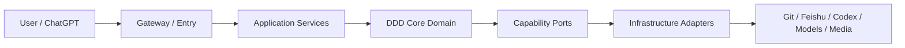

# ai-agent-platform

面向 AI Agent 工程学习、真实实践和求职 Portfolio 的长期项目。当前先建设 **Knowledge Foundation**，随后打通 **ChatGPT → Task → Codex → Git**，最终用 **AI Video Workflow** 验证复杂业务编排。

## 当前状态

- Git 是正式项目事实的唯一真源；飞书承担 Projection 与 Feishu Native。
- Context、Product、Architecture、Domain、Workflow、Solution、Research、Experiment、ADR、Engineering、Operations 与 Portfolio 已完成目录和资产迁移。
- AI Knowledge Skill 已调整为 Git-first 状态模型，并保留 Feishu Provider 的受控投影能力。
- 平台 Runtime、Codex Bridge、Git → Feishu 自动投影服务和 AI Video Workflow 仍未实现。
- 本次迁移已在工作树中完成，Commit、Push 与飞书写入仍需项目所有者执行。

真实状态见 [`CTX-002 Current State`](docs/00-context/CTX-002-current-state.md)。

## 三阶段

1. **Now — Knowledge Foundation**：Git 知识资产、AI Knowledge Skill、Feishu Projection、索引、回读与 Drift 检测。
2. **Next — AI Coding Workflow**：Task Contract、Gateway / Bridge、Codex Adapter、执行追踪和 Git 闭环。
3. **Later — AI Video Workflow**：故事、角色、场景、分镜、生成 Provider、评估、重试与成本记录。

## 架构



- 长期目标：[`ARC-001`](docs/02-architecture/ARC-001-platform-target-architecture.md)
- 六个月交付边界：[`ARC-003`](docs/02-architecture/ARC-003-six-month-delivery-architecture.md)
- 核心领域：[`DOM-001`](docs/03-domain/DOM-001-core-domain-model.md)

## Repository Navigation

| 路径 | 职责 |
|---|---|
| [`docs/00-context/`](docs/00-context/) | 项目背景、状态、任务、Roadmap、恢复入口 |
| [`docs/01-product/`](docs/01-product/) | 产品愿景与 Portfolio 结果 |
| [`docs/02-architecture/`](docs/02-architecture/) | 目标架构与交付架构 |
| [`docs/03-domain/`](docs/03-domain/) | DDD 核心领域模型 |
| [`docs/04-agent-system/`](docs/04-agent-system/) | Agent 与 Skill 设计 |
| [`docs/05-workflows/`](docs/05-workflows/) | 知识、编码和视频工作流 |
| [`docs/06-knowledge-system/`](docs/06-knowledge-system/) | Knowledge Asset 与 Runtime 边界 |
| [`docs/07-solutions/`](docs/07-solutions/) | 面向具体问题的完整技术方案 |
| [`docs/08-research/`](docs/08-research/) | 外部能力调研与来源 |
| [`docs/09-experiments/`](docs/09-experiments/) | 可复现实验与证据 |
| [`docs/10-adr/`](docs/10-adr/) | 已评审架构决策 |
| [`docs/11-engineering/`](docs/11-engineering/) | 工程规范与实现约束 |
| [`docs/12-operations/`](docs/12-operations/) | 迁移、飞书执行和运行历史 |
| [`docs/13-portfolio/`](docs/13-portfolio/) | 项目故事、Demo 和求职展示 |
| [`skills/ai-knowledge/`](skills/ai-knowledge/) | AI Knowledge Skill 实现 |

完整导航见 [`docs/README.md`](docs/README.md)。

## Knowledge and Private Context

- 正式项目事实进入 Git，并通过 Asset ID、路径、关系和状态管理。
- 飞书页面是镜像、汇总、索引或 Native 内容；冲突时 Git 胜出。
- `.private-context/` 允许 Agent 按任务读取私人背景，但实际内容不得进入 Public Git 或 Feishu Projection。
- Token、Cookie、密码、私钥和认证缓存不得存放在仓库或 `.private-context/`。

## Validation

```bash
cd skills/ai-knowledge
node scripts/validate_bundle.mjs
node tests/self-test.mjs
```

迁移审计与验证记录见 [`MIG-001`](docs/12-operations/migration/MIG-001-repository-audit-and-migration-2026-07-27.md)。
