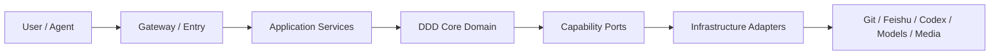

# ai-agent-platform

一个面向 AI Agent 工程学习、长期实践和求职 Portfolio 的平台项目：先建设可恢复的 Knowledge Foundation，再打通 AI Coding Workflow，最终以 AI Video Workflow 验证业务编排能力。

## Why

AI 工程需要的不只是模型调用，还需要稳定上下文、任务契约、可替换能力、执行证据和可持续演进的知识资产。本项目把讨论、决策、Skill、代码、实验和状态连接到 Git 中，降低 Agent 接手成本与重复推理。

## 当前状态

当前阶段是 **Knowledge Foundation**。已完成规则分层、Private Context 边界、Git 唯一真源决策、AI Knowledge Skill 和部分飞书 CLI 调研；正在建立正式 Context、Product 与 Architecture 入口。

平台服务、Agent Runtime、Codex Bridge 和 AI Video Workflow 尚未实现。真实状态见 [CTX-002 Current State](docs/00-context/CTX-002-current-state.md)。

## 三阶段

1. **Now — Git + Feishu + AI Knowledge Skill**：知识资产、索引、上下文恢复与飞书投影。
2. **Next — ChatGPT → Task → Codex → Git**：Task Contract、薄 Bridge、Codex Adapter 与执行追踪。
3. **Later — AI Video Workflow**：故事拆解、分镜、生成 Provider 和工作流 MVP。

## 简化架构



长期目标与交付边界分别见 [ARC-001](docs/02-architecture/ARC-001-platform-target-architecture.md) 和 [ARC-003](docs/02-architecture/ARC-003-six-month-delivery-architecture.md)。

## 当前已有成果

- 分层 `AGENTS.md` 与文档治理规则。
- Git 唯一真源、Feishu Projection 的 ADR。
- AI Knowledge Skill v1.0.0 及确定性自检。
- Feishu CLI、公开 Wiki 读取和递归导出验证资产。
- Asset、Relation、Feishu Map 与 Migration Inventory 索引。

## 尚未实现

- 可运行的平台 API / Gateway。
- Agent Runtime 与 Codex Bridge。
- Task / Result 的运行时闭环。
- AI Video Workflow 和视频模型 Adapter。
- Git → Feishu 自动投影服务。

## Repository Navigation

- [`docs/00-context/`](docs/00-context/)：项目上下文、当前状态和 Roadmap。
- [`docs/01-product/`](docs/01-product/)：平台愿景与 Portfolio 结果。
- [`docs/02-architecture/`](docs/02-architecture/)：目标与六个月交付架构。
- [`docs/06-knowledge-system/`](docs/06-knowledge-system/)：Knowledge Asset Architecture。
- [`docs/09-adr/`](docs/09-adr/)：架构决策。
- [`docs/_index/`](docs/_index/)：Agent 的资产、关系和飞书映射入口。
- [`skills/ai-knowledge/`](skills/ai-knowledge/)：AI Knowledge Skill 源包。

完整文档导航见 [`docs/README.md`](docs/README.md)。

## Knowledge System

- Git / GitHub 保存正式项目事实。
- 飞书是阅读投影、协作空间和补充知识层。
- Feishu Native 内容影响项目时，必须经 Review 晋升到 Git。
- 检索采用索引优先、最小上下文和只读优先。
- 投影通过 Asset ID、Canonical Path、Commit / Hash 与 Node Token 关联；尚未同步的资产明确标记为 pending。

## AI 可读 Private Context 边界

`.private-context/` 保存不进入 Public Git 的本地执行背景。Agent 不得默认扫描；只有公开资产不足、任务明确需要且权限允许时，才读取相关文件。该目录中只有说明性 `README.md` 可跟踪。

## Development Status

仓库目前以 Markdown、Schema、Skill、脚本和测试资产为主，不应被描述为已完成平台。AI Knowledge Skill 可执行既有验证：

```bash
cd skills/ai-knowledge
node scripts/validate_bundle.mjs
node tests/self-test.mjs
```

本批次未修改 Skill，因此不重复运行 Skill 测试。

## Portfolio 目标

最终以真实证据展示可运行 Demo、GitHub 工程质量、Architecture、ADR、Skill、Experiment、Workflow、测试与评估。计划成果和已交付成果必须分开记录，详见 [PRD-002](docs/01-product/PRD-002-portfolio-outcomes.md)。

## 文档入口

1. [Project Context](docs/00-context/CTX-001-project-context.md)
2. [Current State](docs/00-context/CTX-002-current-state.md)
3. [Current Task](docs/00-context/current-task.md)
4. [Project Outline](docs/00-context/CTX-003-project-outline.md)
5. [Six-Month Roadmap](docs/00-context/CTX-004-roadmap-6-months.md)
6. [Platform Vision](docs/01-product/PRD-001-platform-vision.md)
7. [Target Architecture](docs/02-architecture/ARC-001-platform-target-architecture.md)
8. [Recovery Map](docs/00-context/recovery-map.md)

## 安全底线

不提交 Token、Cookie、密钥、`.env`、认证缓存、私人材料或未授权第三方全文；不自动删除、改权限、公开分享、Force Push 或改写历史。
