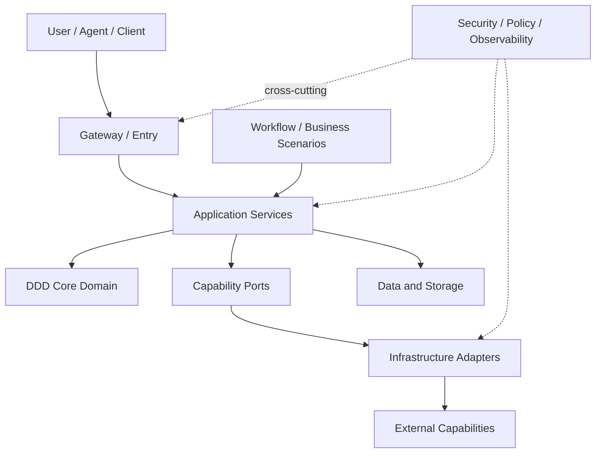

# ARC-001 Platform Target Architecture

> 本文描述长期目标架构，不代表全部已经实现。当前代码和可执行资产主要集中在 AI Knowledge Skill 与 Knowledge Foundation；Gateway、Runtime、Coding Workflow 和 Video Workflow 分属 Next 或 Later。

## Architecture Drivers

- Agent 可恢复、任务可追踪、结果可验证。
- 业务与模型、设备、工具和 Provider 解耦。
- 降低上下文、Token、生成成本和失败重跑范围。
- 支持 Git 唯一真源、飞书投影与多知识 Provider。
- 安全边界、审批、审计和可观测性内建。

## Architecture Overview

可维护图源见 [platform-target-architecture-v1.mmd](diagrams/platform-target-architecture-v1.mmd)。

## User Access Layer

- Chat / Web / CLI / IDE / Mobile Client。
- 人工 Review、审批和结果查看入口。
- Agent 以结构化请求访问平台，不直接操作基础设施。

## Gateway / Entry Layer

- API Gateway、Task Intake 和协议适配。
- 身份、权限、Schema 校验、幂等键和速率限制。
- 将外部输入转换为 Application Command / Query。

## DDD Core Domain

- `Task`：目标、输入、约束、交付物、验收。
- `Agent`：职责、授权和执行主体。
- `Capability`：抽象可调用能力及契约。
- `Workflow`：步骤、依赖、路由、补偿。
- `Knowledge`：发现、检索、捕获和维护行为。
- `Result`：产物、证据、错误和验收状态。
- `Execution`：运行实例、状态转换和重试。
- `Knowledge Asset`：Asset ID、路径、状态、证据和关系。
- `Decision`：被接受、替代或拒绝的架构判断。
- `Experiment`：假设、方法、结果和可复现证据。

## Application Services

- Task Command / Query Service。
- Context Retrieval 与 Knowledge Capture Service。
- Workflow Orchestration Service。
- Execution / Result Tracking Service。
- Review / Publication Service。

Application Service 编排领域对象和 Port，不包含具体 CLI、模型或文档 API 细节。

## Infrastructure Adapters

- Codex、模型和 Tool Adapter。
- Git、Feishu、Local File、Web Knowledge Adapter。
- Video、Image、Voice Provider Adapter。
- Queue、Scheduler、Notification 和 Observability Adapter。

## Data and Storage

- Git：代码、Schema、Skill、架构、ADR、状态和正式知识资产。
- Feishu：Git 资产投影及受治理的 Native / Capture 内容。
- Execution Store：任务状态、结果、错误和追踪标识。
- Artifact Store：中间产物与媒体资源。
- Index：资产元数据、关系和检索提示；不替代 Canonical Asset。

## Workflow / Business Scenarios

- Knowledge Query / Capture / Maintenance。
- ChatGPT → Task → Codex → Git。
- Story → Character / Scene → Shot / Prompt → Media Generation。
- Review、失败重试、结果验收与知识回写。

## External Capabilities

- LLM、Embedding、Search、MCP 和 Tool Calling。
- GitHub、Feishu OpenAPI / `lark-cli`。
- Codex 执行入口。
- 图像、视频、语音和字幕服务。
- 本地设备与云端计算节点。

## Cross-Cutting Concerns

- Identity、Authorization、Secret Management。
- Schema Validation、Idempotency、Rate Limit。
- Logging、Tracing、Metrics、Cost Accounting。
- Evaluation、Content Safety、Human Approval。
- Versioning、Compatibility、Audit 和 Data Retention。

## Data Flow

1. 用户或 Agent 提交请求。
2. Gateway 校验并生成 Task。
3. Application Service 通过 Index 获取最小必要上下文。
4. Workflow 调用领域能力及相应 Adapter。
5. Adapter 返回 Result 和 Execution Evidence。
6. Review 通过后，正式资产写入 Git；需要时生成飞书投影。

## Control Flow

1. Policy 决定允许的动作和审批门禁。
2. Orchestrator 按 Task 状态驱动步骤。
3. 每步先校验输入，再执行，再验证输出。
4. 失败局部重试或补偿，不默认重跑整个 Workflow。
5. 最终由人工或明确策略接受结果。

## Security Boundaries

- Public Git 与 `.private-context/` 明确隔离。
- Secret 只通过环境或专用凭证存储进入 Adapter，不进入资产或日志。
- Agent 仅获得任务必要权限。
- 飞书写入、删除、移动、权限、公开分享和 Git 高风险操作受人工门禁。
- 第三方内容记录来源与许可，不默认纳入公开 Canonical Assets。

## Trade-offs

- Git 唯一真源提高可审计性，但飞书变更不能直接成为正式事实。
- 薄 Bridge 降低复杂度，但早期自动路由能力有限。
- Port / Adapter 增加初期设计成本，换取模型和 Provider 可替换性。
- 最小上下文降低 Token，但依赖高质量索引与关系维护。
- Human-in-the-loop 降低自动化速度，换取安全和事实可靠性。

## Evolution Strategy

- **Now**：Knowledge Assets、Feishu Projection、AI Knowledge Skill。
- **Next**：Task Contract、Gateway / Bridge、Codex Adapter、Execution Tracking。
- **Later**：AI Video Workflow、多媒体 Provider 和高级编排。
- 只有在真实用例、测试和证据出现后，才将目标组件升级为已实现状态。
