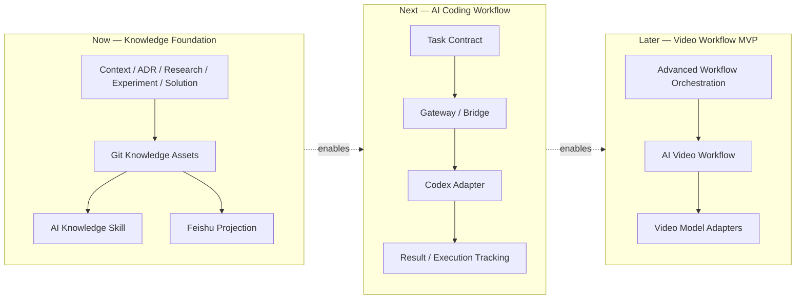

# ARC-003 Six-Month Delivery Architecture

## Purpose

本文限定未来六个月的实际交付边界，用 `Now / Next / Later` 防止把长期目标误写为当前运行组件。

## Delivery View

图源见 [six-month-delivery-architecture.mmd](diagrams/six-month-delivery-architecture.mmd)。

## Now

### Components

- Git Knowledge Assets。
- Feishu Projection。
- AI Knowledge Skill。
- Context / ADR / Research / Experiment / Solution 资产体系。

### Delivery Boundary

提供可检索、可恢复、可追踪的知识基础。当前重点是资产和确定性工具，不包含完整 Agent Runtime。

## Next

### Components

- Task Contract。
- Gateway / Bridge。
- Codex Adapter。
- Result / Execution Tracking。

### Delivery Boundary

实现单机、薄层、可审计的 Coding Workflow。优先规则和契约，不在 Bridge 内引入复杂推理或多 Agent 自治。

## Later

### Components

- AI Video Workflow。
- Video Model Adapters。
- Advanced Workflow Orchestration。

### Delivery Boundary

仅在 Knowledge Foundation 和 Coding Workflow 验证后进入。六个月目标是 MVP，不是生产级视频平台；这些组件当前尚未运行。

## Integration Sequence

1. Knowledge Skill 从 Git Index 获取最小上下文。
2. Task Contract 固化目标、权限、交付物和验收。
3. Bridge 调用 Codex Adapter 并跟踪 Execution / Result。
4. 复用同一契约与 Adapter 边界承载 AI Video Workflow。

## Six-Month Constraints

- 不提前建设通用多 Agent 平台。
- 不绑定单一知识、模型或视频 Provider。
- 不将 Feishu 作为核心领域或事实真源。
- 每一阶段必须有可运行验证和明确退出条件。
