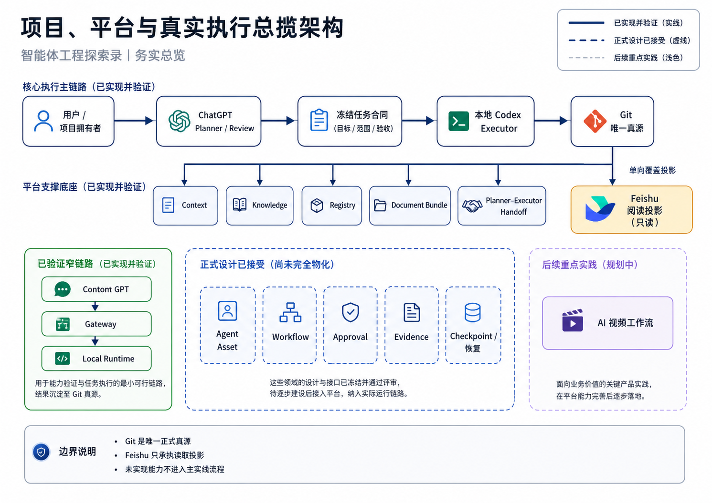

# CTX-001 智能体工程探索录

> **一句话定位**：以 `ai-agent-platform` 为工程载体，建立一套能够持续规划、执行、验证、恢复和演进专业 AI Agent 的个人工程系统，并把真实过程沉淀为可复用知识与可信作品。

## 1. 这是什么

“智能体工程探索录”同时是项目总览、知识库首页和长期工程叙事入口。它面向第一次接触项目的人，回答五个问题：

1. 为什么要建设这个项目；
2. `ai-agent-platform` 到底是什么；
3. 项目、平台和上层产品是什么关系；
4. 当前真实完成了什么、尚未完成什么；
5. 应当从哪里继续阅读。

本文只维护稳定总览，不保存当前 Commit、批次、资产数量或短期任务进度。即时事实见 [CTX-005 当前能力与演进差距](../CTX-005-当前能力与演进差距.md)、根 `context/current-status.md` 和 `context/roadmap.md`。

## 2. 项目背景

项目发起者具有前端工程背景，正在通过真实项目补齐 Agent 工程、后端、运行时、工具集成和全栈交付能力。早期学习覆盖 ChatGPT、Custom GPT、Codex、本地模型、GitHub、飞书和 AI 视频创作，但很快出现了共同摩擦：

- 项目事实散落在会话中，新窗口需要反复解释；
- Planner 能规划、Executor 能执行，但语义和执行之间缺少稳定合同；
- 外部写操作缺少明确范围、审批、证据和恢复边界；
- 文档、代码、飞书和 Builder 配置容易形成多个“看起来都是真的”版本；
- 做了大量工程工作，却难以用代码、测试、实验和决策证明能力。

因此项目不再按“学一个工具，再接一个工具”的顺序推进，而是从完整 Agent 工程系统出发，把目标、角色、任务、执行、知识、证据和恢复放进同一条可追踪链路。

## 3. 项目愿景与现实目标

平台愿景是：

> 让个人开发者能够把 ChatGPT、专业 Agent、Codex、Skills、受控 Runtime、Git 知识真源和本地环境组织成一个可继续、可验证、可解释、可复用的工程系统。

当前项目同时承担三个现实目标：

| 目标 | 具体含义 |
|---|---|
| 真实工程系统 | 建立可运行的 Gateway / Runtime、任务合同、知识治理和确定性交付链路 |
| 能力转型 | 通过真实问题补齐 Agent、后端、全栈、架构和工程治理能力 |
| 求职作品 | 将代码、测试、实验、文档、Commit 和 Demo 组织为可核验的职业证明 |

北极星不是 Agent 数量或自动化率，而是：

> 一项工程工作在窗口变化、执行失败、角色接力和产品变化后，仍能基于可信事实继续推进，并留下可复审证据。

## 4. 项目、平台与产品的关系

| 对象 | 当前定义 | 当前状态 |
|---|---|---|
| `ai-agent-platform` 项目 | 建设、学习、实验、治理和 Portfolio 的长期工程载体 | 持续推进 |
| `ai-agent-platform` 产品 | 面向个人 Agent 工程师的工程协作与可信执行平台 | active build / MVP early |
| AI 视频工作流 | 依托平台验证复杂业务对象、Provider、人工复审、成本和证据的首个上层产品 | concept accepted / implementation not started |
| 其他产品机会 | 可信任务控制台、Agent 资产工作台、知识治理工作台等机会池 | idea / discovery，非承诺 |

平台拥有跨产品重复出现的机制，例如 Contract、Task、Policy、Approval、Evidence、Recovery、Knowledge、Registry 和 Provider Port。上层产品拥有用户体验、业务对象、业务规则、专属质量标准和业务数据。

当前不创建根级 `products/`。只有一个产品真正进入设计或开发，才按实际资产类型进入 `apps/`、`packages/`、`docs/`、`agents/`、`knowledge-packs/` 或 `skills/`，归属关系由 Platform Registry 表达。

## 5. 务实的总体架构

下面的总揽图只表达当前仓库已经存在的真实闭环、已经接受但尚未物化的设计，以及下一步产品验证。它不把未来模块画成已经运行的系统。



### AI 可读语义镜像

```text
一、当前已经运行或已验证的闭环
1. 用户与总控 Planner：用户提出目标、确认重要边界；ChatGPT Planner 负责语义规划和复审。
2. 冻结交付：Planner 生成任务合同、完整文件和验证要求；Codex 只在授权 Scope 内机械执行。
3. Git 真源：代码、Context、正式知识、Registry、测试和 Commit 都先进入 Git。
4. 真实窄链路：Custom GPT → Microsoft Dev Tunnel → Action Gateway → Local Runtime → gateway.ping / runtime.status。
5. 证据回路：测试、Diff、Commit、远端 SHA 和人工 Review 形成当前可复审证据。
6. Feishu：只接收 Git → Feishu 的单向覆盖投影，不成为第二真源。

二、正式设计已接受、但尚未完整物化
- 持久 Goal / Task / Version / State；
- Approval、Evidence、Side-effect Ledger；
- Checkpoint、Snapshot、Recovery；
- Agent Profile、Knowledge Pack、Execution Lane；
- 多 Agent / 多执行器自动调度。

三、产品验证
- 当前主产品：ai-agent-platform；
- 首个计划产品：AI 视频工作流；
- 只有真实业务切片完成后，才证明平台能力可以跨产品复用。

状态约定：实线表示已实现或已验证；虚线表示正式设计或下一阶段；Feishu 只有从 Git 指向阅读投影的单向箭头。
```

- Visual Asset ID：`VIS-036`；
- 可编辑源文件：[`./assets/VIS-036-项目平台与真实执行总揽架构.svg`](./assets/VIS-036-项目平台与真实执行总揽架构.svg)；
- 人类预览：[`./assets/VIS-036-项目平台与真实执行总揽架构.png`](./assets/VIS-036-项目平台与真实执行总揽架构.png)。

## 6. 六层能力视角

项目按完整 Agent 工程体系理解，而不是按工具清单堆叠：

```text
Agent Interface
  ↓
Agent Brain
  ↓
Agent Runtime
  ↓
Tool Layer
  ↓
Knowledge Layer
  ↓
Infrastructure
```

- **Interface**：目标输入、状态呈现和人工审批；
- **Brain**：目标理解、规划、角色选择和上下文编译；
- **Runtime**：任务、权限、状态、证据和恢复；
- **Tool Layer**：Codex、CLI、API、MCP、Browser 和 Skills；
- **Knowledge Layer**：Context、正式知识、Registry 和未来 Knowledge Pack；
- **Infrastructure**：Git、设备、网络、Secret、存储、测试和发布环境。

Approval、Evidence、Health、Snapshot、Handoff 和 Audit 是跨层治理能力，不属于某一个模型或工具。

## 7. 当前真实状态

### 已实现并验证

- Custom GPT → Dev Tunnel → Gateway → Local Runtime 的安全窄链路；
- Task / Result Contract、双层认证、Capability Policy、限流、并发和 Timeout；
- Git 唯一真源、Context、正式知识、Platform Registry 和 Document Bundle；
- Planner–Executor Handoff、冻结 ZIP / Overlay、单 Commit、普通 Push 和远端回读；
- 六个活跃 Skill 及其离线验证；
- Human-first、AI-lossless 正式视觉资产和本地图片 Publisher 规则。

### 正式设计已接受、尚未完整实现

- 持久 Task Store、队列和重试编排；
- Approval、Evidence、Side-effect Ledger；
- Checkpoint、Snapshot、自动恢复和补偿；
- Agent Profile、Knowledge Pack、Agent Eval 和 Host Release；
- 多 Agent、多执行器和动态 Capability Routing。

### 后续重点实践

1. 完成知识库 Feishu 全量覆盖和 Readback；
2. 建立最小可信 Agent 纵向切片；
3. 以 AI 视频工作流验证真实业务对象和平台复用；
4. 形成可演示、可核验的 Portfolio Release。

## 8. 知识库导航

| 栏目 | 回答的问题 |
|---|---|
| 项目与产品 | 为什么做、当前产品是什么、怎样演进、哪些只是机会 |
| 基础产品与能力 | ChatGPT、Codex 和平台核心能力怎样组成执行闭环 |
| Agent 工程思想与方法论 | 为什么采用平台化、DDD、Skills 和可信系统原则 |
| 平台架构 | 总体架构、执行路径、能力依赖和分阶段路线 |
| 上下文与知识系统 | Context、Knowledge、Memory、Registry 和 Projection 怎样治理 |
| 智能体资产体系 | Role、Agent Profile、Skill、Knowledge Pack、Capability 和 Release |
| 工作流与项目治理 | Goal、Task、Handoff、Approval、Evidence、Checkpoint 和 Git Closure |
| 实验与复盘 | 真实输入、输出、失败、根因、修复和经验候选 |
| 作品集 | 如何从真实代码、测试、实验和 Commit 构建外部叙事 |
| 术语与来源 | 正式术语、禁用词、来源和引用治理 |

飞书投影中，本文作为知识库独立根首页；其余 CTX、DEC 和 PRD 页面归入“项目与产品”栏目，不重复发布本页。

## 9. 推荐阅读路径

### 第一次了解项目

```text
智能体工程探索录
→ CTX-005 当前能力与演进差距
→ ARC-001 总体架构与执行路径
```

### 理解产品和工程路线

```text
PRD-003 产品定义与用户价值
→ PRD-005 能力成熟度
→ PRD-007 产品组合与平台边界
→ ARC-016 分阶段 MVP 路线
```

### 理解真实协作和执行

```text
CAP-006 ChatGPT 到 Codex 执行闭环
→ WFL-001 Goal Intake 与规划
→ WFL-005 Task Contract
→ WFL-006 执行、审批与证据
```

### 查看成果与限制

```text
实验与复盘
→ 作品集
→ 代码、测试和固定 Commit
```

## 10. 真源、投影与维护原则

- Git 是代码、正式知识、Context、Registry、配置和发布状态的唯一正式真源；
- Feishu 是面向人的单向覆盖阅读投影，不读取旧正文做合并，不反向同步；
- ChatGPT Planner 负责语义内容和复审，Codex 只执行冻结合同；
- 当前实现、正式设计、实验观察、推断和历史资产必须明确区分；
- 图片只在正文和信息图谱冻结后生成，图片与 AI 可读语义镜像共同构成正式资产；
- 未经代码、测试、真实调用或回读支持的能力不得标记为已验证。

## 11. 继续阅读

- [CTX-005 当前能力与演进差距](../CTX-005-当前能力与演进差距.md)
- [DEC-001 架构决策演进摘要](../DEC-001-架构决策演进摘要.md)
- [PRD-003 产品定义与用户价值](../PRD-003-ai-agent-platform产品定义与用户价值/README.md)
- [PRD-005 平台能力地图与产品成熟度](../PRD-005-平台能力地图与产品成熟度/README.md)
- [PRD-006 AI 视频工作流产品概念与验证计划](../PRD-006-AI视频工作流产品概念与验证计划/README.md)
- [PRD-007 产品组合、演进阶段与平台边界](../PRD-007-产品组合演进与平台边界/README.md)
- [ARC-001 平台总体架构](../../04_平台架构/ARC-001-ai-agent-platform总体架构/README.md)
- [ARC-016 能力依赖、多任务并行与分阶段 MVP 路线](../../04_平台架构/ARC-016-能力依赖多任务并行与分阶段MVP路线图/README.md)
