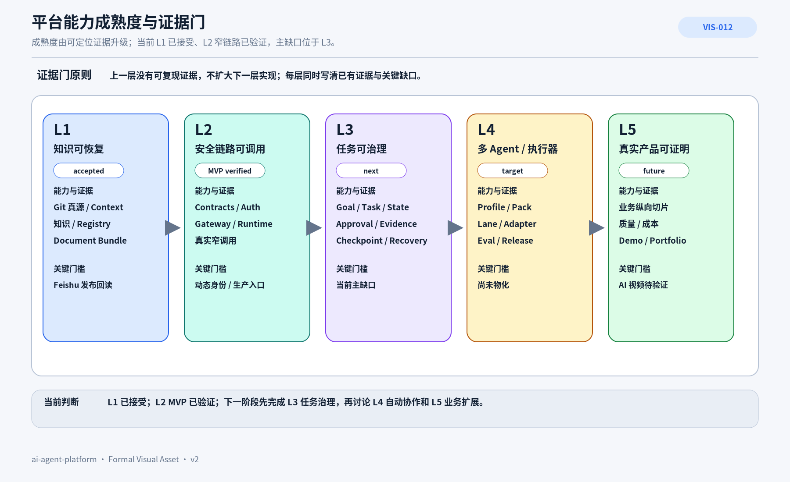

# PRD-005 平台能力地图与产品成熟度

> 平台成熟度不是功能数量或项目批次，而是：用户能否依赖一组经过证据门验证的能力完成结果。

## 1. 本文回答什么

本文回答：**`ai-agent-platform` 的产品能力如何分层、当前位于哪里、每一级需要什么证据才能升级。**

即时执行顺序见 `context/roadmap.md`，当前事实见 [CTX-005](../CTX-005-当前能力与演进差距.md)。本文保持稳定的成熟度模型，不保存易漂移的批次和日期。

## 2. 成熟度阶梯



### AI 可读语义镜像

```text
成熟度由证据门升级，不由功能数量、文档数量或计划日期升级。

L1 知识可恢复 — accepted：
- 已有 Git 真源、Context、正式知识、Registry、Document Bundle；
- 剩余发布门：Feishu 全量覆盖与 Readback。

L2 安全链路可调用 — MVP verified：
- 已有 Contracts、Auth、Policy、Gateway、Runtime 与真实窄链路；
- 缺口：动态身份、生产入口和更广 Capability。

L3 任务可治理 — next：
- 需要 Goal / Task / Version / State、Approval、Evidence、Ledger、Checkpoint、Recovery；
- 通过门：跨 Session 可继续、非法状态拒绝、审批和执行版本绑定。

L4 多 Agent / 多执行器 — target：
- 需要 Agent Profile、Knowledge Pack、Execution Lane、Adapter、Eval、Release；
- 通过门：角色可重建、执行器可替换、知识与权限受控。

L5 真实产品可证明 — future：
- 需要上层业务纵向切片、Provider 替换、质量和成本证据、用户可见 Demo；
- 首个候选验证产品是 AI 视频工作流。

当前主缺口位于 L3；上一层没有可定位证据时，不扩大下一层实现。
```

- Visual Asset ID：`VIS-012`；
- 可编辑源文件：[`./assets/VIS-012-平台能力成熟度阶梯.svg`](./assets/VIS-012-平台能力成熟度阶梯.svg)；
- 人类预览：[`./assets/VIS-012-平台能力成熟度阶梯.png`](./assets/VIS-012-平台能力成熟度阶梯.png)。

## 3. 当前成熟度判断

| 层级 | 当前判断 | 已有证据 | 关键缺口 |
|---|---|---|---|
| L1 知识可恢复 | **已接受** | Git 真源、Context、Registry、文档包、视觉语义镜像、Publisher 规则 | 全库人工 Review、最终 Feishu 发布与回读尚未完成 |
| L2 安全链路可调用 | **MVP 已验证** | Runtime Status 真实链路、Contracts/Auth/Policy/Gateway/Runtime 测试 | 动态身份、广泛 Capability、生产入口未实现 |
| L3 任务可治理 | **下一阶段** | Handoff 合同与人工续跑已验证 | 持久 Task Store、Approval、Evidence、Recovery 未实现 |
| L4 多 Agent / 多执行器 | **目标设计** | Agent/Skill/Knowledge 模型和架构文档 | Profile、Pack、Lane、Adapter、调度和 Release 未物化 |
| L5 真实产品可证明 | **未开始** | AI 视频产品概念已接受 | 无业务代码、Provider 调用、用户 Demo 和业务证据 |

## 4. 跨层能力地图

| 能力域 | L1 | L2 | L3 | L4 | L5 |
|---|---|---|---|---|---|
| Context / Knowledge | 真源、索引、Registry | 受控查询 | Task 绑定上下文与证据 | 角色化 Knowledge Pack | 产品知识闭环 |
| Contract / State | 文档和 Schema | 单次 Task / Result | 持久 Task / Event / Version | 跨 Agent / Lane 协作 | 业务工作流状态 |
| Security | 写入门禁 | Auth / Policy / Deny by default | 动态身份、Scope、Approval | 角色与工具权限 | 产品级风险策略 |
| Execution | 人工 Executor | Gateway / Runtime 窄调用 | Adapter、Queue、Ledger | 多执行器与恢复 | Provider 业务编排 |
| Evidence | Git / Test / Review | 调用结果与日志 | Evidence Registry | Agent Eval / Release | 质量、成本、用户结果 |
| Product | 项目叙事 | 平台 MVP 入口 | 可用控制面 | 可扩展平台 | 真实业务 Demo |

## 5. 各层升级门槛

### L1 → L2

- 任务和结果有稳定 Contract；
- 认证、授权和错误边界可测试；
- 至少一个真实外部入口调用 Runtime；
- Secret 和内部状态不暴露给模型。

### L2 → L3

- Goal / Task / Version / State 持久化；
- 写命令支持 expected version 与幂等；
- 审批与执行版本绑定；
- Evidence、Ledger、Checkpoint 和终止快照可查询；
- 失败不依赖无限重试。

### L3 → L4

- Agent Profile、Skill、Knowledge Pack 和 Policy 可从 Git 重建；
- Execution Lane 拥有明确单一写入者和 Git Operating Policy；
- 至少两个执行器可在同一 Task Contract 下替换；
- 角色访问范围和工具调用可验证。

### L4 → L5

- 一个上层产品完成最小纵向切片；
- 业务领域对象经过真实输入验证；
- Provider 可以替换，成本和质量可记录；
- 用户能够完成端到端成果并理解失败；
- Portfolio 只引用可定位证据。

## 6. 能力投资原则

1. 事实校准先于新增功能；
2. 安全和状态所有权先于扩大 Capability；
3. 控制面先于多 Agent 自动循环；
4. 真实调用方先于公共抽象；
5. 纵向业务证据先于平台横向铺满；
6. UI 必须服务状态、审批和证据，不为“看起来像产品”而提前建设；
7. 未通过证据门的能力保持 `target / candidate / idea`。

## 7. 停止与降级条件

以下情况应暂停升级：

- 当前层证据不可复现；
- 为下层缺口添加更多上层抽象；
- 真实用户问题被新证据否定；
- 成本、设备或安全边界不可承受；
- Provider 变化使现有方案失效；
- 产品纵向切片无法证明平台机制的复用价值。

## 8. 关联文档

- [PRD-003 ai-agent-platform 产品定义与用户价值](../PRD-003-ai-agent-platform产品定义与用户价值/README.md)
- [PRD-006 AI 视频工作流产品概念与验证计划](../PRD-006-AI视频工作流产品概念与验证计划/README.md)
- [CTX-005 当前能力与演进差距](../CTX-005-当前能力与演进差距.md)
- [ARC-016 能力依赖、多任务并行与分阶段 MVP 路线图](../../04_平台架构/ARC-016-能力依赖多任务并行与分阶段MVP路线图/README.md)
