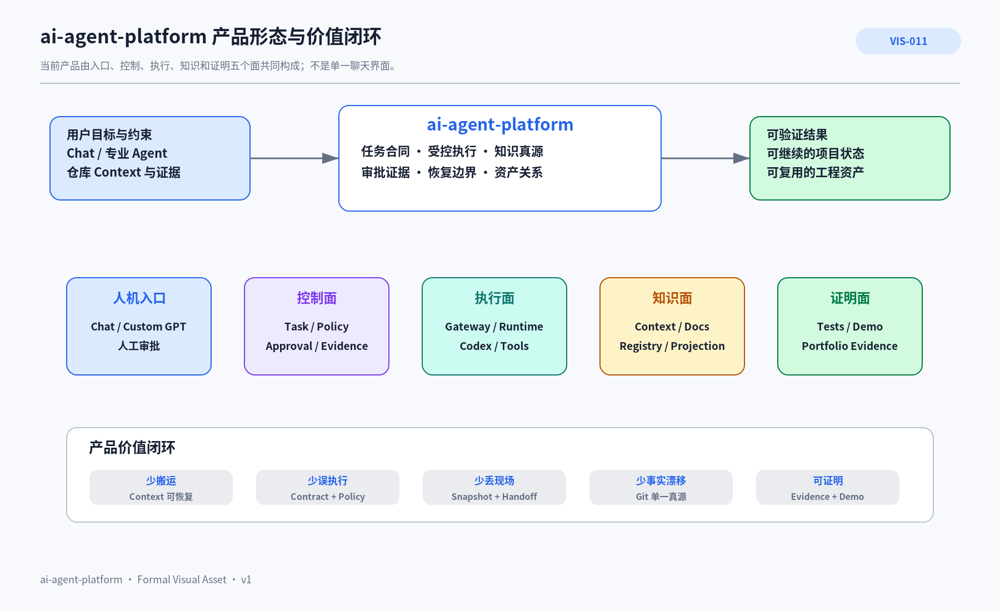

# PRD-003 ai-agent-platform 产品定义与用户价值

> **产品定义**：`ai-agent-platform` 是面向个人 Agent 工程师的工程协作与可信执行平台。它把 Chat、专业 Agent、Codex、Skills、受控 Runtime、Git 知识真源和工程证据组织成可持续推进的工作系统。

## 1. 本文回答什么

本文回答：**当前主产品为谁服务、解决什么问题、以什么形态交付、创造什么价值，以及怎样判断它开始成为可信产品。**

项目为什么存在见 [CTX-001 项目总览](../../00_项目入口/CTX-001-项目总览.md)；当前完成度见 [CTX-005 当前能力与演进差距](../../00_项目入口/CTX-005-当前能力与演进差距.md)；架构实现见 [ARC-001 总体架构](../../04_平台架构/ARC-001-ai-agent-platform总体架构/README.md)。本文不重复项目历史、即时进度和技术实现细节。

## 2. 产品身份

| 维度 | 当前定义 |
|---|---|
| 产品类别 | 个人 Agent Engineering Platform |
| 当前主用户 | 项目所有者本人，以及具有软件工程背景、希望进入 Agent / 全栈 Agent 工程的个人开发者 |
| 当前阶段 | 平台 MVP 早期：知识基础和安全窄链路已验证，任务控制与可信执行尚未完成 |
| 当前交付形态 | Git 仓库 + Chat / Custom GPT 入口 + Gateway / Runtime + Skills + Feishu 知识投影 |
| 目标形态 | 具有持久 Task、审批、证据、恢复、多执行器和 Agent 资产的个人工程控制面 |
| 核心承诺 | 工程工作在窗口变化、执行失败和角色接力后，仍能基于可信事实继续，并留下可复审证据 |
| 非目标 | 当前不建设通用 Agent SaaS，不以 Agent 数量或自动化率作为成功指标 |

## 3. 用户问题与期望结果

### 3.1 核心问题

个人开发者同时使用 ChatGPT、Codex、Git、IDE、知识平台和本地工具时，常见损耗不是模型“不够聪明”，而是：

- 项目事实散落在会话中，新窗口重新解释；
- Planner 的判断难以无损交给 Executor；
- 外部写操作缺少明确权限、审批和证据；
- 失败后现场丢失，只能凭记忆重来；
- 文档、代码、飞书和 Builder 配置各自漂移；
- 做了很多工程工作，却无法形成可信职业证明。

### 3.2 用户获得的结果

用户需要的不是“更多 AI 功能”，而是：

1. **少搬运**：新 Agent 能恢复最小可信上下文；
2. **少误执行**：任务、权限、范围和验收在执行前明确；
3. **少丢现场**：失败、暂停和移交后能够继续或安全终止；
4. **少事实漂移**：正式知识、代码和发布投影有唯一真源；
5. **可证明**：代码、测试、决策、实验和 Demo 可回查。

## 4. 产品形态与价值闭环



### AI 可读语义镜像

```text
输入：用户目标与约束、Chat / 专业 Agent、仓库 Context 与证据。

ai-agent-platform 由五个产品面组成：
1. 人机入口：Chat、Custom GPT、人工审批；
2. 控制面：Task、Policy、Approval、Evidence；
3. 执行面：Gateway、Runtime、Codex、Tools；
4. 知识面：Context、正式文档、Registry、Feishu Projection；
5. 证明面：Tests、Demo、Portfolio Evidence。

输出：可验证结果、可继续的项目状态、可复用工程资产。

价值闭环：
Context 可恢复 → 少搬运；
Contract + Policy → 少误执行；
Snapshot + Handoff → 少丢现场；
Git 单一真源 → 少事实漂移；
Evidence + Demo → 可证明。
```

- Visual Asset ID：`VIS-011`；
- 可编辑源文件：[`./assets/VIS-011-平台产品形态与价值闭环.svg`](./assets/VIS-011-平台产品形态与价值闭环.svg)；
- 人类预览：[`./assets/VIS-011-平台产品形态与价值闭环.png`](./assets/VIS-011-平台产品形态与价值闭环.png)。

## 5. 核心用户旅程

```text
提出目标
→ 总控 Planner 读取可信 Context 并澄清
→ 形成有范围、有验收、有 Git Policy 的任务合同
→ Executor 在授权环境执行
→ 测试、Diff、结果和副作用形成证据
→ Planner 与用户 Review
→ 更新正式状态、知识或下一任务
```

当任一步失败，系统应回到结构化 Task、Checkpoint 和证据，不依赖模型记忆猜测。

## 6. 产品能力面

| 产品面 | 用户看到的能力 | 当前事实 | 下一可信门槛 |
|---|---|---|---|
| 项目恢复 | Context、知识导航、Registry | 已有 Git 真源、Context、知识树、Registry | 影响分析与角色化 Context Package |
| 任务交接 | Planner → Executor 合同 | Handoff 与冻结 Artifact 模式已验证 | 持久 Goal / Task / Version / State |
| 受控执行 | Gateway、Runtime、Policy | 两个安全 Capability 的窄链路已验证 | Executor Adapter、Execution Lane、动态 Scope |
| 风险治理 | Approval、Evidence、Ledger | 主要由人工流程承担 | 结构化审批、证据登记、副作用账本 |
| 失败恢复 | Pause、Snapshot、Handoff、Recovery | 进程级快速失败和人工续跑 | 持久 Checkpoint、恢复预算、终止快照 |
| 资产与发布 | Skill、文档包、Feishu Projection | 六个 Skill、Document Bundle、Publisher 规则 | Agent Profile、Knowledge Pack 和发布闭环 |
| 业务证明 | 真实产品 Demo | 尚无正式业务纵向切片 | AI 视频工作流完成最小可演示成果 |

## 7. 当前产品价值证据

当前可以确认的证据包括：

- Custom GPT → Dev Tunnel → Gateway → Runtime 的真实调用；
- Contracts、Auth、Policy、限流、并发和 Timeout 测试；
- Git 单一真源、Platform Registry 和文档包校验；
- Planner / Executor 冻结交付在真实仓库中的多次成功执行；
- 知识综合、正式文档编写和工程洞见 Skill 的可验证实现。

这些证据证明“平台骨架和工程方法可运行”，不证明完整 Task Control、多 Agent 自动循环或生产级服务已经完成。

## 8. 成功标准

`ai-agent-platform` 从仓库工程升级为可信产品，至少需要：

1. Task 在跨 Session 和执行器切换后可继续；
2. 高风险动作有版本绑定的审批和副作用证据；
3. 失败可以恢复、移交或安全终止；
4. Agent Profile、Skill、Knowledge Pack 能从 Git 重建；
5. 一个真实上层产品在平台上完成纵向切片；
6. 用户能够从入口看到状态、风险、证据和下一动作，而不是只读仓库文件。

## 9. 产品边界

平台拥有跨产品重复出现的机制：Task、身份、权限、执行、审批、证据、恢复、知识、资产关系和 Provider Port。业务产品拥有用户体验、领域对象、业务规则、业务数据和专属质量标准。模型 API、GitHub、飞书、网络入口和设备属于可替换 Provider / Infrastructure。

完整产品组合和归属测试见 [PRD-007 产品组合、演进阶段与平台边界](../PRD-007-产品组合演进与平台边界/README.md)。

## 10. 非目标

- 不把 ChatGPT、Codex、Feishu 或某个模型包装成“平台已实现能力”；
- 不在没有真实调用方前建设完整 SaaS、组织权限和多区域基础设施；
- 不把目标架构、未来 Agent 和潜在产品写成当前实现；
- 不通过堆叠 Agent、Skill 或文档数量制造成熟度；
- 不让平台吞并上层业务领域。

## 11. 继续阅读

- [PRD-005 平台能力地图与产品成熟度](../PRD-005-平台能力地图与产品成熟度/README.md)
- [PRD-006 AI 视频工作流产品概念与验证计划](../PRD-006-AI视频工作流产品概念与验证计划/README.md)
- [PRD-007 产品组合、演进阶段与平台边界](../PRD-007-产品组合演进与平台边界/README.md)
