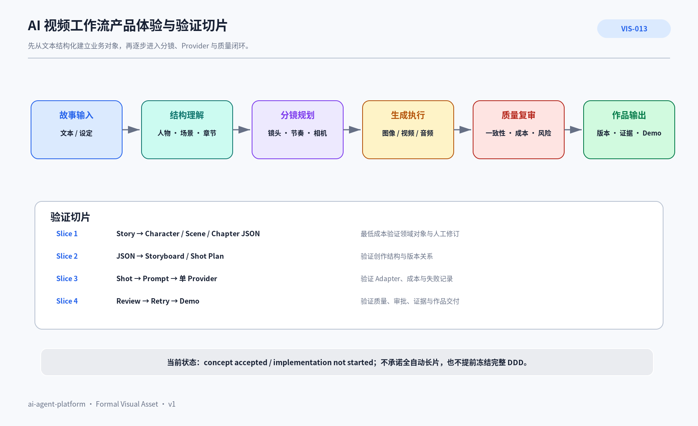

# PRD-006 AI 视频工作流产品概念与验证计划

> AI 视频工作流是计划中的第一个上层业务产品，用于验证复杂领域对象、多个生成 Provider、人工 Review、成本、证据和恢复。当前状态是 **产品概念已接受，业务实现未开始**。

## 1. 本文回答什么

本文回答：**AI 视频工作流为谁解决什么问题、产品体验是什么、如何以低成本纵向切片验证，以及何时值得进入正式设计和开发。**

它不是当前平台能力清单，也不是完整视频编辑器技术方案。

## 2. 产品机会

AI 视频创作不是一次“输入 Prompt → 输出视频”。稳定作品通常需要：

- 理解故事、人物、场景和冲突；
- 保持人物外观、场景风格和镜头连续性；
- 将章节拆成分镜、镜头和生成任务；
- 在图像、视频、声音模型之间选择与切换；
- 记录输入、模型、参数、成本、结果和失败；
- 人工复审、修订、重试并管理版本；
- 最终形成可展示、可解释、可追踪的作品。

现有工具往往优化单次生成，缺少跨阶段结构、资产血缘、质量闭环和 Provider 替换边界。

## 3. 用户与产品阶段

| 阶段 | 目标用户 | 需要完成的结果 | 当前承诺 |
|---|---|---|---|
| 当前验证 | 项目所有者 | 用真实故事完成可展示纵向切片，并验证平台能力 | 已接受概念，未进入业务开发 |
| 早期产品 | 独立创作者 / 小型创作团队 | 将故事变成可编辑的角色、场景、分镜和生成记录 | 需要 Pilot 证据后决定 |
| 远期可能 | 需要多模型协作的内容团队 | 管理持续创作、版本、协作、成本和质量 | 不是当前承诺 |

## 4. 期望产品体验



### AI 可读语义镜像

```text
完整体验链：
故事输入
→ 结构理解（人物、场景、章节、冲突）
→ 分镜规划（镜头、节奏、相机）
→ 生成执行（图像、视频、音频 Provider）
→ 质量复审（一致性、成本、风险）
→ 作品输出（版本、证据、Demo）。

验证切片：
Slice 1：Story → Character / Scene / Chapter JSON，验证领域对象和人工修订；
Slice 2：JSON → Storyboard / Shot Plan，验证创作结构与版本；
Slice 3：Shot → Prompt → 单 Provider，验证 Adapter、成本和失败记录；
Slice 4：Review → Retry → Demo，验证质量、审批、证据和交付。

当前状态：concept accepted / implementation not started。
```

- Visual Asset ID：`VIS-013`；
- 可编辑源文件：[`./assets/VIS-013-AI视频工作流产品体验与验证切片.svg`](./assets/VIS-013-AI视频工作流产品体验与验证切片.svg)；
- 人类预览：[`./assets/VIS-013-AI视频工作流产品体验与验证切片.png`](./assets/VIS-013-AI视频工作流产品体验与验证切片.png)。

## 5. 核心价值

| 用户摩擦 | 产品机制 | 用户价值 |
|---|---|---|
| 故事信息散乱 | 结构化 Story / Character / Scene / Chapter | 内容可编辑、可比较、可继续 |
| 人物与场景不一致 | Reference、Version、Constraint、Lineage | 跨镜头保持一致性 |
| 模型和接口变化快 | Provider Port + Adapter | 更换模型不破坏领域对象 |
| 失败和重试不可追踪 | Generation Task、Result、Issue、Revision | 看得见为什么失败、怎样修正 |
| 成本不可控 | 参数、调用、成本和结果关联 | 比较质量、成本和迭代价值 |
| 只剩最终样片 | 输入、决策、版本、评估和 Demo 证据 | 形成可信作品集与复盘 |

## 6. 领域对象候选

| 领域 | 核心对象 | 第一验证问题 |
|---|---|---|
| Story | Story、Chapter、Plot Point、Conflict | 能否稳定表达原故事结构并允许人工修订？ |
| Character | Character、Appearance、Trait、Reference | 能否让人物设定跨阶段复用和版本化？ |
| Scene | Scene、Location、Time、Mood | 能否将场景语义转为视觉约束？ |
| Shot | Storyboard、Shot、Camera、Duration | 能否形成可执行、可调整的镜头计划？ |
| Prompt | Prompt Template、Version、Negative Constraint | 能否把领域约束转换为 Provider 输入？ |
| Generation | Task、Provider、Model、Parameter、Result | 能否记录一次生成的全部事实和成本？ |
| Review | Evaluation、Issue、Revision、Approval | 能否形成可解释的人工质量闭环？ |
| Asset | Image、Video、Audio、Metadata、Lineage | 能否追踪资产来源、版本和使用关系？ |

这些是候选，不在 Slice 1 前冻结为完整 DDD。

## 7. 最小可行纵向切片

### Slice 1：故事结构化

- **输入**：一段真实故事文本。
- **输出**：Story、Character、Scene、Chapter、Conflict JSON，附来源位置、版本、置信度和人工修订。
- **验证**：结构是否帮助用户理解与编辑故事，而不是只得到模型摘要。

### Slice 2：分镜计划

- **输入**：已批准的结构化故事。
- **输出**：Storyboard、Shot、Camera、Duration 和场景连续性约束。
- **验证**：计划是否可被人修改，并可追溯到故事对象。

### Slice 3：单 Provider 生成

- **输入**：一个 Shot。
- **输出**：Prompt、Provider Request、Result、成本、失败和版本。
- **验证**：Provider 更换是否限制在 Adapter；失败是否可解释。

### Slice 4：质量闭环与 Demo

- **输入**：多个生成结果。
- **输出**：Evaluation、Issue、Revision、Approval、最终 Demo 和证据索引。
- **验证**：用户是否能完成一个可展示成果，并理解每次修订。

## 8. 与平台的关系

平台提供：Task / Result、身份与权限、Execution Lane、Approval、Evidence、成本记录、Health / Recovery、Provider Port、Knowledge、Registry 和 Agent / Skill 治理。

AI 视频产品拥有：故事、人物、场景、分镜、创作体验、业务规则、媒体质量标准和作品资产。

业务机制只有在第二个产品中证明可复用后，才考虑下沉平台。

## 9. 进入开发的证据门

产品从概念进入正式设计或开发前，需要：

- 至少一个真实故事样本；
- 明确的第一用户和完成任务；
- Slice 1 的验收标准与人工修订流程；
- 媒体、版权、隐私和内容安全边界；
- Provider 与成本预算；
- 大型媒体不进入公共 Git 的存储边界；
- 停止条件：结构化结果无实际编辑价值、成本不可承受或平台主线被明显拖慢。

## 10. 非目标

- 当前不建设完整视频编辑器；
- 不承诺全自动生成高质量长片；
- 不绑定单一国内或国外模型；
- 不在业务验证前建设完整媒体资产平台；
- 不同时创建全部专业 Agent；
- 不把产品概念、候选角色和目录写成已实现。

## 11. 风险

- 模型能力、价格和可用区域变化快；
- 人物一致性和长视频连续性仍困难；
- 审美评价具有主观性；
- 版权、隐私、内容安全和模型条款需要独立治理；
- 媒体存储、哈希和血缘边界尚未设计；
- 旧 Mac 不适合重型本地生成。

## 12. 关联文档

- [PRD-003 ai-agent-platform 产品定义与用户价值](../PRD-003-ai-agent-platform产品定义与用户价值/README.md)
- [PRD-007 产品组合、演进阶段与平台边界](../PRD-007-产品组合演进与平台边界/README.md)
- [ARC-017 产品孵化与需求治理体系](../../04_平台架构/ARC-017-产品孵化与需求治理体系/README.md)
- [WFL-011 新产品孵化与资产生成工作流](../../07_工作流与项目治理/WFL-011-新产品孵化与资产生成工作流.md)
