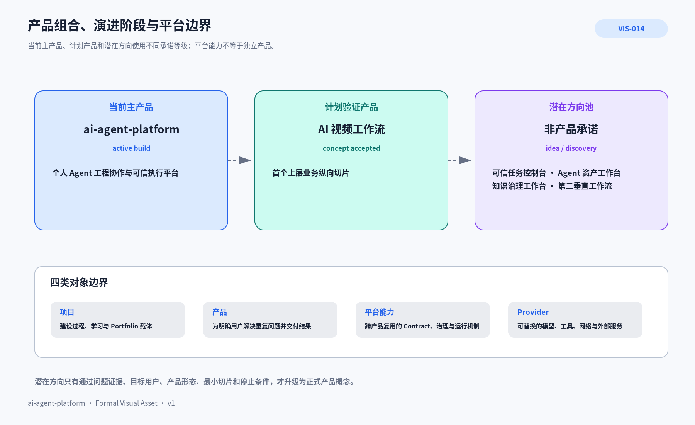

# PRD-007 产品组合、演进阶段与平台边界

> 产品体系不是把所有能力都叫作产品，而是明确：当前主产品是什么、计划验证什么、哪些只是潜在机会，以及产品、项目、平台能力和 Provider 分别拥有哪类问题。

## 1. 本文回答什么

本文回答：**当前产品组合如何分层、远期机会如何被治理，以及一项能力何时属于产品、平台或 Provider。**

## 2. 产品的判定标准

一个对象只有同时具备以下要素，才应称为产品或正式产品概念：

1. 明确用户；
2. 重复且有价值的问题；
3. 可观察的期望结果；
4. 用户完成任务的产品形态和体验；
5. 业务边界、非目标和风险；
6. 最小可验证纵向切片；
7. 证据门、负责人和停止条件。

只有代码包、Skill、模型调用、架构模块或技术机会，不自动构成产品。

## 3. 当前产品组合



### AI 可读语义镜像

```text
当前主产品：ai-agent-platform。
状态：active build。
定义：个人 Agent 工程协作与可信执行平台，是当前仓库主体。

计划验证产品：AI 视频工作流。
状态：concept accepted / implementation not started。
定义：首个依托平台的上层业务纵向切片。

潜在方向池：不是产品承诺，仅处于 idea / discovery。
候选方向包括：
- 可信任务控制台；
- 专业 Agent 资产工作台；
- 项目知识治理工作台；
- 第二个尚未命名的垂直业务工作流。
这些方向可能成为平台模块、独立产品或被拒绝，必须先通过产品判定标准。

四类对象：
项目 = 建设、学习和 Portfolio 的过程载体；
产品 = 为明确用户解决重复问题并交付结果；
平台能力 = 跨产品复用的 Contract、治理和运行机制；
Provider = 可替换的模型、工具、网络和外部服务。
```

- Visual Asset ID：`VIS-014`；
- 可编辑源文件：[`./assets/VIS-014-产品组合演进与平台边界.svg`](./assets/VIS-014-产品组合演进与平台边界.svg)；
- 人类预览：[`./assets/VIS-014-产品组合演进与平台边界.png`](./assets/VIS-014-产品组合演进与平台边界.png)。

## 4. 产品组合矩阵

| 层级 | 产品 / 方向 | 当前状态 | 主要用户 | 产品形态 | 核心价值假设 | 下一证据 |
|---|---|---|---|---|---|---|
| 当前主产品 | `ai-agent-platform` | active build / MVP early | 个人 Agent 工程师 | Git-first 工程平台、Chat/Custom GPT 入口、Runtime 和知识投影 | 让工程任务可继续、可验证、可解释 | 完成 L3 Task Control 和一个真实业务切片 |
| 计划产品 | AI 视频工作流 | concept accepted | 当前先服务项目所有者，后续可能是独立创作者 | 故事结构化、分镜、Provider 生成、复审和资产证据 | 多模型创作需要稳定领域对象与质量闭环 | 完成 Story → JSON Slice 1 |
| 潜在方向 | 可信任务控制台 | idea / discovery | 使用多个 Agent 与 Executor 的个人开发者 | 状态、审批、证据、恢复 UI | 控制面可降低执行不确定性 | 先证明 L3 机制，判断是否只是平台 UI |
| 潜在方向 | 专业 Agent 资产工作台 | idea / discovery | 维护多个 Custom GPT / Agent 的开发者 | Profile、Instructions、Knowledge Pack、Skill、Eval、Release | Git 资产化可降低 Builder 漂移 | 先完成 Agent Profile 与 Knowledge Pack Pilot |
| 潜在方向 | 项目知识治理工作台 | idea / discovery | 需要 Git→知识平台发布的项目维护者 | 文档包、Registry、Review、Projection | Human-first、AI-lossless 文档可减少双端漂移 | 先完成当前仓库 Feishu 发布与第二项目验证 |
| 潜在方向 | 第二垂直业务工作流 | 未命名 | 待发现 | 待验证 | 用第二产品验证平台共性是否真实 | 只有出现真实机会和用户证据后命名 |

潜在方向不是 Roadmap 承诺，不预建根目录、代码包或发布日期。

## 5. 产品演进阶段

```text
idea
→ discovery
→ problem_validated
→ concept_defined
→ experiment_ready
→ approved_for_design
→ approved_for_delivery
```

任一阶段都可以进入 `paused / rejected / archived`。

| 阶段 | 必要证据 | 允许创建的资产 |
|---|---|---|
| idea | 问题来源和受影响对象 | Opportunity 记录 |
| discovery | 用户、场景、现状和约束 | Discovery Brief、假设 |
| problem_validated | 问题重复、价值和不做后果 | Problem Statement、Outcome |
| concept_defined | 产品形态、边界、价值和非目标 | Product Concept、场景、领域候选 |
| experiment_ready | 样本、指标、预算、风险和停止条件 | Experiment、最小切片、ADR 候选 |
| approved_for_design | Owner 批准继续投入 | 正式设计、目标目录和 Roadmap |
| approved_for_delivery | 纵向切片与资源可交付 | 代码、发布和产品证据 |

## 6. 平台、产品、Provider 和项目边界

### 6.1 平台核心

平台拥有跨产品重复出现的机制：Task / Result、身份、Policy、状态、Execution Lane、Approval、Evidence、Health / Recovery、Knowledge、Registry、Provider Port 和通用 Skill 治理。

一项能力进入平台，需要满足多数条件：

- 至少两个不同业务场景需要；
- 语义不依赖具体业务领域；
- 可以定义稳定 Contract；
- 需要统一安全、证据或恢复；
- Provider 变化不要求产品领域修改；
- 有真实调用方和测试。

### 6.2 上层产品

产品拥有用户、业务结果、用户旅程、领域对象、业务规则、业务数据、专属 Agent / Skill、质量标准、业务 UI 和 Demo。

业务机制先在产品中验证，再决定是否下沉平台。

### 6.3 Provider / Infrastructure

模型 API、本地模型、GitHub、飞书、Dev Tunnels、云服务、设备和存储通过 Port / Adapter 接入。它们不是领域真源，替换 Provider 不应穿透产品核心。

### 6.4 项目

`ai-agent-platform` 项目是建设、学习、治理和 Portfolio 的长期工程载体；当前主产品与项目同名，但两者概念不同：

- 项目包含历史、实验、迁移、学习和作品集；
- 产品只承诺为用户交付的持续价值和体验。

因此产品文档不保存 Commit、批次和即时 Review 进度。

## 7. 典型归属矩阵

| 能力 | 平台 | 上层产品 | Provider |
|---|---|---|---|
| Task ID / State / Result | 拥有 | 使用并增加业务规则 | - |
| Approval / Evidence / Snapshot | 拥有 | 定义业务风险与验收 | - |
| Story / Character / Scene | - | AI 视频产品拥有 | - |
| 模型选择 Port | 定义稳定边界 | 提供业务约束 | Adapter 实现 |
| 视频生成 API | 定义调用治理 | 组织业务任务 | 实际服务 |
| Git / Worktree | 执行治理 | 使用 | GitHub / 本地实现 |
| Feishu Projection | 知识发布机制 | 发布产品知识 | 飞书实现 |
| 成本统计框架 | 通用数据与证据 | 定义业务指标 | 提供调用成本 |
| 视频审美评分 | 可提供评估协议 | 拥有质量标准 | 模型可辅助 |

## 8. 仓库落位原则

当前不创建根级 `products/`。真实产品进入设计或开发后，按资产类型落位：

```text
apps/<product-app>/
packages/<product-domain-package>/
docs/knowledge/<相关栏目>/<product-asset>/
docs/technical/<相关栏目>/<product-asset>/
agents/<product-role>/
knowledge-packs/<product-role>/
skills/<product-skill>/
```

跨目录归属由 Platform Registry 的 `belongs_to_product`、`supports_product` 等关系表达。

## 9. 产品组合治理规则

- 当前主产品优先完成可信控制面，不被潜在产品分散；
- AI 视频只从低成本 Slice 1 开始，不直接进入昂贵生成；
- 潜在方向必须先证明是产品，而不是已有平台模块的新名称；
- 第二个垂直产品用于验证平台复用，不为满足目录完整度而创建；
- 每个产品阶段都有 Owner、证据、预算和停止条件；
- Portfolio 清楚区分已实现、已验证、目标设计和产品假设。

## 10. 关联文档

- [PRD-003 ai-agent-platform 产品定义与用户价值](../PRD-003-ai-agent-platform产品定义与用户价值/README.md)
- [PRD-005 平台能力地图与产品成熟度](../PRD-005-平台能力地图与产品成熟度/README.md)
- [PRD-006 AI 视频工作流产品概念与验证计划](../PRD-006-AI视频工作流产品概念与验证计划/README.md)
- [ARC-017 产品孵化与需求治理体系](../../../technical/归档/历史资产/04_平台架构_整合前观点与后续处理候选/README.md)
- [WFL-011 产品孵化与专项业务工作流框架](../../07_工作流与项目治理/WFL-011-产品孵化与专项业务工作流框架/README.md)
