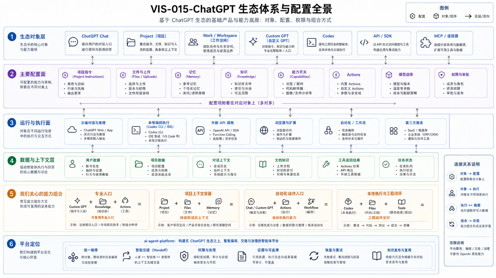

# CAP-001 ChatGPT 生态体系与配置全景

> **核心结论**：ChatGPT 生态不是一个“超级应用”，而是一组入口、上下文容器、角色封装、外部连接、执行环境和开发接口。只有把**功能、配置、权限、上下文、执行环境和证据**组合起来，才形成可交付能力。

## 1. 本文回答什么

本文先把体系说清楚，再说明 `ai-agent-platform` 的位置：

1. ChatGPT 体系里有哪些主要组成；
2. 每个组成有哪些配置入口；
3. 功能与配置组合后能做哪些事；
4. 哪些能力直接使用 OpenAI 生态，哪些能力必须由平台补齐。

本文不维护模型完整名单、套餐额度和菜单位置。它们属于易变产品事实，使用前应回到官方说明和当前账号验证。

## 2. 一项能力是怎样形成的

```text
产品入口
+ 配置
+ 权限
+ 上下文
+ 执行环境
+ 结果证据
= 可复用、可执行、可验证的任务能力
```

| 要素 | 它决定什么 | 典型对象 |
|---|---|---|
| 产品入口 | 用户从哪里发起、观察和接收结果 | Chat、Project、Custom GPT、Codex、API |
| 配置 | 角色如何工作、能使用什么能力 | Instructions、Knowledge、Apps、Actions、AGENTS、Skills |
| 权限 | 谁能读、写、调用和批准 | Workspace 权限、应用权限、沙箱、审批、后端策略 |
| 上下文 | 本次任务依据哪些事实 | 对话、文件、Project、Memory、Git Context、Registry |
| 执行环境 | 文件、命令和工具在哪里真实运行 | ChatGPT 云端、Codex 本地/云端、自建 Gateway / Runtime |
| 结果证据 | 怎样证明动作真实发生且结果可信 | 测试、Diff、Commit、日志、任务结果、远端回读 |

因此，“模型能回答”不等于“系统能可靠完成任务”。

## 3. ChatGPT 生态的六个组成面

### 3.1 对话与工作入口

| 组成 | 主要用途 | 关键配置 | 能形成的能力 |
|---|---|---|---|
| Chat | 对话、搜索、分析、创作和临时文件处理 | 模型、工具、文件、当前会话 | 快速澄清、规划和内容生成 |
| Project（项目） | 长期主题下组织对话、文件和项目指令 | 项目指令（Project Instructions）、文件、记忆模式、共享成员、可用工具 | 多线程、长期项目上下文 |
| Work（工作任务） | 较长、可审阅的通用任务 | 工作目录或 Project、模型、速度、工具、本地或云端授权 | 研究、文档、文件和桌面任务 |
| 语音与移动端（Voice / Mobile） | 随时输入、语音交互和轻量监督 | 麦克风、相机、通知、客户端能力 | 移动沟通、轻量查询和远程监督 |

OpenAI 将 [Projects in ChatGPT](https://help.openai.com/en/articles/10169521-projects-in-chatgpt) 定义为长期工作的智能工作空间，可把相关对话、文件和项目指令放在一起。Project 能降低重复解释成本，但它不提供 Git 的提交、差异、分支和可重复发布能力。

### 3.2 个性化与上下文

| 组成 | 适合保存 | 不适合保存 |
|---|---|---|
| 记忆（Memory） | 长期、低风险的个人偏好和背景 | 精确任务状态、Commit、Secret、审批记录 |
| 自定义指令（Custom Instructions） | 全局、稳定的回复偏好 | 某个仓库的完整规则和动态进度 |
| 项目指令（Project Instructions） | 当前 Project 的目标、术语和会话约定 | 代码目录规则、执行权限、版本化合同 |
| 文件与来源（Files / Sources） | 报告、数据、说明材料和临时参考 | 正式版本控制、资产关系和生命周期 |

[Memory FAQ](https://help.openai.com/en/articles/8590148-memory-faq) 说明 Memory 用于个性化，并可从聊天、文件和连接应用中形成上下文。它是辅助机制，不是工程事实数据库。

### 3.3 可复用角色

Custom GPT（自定义 GPT）是在 ChatGPT 内配置的专业角色入口。根据 [Creating and editing GPTs](https://help.openai.com/en/articles/8770868)，主要配置包括：

- 名称、描述和对话开场白；
- 行为指令（Instructions）；
- 参考知识（Knowledge）；
- 内置能力（Capabilities）；
- 应用或动作（Apps / Actions，外部连接）；
- 分享、预览和版本历史。

功能组合示例：

```text
Custom GPT
+ 行为指令
+ 参考知识
+ 内置能力
+ 应用或动作
+ 分享与版本设置
→ 可复用、可分发的专业任务入口
```

Custom GPT 不自动拥有跨会话任务数据库、本机权限和项目最终事实。

### 3.4 外部连接与工具

| 组成 | 作用 | 权限边界 |
|---|---|---|
| 应用（Apps） | 连接外部数据、搜索、同步和可选写操作 | 受用户授权、Workspace、角色和源系统权限共同限制 |
| 插件（Plugins） | 分发一组工作流能力，可包含 Skills、Apps 和模板 | 安装和可用性受计划、Workspace、角色和地区限制 |
| 动作（Actions） | 让 Custom GPT 调用开发者定义的 HTTP API | 需要 OpenAPI、认证、隐私说明和后端授权 |
| 模型上下文协议（Model Context Protocol，MCP） | 向 Agent 暴露工具和资源 | 连接方式、认证、网络和审批由 Host / Runtime 控制 |
| 内置工具 | 搜索、数据分析、图片、浏览器或计算机操作 | 受产品入口、计划和安全策略限制 |

[Apps in ChatGPT](https://help.openai.com/en/articles/11487775-connectors-) 说明 Apps 可读取外部信息，也可能执行写操作；是否需要确认由应用权限、动作风险和 Workspace 策略共同决定。应用权限不会扩大源系统已经授予的权限。

### 3.5 软件工程执行

Codex 面向仓库、文件、终端、测试和工程交付。主要入口包括：

- Codex App；
- Codex 命令行（Codex CLI）；
- 编辑器扩展（IDE Extension）；
- 云端或远程任务（Cloud / Remote）。

Codex 的实际行为还受以下配置影响：

```text
Repository / Worktree
+ AGENTS.md
+ 技能 / 插件 / MCP
+ 沙箱（Sandbox）
+ 审批（Approval）
+ 网络权限（Network）
+ Git 操作策略（Git Operating Policy）
→ 可审阅的软件工程执行能力
```

[Introducing the Codex app](https://openai.com/index/introducing-the-codex-app/) 介绍了多任务、Worktree、Diff Review、Skills 和可配置安全边界。Codex 可以执行工程任务，但不能替代产品决策、项目真源和最终验收。

### 3.6 开发者平台

当产品需要自有界面、状态、权限、业务流程和运行环境时，应使用 OpenAI API 或智能体开发工具包（Agents SDK）。

```text
Responses API / Agents SDK
+ Model
+ Tools / MCP
+ 身份 / 状态 / 存储
+ 自动校验（Guardrails）
+ 人工审批（Human Review）
+ 追踪（Tracing）
+ 自有运行环境和界面
→ 可嵌入业务系统的 Agent 产品
```

[Agents SDK 官方指南](https://developers.openai.com/api/docs/guides/agents) 明确区分：Responses API 适合应用自己管理循环和分支；Agents SDK 适合由 SDK 管理 Agent 循环、交接、会话、追踪和可恢复审批。

## 4. 配置的四个层级

| 层级 | 典型配置 | 应保存什么 | 不应保存什么 |
|---|---|---|---|
| 个人层 | 记忆、自定义指令 | 稳定偏好、低风险背景 | 项目动态状态、Secret |
| Project 层 | 项目指令、文件、成员、记忆模式 | 项目会话约定和参考资料 | Git 规则、强制权限 |
| 角色层 | GPT 指令、参考知识、应用 / 动作 | 专业角色、方法、稳定知识 | 当前 Task 和运行状态 |
| 执行层 | AGENTS、技能、沙箱、审批、策略 | 仓库规则、执行方法和权限边界 | 产品语义决定和最终验收 |

平台设计必须区分“告诉 Agent 应该怎么做”和“系统真正允许它做什么”。文字指令不是强制安全边界。

## 5. 功能与配置组合后能做什么

### 长期项目协作

```text
Project
+ 项目指令
+ 文件与来源
+ 明确的记忆边界
+ 当前 Workspace 工具
→ 长期、多线程的项目上下文空间
```

### 专业角色入口

```text
Custom GPT
+ 行为指令
+ 参考知识
+ 内置能力
+ 应用或动作
→ 可复用的专业问答、分析或窄动作入口
```

### 软件工程执行

```text
Codex
+ 仓库 / 工作树
+ AGENTS / 技能
+ 沙箱 / 审批
+ 测试 / Git 策略
→ 可审阅的代码、文档和工程变更
```

### 自建 Agent 产品

```text
API / Agents SDK
+ 工具 / 状态 / 身份认证 / 存储
+ 自动校验 / 审批 / 追踪
+ 自有业务领域和界面
→ 可嵌入业务系统的 Agent Runtime
```

## 6. `ai-agent-platform` 在体系中的位置

### 直接继承

- ChatGPT、Project、Custom GPT、Work、Codex 和 API 的现成入口；
- 模型推理、内容生成、搜索、文件和工具调用；
- Workspace、应用、沙箱和审批提供的基础安全能力。

### 统一编排

- 根据任务选择入口、上下文和执行器；
- 将 Project、Git Context、Registry 和正式知识组合成可信输入；
- 将 Custom GPT、Actions、Gateway 和 Runtime 组合成受控调用；
- 将 Codex、Git 策略、测试和 Review 组合成可验证交付。

### 必须自建

- 持久任务、版本和状态；
- 身份、范围、风险、策略和审批；
- 执行器适配、能力路由和执行通道；
- 证据、副作用账本、检查点和恢复；
- Agent、Skill、Knowledge 和发布治理。

平台不是复制 ChatGPT 或 Codex，而是补齐“入口之间缺失的控制面”。

## 7. 正式图生成说明

本篇正文已经冻结“体系对象、配置层级和平台边界”。正式图必须基于本篇正文单独设计，重点表达：

- 六个生态组成面；
- 四个配置层级；
- 继承、编排、自建三类平台责任；
- 产品入口与真实权限之间的边界。

图不得增加正文未确认的新产品能力。

Visual Asset ID：`VIS-015`



### AI 可读语义镜像

```text
图按从上到下的阅读顺序组织：

1. 用户入口：Chat、Project、Work、Voice / Mobile；
2. 个性化与上下文：Memory、Custom Instructions、Project Instructions、Files；
3. 可复用角色：Custom GPT 及其 Instructions、Knowledge、Capabilities、Apps / Actions；
4. 外部连接：Plugins、Apps、Actions、MCP、内置工具；
5. 执行入口：Codex App、CLI、IDE、Cloud / Remote；
6. 开发者平台：Responses API、Agents SDK、自建 Runtime、State 和 UI。

右侧配置控制面包括：身份与 Workspace、行为与知识、工具与连接、执行与安全、状态与证据。

底部平台责任分为：
- 继承：直接使用 OpenAI 生态能力；
- 编排：组合入口、上下文、工具和执行器；
- 自建：任务、策略、审批、证据、恢复和知识治理。
```

- 可编辑源文件：[`VIS-015-ChatGPT生态体系与配置全景.svg`](./assets/VIS-015-ChatGPT生态体系与配置全景.svg)
- 高清预览：[`VIS-015-ChatGPT生态体系与配置全景.png`](./assets/VIS-015-ChatGPT生态体系与配置全景.png)

## 8. 稳定结论与易变事实

### 稳定结论

- 产品入口不等于模型；
- 配置不等于强制权限；
- Memory、Project、Knowledge 和 Task State 不是同一类状态；
- 外部连接不会替代源系统权限和后端策略；
- 真实执行必须有可定位证据。

### 易变事实

- 菜单位置、模型名称和套餐；
- 文件数量、工具和入口可用性；
- Plugins、Apps、Work 和 Codex 的当前产品形态；
- 客户端、地区和 Workspace 差异。

产品事实核验日期：**2026-08-03**。

## 9. 官方事实来源

- [Projects in ChatGPT](https://help.openai.com/en/articles/10169521-projects-in-chatgpt)
- [Creating and editing GPTs](https://help.openai.com/en/articles/8770868)
- [Memory FAQ](https://help.openai.com/en/articles/8590148-memory-faq)
- [Apps in ChatGPT](https://help.openai.com/en/articles/11487775-connectors-)
- [Introducing the Codex app](https://openai.com/index/introducing-the-codex-app/)
- [Agents SDK](https://developers.openai.com/api/docs/guides/agents)

## 10. 关联文档

- [CAP-002 生态组件配置与能力差异](../CAP-002-生态组件配置与能力差异/README.md)
- [CAP-008 平台核心能力模型与目标对齐](../CAP-008-平台核心能力模型与目标对齐/README.md)
- [CAP-006 从 ChatGPT 到 Codex 的平台执行闭环](../CAP-006-从ChatGPT到Codex的平台执行闭环/README.md)
- [PRD-003 产品定义与用户价值](../../00_项目与产品/PRD-003-ai-agent-platform产品定义与用户价值/README.md)
