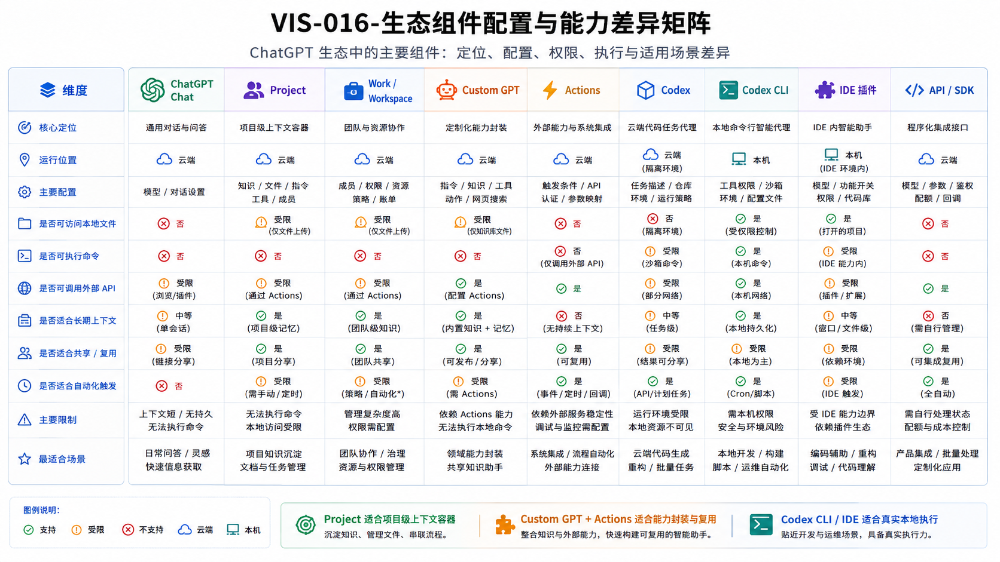

# CAP-002 ChatGPT 生态组件配置与能力差异

> **核心结论**：组件名称相近，不代表能力相同。选型时必须同时看**入口定位、配置面、上下文范围、运行位置、权限、外部连接、状态所有权和结果证据**。

## 1. 本文回答什么

本文不再逐个介绍产品，而是解决实际选型问题：

- 同一任务应该放进 Chat、Project、Custom GPT、Work 还是 Codex；
- 哪些组件只能提供上下文，哪些能够真实执行；
- 哪些配置会改变实际能力；
- 哪些能力必须由 `ai-agent-platform` 补齐。

## 2. 判断一个组件的八个维度

| 维度 | 需要问的问题 |
|---|---|
| 入口定位 | 它主要服务对话、项目、角色、执行还是开发集成？ |
| 运行位置 | 云端、本机、托管沙箱，还是由应用自行决定？ |
| 上下文 | 它能读取哪些对话、文件、项目、仓库和长期状态？ |
| 配置 | 能否配置角色、知识、工具、模型、网络和运行方式？ |
| 权限 | 谁决定读写范围、动作确认和高风险操作？ |
| 外部连接 | 通过 Apps、Actions、MCP、API 还是本机工具连接？ |
| 状态所有权 | 任务和结果状态由会话、Project、Git、后端还是应用保存？ |
| 证据 | 能否提供文件、测试、Diff、Commit、日志或外部回读？ |

选型公式：

```text
实际可交付能力
= 组件原生功能
+ 配置
+ 权限
+ 上下文
+ 执行环境
+ 状态与证据
```

## 3. 组件能力对比

| 组件 | 核心定位 | 关键配置 | 本地文件 / 命令 | 外部连接 | 状态主要归属 | 最适合 |
|---|---|---|---|---|---|---|
| Chat | 通用对话入口 | 模型、工具、文件、会话 | 不直接执行本机命令 | 内置工具、应用 | 当前会话和记忆 | 澄清、规划、分析、创作 |
| Project（项目） | 长期项目上下文空间 | 项目指令、文件、记忆模式、共享和工具 | 不直接执行本机命令 | 继承可用工具 | Project 内对话和文件 | 长期、多线程项目协作 |
| Custom GPT | 可复用专业角色 | 行为指令、参考知识、内置能力、应用或动作、分享 | 不直接拥有本机权限 | Apps 或 Actions | GPT 配置和当前会话 | 专业角色、标准化入口 |
| Work（工作任务） | 通用可交付任务 | 工作目录 / Project、模型、速度、工具、本地或云端授权 | 取决于桌面授权和任务模式 | Apps、Browser、Computer | 本地或云任务 | 研究、文档、文件和桌面任务 |
| 应用 / 插件（Apps / Plugins） | 外部数据和工作流能力 | 安装、认证、角色、动作控制、同步、域限制 | 取决于具体应用 | 源系统 | 源系统和 Workspace | 组织工具、数据和动作连接 |
| 动作（Actions） | GPT 的窄 HTTP API | OpenAPI、认证、隐私、确认 | 由后端执行 | 开发者 API | 后端 | 可控业务动作和 Gateway 入口 |
| Codex App | 多任务工程智能体 | Project、Local / Cloud、Skills、Plugins、权限 | 本地任务可读写仓库并运行命令 | Plugins、MCP、网络 | 任务线程、仓库和 Git | 多任务软件工程和 Review |
| Codex 命令行 / 编辑器 | 精确本地工程执行 | 配置、AGENTS、技能、MCP、沙箱、审批 | 是 | MCP 和网络 | 本机环境、Git、任务记录 | 实现、测试、调试、自动化 |
| API / 智能体开发工具包 | 自建智能体产品 | 模型、工具、状态、认证、运行环境、自动校验、追踪 | 由应用定义 | Function、MCP、外部 API | 应用和数据库 | 自有 UI、业务流程和控制面 |

## 4. 配置怎样改变能力

### 4.1 Project：从聊天集合变成长期项目空间

```text
Project
+ 项目指令
+ 文件与来源
+ 明确的记忆模式
+ 共享成员与 Workspace 工具
→ 长期、多线程、可共享的项目上下文
```

Project 解决“相关内容放在一起”，但不解决 Git 版本、代码执行权限和任务状态机。

### 4.2 Custom GPT：从通用 Chat 变成专业角色

```text
Custom GPT
+ 行为指令
+ 参考知识
+ 内置能力
+ 应用或动作
+ 分享与版本
→ 可复用、可分发的专业入口
```

行为指令决定工作方式，参考知识提供稳定资料，应用 / 动作提供外部连接。它们都不能替代后端身份、策略和持久状态。

### 4.3 Work：从对话变成可交付任务

```text
Work
+ Project 上下文或本地目录
+ 模型 / 推理 / 速度
+ 浏览器 / 应用 / 文件
+ 用户授权
→ 研究、文档、表格、演示或桌面操作
```

Work 的具体本地能力取决于客户端、系统权限和任务模式，不能仅凭入口名称推断。

### 4.4 Codex：从代码问答变成工程执行

```text
Codex
+ 仓库 / 工作树
+ AGENTS / 技能 / 插件 / MCP
+ 沙箱 / 审批 / 网络
+ 测试 / Git 操作策略
→ 可审阅的软件工程变更
```

沙箱和审批控制本机边界，AGENTS 和 Skills 提供工作规则，Git 与测试提供结果证据。

### 4.5 API / Agents SDK：从产品能力变成自建系统

```text
API / Agents SDK
+ 工具 / MCP
+ 身份 / 状态 / 存储
+ 自动校验 / 人工审批
+ 追踪 / 评测
+ 自有界面与业务领域
→ 可嵌入业务系统的 Agent Runtime
```

[Guardrails and human review](https://developers.openai.com/api/docs/guides/agents/guardrails-approvals) 说明自动校验与人工审批承担不同职责：自动校验负责规则判断，人工审批负责高风险动作是否继续。

## 5. 最容易混淆的边界

| 容易混淆 | 正确边界 | 选择建议 |
|---|---|---|
| Project 与 Custom GPT | Project 是持续上下文空间；GPT 是可复用角色配置 | 一个项目可使用多个专业 GPT |
| Chat 与 Work | Chat 偏即时讨论；Work 偏较长、可交付任务 | 需要文件产物或长流程时优先 Work |
| Work 与 Codex | Work 面向通用任务；Codex 面向仓库和工程工具 | 代码、测试、终端和 Git 使用 Codex |
| 应用与动作 | Apps 使用用户 / Workspace 连接；Actions 调用 GPT Builder 定义的 API | 组织工具用 Apps，窄自建接口用 Actions |
| 插件与应用 | Plugin 是分发和发现的能力包；App 是具体外部集成 | Plugin 可组合 Skills、Apps 和模板 |
| AGENTS 与 Skill | AGENTS 是仓库长期规则；Skill 是按任务触发的方法包 | 规则放 AGENTS，重复流程放 Skill |
| MCP 与工作流 | MCP 暴露工具和资源；Workflow 还需要状态、审批、幂等和恢复 | MCP 是连接层，不是完整控制面 |
| 记忆与知识 | Memory 用于个性化；Knowledge 用于稳定参考 | 两者都不保存精确 Task State |
| ChatGPT 与 API | ChatGPT 是现成产品；API / SDK 用于构建自有产品 | 需要自有 UI 和状态时使用 API / SDK |

## 6. `ai-agent-platform` 的选型基线

| 需求 | 当前主载体 | 平台补充的能力 |
|---|---|---|
| 目标讨论、产品与架构判断 | 当前 Chat / Planner | 可信上下文、决策边界和用户复审 |
| 长期会话组织 | ChatGPT Project | Git 真源、Registry 和影响分析 |
| 专业角色入口 | Custom GPT | 智能体档案、知识包、动作策略和发布 |
| 通用文件 / 研究任务 | Work | 任务合同、权限、证据和回流 |
| 仓库、终端、测试、Git | Codex | 交接、范围、Git 策略、失败续跑 |
| 外部窄动作 | 动作 → 网关 | 身份、能力、策略、任务结果 |
| 自有平台运行环境 | API / 智能体开发工具包 | 任务状态、适配器、审批、证据、恢复 |
| 正式事实和资产 | Git / Registry | 文档包、生命周期、发布和回读 |

## 7. 正式图生成说明

本篇正文已经冻结比较维度和选型结论。正式图必须采用高密度矩阵，至少显示：

- 9 类主要组件；
- 入口定位、运行位置、上下文、配置、本地文件、命令、外部连接、共享、状态和证据；
- “支持 / 受限 / 不支持 / 由应用定义”四类状态；
- 图例和关键注释。

图不得为了美观省略“状态所有权”和“证据”两个平台判断维度。

Visual Asset ID：`VIS-016`



### AI 可读语义镜像

矩阵的核心结论如下：

1. Chat、Project 和 Custom GPT 主要提供交互、上下文和角色能力，不直接拥有本机命令权限；
2. Work 是否能操作本地文件取决于桌面任务模式和系统授权；
3. Codex App、CLI 和 IDE 是软件工程执行入口，其中 CLI / IDE 的本机边界最明确；
4. Apps 和 Actions 都能连接外部系统，但身份、权限和状态归属不同；
5. API / Agents SDK 由开发者定义状态、工具、运行时和产品界面；
6. 没有任何单一组件同时提供项目真源、持久任务、统一策略、证据和恢复；这些是平台需要补齐的控制面。

- 可编辑源文件：[`VIS-016-生态组件配置与能力差异矩阵.svg`](./assets/VIS-016-生态组件配置与能力差异矩阵.svg)
- 高清预览：[`VIS-016-生态组件配置与能力差异矩阵.png`](./assets/VIS-016-生态组件配置与能力差异矩阵.png)

## 8. 官方事实来源

- [Projects in ChatGPT](https://help.openai.com/en/articles/10169521-projects-in-chatgpt)
- [Creating and editing GPTs](https://help.openai.com/en/articles/8770868)
- [Apps in ChatGPT](https://help.openai.com/en/articles/11487775-connectors-)
- [Introducing the Codex app](https://openai.com/index/introducing-the-codex-app/)
- [Agents SDK](https://developers.openai.com/api/docs/guides/agents)
- [Guardrails and human review](https://developers.openai.com/api/docs/guides/agents/guardrails-approvals)

核验日期：**2026-08-03**。具体可用性仍取决于计划、Workspace、角色、客户端和地区。

## 9. 关联文档

- [CAP-001 ChatGPT 生态体系与配置全景](../CAP-001-ChatGPT生态体系与配置全景/README.md)
- [CAP-008 平台核心能力模型与目标对齐](../CAP-008-平台核心能力模型与目标对齐/README.md)
- [CAP-006 从 ChatGPT 到 Codex 的平台执行闭环](../CAP-006-从ChatGPT到Codex的平台执行闭环/README.md)
