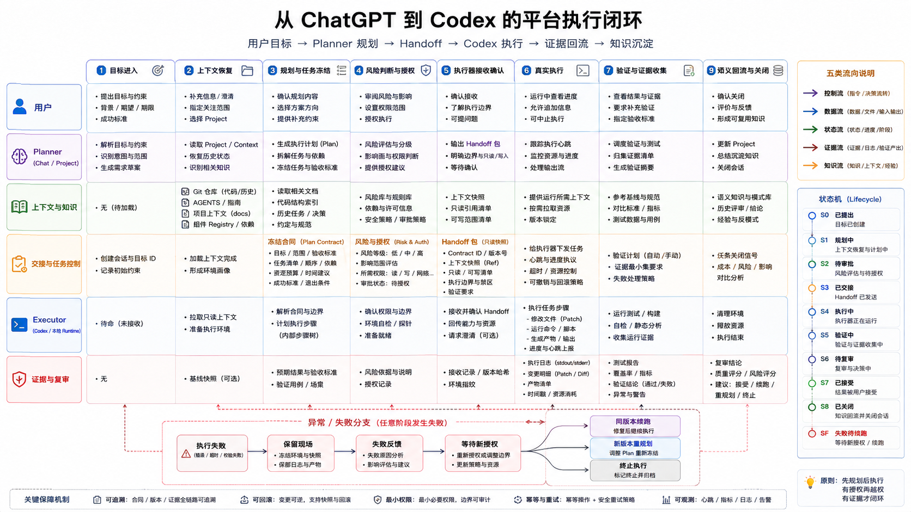

# CAP-006 从 ChatGPT 到 Codex 的平台执行闭环

> **核心结论**：一条可信任务链不是“ChatGPT 把提示词发给 Codex”。它必须明确任务状态、角色泳道、输入输出、审批点、执行边界、失败路径、证据回流和安全续跑。

## 1. 本文回答什么

本文用一个完整状态流说明：用户目标怎样从 ChatGPT 进入规划，怎样形成可执行合同，怎样交给 Codex / Work / 运行环境，怎样验证、Review、续跑并回流为正式知识。

本文区分：

- **当前已验证链路**：已有真实 Commit、测试和 Action 调用证据；
- **人工控制闭环**：目前由规划者（Planner）、用户和 Codex 协作完成；
- **目标任务控制（Task Control）**：未来由平台持久化和自动校验。

## 2. 六条泳道与所有权

| 泳道 | 主要责任 | 关键输入 | 关键输出 | 不能自行决定 |
|---|---|---|---|---|
| 用户 | 提出目标、确认高影响变化、最终接受 | 需求、约束、环境、风险偏好 | 授权、反馈、接受或拒绝 | 执行器内部命令细节 |
| Chat / 规划者（Planner） | 恢复事实、判断语义、拆解任务、生成合同、复审 | 用户目标、Context、知识、代码和证据 | 计划、冻结 Artifact、Handoff、Review 结论 | 未授权仓库写入和外部副作用 |
| 上下文 / 知识 | 提供正式事实和最小必要上下文 | Git、Registry、文档、代码、测试 | 上下文包（Context Package）、来源和边界 | 自主规划和执行 |
| 交接 / 任务控制 | 保存任务版本、状态、范围、权限和停止规则 | Planner 决策与用户授权 | 规范合同（Canonical Contract）、审批、安全续跑点 | 产品语义创作 |
| 执行器（Executor） | 在合同范围内执行文件、命令、工具和测试 | Handoff、Artifact、执行环境 | 变更、日志、测试、失败报告、Commit | 扩大范围、改写目标和自行接受结果 |
| 证据 / 复审（Review） | 汇总证据并决定接受、修订、续跑或终止 | Diff、测试、日志、Commit、远端回读 | Review 决定、知识更新候选、安全续跑点 | 用声明替代真实证据 |

## 3. 任务状态模型

### 3.1 主状态

```text
DRAFT（草稿）
→ CONTEXT_READY（上下文已恢复）
→ PLANNED（方案已确定）
→ AWAITING_APPROVAL（等待审批，可选）
→ AUTHORIZED（已授权）
→ ACKNOWLEDGED（执行器已接收）
→ RUNNING（执行中）
→ VALIDATING（验证中）
→ AWAITING_REVIEW（等待复审）
→ ACCEPTED（已接受）
→ CLOSED（已关闭）
```

### 3.2 异常状态

```text
RUNNING / VALIDATING
→ BLOCKED（外部条件阻断）
→ FAILED_SAFE（安全失败，现场保留）
→ AWAITING_DECISION（等待用户或 Planner 决定）
→ RESUMABLE（可从检查点续跑）
→ RUNNING
```

或者：

```text
AWAITING_DECISION
→ REPLAN_REQUIRED（需要新版本方案）
→ PLANNED
```

最终也可以进入：

```text
TERMINATED（终止，不再继续）
```

状态变化必须绑定任务版本，避免旧审批授权新内容。

## 4. 完整流程流转

### 阶段 A：目标进入与任务草稿

**输入**：用户目标、期望结果、限制、环境和授权偏好。

**处理**：

1. 识别这是讨论、研究、文档、仓库实现还是外部动作；
2. 标记可能产生副作用的操作；
3. 创建任务草稿，不立即执行。

**输出**：Goal、初始 Scope、风险提示和待补信息。

**停止条件**：目标不明确、必要环境未知、权限范围无法判断。

### 阶段 B：上下文恢复

规划者按最小充分顺序读取：

```text
当前会话 / Project
→ Git 上下文
→ Registry / 索引
→ 少量相关正式文档
→ 代码、测试、历史证据
→ 必要的当前官方资料
```

**输出**：上下文包（Context Package），包括已验证事实、当前状态、目标设计、冲突、未知项和来源。

**判断点**：

- 事实是否足以做决策；
- 当前仓库 SHA、分支和工作区是否可信；
- 是否存在必须由用户决定的冲突。

不足时状态进入 `BLOCKED` 或 `AWAITING_DECISION`。

### 阶段 C：规划与版本冻结

Planner 完成：

- 目标与非目标；
- 选择的方案和舍弃方案；
- 文件或系统范围；
- 输入、输出和验收；
- 风险、审批点和停止规则；
- 是否采用普通实施或冻结文件交付。

形成任务版本（`任务版本`）。任何语义变化都创建新版本，旧授权不自动继承。

### 阶段 D：授权与接收确认

高影响任务进入 `AWAITING_APPROVAL`（等待审批）。授权至少说明：

- 允许读写的精确范围；
- 是否允许网络、外部系统和 Secret；
- 是否允许 Commit、Push、发布和删除；
- Context 是否只读；
- 失败是否允许重试。

授权后进入 `AUTHORIZED`。执行器必须返回接收确认（Reception Ack）：

- 实际分支、SHA、工作区和环境；
- 理解到的目标、范围和禁止项；
- 将运行的验证；
- 发现的合同冲突。

接收确认匹配后进入 `ACKNOWLEDGED`，否则停止。

### 阶段 E：真实执行

执行入口按任务选择：

| 任务 | 主要执行入口 |
|---|---|
| 通用研究、文档、文件和桌面任务 | Work |
| 仓库、终端、测试和 Git | Codex |
| 窄 HTTP 能力 | Custom GPT 动作 → Gateway → Runtime |
| 平台自有业务流程 | API / Agents SDK Runtime |

执行器只在合同范围内操作。每个有副作用的动作必须可定位到 任务版本、执行器和时间。

### 阶段 F：验证与证据收集

执行完成不等于任务完成。进入 `VALIDATING` 后收集：

```text
产物 / 文件 Hash
+ 验证命令与退出码
+ Git 差异 / 范围
+ 测试结果
+ 提交 / 远端 SHA
+ 运行环境任务结果 / 日志
+ 外部系统回读
```

任何验证失败进入 `FAILED_SAFE`，不得通过扩大 Scope、改写校验器或修改冻结内容绕过。

### 阶段 G：规划者与用户复审

进入 `AWAITING_REVIEW` 后，规划者检查：

- 目标是否达成；
- 是否越过权限和范围；
- 证据是否真实、完整和可复现；
- 当前实现是否被误写成目标设计；
- 是否产生未记录副作用；
- 是否需要修订、续跑或终止。

用户决定接受重要结果。通过后进入 `ACCEPTED`。

### 阶段 H：状态与知识回流

只有已接受的稳定事实和决策进入：

- Context；
- Platform Registry；
- 正式知识或 ADR；
- Release / Migration；
- 飞书投影。

运行日志、临时错误和未确认推断留在任务证据中，不直接复制到长期知识。

## 5. 四种流必须分开

| 流 | 传递内容 | 方向 | 核心问题 |
|---|---|---|---|
| 控制流 | Goal、任务版本、Scope、Policy、审批、Stop Rules | Planner → Handoff → Executor | 谁决定下一步？ |
| 数据流 | 文件、上下文、工具输入、API 载荷、结果 | 上下文 / 工具 ↔ 执行器 | 处理了什么数据？ |
| 状态流 | 草稿、已授权、执行中、失败、复审、已接受 | 任务控制 | 任务现在处于哪里？ |
| 证据流 | 测试、日志、差异、提交、任务结果、回读 | 执行器 → 复审 / Registry | 怎样证明真实发生？ |
| 知识流 | 已批准事实、决策和结构 | 规划者 → Git 知识 → 投影 | 什么值得长期保留？ |

把这些内容混在一条聊天消息中，会导致无法恢复任务状态和责任。

## 6. 失败、暂停与安全续跑

失败 / 停止报告（Failure / Stop Report）必须包含：

- 原始错误；
- 最后成功门禁；
- 已发生的副作用；
- 当前分支、SHA、工作区、Index 和 Untracked；
- 已完成和未完成步骤；
- 证据位置；
- 安全续跑点；
- 需要的新增授权或决定。

续跑规则：

```text
同一任务版本
+ 合同未变化
+ 现场可证明完整
→ 从安全续跑点继续
```

以下情况必须重新规划并创建新版本：

- 目标或方案变化；
- 范围扩大；
- 权限或 Git 策略变化；
- 冻结 Artifact 变化；
- 证据表明原方案不成立。

禁止自动 Reset、Clean、Force Push、修改冻结内容、无限重试或静默切换协议。

## 7. 当前已验证链路与目标闭环

### 当前已验证

#### 动作窄链路

```text
用户自然语言
→ Custom GPT 动作
→ Microsoft 开发隧道
→ 动作网关
→ 本地运行环境
→ runtime.status
→ Contract v1 任务结果
```

#### 冻结交付链路

```text
规划者生成完整 ZIP / 覆盖文件
→ Codex 验证合同 / Hash / 范围
→ 机械覆盖与删除
→ npm / Git 验证
→ 单 Commit / Push
→ 远端 SHA 回读
→ 规划者复审
```

这些链路证明受控入口和确定性交付可行，但持久 Task Control 仍由人工承担。

### 目标闭环

```text
Goal
→ Persistent Task / Version / State
→ 上下文包（Context Package）
→ Risk / 审批
→ Executor Adapter / Execution Lane
→ Evidence / Side-effect Ledger
→ Checkpoint / Snapshot / Recovery
→ Review / Knowledge Update
```

当前缺口不是入口数量，而是状态、动态身份、结构化审批、统一证据和恢复。

## 8. 正式图生成说明

本篇正文已经冻结泳道、状态、主流程、判断点和失败路径。正式图必须是多泳道流程图，并同时表达：

- 用户、Planner、Context、Handoff、Executor、Evidence 六条泳道；
- 主状态与异常状态；
- 输入、输出、判断点和授权点；
- 控制流、数据流、证据流和知识回流；
- 当前已验证窄链与目标任务控制 的边界。

Visual Asset ID：`VIS-018`



### AI 可读语义镜像

```text
主流程：
用户目标
→ 任务草稿
→ 上下文恢复
→ 方案与 任务版本 冻结
→ 风险判断
→ 必要时用户审批
→ 执行器接收确认
→ 真实执行
→ 验证和证据收集
→ 规划者 / 用户复审
→ 接受
→ 上下文 / Registry / 知识回流。

失败流程：
执行或验证失败
→ 保留现场
→ 失败报告
→ 等待决定
→ 同版本安全续跑 / 新版本重规划 / 终止。

关键门禁：
- 事实不足时不得规划；
- 未授权不得执行；
- 接收确认不匹配不得写入；
- 验证失败不得提交或发布；
- 未 Review 的结果不得进入正式知识。
```

- 可编辑源文件：[`VIS-018-从ChatGPT到Codex的平台执行闭环.svg`](./assets/VIS-018-从ChatGPT到Codex的平台执行闭环.svg)
- 高清预览：[`VIS-018-从ChatGPT到Codex的平台执行闭环.png`](./assets/VIS-018-从ChatGPT到Codex的平台执行闭环.png)

## 9. 实现映射

| 闭环部分 | 当前仓库位置 |
|---|---|
| 规划者–执行者交接 | `skills/planner-executor-handoff/` |
| Custom GPT 动作s | `skills/custom-gpt-actions/` |
| Contracts | `packages/contracts/` |
| Auth / Policy | `packages/auth/`、`packages/policy/` |
| 网关 / 运行环境 | `apps/action-gateway/`、`apps/local-runtime/` |
| 开发隧道 | `apps/dev-tunnel/` |
| 上下文 / 知识 / Registry | `context/`、`docs/knowledge/`、`platform-registry/` |
| 目标任务控制 | 总体结构由 `ARC-001`、`ARC-016` 承接；Workflow 规则由 `WFL-001`、`WFL-002`、`WFL-005`、`WFL-006`、`WFL-007`、`WFL-009`、`WFL-010`、`WFL-012` 承接。旧 `ARC-009`、`ARC-010`、`ARC-013`、`ARC-014` 仅是历史设计输入，目标设计不表示已经实现。 |

## 10. 官方参考

- [Agents SDK](https://developers.openai.com/api/docs/guides/agents)
- [Guardrails and human review](https://developers.openai.com/api/docs/guides/agents/guardrails-approvals)
- [Integrations and observability](https://developers.openai.com/api/docs/guides/agents/integrations-observability)
- [Introducing the Codex app](https://openai.com/index/introducing-the-codex-app/)

## 11. 关联文档

- [CAP-001 ChatGPT 生态体系与配置全景](../CAP-001-ChatGPT生态体系与配置全景/README.md)
- [CAP-002 ChatGPT 生态组件配置与能力差异](../CAP-002-生态组件配置与能力差异/README.md)
- [CAP-008 平台核心能力模型与目标对齐](../CAP-008-平台核心能力模型与目标对齐/README.md)
- [ARC-001 平台总体架构](../../04_平台架构/ARC-001-ai-agent-platform总体架构/README.md)
- [ARC-016 能力依赖、多任务并行与分阶段 MVP 路线图](../../04_平台架构/ARC-016-能力依赖多任务并行与分阶段MVP路线图/README.md)
- [WFL-001 工作流与项目治理总体模型](../../07_工作流与项目治理/WFL-001-工作流与项目治理总体模型/README.md)
- [WFL-002 目标进入、决策、规划与任务分解](../../07_工作流与项目治理/WFL-002-目标进入决策规划与任务分解/README.md)
- [WFL-005 任务合同与多角色协作](../../07_工作流与项目治理/WFL-005-任务合同与多角色协作/README.md)
- [WFL-006 执行通道、验证复审与集成](../../07_工作流与项目治理/WFL-006-执行通道验证复审与集成/README.md)
- [WFL-007 任务状态、Checkpoint、移交与恢复](../../07_工作流与项目治理/WFL-007-任务状态Checkpoint移交与恢复/README.md)
- [WFL-009 审批、权限校验与副作用治理](../../07_工作流与项目治理/WFL-009-审批权限校验与副作用治理/README.md)
- [WFL-010 资产变更、发布与关联同步工作流](../../07_工作流与项目治理/WFL-010-资产变更发布与关联同步工作流/README.md)
- [WFL-012 项目状态、阶段复审与基线治理](../../07_工作流与项目治理/WFL-012-项目状态阶段复审与基线治理/README.md)
