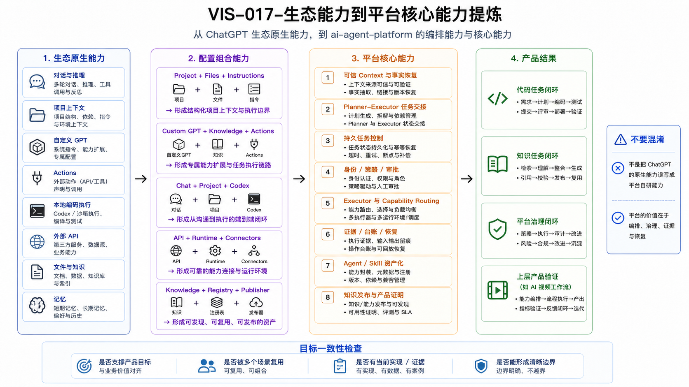

# CAP-008 平台核心能力模型与目标对齐

> **核心结论**：`ai-agent-platform` 不复制 ChatGPT、Codex 或第三方工具。平台核心是把生态能力组织成**有状态、有权限、有证据、可恢复、可复用**的工程工作系统。

## 1. 本文回答什么

本文完成一次能力提炼：

1. 哪些能力直接由 OpenAI 生态提供；
2. 哪些能力只需要通过配置和编排获得；
3. 哪些能力必须由 `ai-agent-platform` 自己拥有；
4. 这些核心能力是否与产品目标一致、当前是否可行。

## 2. 能力归属的四层模型

| 层级 | 说明 | 示例 |
|---|---|---|
| 生态原生能力 | OpenAI 或第三方产品已经提供 | 对话、推理、Project、GPT、Codex、应用、API |
| 配置组合能力 | 通过配置、权限和连接组合形成 | GPT + 参考知识 + 动作；Codex + AGENTS + 沙箱 |
| 平台核心能力 | 为多个场景统一提供状态、安全、证据和恢复 | 任务、策略、审批、证据、恢复 |
| 上层产品能力 | 服务某个具体业务领域 | AI 视频的 Story、Character、Scene、Shot |

只有跨场景复用、需要统一治理、可以形成稳定合同和证据的能力，才应下沉为平台核心。

## 3. 平台核心能力判断标准

一项能力至少应满足以下多数条件：

- 被两个以上产品或工程场景重复需要；
- 不依赖单一业务领域；
- 需要统一身份、状态、权限、证据或恢复；
- 可以形成稳定输入输出合同和自动校验；
- 更换模型、执行器或 Provider 时，上层产品不需要重写；
- 已有真实调用方，或有明确的下一验证切片。

不满足这些条件的能力，应留在 Host、Provider 或上层产品中。

## 4. 八项平台核心能力

| ID | 核心能力 | 解决的用户问题 | 依赖的生态能力 | 平台必须拥有 | 当前状态 | 下一证据门槛 |
|---|---|---|---|---|---|---|
| PC-01 | 可信上下文恢复 | 新窗口、新智能体反复解释，事实漂移 | Project、文件、记忆、Git | Git 真源、上下文包、Registry、最小读取与影响分析 | 已接受 | 完成知识 Review，验证角色化最小 Context |
| PC-02 | 规划者–执行者交接 | 规划在执行端被改写，权限边界不清 | Chat、Work、Codex | 规范合同、范围、上下文访问、Git 策略、反馈合同 | 已接受 | 普通实施与冻结交付持续真实验证 |
| PC-03 | 持久任务控制 | 会话结束后目标、版本和状态丢失 | 宿主任务历史、API 状态 | 目标、任务、版本、状态、事件、幂等命令 | 未实现 / 下一阶段 | 跨会话继续同一 Task，并拒绝非法状态转换 |
| PC-04 | 身份、策略与审批 | 工具可用不代表允许执行 | Workspace 权限、应用权限、沙箱 | 智能体 / 客户端 / 执行器身份、范围、风险、策略、审批 | 部分实现 | Approval 与 Task Version 绑定并可回读 |
| PC-05 | 执行器与能力路由 | 不同执行环境难替换，权限与能力混乱 | Codex、Work、动作、MCP、API | 能力合同、执行器适配器、执行通道、回退策略 | 目标设计 | 两个执行器使用同一能力合同完成任务 |
| PC-06 | 证据、副作用与恢复 | 智能体声称完成但无法验证，失败后只能重来 | 测试、Git、日志、追踪 | 证据注册表、账本、检查点、快照、恢复 | 目标设计 | 一次真实失败可续跑、移交或安全终止 |
| PC-07 | 智能体 / Skill 资产化 | 角色、方法和配置散落在不同宿主 | GPT、插件、Skills | 档案、指令、Skill、知识包、评测、发布 | 部分实现 | 一个专业 Agent 可从 Git 重建并发布 |
| PC-08 | 知识发布与产品证明 | Git、飞书和作品集漂移，成果难展示 | 文件、Projects、应用 | 文档包、语义镜像、Registry、投影、作品集证据 | 部分实现 | Feishu 发布回读和真实产品 Demo |

## 5. 核心能力与产品目标的一致性

| 产品承诺 | 必要核心能力 | 为什么相关 | 当前可行性 |
|---|---|---|---|
| 少搬运 | PC-01、PC-07、PC-08 | 上下文、角色和知识可以从 Git 恢复与发布 | 基础已存在，影响分析和发布回读待完成 |
| 少误执行 | PC-02、PC-03、PC-04、PC-05 | 任务、权限和执行器由统一合同控制 | Handoff 与窄链路已验证；持久 Task 和 Adapter 待实现 |
| 少丢现场 | PC-03、PC-06 | 失败现场、状态和证据可被保存和续跑 | 当前依赖人工续跑，结构化恢复尚未实现 |
| 少事实漂移 | PC-01、PC-07、PC-08 | 正式事实、角色知识和发布映射有唯一真源 | Git 与 Registry 已成立，Host 和 Feishu 闭环待完成 |
| 可证明 | PC-06、PC-08 | 每项能力由测试、Commit、日志和 Demo 证明 | 工程证据已有，统一 Evidence 和业务 Demo 尚缺 |

## 6. 当前实现、部分实现和目标设计

### 已验证或已接受

- Git 唯一真源、Context、正式知识和 Platform Registry；
- 规划者–执行者交接 与冻结文件交付；
- Custom GPT → 开发隧道 → 网关 → 运行环境 的窄能力链路；
- Contracts、Auth、Policy、限流、并发、Timeout 和结果校验；
- 六个治理后的 Skill、Document Bundle 和 AI 可读语义镜像。

### 部分实现

- 静态 API Key、能力允许列表和基础 Policy；
- 人工审批、人工证据 Review 和人工续跑；
- Skill 资产已存在，智能体档案和知识包 尚未完整物化；
- 飞书发布器 规则已形成，正式覆盖发布尚未完成。

### 尚未实现

- 持久 目标 / 任务 / 版本 / 状态 / 事件；
- 执行器适配器、执行通道 和多执行器调度；
- 结构化 审批、证据、账本、检查点、快照和恢复；
- 平台自有 MCP Adapter 与治理；
- AI 视频工作流业务纵向切片和作品集发布。

## 7. 不属于平台核心的内容

以下能力不应被包装成平台自研：

- 模型本身的推理质量和当前模型名称；
- ChatGPT、Work、Codex 的具体菜单和客户端界面；
- GitHub、Feishu、Dev Tunnel 或第三方 Provider 的原生服务；
- 某个工具的专属参数；
- AI 视频的业务领域规则；
- 用户个人 Memory 和单一会话历史。

平台只定义稳定的接口、状态和治理边界。

## 8. 投资顺序与停止条件

建议顺序：

```text
知识与上下文事实收口
→ PC-03 轻量任务状态
→ PC-04 审批与证据
→ PC-05 执行器适配与执行通道
→ PC-06 失败恢复
→ PC-07 Agent Profile / Knowledge Pack
→ PC-08 AI 视频纵向切片与作品集证明
```

每一层必须通过证据门槛再进入下一层。出现以下情况应停止扩张：

- 当前能力无法在真实场景复现；
- 没有真实调用方；
- 新抽象没有减少用户损耗；
- 成本、安全或维护边界不可承受；
- 为了“架构完整”而提前设计无人使用的系统。

## 9. 正式图生成说明

本篇正文已经冻结能力归属、八项核心能力、当前状态和投资顺序。正式图必须展示：

- 生态原生能力、配置组合能力、平台核心能力和产品结果四层；
- 八项核心能力；
- 每项能力与用户问题、当前状态和下一证据门槛的关系；
- 当前、部分实现和目标设计的视觉区分。

Visual Asset ID：`VIS-017`



### AI 可读语义镜像

```text
输入层：ChatGPT、Project、Custom GPT、Work、Codex、Apps、Actions、API / SDK。

编排层：Instructions、Knowledge、Tools、Permissions、Local / Cloud Runtime、Repository、AGENTS 和 Skills。

平台核心层：
PC-01 可信上下文恢复；
PC-02 Planner–Executor 交接；
PC-03 持久任务控制；
PC-04 身份、策略与审批；
PC-05 执行器与能力路由；
PC-06 证据、副作用与恢复；
PC-07 Agent / Skill 资产化；
PC-08 知识发布与产品证明。

结果层：任务可继续、执行可控制、结果可验证、能力可复用、产品可证明。

状态：PC-01 和 PC-02 已接受；PC-04、PC-07、PC-08 部分实现；PC-03、PC-05、PC-06 为下一阶段或目标设计。
```

- 可编辑源文件：[`VIS-017-生态能力到平台核心能力提炼.svg`](./assets/VIS-017-生态能力到平台核心能力提炼.svg)
- 高清预览：[`VIS-017-生态能力到平台核心能力提炼.png`](./assets/VIS-017-生态能力到平台核心能力提炼.png)

## 10. 关联文档

- [PRD-003 产品定义与用户价值](../../01_产品体系/PRD-003-ai-agent-platform产品定义与用户价值/README.md)
- [PRD-005 平台能力地图与产品成熟度](../../01_产品体系/PRD-005-平台能力地图与产品成熟度/README.md)
- [CAP-001 ChatGPT 生态体系与配置全景](../CAP-001-ChatGPT生态体系与配置全景/README.md)
- [CAP-002 ChatGPT 生态组件配置与能力差异](../CAP-002-生态组件配置与能力差异/README.md)
- [CAP-006 从 ChatGPT 到 Codex 的平台执行闭环](../CAP-006-从ChatGPT到Codex的平台执行闭环/README.md)
- [CTX-005 当前能力与演进差距](../../00_项目入口/CTX-005-当前能力与演进差距.md)
