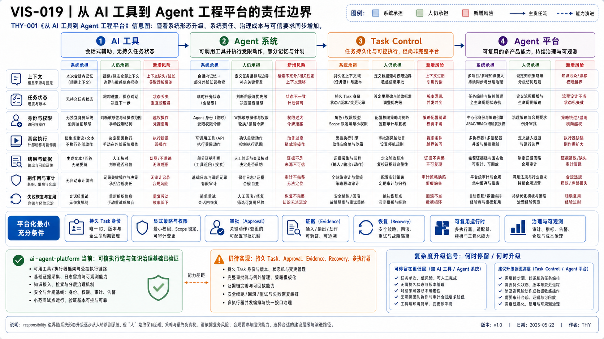

# THY-001 从 AI 工具到 Agent 工程平台
> **当前状态**：正文与正式 PNG 已通过人工 Review；本次作为正式 Document Bundle 候选进入冻结交付。

> **核心结论**：平台化不是把更多模型和工具放进同一个界面，而是把原本由人临时承担的上下文、任务状态、权限、执行、证据、恢复和复用责任，变成可持续的系统机制。

## 1. 本文负责什么

本文回答：

- “AI 工具”“Agent 系统”“Task Control”和“Agent 平台”分别是什么；
- 从问答到可交付任务，系统需要接管哪些责任；
- 六层工程模型与五个横切平面如何协作；
- 什么条件下值得平台化，什么情况下脚本或单 Agent 已经足够；
- `ai-agent-platform` 当前位于哪一阶段、缺口是什么。

本文不负责描述具体平台模块；实际边界归 [ARC-001 平台总体架构](../../04_平台架构/ARC-001-ai-agent-platform总体架构/README.md) 与其他 ARC 资产。

## 2. 为什么“模型 + 工具”仍然不是系统

模型可以生成内容、调用工具或提出计划，但完整任务还包含一组模型本身不能长期可靠承担的工程责任：

| 责任 | 只有工具时通常由谁承担 | 平台化后应由谁承担 |
|---|---|---|
| 目标与约束 | 用户反复解释 | Task Contract 与版本化任务 |
| 上下文 | 当前会话、人工粘贴 | Context 入口、知识索引和最小检索 |
| 状态 | 人脑、聊天历史 | 持久 Task / Execution 状态 |
| 权限 | 用户临时确认 | Identity、Capability、Policy、Approval |
| 执行 | 人复制命令或 Agent 临时运行 | 受控 Executor / Execution Lane |
| 结果验证 | 用户阅读摘要 | Test、Diff、Hash、Commit、回读等 Evidence |
| 副作用 | 分散在外部系统 | Side-effect Ledger 与审计引用 |
| 失败恢复 | 重新解释、从头重跑 | Checkpoint、Snapshot、Safe Continuation |
| 协作复用 | 复制 Prompt | Agent Profile、Skill、Contract、Registry |

因此，Agent 工程的核心问题不是“模型是否足够聪明”，而是：

```text
系统是否知道当前要完成什么
→ 是否知道哪些事实可信
→ 是否只允许必要动作
→ 是否能观察真实执行
→ 是否能证明结果
→ 是否能在失败后安全继续
```

## 3. 四种形态的责任边界




### AI 可读语义镜像

```text
AI 工具：上下文、状态、执行、验证和恢复主要由人承担
→ Agent 系统：模型开始控制工具和多步循环，但状态仍偏 Session
→ Task Control：Task Version、Policy、Approval、Execution、Evidence、Resume 成为系统对象
→ Agent 平台：多个产品和执行器复用统一治理、Registry、审计、成本与恢复

当前：可信执行链与知识治理基础已验证
缺口：持久 Task、Approval、Evidence、Recovery、多执行器
```

### 3.1 AI 工具

典型形态：Chat、代码补全、单次 API 调用、图片生成器。

特征：

- 输入和输出边界短；
- 状态主要在人或宿主产品中；
- 副作用少或由人手工触发；
- 验证主要依靠人工；
- 适合一次性、低风险、局部任务。

### 3.2 Agent 系统

Agent 使用模型控制工作流执行，能够选择工具、读取反馈并调整下一步。OpenAI 的 [Agent 构建指南](https://openai.com/business/guides-and-resources/a-practical-guide-to-building-ai-agents/) 也将 Agent 与普通单轮 LLM 应用区分为：Agent 会代表用户独立完成包含多个步骤的工作流。

新增责任：

- 工具选择与调用；
- 多步循环；
- 基础状态；
- 输出校验；
- 风险控制和人工介入。

但单个 Agent 通常仍依赖某次 Session，长期任务、跨执行器和审计能力有限。

### 3.3 Task Control

Task Control 把“会话中的工作”提升为具有稳定身份和状态的任务对象：

```text
Goal
→ Task
→ Task Version
→ Plan
→ Approval
→ Execution
→ Result
→ Evidence
→ Acceptance / Recovery
```

它增加：

- 任务版本与状态机；
- Expected Version 与并发控制；
- 审批绑定；
- 执行分配、超时和恢复；
- 结果、证据和副作用关联。

### 3.4 Agent 平台

平台面向多个入口、产品、角色和执行器复用同一组控制机制：

- 统一任务与结果 Contract；
- 身份、策略与审批；
- Agent / Skill / Capability 资产；
- 多执行器适配与路由；
- Knowledge / Registry；
- 证据、审计、健康和恢复；
- 运营指标、成本和发布治理。

平台不是所有场景的默认终点。只有多个真实场景重复需要这些机制时，平台抽象才有价值。

## 4. 六层 Agent 工程分析模型

> 这六层是 `ai-agent-platform` 用于定位责任和发现缺口的分析模型，不是行业统一标准，也不要求部署成六个服务。

| 层级 | 核心职责 | 典型对象 | 常见误解 |
|---|---|---|---|
| 6. 表现层（Presentation） | 人机交互、结果呈现、协作入口 | Chat、Web、CLI、IDE、Mobile | 有 UI 就是平台 |
| 5. 编排层（Orchestration） | 多步骤、路由、Task Control、交接与恢复 | Orchestrator、Workflow、Task Store | Prompt 链就是稳定编排 |
| 4. 认知层（Cognition） | 理解、推理、计划、专业判断、Review | Planner、Agent、Model | 模型拥有全部控制权 |
| 3. 能力层（Capability） | 稳定的业务能力契约 | Capability、Skill、Port | Tool 等于 Capability |
| 2. 执行层（Execution） | 真实动作、环境、工具调用和副作用 | Executor、Lane、Adapter、Sandbox | Agent 名称就是执行环境 |
| 1. 基础层（Foundation） | 模型、存储、网络、身份、安全和设备 | Git、DB、Cloud、Local、Provider | 基础设施细节进入 Domain |

六层不是要求部署六个服务，而是用于判断责任应该放在哪里。

## 5. 五个横切平面

### 5.1 角色与权限平面

管理 Identity、Agent Profile、Capability Grant、Policy、Approval 与最小权限。

### 5.2 状态与存储平面

管理 Task、Execution、Result、Checkpoint、Artifact 和版本。

### 5.3 证据与审计平面

管理 Test、Diff、Hash、Commit、日志、追踪、Evidence 和 Side-effect。

### 5.4 观察与评估平面

管理成功率、延迟、成本、质量、健康、告警和 Eval。

### 5.5 治理与演进平面

管理 Contract、Registry、Release、Migration、兼容性和知识发布。

横切平面不能只靠 Prompt 实现，因为它们要在模型失败、会话结束或 Provider 更换后仍然成立。

## 6. 平台化的最小充分条件

只有满足以下至少一组条件，才值得从 Agent 升级为平台：

1. **长期状态**：任务跨 Session、设备或执行器持续；
2. **高风险副作用**：删除、提交、发布、付款或外部写入需要审批和证据；
3. **多执行环境**：同一能力需要 Codex、Work、Script、Runtime 等实现；
4. **多产品复用**：Coding、Knowledge、Video 等场景重复使用同一控制机制；
5. **治理要求**：需要版本、审计、恢复、成本与质量指标；
6. **并发与协作**：多个角色或执行器需要稳定交接和状态归属。

反之，以下情况继续使用脚本或单 Agent 更合理：

- 输入输出固定；
- 规则确定；
- 无长期状态；
- 失败可安全重跑；
- 人工 Review 成本低；
- 任务频率不足以回收平台成本。

## 7. `ai-agent-platform` 当前阶段

### 7.1 已验证事实

当前仓库已经具备：

- Task、Result、Capability 等基础 Contract；
- Auth 与双层 Policy；
- Custom GPT → Dev Tunnels → Action Gateway → Local Runtime 的真实窄链路；
- 六个正式 Skill 与 Planner–Executor Handoff；
- Git 单一真源、Platform Registry 和 Document Bundle；
- 测试、Diff、Commit、Push、回读组成的人工可信闭环。

代码证据：

- [`packages/contracts`](../../../../packages/contracts/README.md)
- [`packages/auth`](../../../../packages/auth/README.md)
- [`packages/policy`](../../../../packages/policy/README.md)
- [`apps/action-gateway`](../../../../apps/action-gateway/README.md)
- [`apps/local-runtime`](../../../../apps/local-runtime/README.md)
- [`skills/README.md`](../../../../skills/README.md)

### 7.2 仍是目标设计

- 持久 Task / Execution / Result Store；
- 结构化 Approval；
- Evidence Registry 与 Side-effect Ledger；
- Execution Lane、Lease、Heartbeat 和多执行器调度；
- Health Event、Snapshot 与自动恢复；
- Agent Profile / Knowledge Pack 发布；
- AI 视频业务纵向切片。

因此当前准确定位是：

> **可信执行链与知识治理基础已验证；完整 Agent 平台尚未实现。**

## 8. 复杂度升级决策

升级前依次回答：

1. 当前失败是模型能力问题，还是状态、权限、环境或验证问题？
2. 能否用更清晰的 Contract、Skill 或 Script 解决？
3. 是否真的存在长期状态、并发、恢复或多执行器需求？
4. 新层级是否有真实调用方和验证指标？
5. 引入后谁维护、如何观测、如何退出？

只有当前层级无法稳定满足验收，且下一层有明确收益和退出条件时才升级。

## 9. 与平台架构的关系

本文给出平台化的责任模型；当前平台的具体设计见：

- [ARC-001 平台总体架构](../../04_平台架构/ARC-001-ai-agent-platform总体架构/README.md)
- [ARC-008 DDD 领域蓝图](../../../technical/归档/历史资产/04_平台架构_整合前观点与后续处理候选/README.md)
- [ARC-009 轻量 Task Control](../../04_平台架构/ARC-001-ai-agent-platform总体架构/README.md)
- [CAP-008 平台核心能力模型](../../02_基础产品与能力/CAP-008-平台核心能力模型与目标对齐/README.md)

## 10. 官方与经典来源

核验日期：2026-08-03。

- [OpenAI：A practical guide to building agents](https://openai.com/business/guides-and-resources/a-practical-guide-to-building-ai-agents/)
- [Anthropic：Building effective agents](https://www.anthropic.com/research/building-effective-agents)
- [Alistair Cockburn：Hexagonal Architecture](https://alistair.cockburn.us/hexagonal-architecture/)

## 视觉资产登记

- Visual Asset ID：`VIS-019`；状态：`accepted`；PNG：本次人工 Review 权威预览；SVG：保留可编辑来源，后续独立刷新以与预览完全对齐。
