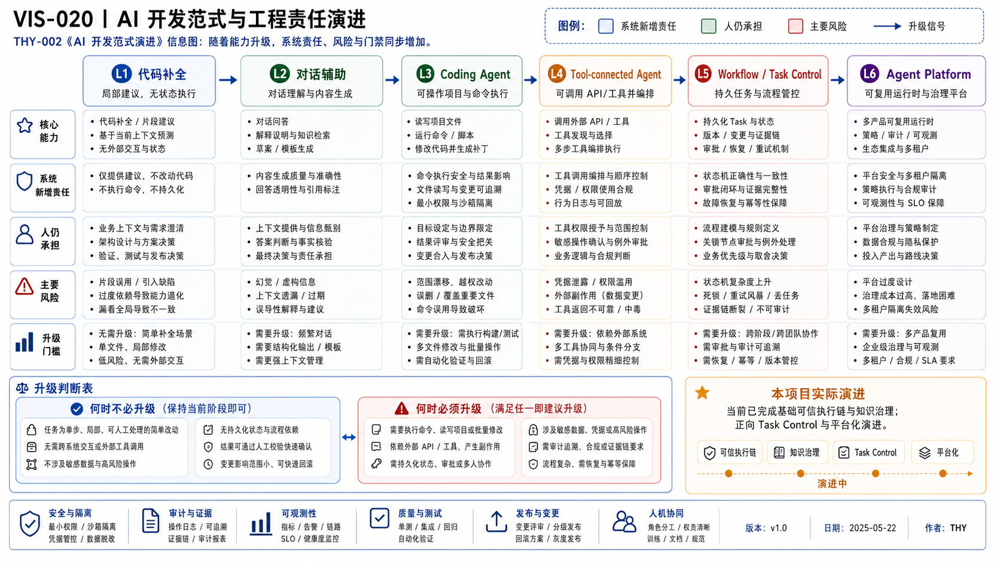

# THY-002 AI 开发范式演进
> **当前状态**：正文与正式 PNG 已通过人工 Review；本次作为正式 Document Bundle 候选进入冻结交付。

> **核心结论**：范式升级不是产品版本竞赛，而是系统逐步接管上下文、状态、执行、验证、恢复和治理责任。只有旧层级无法经济地满足验收时，才应进入下一层级。

## 1. 本文负责什么

本文建立一套工程复杂度选择模型：

```text
L1 代码补全
→ L2 对话辅助
→ L3 Coding Agent
→ L4 Tool-connected Agent
→ L5 Workflow / Task Control
→ L6 Agent Platform
```

每一级都回答：

- 上下文由谁管理；
- 状态保存在哪里；
- 谁做真实执行；
- 怎样验证；
- 怎样失败和恢复；
- 新增了什么风险；
- 什么条件才值得升级。

它不是严格的历史时间线，也不是产品成熟度认证；同一项目可以同时使用多个层级，并且没有必要走到 L6。

## 2. 六级责任演进矩阵




### AI 可读语义镜像

| 层级 | 状态所有者 | 验证与恢复 |
|---|---|---|
| L1 代码补全 | 人 / IDE | 人工编译、测试、重写 |
| L2 对话辅助 | Session | 人工资产化和重新提问 |
| L3 Coding Agent | Session + Repo | Test、Diff、Review、回滚 |
| L4 Tool Agent | Session + 外部系统 | Tool 结果、人工确认、补偿 |
| L5 Task Control | Task / Execution Store | Evidence、状态机、Checkpoint |
| L6 Agent Platform | 跨产品控制面 | Eval、审计、SLA、多执行器恢复 |

| 维度 | L1 代码补全 | L2 对话辅助 | L3 Coding Agent | L4 Tool Agent | L5 Task Control | L6 Agent Platform |
|---|---|---|---|---|---|---|
| 主要输入 | 当前文件 / 光标 | 用户描述 / 文件 | 仓库 / 任务 | 任务 + 外部系统 | 版本化 Task | 多产品 / 多角色 |
| 上下文 | IDE 局部 | 会话 | Session + Repo | Session + Tool Data | Context + Task Store | 多上下文与 Registry |
| 执行主体 | 人 | 人 | Agent + 人 | Agent | 系统 + Executor | 平台调度 |
| 状态 | 无或 IDE 状态 | 单会话 | 临时执行状态 | 临时 / 外部状态 | 持久 Task / Execution | 跨产品状态与运营 |
| 验证 | 人工编译 / 测试 | 人工转为资产 | Test / Diff / Review | Tool 结果 + 人工 | Evidence + 状态机 | Evals + 审计 + SLA |
| 恢复 | 重新编辑 | 重新提问 | 重试 / 回滚 | 重试 / 补偿 | Checkpoint / Resume | 多执行器恢复策略 |
| 主要风险 | 局部错误 | 上下文漂移 | 越界与环境污染 | 权限与副作用 | 状态竞争与重复执行 | 抽象、成本和治理失控 |

## 3. L1：代码补全

### 3.1 系统承担

- 根据附近代码生成局部候选；
- 提供语法、API 或模式建议。

### 3.2 人仍承担

- 业务目标；
- 文件与模块边界；
- 依赖影响；
- 测试与提交；
- 所有副作用。

### 3.3 适用条件

- 任务局部；
- 变更可快速验证；
- 上下文可由当前文件表达；
- 不需要跨系统执行。

### 3.4 升级信号

当任务需要反复解释跨文件约束、同时修改多个模块或生成完整交付物时，进入 L2 / L3。

## 4. L2：对话辅助

### 4.1 新增能力

- 需求澄清、方案比较、调研与设计；
- 读取更多文件或资料；
- 生成跨文件草稿和测试建议。

### 4.2 新增风险

- 会话结论没有进入正式资产；
- 长上下文被旧信息污染；
- “给出代码”被误认为“已经执行”；
- 用户无法复现模型依据。

### 4.3 工程门禁

- 把稳定结论写入 Git、ADR 或正式文档；
- 区分建议、执行和验证；
- 对动态事实使用来源链接和核验日期。

## 5. L3：Coding Agent

### 5.1 新增能力

- 读取仓库；
- 修改多文件；
- 运行命令、构建和测试；
- 生成 Diff、Commit 或 Pull Request 候选。

### 5.2 新增系统责任

- 工作目录和分支；
- Sandbox 与 Network；
- Scope Lock；
- AGENTS / Skill 发现；
- 测试、Diff 和提交证据；
- 失败时保留现场。

### 5.3 主要风险

- 修改范围超过任务；
- 当前分支或 SHA 错误；
- 环境状态污染；
- 执行摘要与真实工作树不一致；
- 自动 Git 操作破坏历史。

### 5.4 升级信号

当 Coding Agent 需要操作 GitHub、Feishu、浏览器、数据库或其他业务系统，并且副作用跨出本地仓库时，进入 L4。

## 6. L4：Tool-connected Agent

### 6.1 新增能力

通过 API、Actions、MCP、浏览器或计算机使用外部系统。

### 6.2 新增责任

- Authentication 与 Authorization；
- Capability Allowlist；
- 输入和输出 Schema；
- Tool 风险评级；
- 数据外发控制；
- 人工确认；
- 外部结果与本地状态对账。

### 6.3 主要风险

- Prompt Injection；
- 外部内容过时或恶意；
- 不可逆写入；
- 重试导致重复副作用；
- 工具返回成功但业务未完成。

OpenAI 的 [Agent 构建指南](https://openai.com/business/guides-and-resources/a-practical-guide-to-building-ai-agents/) 建议根据工具的读写性质、可逆性、账号权限和财务影响进行风险分级，并在高风险动作中引入人工监督。

## 7. L5：Workflow 与 Task Control

### 7.1 为什么不再依赖 Session

长任务具有独立身份、版本、状态、审批和恢复要求，不能只依赖某次会话。

### 7.2 新增能力

- 多步骤依赖；
- Task Version；
- 状态机；
- 分配与 Lease；
- Expected Version；
- Approval；
- Evidence；
- Checkpoint 与 Safe Continuation；
- 局部重试和补偿。

### 7.3 新增风险

- 状态竞争；
- 旧审批用于新版本；
- 超时后重复执行；
- 任务、结果和证据脱节；
- 补偿本身失败；
- 过度自动重试扩大副作用。

### 7.4 验证要求

- 状态转换测试；
- 幂等键；
- 乐观并发；
- 版本绑定审批；
- Evidence 引用完整；
- 恢复演练和异常路径测试。

## 8. L6：Agent Platform

### 8.1 平台增加什么

- 多入口与多产品共享 Contract；
- Agent / Skill / Capability Registry；
- 多执行器与 Provider 适配；
- 统一身份、策略、审批和审计；
- Evals、成本、健康和发布治理；
- 资产生命周期与兼容性。

### 8.2 平台风险

- 没有真实调用方的抽象；
- 产品领域被平台通用模型吞并；
- Registry 与实现漂移；
- 多 Agent 只是 Prompt 拆分；
- 运维和治理成本超过业务收益。

### 8.3 平台成立条件

至少两个真实场景复用同一机制，并且：

- Contract 稳定；
- 边界经过真实失败验证；
- 有可量化运营指标；
- 适配成本低于复制实现；
- 退出和迁移策略明确。

## 9. 升级判断表

| 问题 | “是”时更可能升级 |
|---|---|
| 上下文是否跨多个 Session 或设备？ | L5 |
| 是否需要写外部系统或产生不可逆副作用？ | L4 / L5 |
| 是否需要持久状态、超时和恢复？ | L5 |
| 是否存在多个执行器或 Provider？ | L5 / L6 |
| 是否有多个产品重复相同控制机制？ | L6 |
| 是否需要审计、成本和质量指标？ | L5 / L6 |
| 是否可由确定性脚本稳定完成？ | 否，保持低层级 |

## 10. 降级也是正确决策

以下情况应该主动降级：

- Agent 不稳定但规则已明确：改为 Script；
- 多 Agent 只是在复制相同上下文：合并为单 Agent + Skill；
- Workflow 图只有线性三步：用普通 Application Service；
- Provider Router 没有真实选择逻辑：直接配置一个 Adapter；
- Task Store 没有跨 Session 价值：保留 Session 级状态。

## 11. 本项目的实际演进

```text
Chat 规划与复审
→ Codex 仓库执行
→ Git 知识真源与 Registry
→ Custom GPT Action 窄链路
→ Gateway / Runtime / Contract / Policy
→ Planner–Executor Handoff 与冻结交付
→ 下一步：持久 Task Control 与 Evidence
```

该路线说明：平台抽象来自真实问题，而不是预先选择某个“Agent 框架”。

## 12. 关联资产

- [THY-001 从 AI 工具到 Agent 工程平台](../THY-001-从AI工具到Agent工程平台/README.md)
- [THY-003 Agent 与 Skills 开发范式](../THY-003-Agent与Skills开发范式/README.md)
- [THY-005 可信 Agent 系统基本原则](../THY-005-可信Agent系统基本原则/README.md)
- [PRD-005 平台能力与产品成熟度](../../00_项目与产品/PRD-005-平台能力地图与产品成熟度/README.md)

## 13. 来源

核验日期：2026-08-03。

- [OpenAI：A practical guide to building agents](https://openai.com/business/guides-and-resources/a-practical-guide-to-building-ai-agents/)
- [Anthropic：Building effective agents](https://www.anthropic.com/research/building-effective-agents)

## 视觉资产登记

- Visual Asset ID：`VIS-020`；状态：`accepted`；PNG：本次人工 Review 权威预览；SVG：保留可编辑来源，后续独立刷新以与预览完全对齐。
