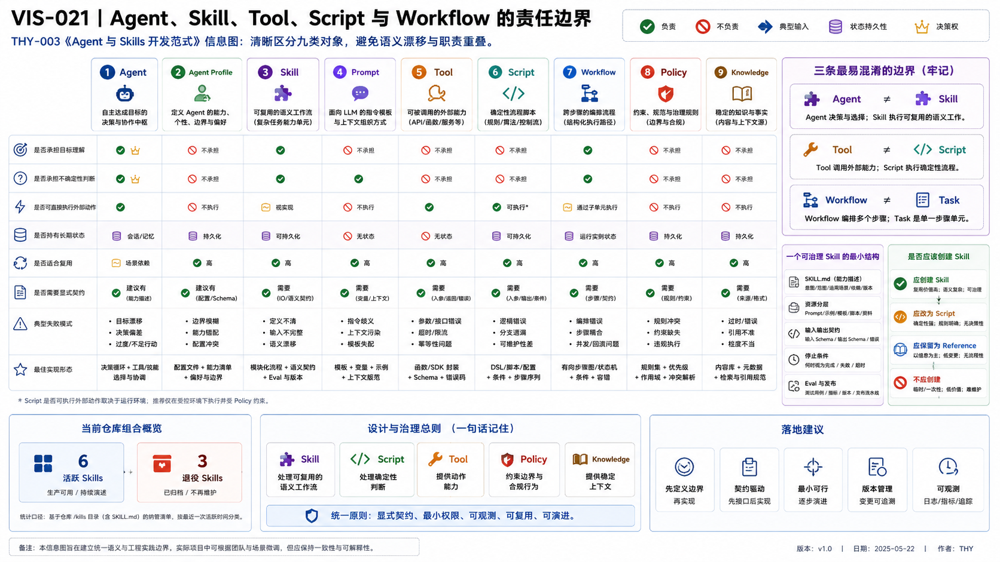

# THY-003 Agent 与 Skills 开发范式
> **当前状态**：正文与正式 PNG 已通过人工 Review；本次作为正式 Document Bundle 候选进入冻结交付。

> **核心结论**：Agent 负责在不确定环境中判断下一步；Skill 封装可复用的程序性知识；Tool 提供原子能力；Script 承担确定性执行；Workflow 管理跨步骤状态；Policy 决定允许什么。把这些概念混在一起，会导致不可触发、不可测试、不可治理的 Prompt 堆积。

## 1. 本文负责什么

本文采用本仓库的 Skill 资产定义：Skill 是可被 Agent 发现和调用的一类程序性知识包。不同 Host 对 Skill、Plugin 或 Tool 的产品命名可能不同，本文讨论的是工程责任，而不是绑定某一家产品菜单。

本文回答：

- Agent、Agent Profile、Skill、Prompt、Tool、Script、Workflow、Runtime、Policy、Knowledge 各自负责什么；
- 什么内容应该成为 Skill，什么应该降为 Script、文档或普通代码；
- Skill 怎样定义触发、输入、输出、停止条件和 Eval；
- 为什么 Agent + Skills 适合当前项目，何时才需要 Workflow Engine；
- 多 Agent 与共享 Skill 应怎样分工。

## 2. 九类对象的责任边界




### AI 可读语义镜像

```text
Agent：在不确定环境中选择下一步
Agent Profile：版本化角色、权限和知识配置
Skill：一类任务的可复用程序性知识，不拥有长期状态
Tool：原子能力或外部数据访问
Script：可机器验证的确定性执行
Workflow：多步骤依赖、状态、重试和恢复
Policy：允许 / 拒绝与风险约束
Knowledge：稳定事实和方法依据
```

| 对象 | 核心职责 | 是否动态判断 | 是否持久状态 | 是否产生副作用 | 主要验证方式 |
|---|---|---:|---:|---:|---|
| Agent | 根据目标、上下文和反馈决定下一步 | 是 | 通常否 | 间接 | 任务 Eval、轨迹 Review |
| Agent Profile | 定义角色、能力、权限和输出偏好 | 否 | 版本化资产 | 否 | Schema、版本、Review |
| Skill | 封装一类任务的可复用方法 | 由 Agent 解释执行 | 否 | 可调用脚本 / 工具 | Trigger、Contract、案例、Eval |
| Prompt | 当前一次指令或上下文片段 | 否 | 否 | 否 | 结果 Review |
| Tool | 提供原子操作或数据访问 | 否 | 外部系统拥有 | 是 | Schema、权限、集成测试 |
| Script | 确定性转换、检查或执行 | 否 | 可选 | 可有 | 单元测试、退出码 |
| Workflow | 定义多步骤、依赖、状态与恢复 | 低到中 | 是 | 间接 | 状态机、幂等、异常测试 |
| Policy | 对请求、状态和风险作允许 / 拒绝判断 | 规则或模型辅助 | 规则版本 | 不直接 | 决策表、回归测试 |
| Knowledge | 提供稳定事实、术语和方法依据 | 否 | 是 | 否 | 来源、版本、Registry |

### 2.1 三个最容易混淆的边界

**Skill 不等于 Tool**：Skill 说明如何完成任务，Tool 提供可以调用的能力。

**Skill 不等于 Workflow**：Skill 本身不拥有长期任务状态；当步骤跨 Session、需要等待、重试、补偿或审批时，状态应进入 Workflow / Task Control。

**Agent 不等于 Executor**：Agent 作认知判断，Executor 在具体环境中运行命令或工具。二者可能由同一产品承载，但概念责任不同。

## 3. 一个可治理 Skill 的最小结构

```text
skills/<skill-name>/
├── SKILL.md
├── references/        # 按需读取的深层知识
├── assets/            # Schema、模板、示例
├── scripts/           # 可确定执行的程序
└── tests/             # 自测、触发或回归
```

### 3.1 SKILL.md 必须回答

| 字段 | 必须说清楚什么 |
|---|---|
| Name / Description | 什么任务触发，什么任务明确不触发 |
| Preconditions | 开始前需要哪些事实、权限和状态 |
| Inputs | 最小必要输入、Schema、可信来源 |
| Workflow | 检查点、判断点和调用资源 |
| Outputs | 结构、证据、质量要求 |
| Stop Rules | 哪些不确定性必须停止 |
| Relationships | 与相邻 Skill、Tool、Policy 的边界 |

### 3.2 资源为什么要渐进披露

```text
先加载 Skill 名称与描述
→ 匹配任务后读取 SKILL.md
→ 需要细节时读取 references/
→ 确定性步骤调用 scripts/
→ 输出由 Schema / tests 验证
```

这降低 Token、减少无关上下文，也让 Agent 不必在每次任务中重新发明流程。

## 4. 是否应该创建 Skill：决策框架

### 4.1 应创建 Skill

同时满足多数条件：

- 任务会重复出现；
- 输入和输出边界可定义；
- 包含稳定方法而非一次性答案；
- Agent 仍需做语义判断；
- 有可复用模板、Schema、脚本或案例；
- 可以定义失败与停止条件；
- 能建立真实 Eval。

### 4.2 应改为 Script 或普通代码

- 完全确定；
- 输入输出可机器定义；
- 不需要语义判断；
- 失败可用退出码表达；
- 需要高频、一致、低成本运行。

例如：解析 YAML、校验路径、比较 Hash、检查重复 ID、验证 Schema。

### 4.3 应保留为文档或 Reference

- 只是稳定知识；
- 没有清晰触发任务；
- 不拥有工作流；
- 主要用于解释和决策依据。

### 4.4 不应创建 Skill

- 只服务一次任务；
- 与现有 Skill 高度重叠；
- 依赖未验证假设；
- 只是一组 Prompt 技巧；
- 无法定义输出质量；
- 为了显得“Agent 化”而包装普通脚本。

## 5. Skill 的设计过程

### 5.1 需求识别

收集真实任务和失败案例，确定重复痛点，而不是从“我想有一个 Skill”开始。

### 5.2 契约设计

定义：

- Trigger；
- Input Schema；
- Precondition；
- Output Schema；
- Stop Condition；
- Evidence；
- 权限与外部动作。

### 5.3 实现与资源分层

- 语义判断留在 Skill / Agent；
- 机器可判定内容放入 Script；
- 长篇背景放入 Reference；
- 固定格式放入 Template / Schema；
- 外部能力通过 Tool / Adapter 调用。

### 5.4 Eval 与发布

至少包含：

- 正向触发案例；
- 不应触发案例；
- 缺失输入；
- 越权或危险输入；
- 失败续跑；
- 输出 Contract；
- 版本兼容性。

## 6. Skill 生命周期

```text
问题出现
→ 候选方法
→ 真实案例
→ Draft
→ Trigger / Contract Eval
→ In Review
→ Stable / Accepted
→ 新证据
→ Revision / Deprecation
```

生命周期不能只靠文档中的版本号。正式状态需要 Registry、Release、测试和真实使用证据。

## 7. 多 Agent 与共享 Skill

推荐结构：

```text
共享 Skill / Tool / Contract
        ↑
不同 Agent Profile
├── 不同目标
├── 不同知识包
├── 不同权限
└── 不同 Review 标准
```

创建多个 Agent 的充分理由：

- 专业语言明显不同；
- 权限必须隔离；
- 上下文过大且互相干扰；
- 需要独立验证或对抗 Review；
- 成本、模型或环境不同；
- 任务可真正并行。

只有“Prompt 不同”并不足以成立多 Agent 系统。

## 8. 为什么当前采用 Agent + Skills，而不是重型编排

当前主要任务包括：

- 多源知识综合；
- 正式工程文档编写；
- Registry 与知识治理；
- 冻结 Artifact 交付；
- Custom GPT Action 设计与验证。

这些任务具有较强语义判断，但大多在人工 Review 后一次完成；它们暂时不需要长期 Workflow 状态、补偿事务和复杂并发。因此：

```text
Agent 判断
+ Skill 方法
+ Script 验证
+ Handoff 交付
```

比引入通用图编排框架更符合当前阶段。

当出现以下事实时再评估 Workflow Engine：

- 任务跨小时或跨天；
- 必须等待外部事件；
- 多分支、重试、补偿和超时；
- 多执行器并发；
- 状态必须脱离 Session；
- 需要运营级可视化和人工队列。

## 9. 本仓库 Skill Portfolio

当前正式 Skill 为六个：

| Skill | 语义所有权 | 不负责 |
|---|---|---|
| `planner-executor-handoff` | 规划者与执行器合同、权限、冻结交付和续跑 | 重新设计冻结内容 |
| `project-knowledge-synthesis` | 多源事实、冲突、重复和目标资产方案 | 正式写作和发布 |
| `engineering-document-authoring` | 将已批准内容写成高密度正式文档与视觉资产 | 恢复项目真相 |
| `project-knowledge-governance` | 落位、ID、生命周期、Registry 和投影完整性 | 代替 Planner 决策 |
| `engineering-insight-distillation` | 从真实事件提炼候选洞见和成熟度 | 从一次小错误制造定律 |
| `custom-gpt-actions` | Builder Action、OpenAPI、认证和适配边界 | 内部 Task Control |

最新清单以 [`skills/README.md`](../../../../skills/README.md) 为准，不在本文硬编码版本状态。

## 10. Skill Review 清单

- 是否只拥有一个明确任务类型？
- 描述能否正确触发并排除相邻任务？
- 输入、输出和停止条件是否可验证？
- 是否把确定性逻辑下沉到 Script？
- 是否避免把长期状态藏在 Skill 文本中？
- 是否明确外部动作和权限？
- 是否有负例和失败案例？
- 是否与 Registry、Release 和文档一致？
- 是否真的被真实任务复用？

## 11. 关联资产

- [THY-001 从 AI 工具到 Agent 工程平台](../THY-001-从AI工具到Agent工程平台/README.md)
- [THY-004 DDD 与 Agent 系统边界建模](../THY-004-DDD与Agent系统边界建模/README.md)
- [AGT-005 Agent Skill 设计与治理](../../06_智能体资产体系/AGT-005-Agent-Skill设计与治理.md)
- [ARC-012 Agent Profile 与 Skills 资产化](../../../technical/归档/历史资产/04_平台架构_整合前观点与后续处理候选/README.md)

## 12. 来源

核验日期：2026-08-03。

- [OpenAI Agents SDK：Agent definitions](https://developers.openai.com/api/docs/guides/agents/define-agents)
- [OpenAI Agents SDK：Agents overview](https://developers.openai.com/api/docs/guides/agents)
- [Anthropic：Building effective agents](https://www.anthropic.com/research/building-effective-agents)

## 视觉资产登记

- Visual Asset ID：`VIS-021`；状态：`accepted`；PNG：本次人工 Review 权威预览；SVG：保留可编辑来源，后续独立刷新以与预览完全对齐。
