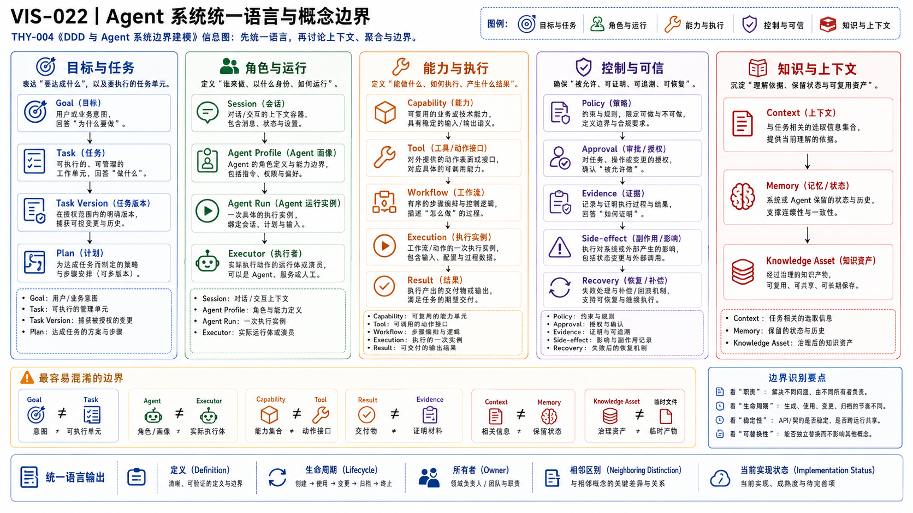
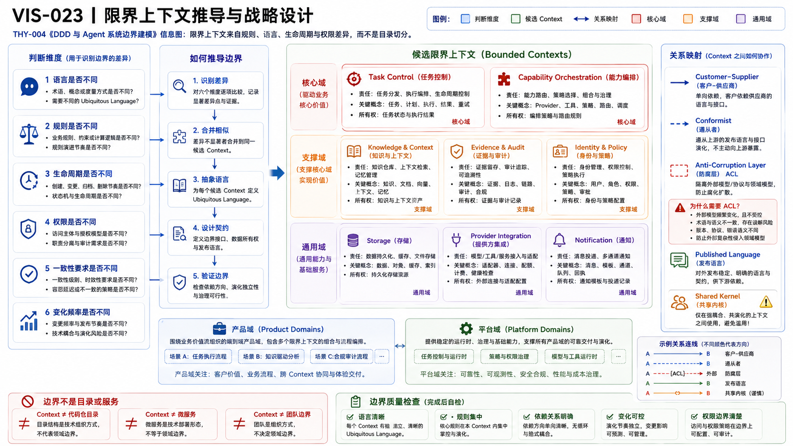
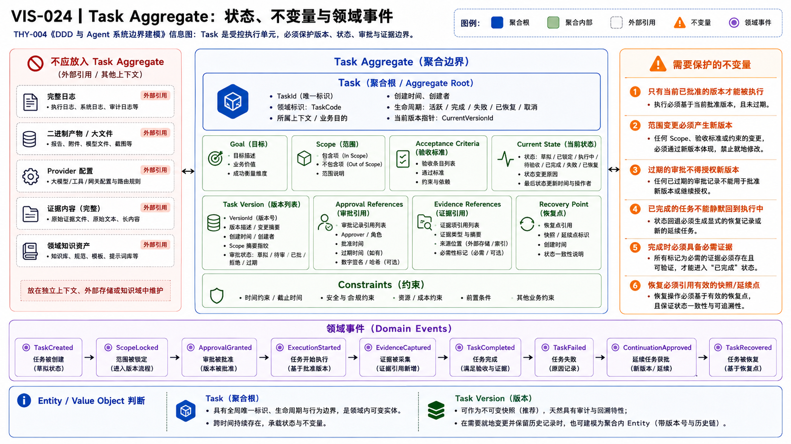
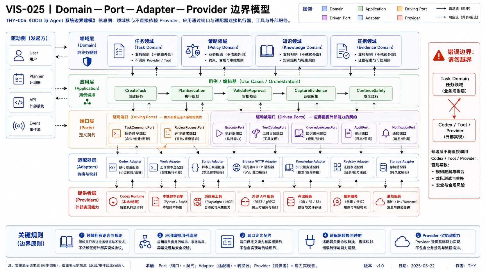

# THY-004 DDD 与 Agent 系统边界建模
> **当前状态**：正文与正式 PNG 已通过人工 Review；本次作为正式 Document Bundle 候选进入冻结交付。

> **核心结论**：DDD 在 Agent 系统中的价值，不是把代码分成更多目录，而是建立统一语言、明确状态所有权、保护业务不变量，并用端口与适配器隔离模型、工具、Provider 和运行环境的变化。

## 1. 本文为什么是本章重点

Agent 系统同时包含概率性认知、确定性规则、长期状态、外部工具和真实副作用。最常见的问题不是“没有更多 Agent”，而是概念互相吞并：

```text
Goal ≠ Task
Task ≠ Session
Agent ≠ Model
Agent ≠ Executor
Capability ≠ Tool
Skill ≠ Workflow
Result ≠ Evidence
Context ≠ Memory
Knowledge Asset ≠ 临时文件
Product Domain ≠ Platform Domain
Provider ≠ 业务能力
```

一旦这些对象没有清晰边界，就会出现：

- Session 结束导致任务状态消失；
- Agent 名称决定权限，但实际 Executor 不受控；
- Provider 字段渗透所有 Contract；
- Result 被一段“完成了”的文本代替；
- 审批没有绑定 Task Version；
- 平台通用模型吞并上层产品语言；
- 多 Agent 变成相互转发 Prompt 的网络。

DDD 提供的不是一张固定领域图，而是一套从语言、规则、生命周期和一致性推导边界的方法。

## 2. DDD 的两个层级

### 2.1 战略设计（Strategic Design）

关注：

- 统一语言（Ubiquitous Language）；
- 子域（Subdomain）；
- 核心域、支撑域、通用域；
- 限界上下文（Bounded Context）；
- 上下文映射（Context Map）；
- 上游 / 下游、公开语言、防腐层等集成关系。

### 2.2 战术设计（Tactical Design）

关注：

- 实体（Entity）；
- 值对象（Value Object）；
- 聚合（Aggregate）与聚合根；
- 领域服务（Domain Service）；
- 领域事件（Domain Event）；
- Repository、Policy、Specification。

战略设计先回答“模型在哪个边界内有效”，战术设计再回答“边界内部怎样保持一致”。

Eric Evans 的 [DDD Reference](https://www.domainlanguage.com/ddd/reference/) 强调：大型系统无法经济地维持一个全局统一模型，需要在明确边界内保持模型一致，并显式管理上下文之间的关系。

## 3. Agent 系统统一语言




### AI 可读语义镜像

```text
目标与任务：Goal → Task → Task Version → Plan → Acceptance
角色与运行：Agent Profile / Agent Run / Session / Executor / Execution Lane
能力与执行：Capability / Skill / Tool / Workflow / Execution
控制与可信：Policy / Approval / Result / Evidence / Side-effect
知识与资产：Context / Memory / Knowledge Asset / Registry / Provider-Adapter

关键非等价：Task ≠ Session；Agent ≠ Model / Executor；Capability ≠ Tool；Result ≠ Evidence；Context ≠ Memory。
```

### 3.1 目标与任务

| 概念 | 定义 | 身份与生命周期 | 不等于 |
|---|---|---|---|
| Goal | 希望达成的业务结果 | 可被多个 Task 细化 | 可直接执行的 Task |
| Task | 可交付工作的稳定业务身份 | 创建、版本化、执行、验收、关闭 | Session 或 Prompt |
| Task Version | 某次目标、范围、约束和验收的不可变快照 | 新范围产生新版本；可由 `(task_id, version)` 引用 | Task 本身或可变 Session |
| Plan | 为当前 Task Version 提议的执行步骤 | 可重规划 | 授权或执行结果 |
| Acceptance Criteria | 判断 Task 是否完成的规则 | 随版本冻结 | 模型自评 |

### 3.2 角色与运行

| 概念 | 定义 | 所有权 | 不等于 |
|---|---|---|---|
| Agent Profile | 版本化的角色、目标、知识、能力和行为配置 | Agent Governance | 运行进程 |
| Agent Run | 一次认知循环或推理执行 | Runtime / Observability | Task 全生命周期 |
| Session | 一次会话或临时交互上下文 | Host / Runtime | Task Store |
| Executor | 真实执行命令、工具或外部动作的主体 | Execution | Agent Profile |
| Execution Lane | Task Control 与 Executor 的受控通道 | Execution | Provider |

### 3.3 能力与执行

| 概念 | 定义 | 例子 | 不等于 |
|---|---|---|---|
| Capability | 可被 Policy 判断和调用的稳定能力契约 | `repository.modify` | 某个 API |
| Skill | 完成一类任务的程序性知识 | 文档综合、冻结交付 | 长期状态机 |
| Tool | 原子技术操作或数据访问 | Git、HTTP、MCP 工具 | 业务能力 |
| Workflow | 多步骤、依赖、状态和恢复定义 | 文档发布流程 | Task 本身 |
| Execution | 某个 Task Version 的一次执行实例 | 一次 Codex 运行 | Result |

### 3.4 控制与可信

| 概念 | 定义 | 关键约束 |
|---|---|---|
| Policy | 根据身份、能力、状态、风险作决策的规则 | 与模型建议分离 |
| Approval | 对特定 Task Version、动作、范围和期限的授权 | 版本变化后失效 |
| Result | 面向 Task 验收的结构化结果 | 不代表已经验证 |
| Evidence | 支持某个 Claim 或状态的可验证材料 | Test、Diff、Hash、Commit、回读 |
| Side-effect | 对 Git、外部系统或环境产生的变化 | 需要审计与幂等 |

### 3.5 知识与上下文

| 概念 | 定义 | 不等于 |
|---|---|---|
| Context | 当前任务需要的最小事实集合 | 全部知识库 |
| Memory | Host 或个人层的长期偏好与背景 | Task State |
| Knowledge Asset | 有稳定 ID、来源、状态和关系的正式资产 | 临时文件 |
| Registry | 资产、状态、关系和发布元数据的机器控制面 | 正文内容 |

统一语言必须进入文档、Contract、Schema、测试和团队日常表达；只在词汇表里列出但代码继续混用，不算完成 DDD。

## 4. 如何推导限界上下文

Martin Fowler 对 [Bounded Context](https://martinfowler.com/bliki/BoundedContext.html) 的解释强调：一个模型只有在明确边界内才能保持统一；大型系统中同一个词在不同团队或职责下可能拥有不同含义，需要使用 Context Map 显式连接。

### 4.1 六个判断维度

| 维度 | 需要问的问题 | 边界信号 |
|---|---|---|
| 语言 | 同一个词是否有不同含义？ | `Result` 在执行与产品中不同 |
| 规则 / 不变量 | 哪些规则必须同步成立？ | Task 完成必须有 Evidence |
| 生命周期 | 对象何时创建、结束和归档？ | Session 与 Task 生命周期不同 |
| 权限 | 谁能读、写、批准？ | Agent 配置与 Task 审批不同 |
| 变化频率 | 哪些模型以不同节奏演进？ | Provider 接口快于领域规则 |
| 组织责任 | 谁对结果负责？ | Knowledge 发布与 Task 执行责任不同 |

### 4.2 边界不是目录或服务

- 一个限界上下文可以先实现为模块化单体；
- 一个服务中也可能错误地混有多个上下文；
- 不应按 Agent 名称、数据库表或技术框架机械划分；
- 拆服务是部署决策，限界上下文是模型与责任决策。

### 4.3 Agent 系统候选 Context 推导示例




### AI 可读语义镜像

```text
边界推导依据：语言差异 + 不变量 + 生命周期 + 权限 + 变化频率 + 组织责任
候选 Context：Task Control、Agent Governance、Execution、Knowledge Asset、Publishing、Product Domain、Infrastructure Integration
共享治理：Identity、Policy、Registry、Audit
集成方式：Published Language、Customer/Supplier、Anti-corruption Layer、Separate Ways
Context 表示模型与状态所有权，不等于微服务。
```

| 候选 Context | 主要语言与状态所有权 | 与相邻 Context 的区别 |
|---|---|---|
| Task Control | Task、Version、State、Approval、Recovery | 不管理具体工具进程 |
| Agent Governance | Agent Profile、Skill、Capability Grant、Eval、Release | 不拥有某次 Task 状态 |
| Execution | Lane、Lease、Executor、Execution、Result | 不决定产品目标 |
| Knowledge Asset | Context、Knowledge Asset、Registry、Lifecycle | 不拥有运行时 Task State |
| Publishing | Projection、Target、Publish Job、Readback | 不修改 Git 真源语义 |
| Product Domain | Story、Character、Scene 等业务模型 | 不被平台通用 Task 模型替代 |
| Infrastructure Integration | Provider、Adapter、Credential、Transport | 属于集成责任边界，不一定是业务子域，也不拥有业务规则 |

这只是方法示例；`ai-agent-platform` 的正式上下文蓝图归 [ARC-008](../../04_平台架构/ARC-008-ai-agent-platform-DDD领域蓝图/README.md)。

## 5. 上下文映射

Context 之间不共享内部对象，而通过明确的 Command、Query、Event、Port 或 Reference 集成。

### 5.1 常见关系

| 关系 | 用途 | Agent 系统示例 |
|---|---|---|
| Open Host Service / Published Language | 上游提供稳定公开契约 | Task Contract |
| Customer / Supplier | 下游需求影响上游 Contract | Execution 对 Task Control |
| Conformist | 下游直接接受上游模型 | 小型内部 Adapter |
| Anti-corruption Layer | 防止外部模型污染内部领域 | Codex / Feishu Adapter |
| Separate Ways | 不值得集成 | 临时实验环境 |
| Shared Kernel | 少量模型共同维护 | 高风险，应严格限制 |

### 5.2 为什么需要防腐层

外部 Provider 常以自己的术语表达：

- Codex Session；
- GitHub Run；
- Feishu Block；
- MCP Tool；
- 模型 Token / Finish Reason。

领域层不应直接采用这些对象。Adapter 将其转换为平台 Port 的 Command、Result、Evidence 或 Error。

## 6. Entity、Value Object 与 Aggregate

### 6.1 Entity

跨时间变化但身份连续，例如：

- Task；
- Agent Profile；
- Knowledge Asset；
- Approval Request；
- Execution。

### 6.2 Value Object

由值定义、可整体替换，例如：

- Task Version Snapshot（若只作为不可变快照）；当版本需要独立审批、引用和审计时，也可以建模为聚合内实体；
- Goal；
- Scope；
- Acceptance Criteria；
- Artifact Hash；
- Policy Decision；
- Error Code。

“是否有 ID”不是唯一标准；关键是业务是否需要追踪其连续身份。

### 6.3 Aggregate 的本质

Martin Fowler 的 [DDD Aggregate](https://martinfowler.com/bliki/DDD_Aggregate.html) 将 Aggregate 定义为作为一个一致性单元处理的一组领域对象；外部通过聚合根访问，事务通常不跨聚合边界。

Aggregate 不是：

- 所有相关对象的集合；
- 一个数据库表组；
- 为了方便 API 返回而构造的大对象；
- 整个 Task 生命周期的所有日志和文件。

## 7. Task Aggregate 深入示例




### AI 可读语义镜像

```text
Task 聚合根保护：current_version、state、goal、constraints、allowed_scope、acceptance、approval_refs、active_execution_ref
关键不变量：只执行当前版本；范围变化产生新版本；Approval 绑定版本；Completed 必须有 Evidence；高风险执行不可重复并发
不属于聚合：完整日志、Artifact、Agent Profile、Provider 配置、Evidence 正文
领域事件：TaskCreated、TaskVersionCreated、ApprovalGranted、ExecutionAssigned、TaskFailed、EvidenceAttached、TaskCompleted、TaskClosed
```

### 7.1 聚合根

```text
Task
├── task_id
├── current_version
├── state
├── risk_level
├── goal
├── constraints
├── allowed_scope
├── acceptance_criteria
├── approval_refs
└── active_execution_ref
```

### 7.2 需要保护的不变量

1. 只能执行当前 Task Version；
2. Scope、Goal 或 Acceptance 变化必须创建新版本；
3. Approval 必须绑定 Task ID、Version、Action 和期限；
4. 过期或旧版本 Approval 不能授权新执行；
5. `Completed` 必须满足 Acceptance 并关联必要 Evidence；
6. `Failed`、`Blocked` 与 `Completed` 不能同时成立；
7. 同一版本的高风险执行不能并发重复；
8. 已关闭 Task 不能直接恢复为 Running，必须显式 Reopen / New Version。

### 7.3 不应放入 Task Aggregate

- 完整 stdout / stderr；
- 大型 Artifact 或二进制文件；
- 全部 Evidence 正文；
- Agent Profile；
- Provider 配置和 Token；
- Knowledge Asset 全文；
- 运行环境内部状态。

这些对象通过稳定引用关联，避免聚合膨胀和跨边界事务。Task Aggregate 的具体大小仍需由真实并发、事务和查询压力验证，不能仅凭概念图确定。

### 7.4 领域事件

```text
TaskCreated
TaskVersionCreated
TaskPlanned
ApprovalRequested
ApprovalGranted / ApprovalDenied
ExecutionAssigned
TaskStarted
TaskPaused
TaskFailed
TaskResumed
EvidenceAttached
TaskCompleted
TaskClosed
```

领域事件表达已经发生的业务事实，不是“调用某个函数”的命令。

## 8. Domain、Application 与 Infrastructure

| 层 | 负责 | 不负责 |
|---|---|---|
| Domain | 业务语言、不变量、状态转换和领域事件 | HTTP、数据库、Codex SDK、Feishu Block |
| Application | 编排用例、事务边界、调用 Port、发布事件 | 重新定义业务规则 |
| Infrastructure | Adapter、存储、网络、Provider、日志 | 决定 Task 是否完成 |
| Interface | API、CLI、Chat、UI 的输入输出适配 | 直接操作 Domain 内部对象 |

示例用例：

```text
ApproveTaskCommand
→ Application Service 加载 Task
→ Domain 校验 Version、Risk 与 State
→ 记录 ApprovalGranted
→ Repository 保存 Aggregate
→ 发布 Domain Event
```

## 9. 端口与适配器



Alistair Cockburn 的 [Hexagonal Architecture](https://alistair.cockburn.us/hexagonal-architecture/) 目标是让应用核心不依赖 UI、数据库或运行设备，并允许多个技术 Adapter 接入同一 Port。


### AI 可读语义镜像

```text
Driving Adapters：ChatGPT Action、Web/CLI、Scheduler、Test Harness
Domain Core：Task、Policy、Evidence 等业务语言与不变量
Ports：Execution、Knowledge、Result、Policy、Notification、Artifact/Evidence
Driven Adapters：Codex/Work、Git/RAG、Feishu Publisher、MCP/External Service
规则：Port 使用领域语言；Adapter 翻译外部模型；Provider/SDK 字段不得渗透 Domain。
```

### 9.1 Driving Port

外部驱动系统的意图入口：

- Create Task；
- Approve Action；
- Assign Executor；
- Resume Task；
- Query Status。

Adapter 可以是 ChatGPT Action、Web、CLI、Scheduler 或测试驱动器。

### 9.2 Driven Port

核心调用外部能力：

- Execution Port；
- Knowledge Query Port；
- Evidence Store Port；
- Identity / Policy Port；
- Notification Port；
- Artifact Store Port。

### 9.3 Adapter 示例

```text
Execution Port
├── Codex Adapter
├── GPT Work Adapter
├── Local Runtime Adapter
├── Script / CI Adapter
└── Future Remote Executor Adapter
```

Provider 变化应停留在 Adapter。Domain 不应出现 `codexSessionId`、`feishuBlockId`、SDK 类型或模型 Token。

## 10. 多 Agent 的领域判断

多 Agent 不是 DDD 的目标。一个 Agent 是否对应独立上下文，取决于它是否拥有独立：

- 统一语言；
- 业务规则；
- 数据和生命周期；
- 权限；
- 一致性边界；
- 组织责任。

以下理由才支持多 Agent：

- 专业上下文隔离；
- 权限隔离；
- 并行处理；
- 独立验证；
- 成本 / 模型 / 环境策略不同；
- 失败隔离。

只因为“产品 Agent、架构 Agent、测试 Agent”拥有不同 Prompt，不代表它们是不同 Bounded Context。

## 11. 平台与产品领域边界

平台拥有跨产品稳定机制：

- Task、Execution、Result；
- Identity、Policy、Approval；
- Agent Profile、Capability、Skill；
- Evidence、Health、Recovery；
- Knowledge Asset、Registry、Publishing；
- Port / Adapter。

产品拥有业务语言与质量规则：

- AI 视频中的 Story、Character、Scene、Shot；
- 用户旅程、体验和业务验收；
- 特定 Provider 组合与质量评估。

平台只能抽取已经在真实产品中证明可复用的机制，不能提前把产品概念通用化。

## 12. 建模步骤

```text
1. 收集真实用例和失败故事
2. 提取业务词汇与同义词 / 歧义词
3. 区分 Goal、Task、Session、Agent、Executor 等核心概念
4. 找出规则、不变量和状态所有者
5. 根据语言、生命周期、权限和变化频率划分候选 Context
6. 绘制 Context Map 与上下游关系
7. 在 Context 内识别 Entity、Value Object、Aggregate 和 Domain Event
8. 定义 Driving / Driven Port
9. 用 Adapter 隔离 Provider 与外部模型
10. 映射现有代码和文档，标记已实现 / 接受设计 / 假设
11. 用正常路径、失败路径和恢复路径验证边界
12. 只有出现部署压力时再考虑拆服务
```

## 13. 边界质量检查

- 一个概念在 Context 内是否只有一个含义？
- 每个状态是否只有一个明确所有者？
- 不变量是否能在单一 Aggregate 内保护？
- 是否存在跨 Aggregate 强事务？为什么？
- Provider 字段是否渗透 Domain？
- Adapter 是否真的可以替换？
- Result、Evidence 和 Acceptance 是否分离？
- Approval 是否绑定 Task Version？
- Product Domain 是否被平台通用对象吞并？
- 当前实现与目标设计是否清楚标记？

## 14. 当前仓库映射

### 已实现证据

- `packages/contracts`：Task、Result、Capability 与验证；
- `packages/auth`：Bearer 认证；
- `packages/policy`：Capability Policy；
- `apps/action-gateway`：外部意图适配与边界；
- `apps/local-runtime`：本地 Capability 执行；
- Git Knowledge / Registry：知识资产和关系控制面。

### 接受设计

- [DOM-001 核心领域模型](../../04_平台架构/DOM-001-核心领域模型.md)
- [ARC-008 DDD 领域蓝图](../../04_平台架构/ARC-008-ai-agent-platform-DDD领域蓝图/README.md)
- [ARC-009 轻量 Task Control](../../04_平台架构/ARC-009-轻量Task-Control架构/README.md)
- [ARC-010 Execution Lane](../../04_平台架构/ARC-010-Execution-Lane执行通道模型/README.md)

### 未实现

持久 Aggregate Store、Domain Event Store、Approval / Evidence / Recovery 的运行时实现和多执行器 Adapter。

## 15. 历史底稿如何使用

2026-07-24 的 v1.0～v1.2 架构底稿提出了：

```text
DDD First
API First
Adapter Pattern
Task / Agent / Capability / Workflow / Result
ChatGPT 负责规划
Runtime 负责执行
Provider 通过 Adapter 接入
```

这些内容用于恢复项目最初意图；其中“当前已实现 Runtime / Coding Agent Adapter”等旧表述已被后续代码和 Context 校正，不能作为当前事实。

## 16. 来源

核验日期：2026-08-03。

- [Eric Evans：DDD Reference](https://www.domainlanguage.com/ddd/reference/)
- [Martin Fowler：Bounded Context](https://martinfowler.com/bliki/BoundedContext.html)
- [Martin Fowler：DDD Aggregate](https://martinfowler.com/bliki/DDD_Aggregate.html)
- [Alistair Cockburn：Hexagonal Architecture](https://alistair.cockburn.us/hexagonal-architecture/)

## 视觉资产登记

- Visual Asset ID：`VIS-022`；状态：`accepted`；PNG：本次人工 Review 权威预览；SVG：保留可编辑来源，后续独立刷新以与预览完全对齐。
- Visual Asset ID：`VIS-023`；状态：`accepted`；PNG：本次人工 Review 权威预览；SVG：保留可编辑来源，后续独立刷新以与预览完全对齐。
- Visual Asset ID：`VIS-024`；状态：`accepted`；PNG：本次人工 Review 权威预览；SVG：保留可编辑来源，后续独立刷新以与预览完全对齐。
- Visual Asset ID：`VIS-025`；状态：`accepted`；PNG：本次人工 Review 权威预览；SVG：保留可编辑来源，后续独立刷新以与预览完全对齐。
