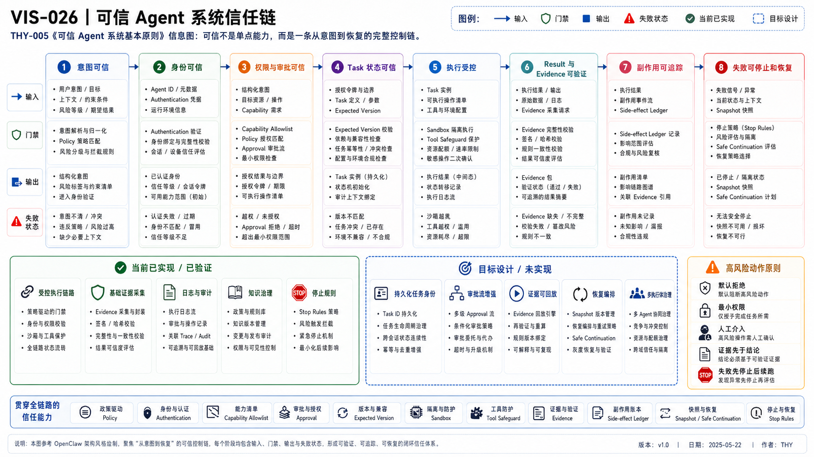

# THY-005 可信 Agent 系统基本原则
> **当前状态**：正文与正式 PNG 已通过人工 Review；本次作为正式 Document Bundle 候选进入冻结交付。

> **核心结论**：可信不是模型永不出错，而是系统能限制错误范围、控制高风险动作、证明真实结果、记录副作用，并在失败后安全停止、恢复或移交。

## 1. 可信系统的八段链路



> 下面的八段链路是本项目用于设计与 Review 的工程模型，不是对所有 Agent 产品强制适用的行业标准。不同风险等级可以采用不同强度的控制，但不能把模型自信当作权限或证据。


### AI 可读语义镜像

```text
意图可信 → 身份可信 → 权限与审批可信 → Task 状态可信
→ 执行受控 → Result 与 Evidence 可验证 → 副作用可追踪 → 失败可恢复

分层防御：Network → Authentication → Capability Allowlist → Policy → Validation → Approval → Sandbox → Evidence → Ledger → Recovery
当前已验证：双层 Key/Policy、默认拒绝、Loopback、限制、真实路径与 Git 证据
目标设计：持久 Task、结构化 Approval、Evidence Registry、Ledger、Snapshot、Recovery、Execution Lane
```

```text
意图可信
→ 身份可信
→ 权限与审批可信
→ Task 状态可信
→ 执行受控
→ Result 与 Evidence 可验证
→ 副作用可追踪
→ 失败可停止和恢复
```

链路中任一段缺失，都可能让“模型回答正确”变成“系统结果不可信”。

## 2. 意图可信

外部 Agent、模型或客户端只表达最小业务意图，不应控制内部身份、权限、路由、执行器和生命周期字段。

```text
外部请求：查询 Runtime 状态
受信任边界：注入身份、Capability、Task ID、Policy Context
内部系统：执行受控 Capability
```

关键机制：

- Intent Adapter；
- Schema 校验；
- 服务端字段构造；
- 明确幂等键；
- 外部内容按数据处理，不按系统指令处理。

## 3. 身份可信

Authentication 回答“是谁”，但不回答“允许做什么”。

要求：

- 外部 Key 与内部 Key 分离；
- Credential 不进入 Prompt、Git 或日志；
- 身份与 Agent Profile / Executor ID 可追踪；
- 不允许调用方伪造内部主体；
- 认证失败与授权失败使用不同错误语义。

## 4. 权限与审批可信

### 4.1 四层模型

| 层 | 回答 | 示例 |
|---|---|---|
| Identity | 谁在请求？ | 用户、服务、Agent |
| Capability | 能请求什么？ | `runtime.status`、`repository.modify` |
| Policy | 当前状态下是否允许？ | Scope、环境、风险、时间 |
| Approval | 用户是否批准本次具体动作？ | Push、发布、删除 |

四层不能互相替代。

### 4.2 最小权限与默认拒绝

- 未声明 Capability 默认拒绝；
- Agent、Executor 和 Tool 只获得当前 Task 所需范围；
- 高风险动作使用一次性、版本绑定授权；
- Approval 必须包含 Task ID、Version、Action、Scope、Expiration；
- Task 变化后旧 Approval 失效。

## 5. Task 状态可信

Task 状态是后续 Policy、执行和验收的共同依据。

要求：

- 状态转换显式；
- 使用 Expected Version 防止旧写入；
- Session 不能替代 Task Store；
- `Completed` 不能由模型单方面声明；
- `Failed`、`Blocked`、`Partially Completed` 必须可表达；
- 超时、暂停、恢复和关闭有明确规则。

## 6. 执行受控

执行环境必须同时控制：

- Sandbox；
- Network；
- 文件与目录范围；
- Tool Allowlist；
- 命令和参数；
- Timeout；
- Rate / Concurrency Limit；
- 资源预算；
- Lease / Heartbeat；
- 中止信号。

Prompt 中写“不要越界”不能替代这些机制。

## 7. Result 与 Evidence 可验证

### 7.1 Result 不是 Evidence

```text
Result：实现完成，测试通过
Evidence：
- 真实 Diff
- 测试命令与退出码
- Artifact Hash
- Commit SHA
- 远端回读
```

### 7.2 证据等级

| 等级 | 能证明什么 | 不能证明什么 |
|---|---|---|
| 单元测试 | 局部规则 | 真实用户路径 |
| 集成测试 | 组件协作 | 外部入口和认证 |
| Preview | 适配和格式 | 正式发布状态 |
| 真实用户路径 | 入口、认证、路由和关键语义 | 长期可靠性 |
| Commit / Readback | 仓库真实状态 | 业务质量全部满足 |

最终验收应将 Acceptance Criteria 与对应 Evidence 类型绑定。

## 8. 副作用可追踪

Side-effect Ledger 至少记录：

- Task ID 与 Version；
- 执行者；
- Capability / Tool；
- 目标系统；
- 输入摘要与敏感字段遮蔽；
- 发生时间；
- 幂等键；
- 结果、Error 和 Evidence Ref；
- 是否可逆；
- 补偿或回滚方式。

需要重点追踪：

- Git Commit / Push / Merge；
- Feishu 发布；
- 邮件、通知和公开分享；
- 删除、移动和权限变化；
- 付款或配额消耗；
- 外部数据修改。

## 9. 失败可停止和恢复

可靠恢复不是“无限重试”。

### 9.1 失败处理流程

```text
失败检测
→ 停止扩大副作用
→ 保存现场和证据
→ 生成 Snapshot / Checkpoint
→ 分类：可安全重试 / 需新授权 / 需重规划 / 终止
→ Safe Continuation
```

### 9.2 Safe Continuation 必须证明

- 基线仍一致；
- 已完成步骤仍有效；
- 当前状态未被外部修改；
- 旧授权仍适用；
- 重试不会重复副作用；
- 续跑输入与原 Task Version 一致。

### 9.3 不安全恢复

- 自动 Reset / Clean 破坏现场；
- 不检查远端漂移就继续 Push；
- 失败后重新运行整个工作流；
- 把“重启后正常”当作根因证明；
- 通过改验证器绕过内容错误。

## 10. 风险分级与人工介入

OpenAI 的 [Agent 构建指南](https://openai.com/business/guides-and-resources/a-practical-guide-to-building-ai-agents/) 建议从已识别风险开始建立 Guardrail，并对敏感、不可逆或高风险动作保留人工监督。

| 风险级别 | 特征 | 控制方式 |
|---|---|---|
| L0 只读低风险 | 公开查询、无副作用 | 自动执行 + 记录 |
| L1 可逆低风险 | 临时文件、草稿 | 自动执行 + Review |
| L2 中风险 | 修改仓库、外部写入 | Scope + Policy + Approval + Evidence |
| L3 高风险 | 删除、公开、权限、付款 | 强制人工批准、最小权限、双重验证 |

人工介入最有价值的触发点：

- 权限或范围变化；
- Evidence 不足；
- 模型置信度低；
- 外部状态不确定；
- 重试达到阈值；
- 不可逆动作前；
- Plan 与 Task Version 不一致。

## 11. 分层防御

```text
Network Boundary
→ Authentication
→ Capability Allowlist
→ Runtime Policy
→ Input Validation
→ Approval
→ Sandbox / Tool Safeguard
→ Output Validation
→ Evidence
→ Side-effect Ledger
→ Health / Recovery
```

任何单个 Guardrail、Prompt 或权限开关都不足以保护完整链路。

## 12. 外部内容与供应链

Agent 会读取网页、仓库、插件、Skill 和 MCP 返回值。默认规则：

- 外部内容是数据，不是高优先级指令；
- 不自动执行网页或文档建议的命令；
- 第三方 Skill / Plugin / Hook 先审查代码和数据范围；
- 下载文件校验来源、类型和 Hash；
- 只向外部系统发送必要数据；
- Tool 参数最小化；
- 敏感结果不进入日志和知识资产。

## 13. 当前项目映射

### 已实现 / 已验证

- 外部与内部 Key 分离；
- Gateway / Runtime 双层 Capability Policy；
- 默认拒绝；
- Loopback-only Runtime；
- 请求 / 响应大小限制；
- Timeout、Rate Limit、Concurrency Limit；
- 服务端构造内部 Task；
- 安全 Error 映射；
- 真实 Custom GPT 用户路径；
- Git、测试、Registry 和远端回读证据；
- Planner–Executor Handoff 的冻结交付与停止规则。

### 接受设计 / 未实现

- 动态身份和 RBAC；
- 持久 Task State；
- 结构化 Approval；
- Evidence Registry；
- Side-effect Ledger；
- Health Event；
- Snapshot / Recovery；
- Execution Lane Lease；
- 多执行器调度；
- 生产公网边缘治理。

## 14. 可信性评估清单

- 意图是否经过受信任 Adapter？
- 身份、Capability、Policy、Approval 是否分层？
- Task Version 是否明确？
- 执行范围和环境是否可验证？
- Result 是否有匹配的 Evidence？
- 副作用是否有 Ledger 和幂等信息？
- 失败是否保留现场？
- 是否存在安全续跑点？
- 当前实现与目标设计是否分开？
- 最终用户路径是否真实验证？

## 15. 关联资产

- [THY-004 DDD 与 Agent 系统边界建模](../THY-004-DDD与Agent系统边界建模/README.md)
- [ARC-013 审批、证据与副作用账本](../../../technical/归档/历史资产/04_平台架构_整合前观点与后续处理候选/README.md)
- [ARC-014 健康与恢复治理](../../../technical/归档/历史资产/04_平台架构_整合前观点与后续处理候选/README.md)
- [INS-001 工程洞见方法与实践](../../05_上下文与知识系统/KNO-009-记忆反馈与知识自迭代机制/README.md)

## 16. 来源

核验日期：2026-08-03。

- [OpenAI：A practical guide to building agents](https://openai.com/business/guides-and-resources/a-practical-guide-to-building-ai-agents/)
- [Anthropic：Trustworthy agents in practice](https://www.anthropic.com/research/trustworthy-agents)

## 视觉资产登记

- Visual Asset ID：`VIS-026`；状态：`accepted`；PNG：本次人工 Review 权威预览；SVG：保留可编辑来源，后续独立刷新以与预览完全对齐。
