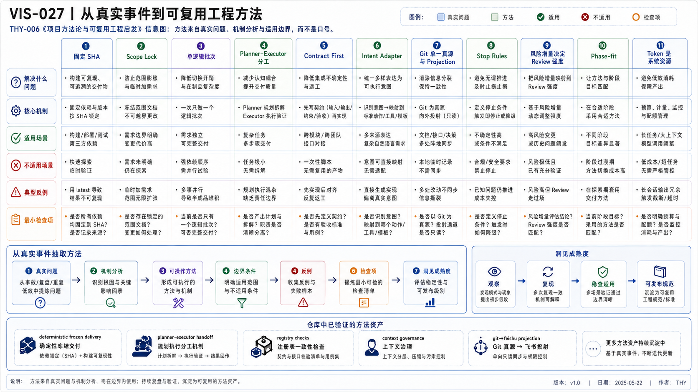

# THY-006 项目方法论与可复用工程启发
> **当前状态**：正文与正式 PNG 已通过人工 Review；本次作为正式 Document Bundle 候选进入冻结交付。

> **核心结论**：可复用方法不是一句“最佳实践”，而是由真实问题、发生机制、适用条件、反例、检查项和仓库证据共同构成的工程判断；一次事件通常只够形成候选洞见。

## 1. 方法与口号的区别



一条正式方法必须回答：

```text
真实问题
→ 发生机制
→ 方法
→ 适用条件
→ 不适用条件
→ 失败模式 / 反例
→ 可执行检查项
→ 仓库证据
→ 洞见成熟度
```

缺少任一关键部分，就容易变成无法执行的口号。


### AI 可读语义镜像

```text
真实问题 → 机制分析 → 方法提炼 → 适用条件 → 反例 / 排除
→ 检查项 → 仓库证据 → 成熟度

方法必须说明“解决什么”和“不解决什么”；一次事件通常只产生 Candidate / Provisional，经过独立重复、反例和正式 Review 后再升级。
```

## 2. 固定 SHA：控制输入漂移

### 真实问题

长任务执行期间，本地分支、远端分支或来源文件发生变化，导致 Review 的输入与执行输入不是同一版本。

### 机制

Agent 根据旧上下文规划，却在新工作树上执行；即使所有命令成功，也无法证明结果对应原计划。

### 方法

执行前固定：

- branch；
- local HEAD；
- remote SHA；
- source package Hash；
- clean worktree / index / untracked。

### 适用

- 冻结 Artifact；
- 多文件迁移；
- 长时间执行；
- 需要 Commit / Push；
- 多人或多 Agent 并行。

### 不适用

- 纯讨论；
- 无仓库副作用的短调研；
- 明确允许跟随最新分支的任务。

### 反例

固定 SHA 不能防止语义错误、验证器错误或来源本身错误；它只保证输入版本一致。

### 检查项

```text
git branch --show-current
git rev-parse HEAD
git rev-parse origin/<branch>
git status --short --untracked-files=all
```

## 3. Scope Lock：限制越界

### 真实问题

Agent 在完成目标时顺手重构、格式化或创建额外文件，导致 Review 面扩大。

### 机制

自然语言中的“相关内容”边界模糊，模型倾向优化相邻问题；Git 的已跟踪和未跟踪文件又使用不同查询方式。

### 方法

明确：

- 允许修改的既有路径；
- 允许新增路径；
- 必须删除路径；
- 禁止范围；
- 外部动作；
- 停止条件；
- 计数与路径清单。

真实 Dirty Scope 必须组合：

```text
git diff --name-only --no-renames
+ git ls-files --others --exclude-standard
```

### 反例

只检查 `git diff` 会漏掉未跟踪新增文件；只检查数量会漏掉错误路径替换。

## 4. 单逻辑批次：优化 Review 与恢复

### 方法

一个 Commit 表达一个可独立解释、验证和回滚的完整目的。

### 价值

- Review 范围清楚；
- Release 与 Registry 可对应；
- 出错时恢复范围小；
- Commit 可以作为证据和后续基线。

### 反例

“每篇文章一个 Commit”不一定更好。批次过碎会增加 Prompt、验证、Push 和回读成本。粒度应由逻辑完整性决定，而不是文件数量。

## 5. 按不确定性分工

| 任务 | 适合主体 | 原因 |
|---|---|---|
| 事实恢复、冲突判断、架构、正文 | 强模型 + 人 | 高语义不确定性 |
| 文件复制、精确覆盖、Hash、测试 | Script / 受控 Executor | 可确定验证 |
| 专业 Review | 人 + 强模型 | 需要价值判断 |
| 重复 Schema / 路径检查 | 程序 | 布尔结果稳定 |

关键不是模型品牌，而是：

```text
高不确定性 → 认知与 Review
低不确定性 → Contract、Script、CI
```

## 6. 程序负责确定性判断

适合程序：

- YAML / JSON Schema；
- 路径和文件名；
- ID 唯一性；
- Link；
- Hash；
- 行尾空白；
- Scope；
- 测试；
- 计数与状态。

但程序验证器也属于软件，必须：

- 先做语法检查；
- 有自测与负例；
- 与当前规则同步；
- 不依赖脆弱的精确文案；
- 失败时区分“内容错误”和“验证器错误”。

## 7. Planner–Executor 分工

### Planner

- 恢复事实；
- 定义目标与边界；
- 完成语义设计；
- 生成冻结完整文件；
- 复审结果。

### Executor

- Reception Ack；
- 验证基线、权限和包；
- 机械应用；
- 运行门禁；
- 精确暂存、Commit、Push；
- 返回证据；
- 遇到未知立即停止。

### 反例

让 Executor 在应用冻结包后“顺便润色”会破坏 Hash、Scope 和语义所有权。

## 8. Contract First

### 方法

先定义稳定 Contract，再连接入口、Runtime 和 Provider。

### 解决

- 入口和执行环境解耦；
- 测试可以独立验证；
- Provider 可替换；
- 错误语义统一；
- Adapter 不泄漏内部对象。

### 不解决

Contract 不能自动保证领域边界正确，也不能替代真实用户路径验证。

## 9. Intent Adapter

外部调用者只提交业务意图，服务端注入身份、Capability、内部 Task 字段和 Policy Context。

适用：

- Custom GPT Actions；
- Webhook；
- 第三方 Agent；
- Browser Extension；
- 公共 API。

反例：允许外部模型指定 `executor_id`、内部权限或状态，会让概率性输入进入控制面。

## 10. 真实用户路径验证

```text
单元测试
→ 内部集成
→ Adapter 测试
→ Preview
→ 正式用户入口
→ 自动回归
```

每层证明不同事实。组件测试通过不能替代正式入口、真实认证、真实请求形态和关键响应语义。

## 11. Git 单一真源与 Projection

### 方法

- Git 保存经过 Review 的正式事实；
- Feishu、Custom GPT Knowledge、Host 配置等是派生发布；
- 外部修改不能静默合并回 Git；
- 发布需要 Hash、映射和回读。

### 适用

适用于需要版本、Review、关系、迁移和多 Agent 恢复的工程知识。

### 代价

- 发布链更复杂；
- 外部即时编辑不能自动成为正式事实；
- 需要 Publisher 与 Drift 检测。

## 12. Phase-fit：方案匹配当前阶段

### 方法

```text
当前目标
→ 最高风险假设
→ 最小真实探针
→ 成功证据
→ 预算与退出条件
→ 替代路线
```

### 反例

- MVP 前先建设通用多 Agent 平台；
- 开发期 Tunnel 被描述为生产架构；
- 无真实 Workflow 时引入重型编排框架；
- 没有第二个调用方就抽象通用 Provider Router。

## 13. 风险增量决定 Review 强度

| 变化 | 建议 Review |
|---|---|
| 格式、明确字段 | 自动门禁 + Diff Review |
| 跨文档语义、Registry | 相关资产 Review |
| Contract、状态、不变量 | 设计 + 测试 + 影响分析 |
| 认证、权限、外部写入 | 完整链路 + 人工批准 |
| 不可逆或公开发布 | 双重确认 + 回读 + 恢复方案 |

已有可信基线后，应复用仍有效证据，而不是每次从零审计整个仓库。

## 14. Token 是系统资源

Token 浪费常来自：

- 重复扫描同一事实；
- 模糊任务让 Executor 重新设计；
- 每个文件单独交付；
- 用强模型做复制和计数；
- 验证器错误导致多轮返工；
- 失败后叠加 Prompt 而不建立续跑点。

优化链路：

```text
事实一次恢复
→ 内容与信息地图冻结
→ 确定性验证
→ 冻结交付
→ 一次落库
→ 风险级 Review
→ 真实 Commit 回读
```

## 15. Stop Rules 是可靠性机制

应停止的典型条件：

- 基线或远端漂移；
- Scope 不一致；
- 需要新语义决策；
- 权限未授权；
- 验证失败且根因未知；
- 续跑状态无法证明；
- 副作用可能重复；
- Token 不足以完成验证。

停止不是失败；在未知状态下继续写入才是风险扩大。

## 16. 洞见成熟度

```text
candidate
→ provisional
→ validated
→ repeated
→ established
```

升级需要：

- 独立重复事件；
- 明确 Precondition；
- 反例与 Exclusion；
- 稳定检查项；
- 正式 Review；
- 对项目决策产生可观察影响。

一次事件通常不应高于 Candidate / Provisional。

## 17. 方法总表

| 方法 | 主要解决 | 不解决 |
|---|---|---|
| 固定 SHA | 输入漂移 | 语义错误 |
| Scope Lock | 越界 | 内容质量 |
| 单逻辑批次 | Review / 回滚 | 自动正确 |
| 不确定性分工 | Token 与判断质量 | 权限问题 |
| 程序门禁 | 确定性错误 | 价值判断 |
| Planner–Executor | 语义与执行所有权 | 自动 Task Store |
| Contract First | 接口耦合 | 领域模型错误 |
| Intent Adapter | 外部控制字段污染 | 内部策略缺失 |
| 真实路径验证 | 完成声明失真 | 长期可靠性 |
| Git 真源 | 事实版本与审计 | 外部协作成本 |
| Phase-fit | 过度设计 | 长期架构全部问题 |
| 风险增量 Review | 审计成本 | 高风险免审 |
| Stop Rules | 错误扩大 | 根因自动解决 |
| Insight Maturity | 一次事件过度抽象 | 自动形成定律 |

## 18. 仓库证据入口

- [INS-001 工程洞见方法与实践](../../05_上下文与知识系统/INS-001-工程洞见方法与实践.md)
- [`planner-executor-handoff`](../../../../skills/planner-executor-handoff/SKILL.md)
- [`project-knowledge-synthesis`](../../../../skills/project-knowledge-synthesis/SKILL.md)
- [`engineering-document-authoring`](../../../../skills/engineering-document-authoring/SKILL.md)
- [EXP-005 Custom GPT Actions 链路实验](../../08_实验与复盘/EXP-005-Custom-GPT-Actions链路实验/README.md)
- [WFL-004 多模型执行治理与 Token 预算](../../07_工作流与项目治理/WFL-004-多模型Agent执行治理与Token预算.md)

## 19. 结论

可靠工程方法的目标不是让 Agent 永不停下，而是：

- 让不确定性在认知层被发现；
- 让确定性工作进入 Contract、Script 和 CI；
- 让每次正式状态变化有可回读证据；
- 让失败保留现场并形成安全续跑点；
- 让经验带着适用条件逐步成熟。

## 20. 来源与证据边界

本篇主要依据本仓库的真实交付记录、失败续跑、Git 回读、测试结果与 Engineering Insight Registry。历史对话和执行摘要只用于定位事件，不能单独证明方法成立。

方法成熟度必须继续由独立重复、反例、适用前提和正式 Review 推进；本文不会把一次成功或一次失败升级为普遍定律。

## 视觉资产登记

- Visual Asset ID：`VIS-027`；状态：`accepted`；PNG：本次人工 Review 权威预览；SVG：保留可编辑来源，后续独立刷新以与预览完全对齐。
