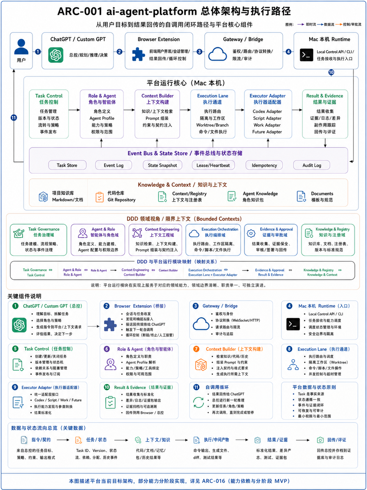

# ARC-001 ai-agent-platform 总体架构与执行路径

> **核心结论**：`ai-agent-platform` 的架构中心不是模型、工具或宿主产品，而是一个由明确领域边界、稳定契约、受控执行、状态与证据共同组成的可信闭环：用户提出目标，总控负责理解与决策，平台把目标固化为可追踪 Task，装配最小上下文，在隔离执行通道内调用可替换执行器，收集结果、证据和副作用，再由总控与用户决定接受、继续、暂停、恢复或终止。

## 1. 文档定位：整套知识体系的结构中心

本文负责把前面章节已经确认的产品目标、Agent 工程方法、DDD 边界建模、可信系统原则和 Planner–Executor 分工，落成 `ai-agent-platform` 的可执行架构；同时为后续 Context、Agent、Workflow、实验和 Portfolio 文档提供稳定挂点。

```text
00～03：说明项目为何存在、平台化责任是什么、为什么采用 DDD、Skills 和可信执行
                                      ↓
ARC-001：规定系统边界、领域所有权、模块责任、运行路径、状态证据与 Adapter 位置
                                      ↓
05：Context / Knowledge / Registry       06：Role / Agent Profile / Skill
07：Task / Handoff / Approval / Recovery 08：实验与真实证据  09：Portfolio
```

本文不展开每个状态字段、Profile Schema、审批表单或恢复算法，但所有重要能力必须在架构中有位置、责任、依赖和接口；详细设计由后续专题承接。

## 2. 架构目标、驱动因素与非目标

### 2.1 架构目标

1. 把聊天中的目标转化为可版本化、可暂停、可恢复、可验收的 Task；
2. 让 ChatGPT / Custom GPT 保持总控、规划与复审职责，不承担本机执行事实；
3. 让 Codex、Work、Script、Browser、模型和未来设备通过统一执行边界接入；
4. 让代码、Context、知识、状态、证据、副作用和发布关系可追踪；
5. 用最小权限、版本校验、幂等、审批、隔离和安全停止控制副作用；
6. 允许平台先以模块化单体和窄链路验证，再按真实压力演进；
7. 让 AI 视频工作流等上层产品复用平台能力，而不是反向污染平台核心。

### 2.2 关键驱动因素

| 驱动因素 | 架构响应 |
|---|---|
| 长 Chat 容易漂移，执行状态不能只存在消息中 | Task Version、State Store、Checkpoint、Evidence |
| 强模型不应消耗在机械落盘 | Planner–Executor Handoff、Frozen Artifact、Executor Adapter |
| 本机仓库和浏览器具有高副作用 | Local Control、Policy、Approval、Scope、Worktree 隔离 |
| Host、模型和 Provider 会变化 | Port / Adapter、Capability Contract、Executor Routing |
| 知识与代码必须保持单一真源 | Git Canonical Asset、Registry、Projection |
| 项目需要可展示的真实工程证据 | Result Envelope、Evidence、Commit、测试和真实路径实验 |

### 2.3 当前非目标

- 不建设通用 Agent SaaS、集群调度平台或无限并行系统；
- 不提前采用 LangGraph 或通用 Workflow Engine 作为核心；
- 不把 Bounded Context 直接拆成微服务；
- 不把 Feishu、Custom GPT Knowledge、Memory、MCP 或宿主功能冒充为平台实现；
- 不在当前阶段让 AI 视频、手机模型或第二垂直产品进入核心运行时。

## 3. Canonical 总体架构图



### AI 可读语义镜像

Visual Asset ID：`VIS-028`，版本：`2`。

### 3.1 System Context

```text
用户 / Project Owner
  ↓ 目标、约束、审批、最终接受
ChatGPT / Custom GPT 总控
  ↓ Command / Context Request
Browser Extension 或 Action
  ↓ 已认证请求、会话引用、循环控制
Gateway / Bridge
  ↓ Contract、身份、Policy、路由、审计
Mac Local Control / Runtime
  ↓ Application Command
平台领域与应用核心
  ↓ Execution Contract
Executor Adapter → Codex / Work / Script / Browser / Future Executor
  ↓ Result / Evidence / Side Effects
平台状态与证据 → Browser / Action → ChatGPT 总控 → 用户
```

### 3.2 DDD Bounded Context

| Bounded Context | 状态与规则所有权 | 主要 Aggregate / Value Object | 与其他 Context 的接口 |
|---|---|---|---|
| **Task Control** | Task 目标、Version、状态、依赖、合法迁移与完成判定 | Task、Task Version、Dependency、Acceptance | Task Command、Task Event、Task Query |
| **Agent Governance** | Role、Agent Profile、能力、Skill、Policy、权限与分配 | Agent Profile、Role Assignment、Capability Reference | Assignment Command、Profile Query、Policy Decision |
| **Context & Knowledge** | Context Package、知识资产引用、检索、裁剪与漂移 | Context Package、Knowledge Asset Ref、Registry Ref | Context Query、Context Built Event、Asset ID Reference |
| **Execution Orchestration** | Execution、Lane、Lease、环境、Scope、Adapter 与资源 | Execution、Execution Lane、Lease、Workspace Binding | Execution Command、Executor Port、Execution Event |
| **Evidence & Safety** | Result、Evidence、Approval、副作用、健康、恢复和终止快照 | Evidence Case、Approval、Side-effect Record、Snapshot | Evidence Event、Approval Decision、Recovery Command |
| **Publishing & Registry** | Git Canonical Asset、关系、生命周期、Release 和投影 | Knowledge Asset、Registry Entry、Release、Projection | Asset Command、Registry Query、Published Event |
| **Product Domain** | AI 视频等上层产品的业务语言、规则和验收 | Story、Character、Scene、Shot 等未来业务对象 | Product Task / Capability Port；当前仅占位 |
| **Engineering Insight** | 工程事件、洞见、成熟度和复用证据 | Engineering Event、Insight、Pattern | Evidence Reference、Insight Proposal |

这些 Context 表示**规则与状态所有权**，不表示当前已经部署为独立服务。近期实现采用模块化单体；只有当独立扩展、部署、团队或数据一致性压力出现时，才评估服务拆分。

### 3.3 核心 Aggregate 不变量

| Aggregate | 必须保护的不变量 |
|---|---|
| Task | 每次写入匹配 `expected_version`；非法状态跳转被拒绝；完成必须满足 Acceptance 和 Evidence |
| Role Assignment | 一个执行轮次的职责、输入、输出、权限和 Handoff 目标明确；角色不能通过提示词扩大授权 |
| Context Package | 来源、版本、裁剪策略和适用 Task 可追踪；上下文不是事实源副本 |
| Execution | 绑定 Task Version、Executor、Scope、环境、Attempt 和 Lease；过期结果不能覆盖新执行 |
| Evidence Case | Evidence 与具体 Task Version、Execution 和 Acceptance 绑定；摘要不能替代测试、Diff、Commit 或回读 |
| Knowledge Asset | Stable ID、Canonical Path、生命周期、关系和投影方向一致；Feishu 不反向成为真源 |

## 4. 从领域到可执行模块

DDD Context 通过应用服务组合为平台运行核心。模块名不是新的状态所有者，而是对领域能力的运行时组织。

| 运行模块 | 所属 Context | 责任 | 输入 | 输出 | 当前状态 |
|---|---|---|---|---|---|
| Task Control | Task Control | 创建/继续/暂停/终止 Task，维护 Version、Dependency、State | Goal、Scope、Acceptance、Task Command | Task Snapshot、Task Event | `planned` |
| Role & Agent | Agent Governance | 解析角色、Profile、Skill、能力、权限并生成 Assignment | Task、Role Request、Policy | Role Assignment、Agent Ref | 人工资产 `partial` |
| Context Builder | Context & Knowledge | 检索 Git、文档、Registry、历史和角色知识，装配最小 Context | Task、Assignment、Context Query | Context Package | `planned` |
| Execution Lane | Execution Orchestration | 绑定工作区、Worktree、环境、资源、Lease 和执行 Attempt | Execution Request、Scope、Approval | Execution、Intermediate Artifact | 窄 Runtime `partial` |
| Executor Adapter | Execution Orchestration | 将统一 Contract 转换为 Codex、Work、Script、Browser 等调用 | Execution Contract | Provider Call、Normalized Result | 人工 Codex Handoff 已验证；Adapter `planned` |
| Result & Evidence | Evidence & Safety | 标准化结果、测试、Diff、Commit、日志、副作用和 Review 输入 | Raw Result、Event、Artifact | Result Envelope、Evidence Case | 人工机制 `partial` |
| Registry / Publisher | Publishing & Registry | 管理资产关系、Migration、Release 与 Git→Feishu 投影 | Asset Change、Release Command | Registry State、Projection | Registry 已运行；最终发布未执行 |

共享基础能力：

```text
Event Bus & State Store
├── Task Store / Execution Store
├── Event Log / Audit Log
├── State Snapshot
├── Lease / Heartbeat
├── Idempotency
└── Resource Lock

Cross-cutting Policy
├── Identity / Authentication
├── Capability Policy / Scope
├── Approval Gate
├── Budget / Rate / Timeout
├── Observability / Cost
└── Health / Recovery / Safe Stop
```

## 5. 运行视图：从用户目标到结果回传

### 5.1 当前已经验证的真实窄链路

```text
用户
→ Custom GPT Action
→ Microsoft Dev Tunnels
→ Action Gateway
→ Local Runtime
→ gateway.ping / runtime.status
→ TaskResult
→ Custom GPT
```

当前已验证：请求级 Contract、外部/内部认证、双层 Capability Policy、Loopback、超时、并发、大小限制、结构化结果和真实自然语言调用。它不等于持久 Task、自调用循环、Browser Extension、动态 Executor 或恢复系统。

### 5.2 当前人工工程闭环

```text
用户目标
→ ChatGPT Planner：语义分析、架构、正式内容与 Scope
→ planner-executor-handoff：冻结任务与 Git Policy
→ 用户手工转交本地 Codex
→ Codex：受限执行、测试、Commit、Push、事实回传
→ ChatGPT Review
→ 用户确认下一步
```

该闭环已经真实交付，但 Task、转交、下一轮触发和中断恢复尚未平台化。

### 5.3 目标自调用闭环

1. 用户向总控提交目标、约束、预算和最终验收；
2. 总控读取 Task 摘要、Context 和上一轮 Evidence，生成结构化 Command；
3. Browser Extension / Action 绑定 `conversation_ref`、`task_id`、`turn_no` 并发起请求；
4. Gateway 完成 Contract、Identity、Policy、Rate、Idempotency 和审计；
5. Local Control 将外部意图转换为 Application Command；
6. Task Control 校验 Version、Dependency 和合法状态；
7. Agent Governance 生成 Role Assignment 和权限范围；
8. Context Builder 生成最小 Context Package；
9. Evidence & Safety 判断是否需要 Approval；
10. Execution Orchestration 租用 Lane，绑定 Executor、Scope、Workspace / Worktree 和资源预算；
11. Executor Adapter 执行并返回标准 Result；
12. Evidence & Safety 记录测试、Diff、Commit、日志、副作用和失败；
13. Task Control 更新状态与 Snapshot；
14. Browser / Action 回传结构化结果；
15. 总控与用户决定接受、继续、换角色、重试、暂停、恢复或终止。

Browser Extension 负责**触发下一轮与人工接管 UI**，但不拥有 Task 状态；Task Control 才是任务事实来源。总控拥有语义决策，但不能绕过 Policy、Approval 和状态不变量。

## 6. 数据、状态、证据与副作用流

| 流 | 内容 | 写入责任 | 不能被什么替代 |
|---|---|---|---|
| 指令流 | Goal、Command、Role、Scope、Acceptance | 总控与 Task Control | 自然语言聊天摘要 |
| 状态流 | Task Version、State、Dependency、Execution、Lease | Task / Execution Store | 浏览器页面或执行器内存 |
| 上下文流 | Context Package、Knowledge Ref、Code Ref、History | Context Builder | 把整个仓库塞进 Prompt |
| 数据流 | 参数、文件、命令输出、中间产物 | Local Control / Executor | 无来源的模型描述 |
| 证据流 | Test、Diff、Commit、Log、Read-back、Hash | Result & Evidence | “看起来完成了” |
| 副作用流 | 文件、Git、网络、外部系统变化 | Side-effect Record / Audit | 单一结果文本 |
| 发布流 | Canonical Asset、Registry、Release、Projection | Publishing & Registry | Feishu 在线内容反向合并 |

## 7. Adapter、部署与信任边界

### 7.1 部署边界

```text
ChatGPT Host / Browser
        │ public authenticated boundary
Gateway / Bridge / Dev Tunnel
        │ localhost or trusted network boundary
Mac Local Control / Runtime
        │ process + repository + workspace boundary
Executor Adapter
        ├── Codex / GPT Work
        ├── Script / CI
        ├── Browser / API
        └── Future mobile / remote executor
```

### 7.2 Adapter 原则

- ChatGPT、Codex、Work、浏览器、Tunnel、模型和媒体 Provider 均可替换；
- Provider 差异只能停留在 Adapter，不进入 Task、Evidence 和完成规则；
- CLI、Gateway 和 Browser Extension 调用同一 Local Control Application Service；
- Secret、Cookie 和本机身份不进入 Git、Context、Evidence 明文或公开日志；
- 一个可写 Lane 默认绑定一个隔离工作区；并行前先检查依赖、Scope、资源和合并策略。

### 7.3 停止与恢复出口

出现以下情况，平台必须停止自动触发并进入人工决策或 Safe Continuation：

- `expected_version`、`expected_state`、Lease 或结果哈希不匹配；
- 高风险动作缺少 Approval；
- 幂等键重复、事件缺口、证据不完整或副作用不可追踪；
- Browser、Bridge、仓库、Worktree 或外部 Provider 状态不可信；
- 达到轮次、时间、Token、费用或资源预算；
- Context Drift 无法安全裁剪；
- 用户暂停、终止或人工接管。

## 8. 当前仓库实现映射与证据等级

| 架构能力 | 当前路径 | 当前证据 | 声明等级 |
|---|---|---|---|
| Shared Contract | `packages/contracts/` | 代码与测试 | 请求级基础 `implemented` |
| Auth | `packages/auth/` | 代码与测试 | 静态 Bearer Key 原语 `implemented` |
| Capability Policy | `packages/policy/` | 代码与测试 | 默认拒绝与 Allowlist `implemented` |
| Public Intake | `apps/action-gateway/` | 集成与真实 Action | 窄入口 `verified` |
| Local Execution Boundary | `apps/local-runtime/` | 集成与真实状态调用 | 低风险 Handler Runtime `verified` |
| Dev Public Entry | `apps/dev-tunnel/` | 真实连接实验 | 开发期入口 `verified` |
| Planner–Executor | `skills/planner-executor-handoff/` | 多轮仓库交付 | 人工/冻结 Handoff `operational` |
| Knowledge / Context / Registry | `docs/`、`context/`、`platform-registry/` | 校验、Commit、文档包 | `operational` |
| Browser Loop、Task Store、Context Builder、Approval、Evidence Store、Lane Registry | 暂无对应完整代码 | 设计与候选 | `planned` |

证据等级遵循：

```text
目标设计 < Contract / Schema < 代码存在 < 单元测试 < 集成测试 < 真实用户路径 < 可重复运营证据
```

不能因为文档、目录、宿主能力或 Mock 存在，就升级实现声明。

## 9. 正式占位与后续专题挂接

| 架构占位 | 在 ARC-001 中的位置 | 后续承接 |
|---|---|---|
| Knowledge、Context、Registry、Projection | Context & Knowledge / Publishing | `05_上下文与知识系统` |
| Role、Agent Profile、Skill、Knowledge Pack | Agent Governance | `06_智能体资产体系` |
| Task Contract、Handoff、多角色协作 | Task Control / Agent Governance | `07_工作流与项目治理` |
| Approval、Evidence、Side-effect、Recovery | Evidence & Safety | `07` 与 `08` |
| Browser Loop、Local CLI、Execution Lane、Adapter | Execution Orchestration | ARC-016 阶段路线与真实实验 |
| AI 视频工作流 | Product Domain | `01` 产品定义、`07` 工作流、Phase 3 |
| 手机模型 / 第二执行器 | Executor Adapter | MVP-7 后续扩展 |
| Feishu 发布 | Publishing & Registry | `05` 与 `WFL-001`，不作为 Runtime 前置条件 |
| 项目汇报与 Portfolio | Registry / Evidence 消费方 | `07` 与 `09` |

旧 ARC 的详细草案和旧图保存在[平台架构整合前观点与后续处理候选](../../../technical/归档/历史资产/04_平台架构_整合前观点与后续处理候选/README.md)。归档内容不能覆盖当前 Canonical 架构，但可在出现真实调用方和证据后重新综合。

## 10. 架构不变量与决策摘要

1. Task 是任务事实来源；聊天窗口、Browser 和 Executor 都不是；
2. DDD 边界由状态和规则所有权决定，不由产品名或 Agent 名称决定；
3. 当前采用模块化单体，Contract 稳定后再讨论服务拆分；
4. 总控拥有目标与语义决策，执行器只执行授权 Contract；
5. Provider / Host / Model / Device 差异限制在 Adapter；
6. 完成由 Acceptance 与 Evidence 共同判定；
7. 写操作默认拒绝，必须满足 Scope、Version、Approval、Idempotency 和隔离；
8. 默认串行；并行是满足依赖、Scope、资源和合并条件后的显式能力；
9. Git 是代码和正式知识真源，Feishu 等均为可重建投影；
10. 当前实现、目标设计、阶段计划和历史候选必须始终分开。

## 11. 演进入口

平台怎样从当前窄链路逐步实现上述架构，见：

- [ARC-016 能力依赖、多任务并行与分阶段 MVP 路线图](../ARC-016-能力依赖多任务并行与分阶段MVP路线图/README.md)
