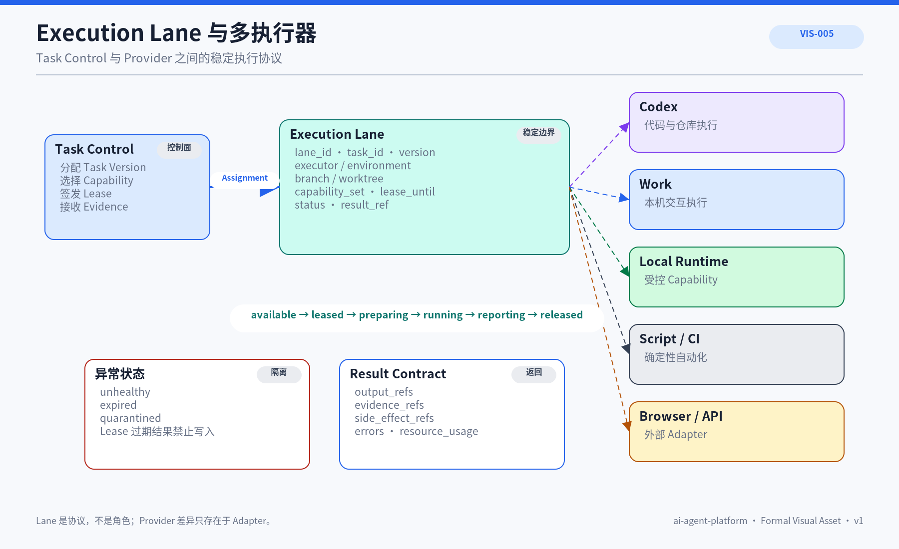

# ARC-010 Execution Lane 执行通道模型

## 1. 文档定位

Execution Lane 是 Task Control 与具体执行器之间的稳定边界，统一任务分配、环境、权限、Lease、心跳和结果。


## 正式视觉资产



### AI 可读语义镜像

```text
Task Control
   ↓ assign + lease
Execution Lane
   ├→ Codex Adapter
   ├→ GPT Work Adapter
   ├→ Local Runtime Adapter
   ├→ Script / CI Adapter
   └→ Browser / API Adapter
   ↓ result + evidence + side effects
Task Control
```

Lane 生命周期：`available → leased → preparing → running → reporting → released`；异常状态为 `unhealthy / expired / quarantined`。Lease 过期结果不得写回；Provider 差异只能停留在 Adapter。

- Visual Asset ID：`VIS-005`；
- 可编辑源文件：[`./assets/VIS-005-Execution-Lane与多执行器.svg`](./assets/VIS-005-Execution-Lane与多执行器.svg)；
- 人类预览：[`./assets/VIS-005-Execution-Lane与多执行器.png`](./assets/VIS-005-Execution-Lane与多执行器.png)；
- 事实边界：Lane 是稳定执行协议；执行器和 Provider 差异限制在 Adapter。

## 2. 组成

Lane 记录 lane_id、task_id、task_version、executor_type、executor_id、environment_ref、branch、worktree、capability_set、lease_until、status 和 result_ref。

## 3. 生命周期

`available → leased → preparing → running → reporting → released`；异常进入 unhealthy、expired 或 quarantined。Lease 过期结果不得写入。

## 4. 适配

Execution Port 可以连接 Codex、Work、Local Runtime、Script/CI、Browser/API Adapter 和未来远程环境。Provider 差异限制在 Adapter。

## 5. 结果

Result 包含 status、output_refs、evidence_refs、side_effect_refs、errors 和 resource_usage。文本摘要不能替代 Hash、测试、Commit 或回读。

## 6. 当前实现边界

当前 Gateway 与 Runtime 形成固定执行通道；Codex 与 Work 仍由人手工分配，没有 Lane Registry、Lease 或心跳。

## 7. 目标设计边界

目标先支持 Local Runtime、Codex 与 Script 三类 Adapter，统一 Lane 状态和 Evidence。

## 8. 设计原则

- Lane 是执行协议不是角色
- Lease 防止重复执行
- 环境与 Git 隔离可追踪
- Provider 差异限制在 Adapter
- 结果必须有证据引用

## 9. 关联文档

- [ARC-009 轻量 Task Control](../ARC-009-轻量Task-Control架构/README.md)
- [CAP-006 从 ChatGPT 到 Codex 的平台执行闭环](../../02_基础产品与能力/CAP-006-从ChatGPT到Codex的平台执行闭环/README.md)
- [ARC-001 平台总体架构](../ARC-001-ai-agent-platform总体架构/README.md)
