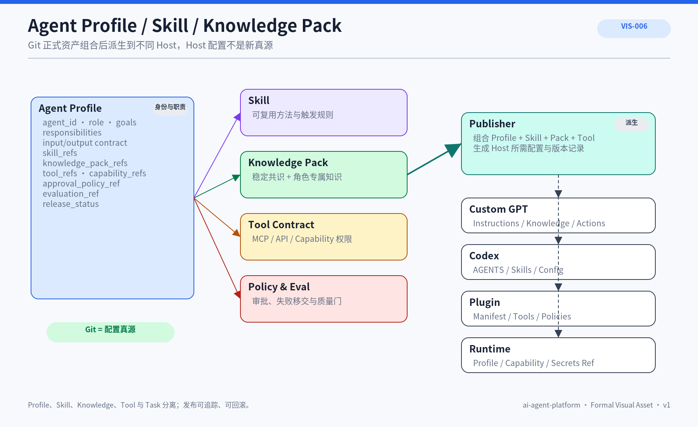

# ARC-012 Agent Profile 与 Skills 资产化

## 1. 文档定位

定义专业 Agent 的长期配置如何作为 Git 正式资产管理，并与 Skill、Knowledge Pack、Tool、Policy、Task 和发布目标分离。


## 正式视觉资产



### AI 可读语义镜像

```text
Agent Profile
 + Skill refs
 + Knowledge Pack refs
 + Tool Contracts
 + Policy / Approval
 + Evaluation / Release
          ↓ Publisher
Custom GPT / Codex / Plugin / Runtime
```

Git 中的 Profile、Skill、Knowledge Pack、Tool Contract 和 Policy 是规范资产；Host 配置只是派生结果。Profile 选择 Skill，Skill 提供可复用方法，Knowledge Pack 提供角色知识，权限与验收由 Profile/Policy 决定。

- Visual Asset ID：`VIS-006`；
- 可编辑源文件：[`./assets/VIS-006-Agent-Profile-Skill-Knowledge-Pack.svg`](./assets/VIS-006-Agent-Profile-Skill-Knowledge-Pack.svg)；
- 人类预览：[`./assets/VIS-006-Agent-Profile-Skill-Knowledge-Pack.png`](./assets/VIS-006-Agent-Profile-Skill-Knowledge-Pack.png)；
- 事实边界：Git 中的 Profile、Skill、Knowledge Pack、Tool Contract 与 Policy 组合后派生到不同 Host。

## 2. Agent Profile

Profile 包含 agent_id、role、goals、responsibilities、input/output contract、skill_refs、knowledge_pack_refs、tool_refs、capability_refs、approval_policy_ref、evaluation_ref 和 release_status。

## 3. Skill 关系

Profile 选择 Skill；Skill 定义可复用方法。多个 Agent 可以共享 Skill，但使用不同权限、Knowledge Pack 和验收。

## 4. 发布派生

`Git Profile + Skills + Knowledge Pack Manifest + Tool Contract → Publisher → Custom GPT / Codex / Plugin / Runtime`。Host 配置不是新真源。

## 5. 生命周期

Profile 经 draft、review、released、deprecated；发布前验证触发、Skill、权限、输出 Contract、Knowledge Pack 和失败移交。

## 6. 当前实现边界

当前有六个正式 Skill、Custom GPT 配置原则和两层 Knowledge Pack 决策，但没有 `agents/`、`knowledge-packs/` 或通用跨 Host Publisher。Feishu Knowledge Publisher 是受限知识投影能力，不等于 Agent Profile Publisher。

## 7. 目标设计边界

首批真实角色准备好后再创建 `agents/`，由 Registry 管理 Profile、Skill、Pack 和 Release 关系。

## 8. 设计原则

- Profile/Skill/Knowledge/Tool/Task 分离
- Git 为配置真源
- 不创建空 Agent 目录
- 权限与 Approval 用稳定引用
- 发布可追踪可回滚

## 9. 关联文档

- [CAP-008 Agent 扩展与治理](../../02_基础产品与能力/CAP-008-Agent扩展与治理-AGENTSRulesSkillsHooksMCP与Plugins.md)
- [THY-003 Agent + Skills](../../03_架构思想与理论/THY-003-Agent与Skills开发范式.md)
- [KNO-006 Knowledge Pack 设计](../../05_上下文与知识系统/KNO-006-Knowledge-Pack设计.md)
