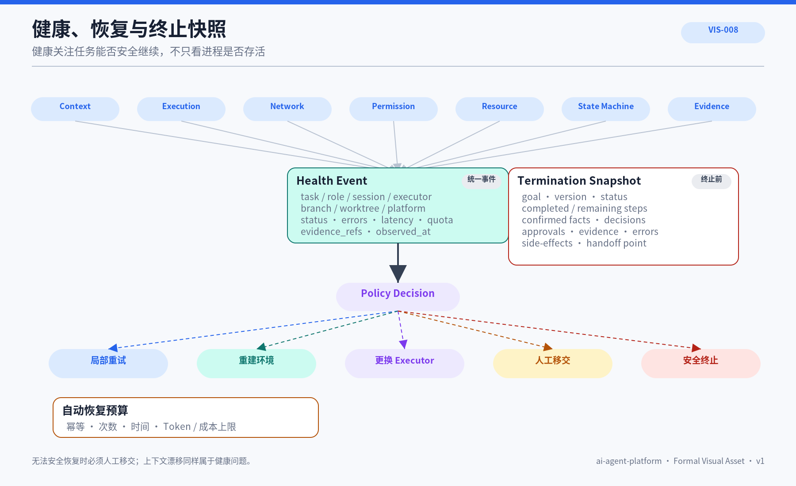

# ARC-014 健康与恢复治理架构

## 1. 文档定位

定义跨 Chat、Codex、Runtime、Provider、网络和 Git 的健康事件、恢复、移交与安全终止。健康关注任务能否安全继续，不只看进程。


## 正式视觉资产



### AI 可读语义镜像

```text
Health Dimensions
context / execution / network / permission / resource / state_machine / evidence
        ↓ Health Event
Policy Decision
  ├→ local retry
  ├→ rebuild environment
  ├→ switch executor
  ├→ human handoff
  └→ safe termination
        ↓
Termination Snapshot
```

自动恢复受幂等性、重试次数、时间、Token、费用和资源预算限制。无法安全恢复时保存目标、版本、进度、事实、决策、批准、证据、错误和副作用，再移交人工。

- Visual Asset ID：`VIS-008`；
- 可编辑源文件：[`./assets/VIS-008-健康恢复与终止快照.svg`](./assets/VIS-008-健康恢复与终止快照.svg)；
- 人类预览：[`./assets/VIS-008-健康恢复与终止快照.png`](./assets/VIS-008-健康恢复与终止快照.png)；
- 事实边界：恢复受幂等、次数、时间和资源预算限制；无法安全恢复时保存 Snapshot 并移交。

## 2. 健康维度

context、execution、network、permission、resource、state_machine 与 evidence health；状态为 healthy、degraded、blocked 或 failed。

## 3. Health Event

事件包含 task_id、role_id、session_id、executor_id、branch、worktree、platform、status、errors、latency、token_usage、quota、observed_at 和 evidence_refs。

## 4. 恢复等级

局部重试、重建环境、更换 Executor、人工移交和安全终止。自动恢复受幂等、次数、时间和成本预算约束。

## 5. 终止快照

Snapshot 保存 task_id、goal、version、status、已完成/剩余步骤、执行点、确认事实、决策、批准、证据、错误和副作用。

## 6. 当前实现边界

当前 Gateway、Runtime 与 Tunnel 有超时、并发、大小限制和部分错误分类；任务级 Health Event、Checkpoint 与自动移交未实现。

## 7. 目标设计边界

目标由平台 Adapter 上报统一事件，中央治理逻辑按 Policy 决定重试、暂停、移交或终止。

## 8. 设计原则

- 健康必须关联 Task
- 自动恢复受预算限制
- 上下文漂移也是健康问题
- 终止前保存 Snapshot
- 无法安全恢复时人工移交

## 9. 关联文档

- [ARC-009 轻量 Task Control](../ARC-009-轻量Task-Control架构/README.md)
- [ARC-010 Execution Lane](../ARC-010-Execution-Lane执行通道模型/README.md)
- [THY-005 可信 Agent 系统](../../03_架构思想与理论/THY-005-可信Agent系统基本原则.md)
