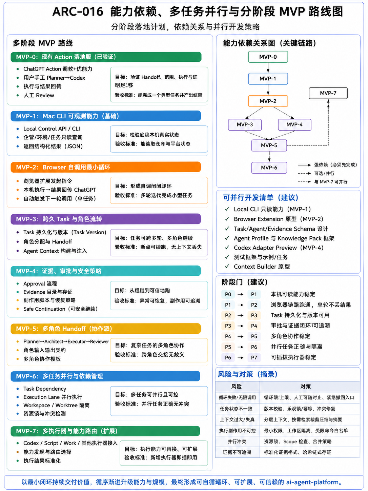

# ARC-016 能力依赖、多任务并行与分阶段 MVP 路线图

> **核心结论**：本文不是普通项目排期，而是 `ARC-001` 的架构演进视图。每个 MVP 只增加一组可独立验证的架构能力；能力升级必须匹配证据等级和阶段门。并行开发不等于并行写执行，真正的多任务并行必须建立在持久 Task、Version、可信 Evidence、隔离 Workspace 和冲突治理之上。

## 1. 文档定位与 ARC-001 的关系

[ARC-001](../ARC-001-ai-agent-platform总体架构/README.md) 回答“平台是什么、怎样运行、谁拥有状态与规则”；本文回答“这些目标能力按什么依赖、并行边界和验收门槛落地”。

```text
ARC-001 Canonical Architecture
        ↓ 选择最小架构增量
MVP Stage
        ↓ Contract / Code / Test / Real Path Evidence
Stage Gate
        ↓ 通过才允许提升状态或扩大副作用
Next MVP / Parallel Track
```

本文中的 `MVP-x` 表示架构成熟阶段，不等同于 Git 分支、Release 版本或产品对外承诺。

## 2. Canonical 分阶段路线图



### AI 可读语义镜像

Visual Asset ID：`VIS-029`，版本：`2`。

### 2.1 强依赖链

```text
MVP-0 已验证窄链路与人工 Handoff
  → MVP-1 Mac Local Control / CLI 可观测
  → MVP-2 Browser 单任务自调用最小闭环
  → MVP-3 持久 Task / Version / Context ─┐
                                          ├→ MVP-5 多角色 Handoff
  → MVP-4 Approval / Evidence / Safety ──┘
                 MVP-3 + MVP-4 + 隔离能力 → MVP-6 多任务并行与依赖
第二个真实执行器 + 稳定 Execution Contract → MVP-7 多执行器与 Capability Routing
```

MVP-3 与 MVP-4 可以在 MVP-2 后以受控方式并行设计和实现，但 MVP-5 需要两者均达到阶段门；MVP-6 还要求 Worktree / Workspace、资源锁和冲突检查成立。MVP-7 的 Adapter Preview 可以较早并行，但“动态路由已实现”只有第二个真实执行器完成真实路径验证后才能声明。

## 3. 当前基线与非声明

### 3.1 已验证基线

```text
Custom GPT
→ Microsoft Dev Tunnels
→ Action Gateway
→ Local Runtime
→ gateway.ping / runtime.status
→ 结构化 TaskResult
```

同时，ChatGPT Planner → 用户转交 → 本地 Codex → Git → ChatGPT Review 的人工工程闭环已多次运行。

### 3.2 当前不能声明

- 没有持久 Task Store、动态 Task Version、Approval Store 或 Evidence Store；
- 没有 Browser Extension 自动触发下一轮；
- 没有统一 Local Control CLI、Context Builder、Lane Registry 或 Executor Router；
- 没有多任务自动并行、自动恢复、自动多角色路由；
- 宿主已有 MCP、Memory、Projects 或 Actions 不等于平台已实现同名能力。

## 4. MVP-0～MVP-7

### MVP-0：现有 Action 窄链路与人工闭环（已验证）

| 项目 | 内容 |
|---|---|
| 目标 | 证明 ChatGPT 能通过受控公网入口调用 Mac Runtime，并由人工 Planner–Executor 流程完成真实交付 |
| 架构增量 | Contracts、Auth、Policy、Gateway、Runtime、Dev Tunnel、Handoff |
| 证据 | 单元/集成测试、Builder Action、真实自然语言调用、Git Commit 与 Push 回读 |
| 验收 | 一个低风险 Capability 和一个仓库任务均能产出结构化结果与证据 |
| 非声明 | 不是自调用循环、持久 Task、自动 Codex Adapter 或生产公网入口 |

### MVP-1：Mac Local Control / CLI 可观测能力（基础）

| 项目 | 内容 |
|---|---|
| 目标 | 建立平台自有、可脚本化、与 Browser/Gateway 共用的本机控制入口 |
| 架构增量 | Local Control Application Service、只读 CLI、Repository / Runtime / Task Snapshot Query |
| 首批能力 | `runtime status`、`repository status`、`capability list`、`task query`（无持久 Task 时明确为空） |
| 验收 | 返回稳定 JSON Schema；错误分类、超时和权限一致；CLI 与 Gateway 不复制业务规则 |
| 非声明 | 只读能力不等于可写执行、Task Store 或自动恢复 |

### MVP-2：Browser 单任务自调用最小闭环

| 项目 | 内容 |
|---|---|
| 目标 | 让一次 Task 的结构化结果可回传 ChatGPT，并在门禁允许时触发下一轮 |
| 架构增量 | Browser Extension / Loop Bridge、conversation/task/turn 关联、Safety UI、轮次与预算上限 |
| 必须字段 | `loop_id`、`task_id`、`turn_no`、`idempotency_key`、`last_result_hash`、`max_turns` |
| 验收 | 多轮完成一个低风险小任务；可暂停、终止、人工接管；重复触发不会重复副作用 |
| 非声明 | 单任务循环不等于持久 Task、多角色或后台无人值守运行 |

### MVP-3：持久 Task、Version、Role 与 Context

| 项目 | 内容 |
|---|---|
| 目标 | 让任务跨轮次、跨会话和跨角色可继续，不依赖单个聊天窗口保存事实 |
| 架构增量 | Task Store、Expected Version、Event Log、Role Assignment、Context Builder、Checkpoint |
| 核心不变量 | 所有写入匹配 Task Version；Context 来源可追踪；Handoff 输入输出和未完成项明确 |
| 验收 | 中断后从 Snapshot 恢复；旧版本写入被拒绝；角色切换不丢目标、范围和证据 |
| 非声明 | 持久化不自动带来可信写执行或多任务并行 |

### MVP-4：Approval、Evidence、Side-effect 与 Safe Continuation

| 项目 | 内容 |
|---|---|
| 目标 | 从“能执行”升级为“副作用可控、完成可验证、失败可安全停止” |
| 架构增量 | Approval、Evidence Case、Side-effect Record、Health Event、Snapshot、Recovery Policy |
| 核心不变量 | Approval 绑定 Task Version / Action / Scope；完成满足 Acceptance + Evidence；恢复前验证幂等与副作用 |
| 验收 | 一个受控写任务可以审批、执行、验证、失败恢复或生成终止快照；全程可追溯 |
| 非声明 | 最小账本不等于企业级审计平台或自动补偿所有外部系统 |

### MVP-5：多角色 Handoff 与协作

| 项目 | 内容 |
|---|---|
| 目标 | 支持 Planner、Architect、Executor、Reviewer 等角色围绕同一 Task Version 有序协作 |
| 架构增量 | Role Contract、Assignment、Handoff Package、Review Decision、Conflict / Replan |
| 前置依赖 | MVP-3 的持久 Task / Context；MVP-4 的证据、审批和完成门禁 |
| 验收 | 角色输入输出无歧义；Reviewer 能基于证据接受、退回或重规划；权限不随角色提示词漂移 |
| 非声明 | 多角色不等于多个模型自动自治或复杂组织模拟 |

### MVP-6：多任务并行、依赖与隔离

| 项目 | 内容 |
|---|---|
| 目标 | 在不破坏事实一致性和 Git 安全的条件下并行执行可独立任务 |
| 架构增量 | Task Dependency、Execution Lane、Lease、Workspace / Worktree、Resource Lock、Integration Task |
| 前置依赖 | 持久 Task、可信 Evidence、写执行门禁、Scope 冲突检测、隔离环境 |
| 验收 | 两个可并行任务在隔离工作区正确执行；依赖任务被阻塞；冲突被检测而非覆盖；汇合可审计 |
| 非声明 | 不做无限并行、共享可写目录、最后写入者获胜或自动无审查合并 |

### MVP-7：多执行器与 Capability Routing（扩展）

| 项目 | 内容 |
|---|---|
| 目标 | 让执行能力可替换、可扩展，并基于 Capability、Environment、Health、Cost 与 Risk 路由 |
| 架构增量 | Executor Port、Adapter Registry、Capability Discovery、Result Normalization、Routing Policy |
| 成立条件 | 至少两个真实执行器在同一 Contract 下完成真实路径和失败测试 |
| 验收 | 新执行器不修改 Task / Evidence 规则即可接入；路由决策可解释、可回退、可人工覆盖 |
| 非声明 | Adapter 文件存在不等于动态路由、远程集群或多设备调度已实现 |

## 5. 能力依赖与并行建设轨道

### 5.1 可并行的是建设工作，不是无约束写执行

| 建设轨道 | 可开始时间 | 主要产物 | 与主链依赖 |
|---|---|---|---|
| Local Control / CLI | MVP-0 后 | Query Contract、CLI、状态读模型 | MVP-1 主链 |
| Browser Extension Prototype | MVP-0 后 | Bridge、Safety UI、Loop Envelope | MVP-2；写能力受 MVP-4 限制 |
| Task / Agent / Evidence Schema | MVP-0 后 | Schema、状态与事件草案 | MVP-3 / 4 前置设计 |
| Context Builder Prototype | MVP-1 后 | Context Query、裁剪与来源追踪 | MVP-3 |
| Codex Adapter Preview | MVP-1 后 | Execution Port、Dry-run / Preview | 正式写入依赖 MVP-4 |
| Test Harness / Simulation | 全程 | Contract Test、Failure Fixture | 所有阶段 |
| Agent Profile / Knowledge Pack | MVP-1 后 | Profile / Pack Schema | MVP-3 / 5；详细规则在 05/06 Review |

### 5.2 多任务并行的架构不变量

只有同时满足以下条件，Task 才可进入并行 Lane：

1. Task Dependency 图无未满足的强依赖；
2. 每个 Task 的 Version、Scope、Acceptance 和 Executor Assignment 已冻结；
3. 可写文件、Git Ref、外部资源和端口无未解决冲突；
4. 一个可写 Lane 对应一个隔离 Workspace / Worktree；
5. Lease、Heartbeat、Idempotency 和资源预算可检查；
6. Result / Evidence 能按 Task 与 Execution 分开归档；
7. 汇合由独立 Integration Task 或明确 Merge Policy 负责；
8. 任一状态漂移、证据缺口或副作用不明时立即降级为串行或人工处理。

## 6. 阶段门（Stage Gates）

| Gate | 必须满足 | 未通过时 |
|---|---|---|
| P0→P1 | 现有 Gateway / Runtime 路径稳定，Contract 与错误分类可复用 | 先修复窄链路，不建设 Browser Loop |
| P1→P2 | Local Control 只读状态可信，Browser 可安全发现本机能力 | 维持人工触发 |
| P2→P3 | 单任务循环可暂停、终止、去重，回传不丢结果 | 禁止持久化复杂状态 |
| P3→P4 | Task Version、Event、Context 和 Snapshot 可恢复 | 写执行继续人工审批 |
| P4→P5 | Approval、Evidence、Side-effect 和 Safe Stop 可追溯 | 不扩大多角色自治 |
| P5→P6 | 多角色 Handoff 稳定，Review 决定可回写 Task | 保持单 Task 执行 |
| P6→P7 | 两任务隔离并行、依赖阻塞和汇合均验证 | 不做动态多执行器路由 |
| MVP-7 接受 | 第二个真实 Executor 接入、结果标准化和失败回退验证 | Adapter 保持实验状态 |

每个 Gate 至少需要：Contract、代码或脚本、测试、真实路径证据、Context / Registry 更新、明确非声明和可恢复点。

## 7. 仓库实现映射与证据矩阵

| 能力 | 当前仓库资产 | 当前证据等级 | 目标阶段 |
|---|---|---|---|
| Contract / Auth / Policy | `packages/contracts`、`auth`、`policy` | 代码 + 测试 | MVP-0 |
| Gateway / Runtime / Dev Tunnel | `apps/action-gateway`、`local-runtime`、`dev-tunnel` | 集成 + 真实路径 | MVP-0 |
| Planner–Executor Handoff | `skills/planner-executor-handoff` | 多轮真实仓库交付 | MVP-0 / 3 / 5 |
| Context / Registry / Knowledge | `context`、`docs`、`platform-registry` | 运营中资产与校验 | MVP-0，后续持续增强 |
| Local Control CLI | 无正式实现 | 目标设计 | MVP-1 |
| Browser Loop | 无正式实现 | 目标设计 | MVP-2 |
| Task Store / Context Builder | 无正式实现 | 目标设计 | MVP-3 |
| Approval / Evidence / Recovery | 主要为流程与文档 | 人工机制 `partial` | MVP-4 |
| 多角色 Runtime | 仅人工协作 | 实践 `partial` | MVP-5 |
| Lane / Worktree 自动并行 | 仅 Git 规则和人工隔离 | 规则 `partial` | MVP-6 |
| Executor Adapter / Routing | 无正式 Router | 人工 Handoff `partial` | MVP-7 |

## 8. 风险、停止与降级

| 风险 | 早期信号 | 对策 / 降级 |
|---|---|---|
| 无限循环或重复副作用 | turn 超限、相同 hash、幂等重复 | `max_turns`、预算、人工接管、停止自动触发 |
| Task 状态不一致 | Version 冲突、事件缺口 | 乐观锁、Snapshot、拒绝旧写入、回到人工 Review |
| Context 过大或失真 | Token 超预算、来源不明 | 分层检索、裁剪、摘要、来源引用、停止继续注入 |
| 写执行不可控 | Scope 漂移、命令超白名单 | 最小权限、Approval、隔离、Preview、降级只读 |
| 并行冲突 | 同文件/Ref/资源争用 | 资源锁、Scope 检查、串行化、Integration Task |
| Evidence 不足 | 无测试、Diff、Commit、回读 | 不允许完成，返回 `awaiting_evidence` |
| Provider / Host 漂移 | API、页面、模型行为变化 | Adapter 隔离、Capability Probe、人工回退 |
| 过早平台化 | 无真实调用方却新增通用层 | 保留占位，不物化代码和目录 |

## 9. 与后续文档和上层产品的接口

- MVP-3 的 Context Builder 由 `05_上下文与知识系统` 提供知识分层、Registry、Token 和 Drift 规则；
- MVP-3 / 5 的 Agent Profile、Skill 和 Knowledge Pack 由 `06_智能体资产体系` 深化；
- MVP-3～6 的 Handoff、Approval、Recovery、并行与项目治理由 `07_工作流与项目治理` 形成工作流；
- 每个阶段的真实验证进入 `08_实验与复盘`，不在 ARC 中伪造实现证据；
- 稳定 Demo、证据和设计权衡进入 `09_作品集`；
- AI 视频工作流只在 MVP-4 以后具备可信写执行基础时进入纵向产品验证；
- 手机模型和第二远程 Executor 只作为 MVP-7 的真实 Adapter 候选。

## 10. 最近落点

在当前知识 Review 完成且进入实现阶段后，最合理的首个工程增量是：

```text
MVP-1：Mac Local Control / CLI 只读可观测
```

原因：它不扩大写副作用，却为 Browser、Task、Context、Executor 和自动化测试提供统一入口；同时能把“平台实际状态”从聊天推测转为结构化查询。只有 MVP-1 通过阶段门，才进入 Browser 自调用最小闭环。
