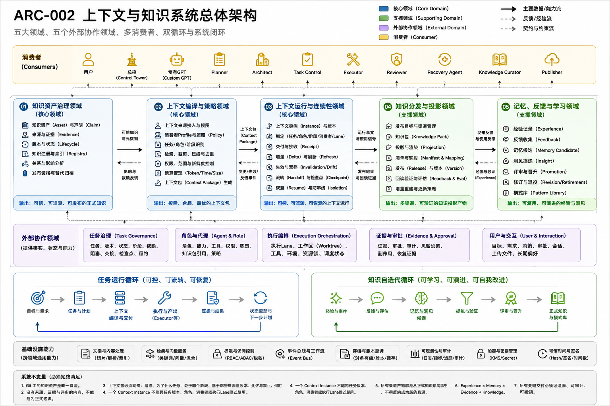

# ARC-002 上下文与知识系统总体架构

> **核心结论**：`ai-agent-platform` 的上下文与知识系统不是一个“大知识库”，而是一套把长期可信知识、动态任务事实、角色职责、运行环境、证据和反馈，按消费者、Task、Role 与 Phase 编译为可执行 Context Package，并在任务生命周期中受控流转、恢复和迭代的系统。

## 正式架构图



### AI 可读语义镜像

Visual Asset ID：`VIS-030`。

- 顶部列出用户、总控、专有 GPT、Planner、Architect、Task Control、Executor、Reviewer、Recovery Agent、Knowledge Curator 与 Publisher 等消费者；消费者是上下文视图接收者，不拥有领域状态。
- 内部五领域依次为知识资产治理、上下文编译与策略、上下文运行与连续性、知识分发与投影、记忆反馈与学习；前三者为核心领域，后两者为支撑领域。
- 五个外部协作领域提供事实、状态与能力：Task Governance、Agent & Role、Execution Orchestration、Evidence & Approval、User & Interaction。
- 任务运行循环为“目标与需求 → 任务与计划 → 上下文编译与交付 → 执行与产出 → 证据与结果 → 状态更新与下一步计划”。
- 知识自迭代循环为“经历与事件 → 反馈与评估 → 记忆与洞见候选 → 提炼与验证 → 评审与晋升 → 正式知识与模式库”。
- 基础设施提供文档处理、检索、权限、事件、存储、可观测性、密钥管理和可信时间；所有关键交付必须可追溯、可审计、可撤销。


## 1. 文档定位

本文是 `05_上下文与知识系统` 的 Canonical 总览，回答：

> 平台如何组织知识、上下文、记忆、状态、证据和发布，使总控、专有 GPT、Planner、Architect、Executor、Reviewer 等消费者获得正确且边界清晰的信息？

本文负责：

- 定义五个内部领域及其状态所有权；
- 定义与 Task、Agent、Execution、Evidence、User 五个外部领域的协作；
- 定义多消费者 Context Package 的总模型；
- 定义任务运行循环与知识自迭代循环；
- 分开当前实现、人工机制、目标设计和未来占位。

本文不展开：

- 每个知识资产的治理细节，见 `ARC-005`；
- Context Package 的选择、权限和编译细节，见 `ARC-006`；
- Context Instance 的版本、Handoff 和恢复，见 `KNO-011`；
- Feishu、Custom GPT Knowledge、Knowledge Pack 和 RAG，见 `KNO-006`；
- Memory、反馈、洞见和知识晋升，见 `KNO-009`。

## 2. 为什么它是平台的核心基础

MVP-0 证明了 ChatGPT 可以通过受控链路调用本机 Runtime，并通过人工 Planner–Executor Handoff 完成真实交付。但要让平台进一步具备：

- 可控；
- 可流转；
- 可恢复；
- 可并行；
- 可审计；
- 可自迭代；

仅有 Gateway、工具调用和 Prompt 不够。平台必须知道：

1. 当前消费者是谁；
2. 当前 Task 和 Task Version 是什么；
3. 当前角色和阶段是什么；
4. 哪些事实可信、来自哪个版本；
5. 哪些信息允许被看见和使用；
6. 哪些状态必须实时刷新；
7. 执行结果怎样回到 Task、Evidence 和下一轮 Context；
8. 哪些经验可以晋升为长期知识，哪些必须被拒绝。

因此，上下文与知识系统不是文档辅助模块，而是 Task Control、Agent Governance、Execution Orchestration 和 Evidence & Safety 之间的语义基础设施。

## 3. 术语边界

| 概念 | 本文含义 | 不等于 |
|---|---|---|
| DDD 限界上下文（Bounded Context） | 状态、规则和模型的业务所有权边界 | LLM 输入窗口 |
| 知识资产（Knowledge Asset） | 长期、可复用、可审阅、可版本化的正式信息 | 本次 Prompt |
| 项目 Context | `context/**` 中短、小、当前、可信的共享启动事实 | 完整知识库 |
| Task State | 某个任务的动态状态、版本、依赖和阶段 | 长期知识 |
| Evidence | 对执行结果、状态和副作用的证明 | 对事实含义的解释性知识 |
| Memory | 经允许保留的用户偏好、Agent 经验或候选记忆 | 项目真源或 Task Store |
| Context Package | 面向一个消费者、一个 Task Version 和一个 Phase 临时编译的输入包 | 知识库副本 |
| Session Context | 当前 Chat、Codex 或 Work 会话的局部历史 | 可跨会话持续的 Task |
| Knowledge Pack | 从正式知识派生的版本化角色知识产品 | 新真源 |
| Feishu / GPT Knowledge / RAG | 不同消费渠道或派生形态 | Git 正式知识 |

必须保持：

```text
DDD Bounded Context ≠ Runtime Context
Knowledge Base ≠ Context Package
Session ≠ Task
Memory ≠ Task State
Evidence ≠ Knowledge
Projection ≠ Source of Truth
```

## 4. 系统边界

### 4.1 上游事实与协作领域

上下文与知识系统不拥有所有平台事实。它通过明确契约读取五个外部领域：

| 外部领域 | 拥有的事实 | 提供给本系统的视图 |
|---|---|---|
| User & Interaction | 用户目标、明确要求、审批、Session、上传输入 | User Goal View、Decision View、Session View |
| Task Governance | Task、Version、状态、依赖、阶段、Checkpoint | Task Context View、Handoff View |
| Agent & Role | Role、Agent Profile、职责、能力、权限 | Consumer Profile、Role Policy View |
| Execution Orchestration | Runtime、Execution Lane、Executor、Workspace、Capability | Environment Snapshot、Capability Snapshot、Lane View |
| Evidence & Approval | Evidence、Approval、Side Effect、Audit、Recovery Evidence | Evidence View、Approval View、Recovery View |

本系统不得反向夺取这些领域的状态所有权。

### 4.2 下游消费者

Context Package 的主要消费者包括：

- 用户 / 项目负责人；
- ChatGPT 总控；
- 专有 Custom GPT；
- Planner；
- Architect；
- Task Control；
- Executor / Codex / Work / Script；
- Reviewer；
- Recovery Agent；
- Knowledge Curator；
- Publisher / Knowledge Pack Builder / RAG Indexer。

消费者不是领域边界。它们是同一套上下文能力的不同投影视图。

## 5. 五个内部领域

### 5.1 知识资产治理（Knowledge Asset Governance）

负责平台“知道什么以及为什么可信”。

拥有：

- Knowledge Asset；
- Asset Version；
- Source Reference；
- Lifecycle；
- Evidence Level；
- Asset Relation；
- Registry Entry；
- Publication Eligibility；
- Supersession / Archive。

核心不变量：

> 没有来源、版本、状态和 Review 的内容，不能被声明为正式知识。

详细见 [ARC-005](../ARC-005-知识资产治理单一真源与生命周期架构/README.md)。

### 5.2 上下文编译与策略（Context Compilation & Policy）

负责“在当前场景下应该把什么交给谁”。

拥有：

- Context Request；
- Consumer Context Profile；
- Context Plan；
- Context Policy；
- Context Template；
- Context Package；
- Context Item；
- Source Snapshot；
- Policy Decision；
- Context Budget。

核心不变量：

> 每个 Context Package 都必须明确 Consumer、Task、Role、Phase、来源版本、权限、失效条件和输出契约。

详细见 [ARC-006](../ARC-006-多消费者上下文编译与策略架构/README.md)。

### 5.3 上下文运行与连续性（Context Runtime & Continuity）

负责 Context Package 进入真实任务后的绑定、交付、刷新、流转和恢复。

拥有：

- Context Instance；
- Context Version；
- Consumer Binding；
- Delivery Receipt；
- Context Delta；
- Refresh Trigger；
- Invalidation Record；
- Checkpoint Binding；
- Resume Token；
- Context Usage Record。

核心不变量：

> 一个 Context Instance 不能跨 Task Version、Role、Consumer 或 Execution Lane 隐式复用。

详细见 [KNO-011](../KNO-011-上下文运行流转与恢复机制/README.md)。

### 5.4 知识分发与投影（Knowledge Distribution & Projection）

负责把已经批准的 Git 正式知识派生为不同知识产品和渠道。

拥有：

- Publication Target；
- Channel Profile；
- Knowledge Pack；
- Publication Manifest；
- Projection Record；
- Publication Version；
- Readback Evidence；
- Distribution Policy。

渠道包括：

- Feishu；
- Custom GPT Knowledge；
- Common Knowledge Pack；
- Role Knowledge Pack；
- 外部 Knowledge Service / RAG；
- Agent Runtime 按需知识。

核心不变量：

> 所有渠道产物都是可重建派生物，不能反向成为新的正式知识源。

详细见 [KNO-006](../KNO-006-知识分发Knowledge-Pack与多渠道投影/README.md)。

### 5.5 记忆、反馈与学习（Memory, Feedback & Learning）

负责把运行经历和反馈转化为候选经验，并在防污染门禁下晋升为记忆、洞见或正式知识。

拥有：

- Experience Record；
- Feedback Record；
- Memory Candidate；
- Failure / Success Pattern；
- Insight Candidate；
- Distillation Job；
- Promotion Decision；
- Retirement Decision。

核心不变量：

```text
Experience ≠ Memory
Memory ≠ Evidence
Evidence ≠ Knowledge
```

详细见 [KNO-009](../KNO-009-记忆反馈与知识自迭代机制/README.md)。

## 6. Context Package 总模型

Context Package 不是把知识库复制给模型，而是一次带来源、权限、预算和有效期的编译结果。

```text
Knowledge Assets
Project Context
User Goal
Task State / Handoff
Role / Agent Profile
Execution Environment
Capability Snapshot
Evidence / Approval
Memory / Session
        ↓
Context Compilation & Policy
        ↓
Context Package
        ↓
Context Runtime & Continuity
        ↓
Controller / GPT / Planner / Executor / Reviewer
```

最小元数据：

```text
context_id
consumer_id / consumer_type
role_id
agent_profile_version
task_id / task_version
phase
goal
scope / out_of_scope
permissions / approval_refs
source_refs / source_versions
knowledge_pack_refs
task_state_ref / handoff_ref / evidence_refs
environment_snapshot / capability_snapshot
constraints
output_contract
acceptance_criteria
evidence_requirements
token_budget / time_budget
generated_at / expires_at
freshness_policy / sensitivity_level
failure_policy / return_channel
provenance
```

## 7. 消费者视图

| 消费者 | 必须获得 | 应被裁剪或隐藏 |
|---|---|---|
| 用户 / 项目负责人 | 目标、进度、风险、决策、结果、下一步 | 全量底层日志和无关实现噪声 |
| ChatGPT 总控 | 项目、架构、Task 图、角色、能力、状态和证据摘要 | 无关文件原文和全部运行日志 |
| 专有 GPT | 通用基础包、角色包、当前 Task View、权限、输出契约 | 全仓知识、其他角色私有信息、Task Store 所有权 |
| Planner | 用户目标、架构、Task、依赖、能力、约束、历史决策 | Executor 的全部环境细节 |
| Architect | 架构、DDD、当前实现映射、约束、ADR、风险 | 无关 Session 和个人 Memory |
| Executor | 精确任务合同、Scope、环境、Artifact、验收、Git Policy | 不相关项目历史和宏观知识 |
| Reviewer | 原始目标、Diff、测试、Evidence、边界、风险、审批条件 | 仅执行者自述、无证据结论 |
| Recovery Agent | Task Snapshot、不可重复副作用、最后安全点、恢复规则 | 旧 Session 的全部历史 |
| Publisher / Builder | 已批准资产、Manifest、渠道规则、来源 Commit、回读要求 | 修改正式正文的权力 |

## 8. 两个闭环

### 8.1 任务运行循环

```text
User Goal
→ Task / Version
→ Context Request
→ Context Package
→ Consumer / Executor
→ Result / Event / Evidence
→ Task Update / Review Decision
→ Context Refresh / Handoff / Recovery
```

它解决：

- 可控；
- 可流转；
- 可恢复；
- 可暂停；
- 可审计；
- 后续多任务并行。

### 8.2 知识自迭代循环

```text
Experience / Result / Feedback
→ Evidence and Candidate Classification
→ Distillation
→ Human Review
→ Memory / Insight / Knowledge Promotion
→ Registry and Distribution
→ New Context Package
→ New Execution
```

它解决：

- 经验复用；
- 错误防复发；
- 角色能力进化；
- 知识持续修订；
- 防止模型输出和一次事件污染真源。

## 9. 状态和数据所有权

| 信息 | 唯一 Owner | 本系统的使用方式 |
|---|---|---|
| 项目长期知识 | Knowledge Asset Governance | 查询、引用、发布 |
| 项目当前共享事实 | Git `context/**`，语义由总控 Planner 维护 | 作为高优先级 Context Source |
| Task / Version / Stage | Task Governance | 读取 Task Context View |
| Role / Agent Profile | Agent & Role | 读取 Consumer Profile |
| Runtime / Git / Tool 状态 | Execution Orchestration | 执行前实时 Snapshot |
| Evidence / Approval | Evidence & Approval | 引用、裁剪、验证 |
| Session 历史 | User & Interaction / Host Session | 临时使用，不作为 Task 真源 |
| 用户 Memory | 用户个性化系统 | 低风险偏好视图，不作为授权 |
| Context Package | Context Compilation & Policy | 编译并签发 |
| Context Instance | Context Runtime & Continuity | 绑定、版本、交付和恢复 |
| Knowledge Pack / Projection | Distribution & Projection | 从 Git 派生并验证 |

## 10. 当前实现、人工机制与目标设计

### 10.1 当前已实现

- Git 是代码和正式知识唯一真源；
- `context/**` 提供项目、架构、状态、路线图和知识策略；
- `docs/knowledge/**`、`docs/technical/**`、ADR 和 Registry 已建立；
- Platform Registry 管理稳定 ID、关系、生命周期和发布信息；
- 六个活跃 Skill 已形成语义规划、文档编写、治理和执行交接链；
- Planner–Executor Handoff 支持 Context 精确写授权和冻结 Artifact；
- Feishu 采用 Git → Feishu 单向覆盖投影；
- 正式图片采用 Document Bundle 和 AI 可读语义镜像。

### 10.2 当前人工机制

- 总控 Chat 恢复多源事实并生成 Context / 文档完整替换；
- 用户确认重要目标、架构、阶段和治理变化；
- 本地 Codex 按冻结 Contract 机械执行；
- Context 选择、Token 裁剪、影响分析和知识晋升仍以人工 Review 为主；
- Task、Checkpoint、Evidence 和 Recovery 主要通过结构化交接与 Git 证据模拟。

### 10.3 目标设计

- 通用 Context Request / Context Package Schema；
- 持久 Task Store 与 Task Version；
- Context Builder 和 Context Runtime；
- Role / Agent Profile Publisher；
- Knowledge Pack Builder；
- 外部 Knowledge Service / RAG；
- Evidence / Approval / Side-effect / Recovery Store；
- Context Health、Drift、Refresh 和 Usage Feedback；
- 自动候选影响分析，但仍保留人工授权。

### 10.4 正式占位

以下能力在本章占位，但当前不宣称已实现：

- Browser 自动自调用；
- 多角色 Runtime；
- 多 Task 并行 Context Isolation；
- 多执行器动态路由；
- 自动长期 Memory；
- 自动知识晋升；
- 自动跨渠道回写；
- 企业级权限和审计平台。

## 11. 与平台架构和后续章节的关系

- [ARC-001 总体架构与执行路径](../../04_平台架构/ARC-001-ai-agent-platform总体架构/README.md) 定义顶层 `Context & Knowledge` Bounded Context；本文给出其内部领域结构；
- [ARC-016](../../04_平台架构/ARC-016-能力依赖多任务并行与分阶段MVP路线图/README.md) 将 Context Builder、持久 Task 和 Recovery 分别放入 MVP-3 / 4 / 5 / 6；
- `06_智能体资产体系` 承接 Agent Profile、Role、Skill 和 Knowledge Pack 的角色资产化；
- `07_工作流与项目治理` 承接 Task、Handoff、Approval、并行和执行治理；
- `08_实验与复盘` 提供真实运行证据和学习输入；
- `09_作品集` 消费稳定架构、Demo 和可验证证据。

## 12. 架构不变量

1. Git 是正式知识唯一真源；
2. Task 是动态任务事实来源；
3. Session 不能替代 Task；
4. Memory 不能替代项目 Context 或用户审批；
5. Evidence 不能自动晋升为 Knowledge；
6. Context Builder 只选择和编译，不成为知识库或 Task Store；
7. Context Instance 绑定 Task Version、Consumer、Role、Phase 和 Lane；
8. 不同消费者获得不同视图，而不是共享全量上下文；
9. 所有动态来源必须有版本、新鲜度和失效策略；
10. 所有知识渠道都是可重建派生物；
11. 经验只有经过证据、提炼和人工 Review 才能进入正式知识；
12. 当前实现、人工机制、目标设计和未来占位必须始终分开。

## 13. 验收标准

本文体系成立时，应能明确回答：

- 上下文是谁的上下文；
- 每类消费者需要什么、不能得到什么；
- 每项事实由谁拥有；
- Context Package 来自哪些来源；
- 上下文怎样版本化、流转、失效和恢复；
- Feishu、Custom GPT Knowledge、Pack、RAG 各自解决什么问题；
- Memory、Evidence、Knowledge 如何防止串线和污染；
- 当前平台真实实现到哪里，下一阶段需要什么证据。
