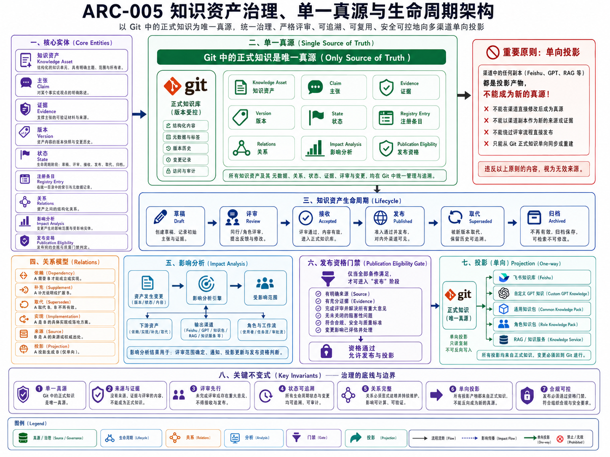

# ARC-005 知识资产治理、单一真源与生命周期架构

> **核心结论**：平台可以拥有很多知识副本、索引、阅读端和角色知识产品，但一个正式事实只能有一个生产入口。`ai-agent-platform` 以 Git 为唯一正式知识源，通过稳定 Asset ID、来源、版本、证据、Review、Registry 关系和生命周期，保证知识可追溯、可影响分析、可发布、可修订和可退役。

## 正式架构图



### AI 可读语义镜像

Visual Asset ID：`VIS-010`。

- 核心实体包括 Knowledge Asset、Claim、Evidence、Version、State、Registry Entry、Relations、Impact Analysis 与 Publication Eligibility。
- Git 中的正式知识是唯一真源；资产正文、元数据、关系、状态、证据、Review 与变更均在 Git 中治理和追溯。
- 生命周期为 `Draft → Review → Accepted → Published → Superseded → Archived`，每次晋升都受来源、证据、评审和影响处理约束。
- 关系模型包含依赖、补充、取代、实现、来源和投影；关系用于检索、影响分析和替代追踪。
- 资产变更必须识别下游文档、输出渠道和角色工作流，再决定 Review、重建与发布资格。
- 只有通过发布资格门禁的版本才能向 Feishu、Custom GPT Knowledge、Common / Role Knowledge Pack 和 RAG 投影；所有渠道均为单向派生物，不得反向成为真源。


## 1. 文档定位

本文回答：

> 平台怎样维护可信、可审计、可演进的正式知识资产，并防止 Chat、Feishu、Memory、RAG 和运行日志成为相互冲突的“第二真源”？

本文负责 `Knowledge Asset Governance` 领域，包括：

- 单一真源；
- Knowledge Asset 与 Version；
- 来源和证据；
- 生命周期与 Review；
- Registry 身份和关系；
- 变更影响分析；
- 发布资格；
- superseded、archive 和历史追溯。

渠道构建与发布细节由 [KNO-006](../KNO-006-知识分发Knowledge-Pack与多渠道投影/README.md) 负责；Context Package 选择由 [ARC-006](../ARC-006-多消费者上下文编译与策略架构/README.md) 负责。

## 2. 架构驱动因素

知识治理必须同时满足：

- 正式事实可以 Diff、Review、回滚和绑定 Commit；
- 新 Chat、新 Agent、新设备不依赖历史会话恢复项目；
- 当前事实、目标设计、实验观察、推断和历史观点不混写；
- 资产移动或重命名后身份不丢失；
- 关系可以支持检索、影响分析和发布重建；
- 派生渠道被删除后可以从 Git 恢复；
- 私人信息、Secret 和未经授权内容不能进入正式知识；
- 模型生成内容不能未经 Review 自动成为事实；
- 知识变化能触发必要的 Context、Pack、测试和发布 Review。

## 3. 单一真源模型

```text
Raw Source / Conversation / Research / Evidence
                    ↓ 分类、核验、综合
              Git Draft / Candidate
                    ↓ Human Review
             Accepted Git Knowledge
                    ↓ Registry / Release
     ┌──────────────┼───────────────┐
     ▼              ▼               ▼
 Feishu        Knowledge Pack       RAG Index
阅读投影        角色知识产品          检索派生物
```

### 3.1 Git 是正式生产入口

正式资产只有在 Git 中物化，并经过适用的 Review、校验、Commit 和 Push 后，才具有正式项目地位。

Git 真源包括：

- `context/**`：短、小、当前、可信的项目共享启动事实；
- `docs/knowledge/**`：长期解释性知识与 Feishu 发布源；
- `docs/technical/**`：技术方案、治理、调研、Runbook、迁移和实验评估；
- `docs/adr/**`：已接受的重要决策与后果；
- `platform-registry/**`：资产、关系、生命周期、实现、发布和迁移的机器事实；
- `skills/**`：可复用方法、契约和工作流；
- Code / Test / Schema：实现事实和验证证据。

### 3.2 其他系统不是第二真源

| 系统 | 正确定位 | 禁止承担 |
|---|---|---|
| Feishu | 面向人的阅读投影 | 正式知识的并行编辑端 |
| Custom GPT Knowledge | 某个 GPT 的稳定知识副本 | 项目状态和 Task Store |
| Knowledge Pack | 带版本和 Manifest 的角色知识产品 | 替代 Git 原文 |
| RAG / Knowledge Service | 权限化检索和实时共享 | 无来源的事实裁决 |
| Chat / Session | 临时沟通和推理环境 | 长期知识和任务数据库 |
| Memory | 低风险偏好或候选经验 | 项目事实、审批和权限 |
| Task / Event / Evidence Store | 运行时事实与证明 | 长期解释性知识 |

### 3.3 Feishu 原生内容的纠偏

旧模型曾允许“Feishu 原生内容层”保存临时讨论并晋升为正式知识。当前正式模型不再把 Feishu 设为独立知识层。

飞书中的临时讨论、批注或外部资料只能被视为：

```text
External / Human Source Candidate
→ 进入受控综合任务
→ 形成 Git Draft
→ Human Review
→ 可能晋升为正式知识
```

它不能直接成为 Canonical Asset，也不能通过反向同步覆盖 Git。

## 4. Knowledge Asset 聚合

### 4.1 核心对象

| 对象 | 责任 |
|---|---|
| `KnowledgeAsset` | 稳定知识身份、类型、Canonical 路径和当前状态 |
| `KnowledgeVersion` | 某一 Commit 或 Release 下的知识版本 |
| `SourceReference` | 原始文档、会话范围、代码、测试、ADR、外部来源 |
| `ClaimSet` | 资产拥有的事实、决策、目标设计、推断和非声明 |
| `ReviewRecord` | 谁在何时基于什么证据接受、退回或修订 |
| `EvidenceReference` | 支撑当前声明的代码、测试、实验、Commit 或真实路径证据 |
| `KnowledgeRelation` | 与其他资产的受控语义关系 |
| `PublicationEligibility` | 当前版本是否允许进入外部渠道 |
| `SupersessionRecord` | 被什么资产替代、哪些内容仍保留历史价值 |

### 4.2 最小资产字段

```text
asset_id
asset_type
title
canonical_path
status
evidence_level
owner
source_refs
current_version
relations
publication_status
sensitivity
superseded_by
created_at / reviewed_at / updated_at
```

正文不需要复制全部机器元数据。稳定状态、关系和路径由 Platform Registry 维护，正文专注于人的理解。

## 5. Claim 和证据纪律

同一篇文档中的主要声明必须区分：

| Claim 类型 | 含义 | 示例 |
|---|---|---|
| Verified Fact | 已由代码、测试、Git 或真实路径证明 | Gateway / Runtime 窄链路已验证 |
| Accepted Decision | 用户或正式治理已经确认 | Git 是唯一正式知识源 |
| Current Status | 当前阶段事实，可能较快变化 | 当前进入 `05` 人工 Review |
| Target Design | 目标架构，尚未完整实现 | 通用 Context Builder |
| Historical / Superseded | 过去曾成立或曾考虑 | Cloudflare Edge 路线、Feishu 原生层 |
| Engineering Inference | 基于证据的工程判断 | Context 连续性是多角色恢复基础 |
| Open Hypothesis | 仍需实验验证 | 某种自动压缩策略是否有效 |
| Non-claim | 明确不能宣称的能力 | 未实现自动 RAG 和多任务 Runtime |

证据等级不能被漂亮文字替代。建议使用：

```text
hypothesis
→ observed
→ verified
→ accepted / decided
→ implemented
→ validated
→ operational evidence
```

知识状态和证据等级是不同维度：一个已接受的设计不等于已实现，一个已实现的代码不等于真实用户路径已验证。

## 6. 生命周期

### 6.1 标准生命周期

```text
Capture / Raw Source
→ Classified Source
→ Synthesis Candidate
→ Draft
→ Human Review
→ Accepted
→ Implemented / Referenced
→ Validated
→ Published / Distributed
→ Revised
→ Superseded / Archived / Retired
```

### 6.2 生命周期门禁

| 晋升 | 必须具备 |
|---|---|
| Source → Candidate | 来源范围、隐私边界、Claim 分类 |
| Candidate → Draft | Canonical 问题、稳定 ID、目标路径、冲突记录 |
| Draft → Accepted | 人工 Review、来源、当前/目标边界、链接和敏感信息检查 |
| Accepted → Implemented | 对应代码、Skill、流程或运行机制的实现引用 |
| Implemented → Validated | 测试、集成、真实路径或可复现实验证据 |
| Validated → Published | 固定 Git 版本、Manifest、渠道资格、独立发布授权 |
| Any → Superseded | 明确替代资产、关系和历史保留策略 |
| Any → Archived | 不再作为主入口但仍需追溯的完整历史资产 |

### 6.3 禁止自动晋升

以下输入不能直接成为正式知识：

- 单次 Chat 输出；
- Executor 自述；
- 未核验日志；
- 一次事件；
- 用户未确认的推断；
- RAG 命中片段；
- Feishu 临时页面；
- Memory 条目；
- 未提交的本地文件；
- 无来源的总结。

## 7. Platform Registry 与关系模型

### 7.1 Registry 职责

Platform Registry 保存：

- 稳定 ID；
- Canonical Path；
- 资产类型；
- 生命周期；
- Evidence Level；
- Materialized 状态；
- Release / Migration / Projection；
- 资产关系；
- Visual Asset 和语义镜像关系。

它不是第二套正文，也不负责解释完整架构。

### 7.2 受控关系

建议保留明确且可验证的关系词：

- `depends_on`
- `implements`
- `explains`
- `governed_by`
- `validated_by`
- `derived_from`
- `uses_skill`
- `loads_knowledge`
- `projected_to`
- `published_as`
- `supersedes`
- `merged_into`
- `related_to`

每条关系必须有合法端点和清晰方向。`related_to` 只能在没有更精确语义时使用。

### 7.3 稳定 ID

- 移动和重命名保持原 ID；
- 合并后保留主资产 ID；
- 被合并 ID 不重用；
- 旧 ID 通过 `superseded_by` 或 `merged_into` 指向新 Canonical 资产；
- 历史链接应可通过归档或 Registry 追溯。

## 8. 变更影响分析

知识变化不是单文件事件。影响分析从发生变化的 Asset ID 出发，沿关系图生成候选 Review 范围。

### 8.1 输入

```text
changed_asset_id
old_version / new_version
change_type
lifecycle_change
relation_graph
implementation_mapping
publication_mapping
risk_level
```

### 8.2 常见传播

| 变化 | 候选影响 |
|---|---|
| Architecture | Context、Capability Map、Agent Profile、Workflow、Portfolio |
| Contract / Schema | 实现、测试、Adapter、Runbook、调用文档 |
| Knowledge | Knowledge Pack、Custom GPT Knowledge、RAG、Feishu |
| Skill | Agent、Workflow、Eval、README、Registry |
| Context | 新任务启动、Handoff、Review 和发布计划 |
| Evidence / Status | 当前声明、Release、Migration、Portfolio 证据 |

### 8.3 输出

```text
directly_changed
affected_assets
required_reviews
required_tests
context_files_to_review
packages_to_rebuild
projections_to_update
blocked_by
risk_level
uncertain_relations
```

影响分析只生成候选范围，不自动授权写入、重建或发布。

## 9. Publication Eligibility

知识资产允许发布或进入 Pack 前，必须满足：

- 当前版本已 Commit、Push 并可定位；
- 生命周期状态允许；
- 来源、证据和敏感信息已检查；
- 正文与本地资源完整；
- 图片具有 AI 可读语义镜像；
- 无失效相对链接；
- 无未解决的 Canonical 冲突；
- Manifest 可以锁定版本、路径和 Hash；
- 当前渠道具有独立授权。

不同渠道可以有不同 Eligibility，但都不能放松正式知识本身的真实性要求。

## 10. Superseded、Archive 与历史候选

### 10.1 Superseded

某资产的 Canonical 问题已经由新资产接管时：

- 原 ID 不删除、不重用；
- Registry 标记 `superseded`；
- 指向替代资产；
- 主导航移除；
- 旧正文迁入历史 Document Bundle；
- 下游链接逐步迁移。

### 10.2 Archive

Archive 用于保留：

- 旧架构；
- 被否决方案；
- 历史图片；
- 仍可能在未来重新综合的观点；
- 迁移和事故证据。

Archive 不是垃圾桶。每个归档包应说明：

- 原来源；
- 为什么退出主线；
- 当前替代资产；
- 哪些观点仍有价值；
- 什么条件下可以重新评估。

## 11. 隐私、安全和来源边界

正式知识不得包含：

- Secret、Token、私钥和认证材料；
- 不必要的私人信息；
- 精确本地隐私路径；
- 未经允许的第三方版权内容；
- 未经用户确认的个人推断；
- 对当前外部产品的无日期陈旧结论。

原始 Chat、附件和日志进入综合前必须：

```text
Scope Freeze
→ Claim Classification
→ Privacy / Copyright Gate
→ Truth Reconciliation
→ Target Asset Decision
→ Human Review
```

## 12. 当前实现与目标设计

### 12.1 当前已实现

- Git 唯一真源；
- 正式知识、技术文档、ADR、Context 和 Skills 的目录边界；
- Platform Registry 与受控关系；
- Engineering Insight Registry；
- Document Bundle、Visual Asset 和语义镜像规则；
- `project-knowledge-synthesis` 的多源综合候选能力；
- `project-knowledge-governance` 的落位、生命周期和发布约束；
- 目录级人工综合、superseded 和归档实践；
- 确定性 Validator 与仓库检查。

### 12.2 目标设计

- 自动只读 Impact Analyzer；
- Asset 级变更计划；
- Publication Eligibility 自动候选检查；
- Knowledge Pack / RAG / GPT Knowledge 依赖图；
- 来源级行号和 Claim 追踪；
- 自动 Drift 候选报告；
- 生命周期和发布状态的统一查询 API。

所有目标能力仍需要人工 Review 和写入授权，不能自动晋升正式知识。

## 13. 架构不变量

1. 一个正式事实只有一个生产入口；
2. Git 中未物化、未 Review 的内容不是正式知识；
3. Registry 管理机器状态，正文管理人的理解；
4. 资产身份不随路径移动而变化；
5. 历史 ID 不重用；
6. Evidence 支撑 Claim，但不自动成为 Knowledge；
7. 发布渠道可以删除并从 Git 重建；
8. Feishu、GPT Knowledge、Pack 和 RAG 禁止反向成为真源；
9. 影响分析生成候选范围，不生成写权限；
10. Superseded 资产保留追溯和替代关系；
11. 私人和敏感信息默认不进入 Public Git；
12. 当前事实、目标设计和历史观点必须分开。

## 14. 验收标准

- 每个 Canonical 知识问题只有一个主资产；
- 每个正式资产有稳定 ID、路径、状态、来源和版本；
- 每个主要 Claim 可以定位到证据或明确标记为设计/推断；
- 合并和替代不丢失历史；
- 关系图可以支持检索和影响分析；
- 外部渠道删除后可以从 Git 重建；
- 未经 Review 的 Chat、Memory、日志或模型输出不会自动晋升；
- 下游 Context、Pack 和发布可以定位到固定 Source Commit。
