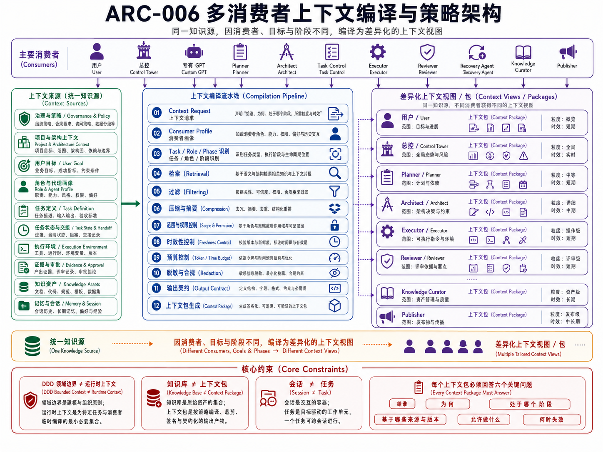

# ARC-006 多消费者上下文编译与策略架构

> **核心结论**：上下文不是一份对所有 Agent 通用的项目摘要。Context Builder 必须根据 Consumer、Task、Role、Phase、Scope、Permission、Freshness 和 Budget，从知识、状态、环境、证据、Memory 与 Session 中选择最小充分信息，生成带来源、有效期和输出契约的 Context Package。

## 正式架构图



### AI 可读语义镜像

Visual Asset ID：`VIS-031`。

- Context Builder 从治理、项目架构、用户目标、角色 Profile、Task 定义、Task State / Handoff、执行环境、Evidence / Approval、知识资产以及 Memory / Session 等来源读取事实。
- 编译流水线依次执行 Context Request、Consumer Profile、Task / Role / Phase 识别、检索、过滤、压缩、Scope 与权限、Freshness、预算、脱敏、输出契约和 Context Package 生成。
- 同一知识源针对用户、总控、Planner、Architect、Executor、Reviewer、Knowledge Curator 与 Publisher 形成不同粒度、时效和权限的 Context View。
- Context Package 必须回答“给谁、为什么、处于哪个阶段、基于哪些来源和版本、允许做什么、何时失效”。
- DDD Bounded Context 不等于 Runtime Context，Knowledge Base 不等于 Context Package，Session 不等于 Task。


## 1. 文档定位

本文回答：

> 总控、专有 GPT、Planner、Architect、Task Control、Executor、Reviewer 和 Recovery Agent 分别需要什么上下文，Context Builder 应怎样选择、裁剪、授权和编译？

本文负责 `Context Compilation & Policy` 领域，不负责：

- 保存正式知识；
- 拥有 Task 状态；
- 定义 Agent Profile；
- 维护 Runtime 和 Execution Lane；
- 伪造 Evidence 或 Approval；
- 管理 Context Instance 的交付和恢复。

这些事实由其他领域提供视图，Context Builder 只负责安全选择和编译。

## 2. 上下文的完整主语

“上下文”必须被表达为：

> 某个 Consumer，在某个 Task Version 和 Phase 下，以某个 Role 和 Permission，为完成某个 Goal 所需的最小充分信息集合。

可以概括为：

```text
Context Package
=
Consumer
+ Task / Version
+ Role / Agent Profile
+ Phase
+ Goal / Scope
+ Permissions / Approval
+ Knowledge
+ State / Handoff
+ Environment / Capability
+ Evidence / Memory / Session
+ Output Contract
+ Budget / Freshness / Expiry
```

没有 Consumer、Task、Role、Phase 或来源版本的“上下文”只是无边界资料集合。

## 3. Context Source 分类

### 3.1 治理与宪法来源

典型来源：

- 根及路径级 `AGENTS.md`；
- Governance 文档；
- Git Operating Policy；
- 安全规则；
- Skill Contract；
- Scope 和停止条件。

解决：

> 当前角色能做什么、不能做什么，何时必须停止。

边界：长期治理不保存本次任务状态；下层规则不能覆盖项目宪法。

### 3.2 项目与架构来源

典型来源：

- `context/project-context.md`；
- `context/architecture-context.md`；
- `context/current-status.md`；
- `context/roadmap.md`；
- ARC、ADR 和当前实现映射。

解决：

> 当前在建设什么系统，为什么这样设计，真实做到哪里。

边界：目标架构不能冒充当前实现；长期知识不替代实时环境。

### 3.3 用户与目标来源

典型来源：

- 用户当前输入；
- 明确审批；
- 结果形式要求；
- 优先级；
- 允许保存的长期偏好。

解决：

> 用户真正要完成什么，怎样才算符合意图。

边界：推断不能自动升级为用户决定；Memory 不能替代本次授权。

### 3.4 角色与 Agent 来源

典型来源：

- Role；
- Agent Profile；
- Instructions；
- Common / Role Knowledge Pack；
- Tool Binding；
- 输入输出契约；
- 评价标准。

解决：

> 当前是谁在工作，应使用什么专业能力和标准。

边界：角色不能修改 Task Goal；Knowledge Pack 不能覆盖治理。

### 3.5 Task 与 Handoff 来源

典型来源：

- task_id / task_version；
- Goal、Scope、Acceptance；
- 依赖、阻塞、阶段；
- 上一角色输出；
- Checkpoint；
- Handoff Contract；
- 下一步允许动作。

解决：

> 当前任务进行到哪里，为什么交给这个角色，下一步做什么。

边界：Task 不是 Session；Handoff 不传递全部聊天历史。

### 3.6 执行环境与能力来源

典型来源：

- Repository / Branch / HEAD / Remote；
- Worktree / Workspace；
- Runtime / Node / npm；
- 可用 Skill、MCP、API、CLI；
- Capability Health；
- 网络、Secret 和 Sandbox 边界。

解决：

> 在哪个真实环境中，以什么能力和权限执行。

边界：必须执行前实时读取；注册过的工具不等于当前可用。

### 3.7 状态、证据与审批来源

典型来源：

- State Snapshot；
- Event Log；
- Diff；
- 测试；
- Artifact Hash；
- Commit / Push；
- Approval；
- Side-effect Record；
- Recovery Evidence。

解决：

> 发生了什么、是否可信、能否继续、回滚或移交。

边界：Evidence 不能自动成为 Knowledge；Approval 必须绑定动作和版本。

### 3.8 Session 与 Memory 来源

典型来源：

- 当前对话；
- 上传文件；
- 临时工具结果；
- 用户长期偏好；
- Agent 经验候选。

解决：

> 维持局部连续性和减少重复沟通。

边界：Session 会压缩和丢失；Memory 可能主观或过期，不能拥有 Task 和项目事实。

### 3.9 外部实时事实来源

典型来源：

- Web；
- 外部 API；
- Provider 文档；
- 服务健康；
- 当前版本、价格、法规和第三方状态。

解决：

> 获得时间敏感的外部事实。

边界：必须记录来源、时间和有效期；外部事实不能无条件写入长期知识。

## 4. 消费者 Context Profile

消费者 Profile 定义：

- 必须包含的信息；
- 默认排除的信息；
- 可访问的来源和敏感级别；
- 允许的工具和副作用；
- 期望的输出结构；
- Token / Time 预算；
- Evidence 要求；
- Freshness 和 Expiry 规则。

### 4.1 主要消费者矩阵

| Consumer | 必须包含 | 默认裁剪 |
|---|---|---|
| 用户 / Owner | Goal、进度、风险、Decision、Result、Next Step | 全量日志、底层 Registry 细节 |
| ChatGPT 总控 | Project、Architecture、Task Graph、Role、Capability、State、Evidence 摘要 | 无关文件原文和全部工具日志 |
| 专有 Custom GPT | Common Pack、Role Pack、Task View、Tool Permission、Output Contract | 其他角色私有包、全仓资料、Task Store 所有权 |
| Planner | User Goal、Architecture、Task、Dependency、Constraint、Decision History | Executor 全部环境细节和无关实现 |
| Architect | DDD、Quality Attribute、Current Mapping、ADR、Constraint、Risk | 无关 Session、个人 Memory |
| Task Control | 结构化 Task、Version、State、Dependency、Assignment、Approval Ref | 长篇知识正文和模型推理 |
| Executor / Codex | Exact Contract、Scope、Environment、Artifact、Acceptance、Git Policy | 不相关历史、全局愿景、其他 Lane Context |
| Reviewer | Original Goal、Diff、Test、Evidence、Boundary、Risk、Approval | 仅执行者自述和无来源摘要 |
| Recovery Agent | Snapshot、Last Safe Point、Incomplete Work、Side Effects、Resume Policy | 旧 Session 全量历史 |
| Knowledge Curator | Source、Claim、Relation、Lifecycle、Evidence、Publication Impact | Task 控制权和外部副作用权限 |
| Publisher / Builder | Accepted Assets、Manifest、Channel Policy、Source Commit、Readback | 修改 Canonical 正文的权限 |

## 5. Context Request

一次 Context 编译从结构化请求开始：

```yaml
context_request:
  request_id: ctxreq-...
  consumer_id: executor-codex-local
  consumer_type: executor
  role_id: repository-executor
  task_id: task-...
  task_version: 3
  phase: execution
  goal: 应用冻结文档包并验证
  scope:
    allowed_paths: [...]
    denied_paths: [...]
  requested_sources:
    - governance
    - task
    - environment
    - evidence
  freshness:
    runtime: realtime
    git: realtime
    knowledge: source_commit
  budget:
    token_limit: ...
    time_limit: ...
  output_contract: execution_result.v1
```

Request 不直接决定可见内容。Context Policy 必须进行权限、敏感度、版本和预算判定。

## 6. Context 编译流水线

```text
1. Identify Consumer / Role / Task / Phase
2. Resolve Governance and Permission
3. Resolve Source Owners and Required Freshness
4. Query Registry / Task / Runtime / Evidence
5. Retrieve Candidate Context Items
6. Filter by Scope / Sensitivity / Approval
7. Reconcile Version and Conflict
8. Rank by Necessity and Risk
9. Deduplicate / Compress / Redact
10. Inject Goal / Constraints / Output Contract
11. Validate Completeness and Budget
12. Sign Provenance and Expiry
13. Emit Context Package
```

### 6.1 识别上下文需求

需求由四个核心维度决定：

```text
Consumer × Task × Role × Phase
```

同一角色在 Planning、Execution 和 Review 阶段需要不同内容；同一 Task 的 Executor 和 Reviewer 也不能共享同一视图。

### 6.2 来源选择

检索顺序建议：

```text
Task Evidence / Checkpoint
→ context/**
→ Registry / Local Index
→ 少量相关 Canonical 文档
→ Code / Test / Runtime Evidence
→ 必要时外部 Knowledge Service
```

不默认扫描整个仓库、整个 Feishu 或全部会话。

### 6.3 冲突处理

来源冲突时按事实优先级处理：

1. 实时环境和 Git 状态；
2. 代码、测试和真实路径证据；
3. 已推送 Commit / Release / Migration；
4. 当前 Context；
5. 已接受 ADR 和 Canonical Knowledge；
6. 当前用户明确决定；
7. 历史资料和 Memory；
8. 模型推断。

不能通过平均或模糊表述隐藏冲突。无法解决时输出 `needs_evidence` 或 `clarification_required`。

## 7. Context Policy

### 7.1 Policy 维度

| 维度 | 决定内容 |
|---|---|
| Scope | 哪些 Task、路径、领域和资源允许进入 |
| Permission | 消费者可以读、建议、执行或发布什么 |
| Sensitivity | 私人、Secret、内部、公开内容如何过滤 |
| Freshness | 哪些信息必须实时刷新，哪些可绑定 Commit |
| Provenance | 每项内容来自哪里、哪一版本 |
| Budget | Token、时间、调用次数、文件数和优先级 |
| Evidence | 完成或继续需要哪些证明 |
| Expiry | 何时 Context Package 失效 |
| Redaction | 哪些内容只提供摘要、引用或脱敏版本 |
| Failure | 缺失、冲突、超预算时如何停止或降级 |

### 7.2 Policy Decision

每个候选 Context Item 的处理结果应为：

```text
include_full
include_summary
include_reference
redact
require_fresh_read
require_approval
defer
reject
```

Policy Decision 应记录理由，便于 Review、调优和后续自迭代。

## 8. Context Package Schema

建议字段：

```yaml
context_package:
  context_id: ctx-...
  context_type: executor_package
  consumer_id: ...
  consumer_type: executor
  role_id: ...
  agent_profile_version: ...
  task_id: ...
  task_version: ...
  parent_task_id: ...
  phase: execution
  goal: ...
  scope: ...
  out_of_scope: ...
  permissions: ...
  approval_refs: ...
  source_refs: ...
  source_versions: ...
  knowledge_pack_refs: ...
  task_state_ref: ...
  handoff_ref: ...
  evidence_refs: ...
  environment_snapshot: ...
  capability_snapshot: ...
  context_items: ...
  constraints: ...
  output_contract: ...
  acceptance_criteria: ...
  evidence_requirements: ...
  token_budget: ...
  time_budget: ...
  generated_at: ...
  expires_at: ...
  freshness_policy: ...
  sensitivity_level: ...
  redaction_policy: ...
  checkpoint_policy: ...
  failure_policy: ...
  return_channel: ...
  next_consumer: ...
  provenance: ...
```

大型正文和日志优先使用稳定引用，不在 Context Package 中重复复制。

## 9. 面向不同消费者的模板

### 9.1 总控包

重点：项目全局、Task 图、状态摘要、角色和能力、风险、Evidence 摘要、可选下一步。

不得：加载无关文件全文，或把所有执行日志直接塞入模型窗口。

### 9.2 专有 GPT 包

包括：

```text
Common Knowledge Pack
+ Role Knowledge Pack
+ Current Task View
+ Tool / Permission View
+ Output Contract
+ Fresh Runtime Query when needed
```

专有 GPT 内置 Knowledge 只保存稳定参考；动态 Task、Git 和审批必须运行时注入。

### 9.3 Planner 包

重点：User Goal、Architecture、Current Status、Task Dependency、Available Capability、Constraints、Prior Decision、Acceptance。

### 9.4 Executor 包

重点：Exact Goal、Fixed Baseline、Allowed Paths、Forbidden Actions、Frozen Artifacts / Implementation Spec、Environment、Acceptance、Evidence、Git Policy、Stop Rules。

Executor 包必须最窄，避免让执行器重新做架构判断。

### 9.5 Reviewer 包

重点：Original Contract、Actual Diff、Test、Evidence、Claim Boundary、Risk、Side Effect、Approval Condition。

Reviewer 不能只读取 Executor 总结。

### 9.6 Recovery 包

重点：Task Version、Last Safe Snapshot、Completed / Incomplete、Non-repeatable Side Effects、Evidence Gap、Resume Policy、New Environment Snapshot。

恢复包不能依赖旧 Session 存活。

### 9.7 Publisher 包

重点：Accepted Asset、Source Commit、Manifest、Channel Profile、Preview、Write Authorization、Readback Requirements。

Publisher 无权修改 Canonical 正文。

## 10. Token、压缩和上下文健康

### 10.1 预算分配

Token 和时间预算应分为：

- 事实恢复与冲突判断；
- 规划和 Contract；
- 实现或回答；
- 验证与 Review；
- Failure / Recovery Reserve。

高不确定或高风险任务应保留更多证据和验证预算；冻结 Artifact 落盘应减少模型推理预算。

### 10.2 压缩原则

压缩必须保留：

- Goal；
- Scope；
- Source ID / Version；
- Permission；
- Constraint；
- Failure / Stop Condition；
- Evidence Gap；
- 不可重复副作用；
- Output Contract。

可以压缩：

- 重复历史；
- 全量日志；
- 已有稳定引用的长正文；
- 与当前 Consumer 无关的背景；
- 已被新版本完全替代的内容。

### 10.3 Context Health

Context Package 在签发前检查：

- 版本冲突；
- 当前 / 目标混写；
- 失效路径；
- 缺失 Task Version；
- 缺失 Approval；
- 敏感信息；
- 超预算；
- 来源不明；
- 角色和权限不匹配；
- 关键约束在压缩后丢失；
- 与其他 Execution Lane 串线。

## 11. AGENTS 与 Context 的关系

`AGENTS.md` 是治理 Context Source，不是完整 Context Package。

- 根 AGENTS：全局长期边界；
- 路径级 AGENTS：局部补充规则；
- Task Contract：本轮目标、范围和验收；
- Skill：可复用方法和 Contract；
- Context Package：把上述内容与 Task、状态、知识、环境和证据编译到一起。

不同 Host 的 Instructions、Project Rules 和 Custom Instructions 应由 Adapter / Publisher 从 Git 正式规则派生，并记录来源 Commit。

## 12. 当前实现与目标设计

### 12.1 当前已实现

- 人工按任务读取最小知识集合；
- `context/**` 的高密度项目启动事实；
- AGENTS 分层规则；
- Planner–Executor Handoff 的精确 Context Access；
- 固定 SHA、Scope Lock、Artifact Manifest 和 Evidence 要求；
- Project Knowledge Synthesis 的 Source / Claim / Conflict / Target Asset 模型；
- Registry 索引和少量完整文档读取策略。

### 12.2 当前缺口

- 无通用 Context Request / Package 服务；
- 无 Consumer Profile Registry；
- 无自动权限过滤和脱敏；
- 无统一 Token / Time Budget 记录；
- 无 Context Health Event；
- 无实时 Capability Snapshot 服务；
- 无 Context Usage 和选择质量反馈；
- Context 选择和压缩仍主要由总控人工完成。

### 12.3 目标设计

- Context Builder Application Service；
- Consumer / Role Context Profile；
- Registry + Task + Runtime + Evidence 多源 Query；
- 可解释 Policy Decision；
- 版本化 Context Package；
- Freshness / Expiry / Sensitivity；
- 多模板输出；
- 与 Context Runtime、Task Store、Agent Profile 和 Evidence Store 对接。

## 13. 架构不变量

1. Context 必须有明确 Consumer；
2. Context 必须绑定 Task Version 和 Phase；
3. Context Builder 不拥有 Task、Role、Runtime 或 Evidence；
4. 不同消费者使用不同投影视图；
5. Executor 获得最窄的确定性执行上下文；
6. 动态环境必须实时读取；
7. Memory 和 Session 不能替代 Git、Task 和 Approval；
8. 检索结果必须保留来源和版本；
9. 冲突不能通过模糊摘要隐藏；
10. Token 压缩不能删除 Goal、Scope、Permission、Stop 和 Evidence；
11. 敏感信息在检索结果交付前过滤；
12. Context Package 必须有 Expiry 和 Failure Policy。

## 14. 验收标准

- 任意上下文请求都能回答“给谁、为哪个 Task、处于哪个 Phase”；
- 每项 Context Item 有来源、版本和选择理由；
- 不同消费者不会获得相同的全量资料；
- Executor 不需要重新推断权限和架构；
- Reviewer 能访问原始任务与证据；
- 动态事实过期后可被识别；
- Context 超预算、冲突或缺失审批时会停止或降级；
- 上下文选择过程可以被 Review 和持续改进。
