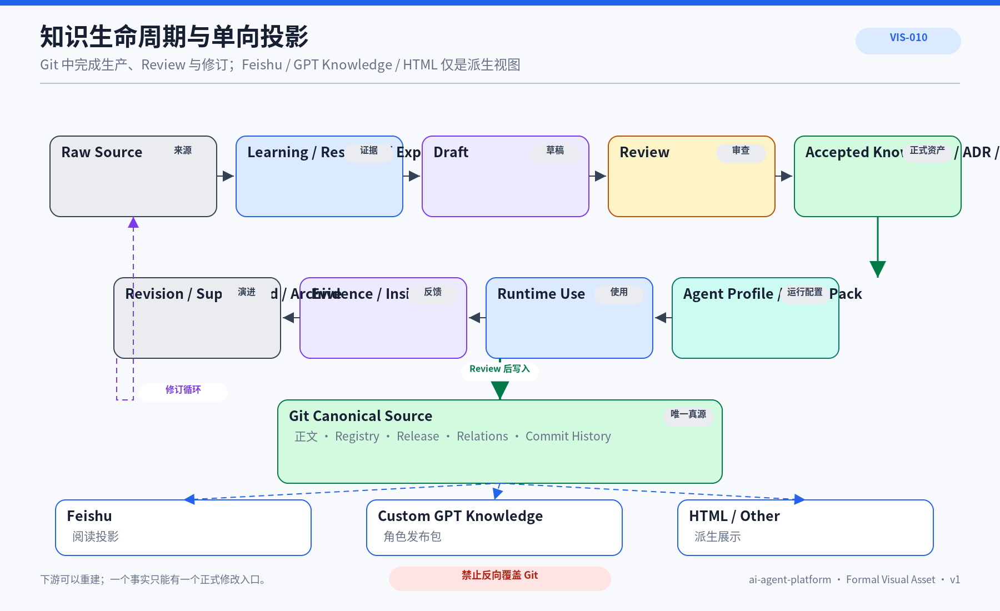

# KNO-005 项目知识生命周期

## 1. 文档定位

定义从原始来源到正式知识、运行时使用、发布和修订的完整生命周期。状态必须与证据和 Registry 一致。


## 正式视觉资产



### AI 可读语义镜像

```text
Raw Source
 → Learning / Research / Experiment
 → Draft
 → Review
 → Accepted Knowledge / ADR / Solution
 → Agent Profile / Skill / Knowledge Pack
 → Runtime Use
 → Evidence / Engineering Insight
 → Revision / Superseded / Archive
```

Git 是唯一正式修改入口。Feishu、Custom GPT Knowledge 与 HTML 由 Git 生成，使用单向覆盖，不能反向合并。生命周期晋升需要证据和 Review；被替代资产保留稳定 ID 与历史关系。

- Visual Asset ID：`VIS-010`；
- 可编辑源文件：[`./assets/VIS-010-知识生命周期与单向投影.svg`](./assets/VIS-010-知识生命周期与单向投影.svg)；
- 人类预览：[`./assets/VIS-010-知识生命周期与单向投影.png`](./assets/VIS-010-知识生命周期与单向投影.png)；
- 事实边界：Git 是唯一正式修改入口；Feishu、Custom GPT Knowledge 与 HTML 都是可重建投影。

## 2. 流程

`Raw Source → Learning/Research/Experiment → Draft → Review → Accepted Knowledge/ADR/Solution → Agent Profile/Skill/Knowledge Pack → Runtime Use → Evidence/Insight → Revision/Superseded/Archive`。

## 3. 状态

designing 只有计划；partial 已物化待真实 Commit Review；accepted 已通过 Review；implemented/validated 用于实现或实验；superseded/archived 保留历史。

## 4. 真源与投影

Git 保存正式内容、Registry、Release 和关系。Feishu、GPT Knowledge、HTML 等是派生投影，不反向修改 Git。

## 5. 修订

先识别影响范围，再更新正文、关系、Context、Release 和投影；被替代资产保留稳定 ID 与历史。

## 6. 当前实现边界

当前已建立 Git 单一真源、Platform Registry、Engineering Insight Registry、知识状态和飞书覆盖式投影规则。

## 7. 目标设计边界

目标通过统一 Release 与影响分析自动生成待更新资产、Pack、映射和发布验证计划。

## 8. 设计原则

- 事实/决策/实现/实验分状态
- 晋升需要证据
- 发布目标不成真源
- 历史通过 superseded/archived 保留
- 正式变化可从 Commit 恢复

## 9. 关联文档

- [KNO-007 平台资产关联模型](../KNO-007-平台资产关联模型.md)
- [ADR-002 Git 单一真源](../../../adr/ADR-002-git-single-source-feishu-projection.md)
- [WFL-001 知识生命周期](../../07_工作流与项目治理/WFL-001-知识生命周期与飞书发布.md)
