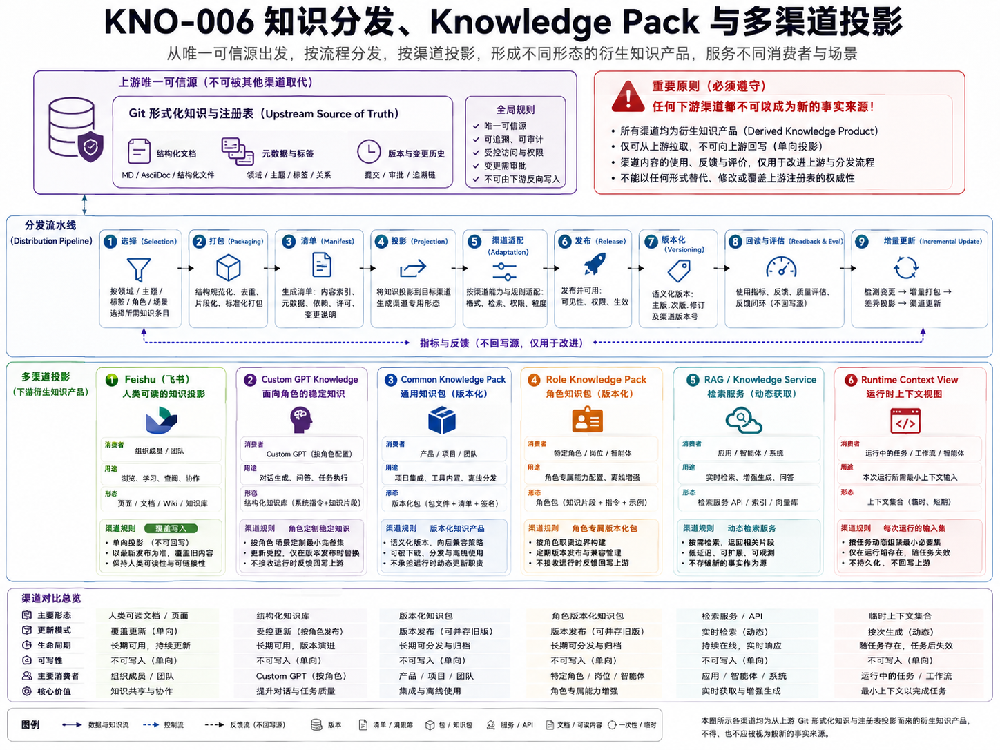

# KNO-006 知识分发、Knowledge Pack 与多渠道投影

> **核心结论**：Feishu、Custom GPT Knowledge、Knowledge Pack、外部 RAG 和 Agent Runtime 不是同一种“知识库”。它们面向不同消费者、更新频率、权限和使用方式，但都必须从已 Review 的 Git 正式知识派生，并通过 Manifest、Source Commit、Hash、评估和回读证明可重建、可追溯且未成为第二真源。

## 正式架构图



### AI 可读语义镜像

Visual Asset ID：`VIS-033`。

- 上游唯一可信源是 Git 正式知识和 Registry；下游渠道不能替代或反向修改真源。
- 分发流水线依次执行 Selection、Packaging、Manifest、Projection、Channel Adaptation、Release、Versioning、Readback & Eval 和 Incremental Update。
- 六类派生形态分别服务不同消费者：Feishu 人类阅读投影、Custom GPT Knowledge、Common Knowledge Pack、Role Knowledge Pack、RAG / Knowledge Service 与 Runtime Context View。
- 每个渠道具有独立消费者、用途、形态、生命周期、新鲜度和权限模型；同一全文不能无差别投放所有渠道。
- 下游反馈只用于改进上游知识与分发流程，任何变更仍必须回到 Git Review、Commit 和发布门禁。


## 1. 文档定位

本文回答：

> 同一套 Git 正式知识，怎样针对人类阅读者、专有 GPT、不同 Agent 角色和动态检索场景，生成边界不同的知识产品？

本文负责 `Knowledge Distribution & Projection` 领域，包括：

- Feishu 人类阅读投影；
- Custom GPT 内置 Knowledge；
- Common / Role Knowledge Pack；
- 外部 Knowledge Service / RAG；
- Agent Runtime 按需知识；
- Manifest、版本、构建、评估、发布和回读。

本文不决定正式知识内容和生命周期；那属于 [ARC-005](../ARC-005-知识资产治理单一真源与生命周期架构/README.md)。

## 2. 为什么要统一为一个分发领域

旧文档分别讨论 Feishu、GPT Knowledge、Knowledge Pack 和外部服务，容易产生以下误解：

- 每个渠道都有自己的正式知识；
- Feishu 和 Git 需要双向同步；
- Custom GPT 内置 Knowledge 可以保存项目状态；
- Knowledge Pack 是另一个知识仓库；
- RAG 索引结果可以直接裁决事实；
- 同一份全文适合所有消费者。

正确模型是：

```text
Accepted Git Knowledge
        ↓ Distribution Policy
        ↓ Channel-specific Build
┌───────┼───────────┬──────────┬─────────────┐
▼       ▼           ▼          ▼             ▼
Feishu  GPT Knowledge  Knowledge Pack  RAG Index  Runtime Retrieval
人类阅读  单 GPT 稳定参考  角色知识产品   动态检索    按 Task 组装
```

## 3. 渠道分类

| 渠道 | 主要消费者 | 解决问题 | 更新频率 | 是否直接进入 Context | 是否真源 |
|---|---|---|---|---|---|
| Feishu | 用户、团队、评审者 | 阅读、导航、分享、展示 | 批次发布 | 通常不作为 Runtime 原始源 | 否 |
| Custom GPT Knowledge | 某个专有 GPT | 稳定角色知识和共同语言 | 低频版本化 | 由 GPT 检索进入上下文 | 否 |
| Common Knowledge Pack | 多个 Agent / GPT | 共享项目基础共识 | 随正式基线更新 | 是 | 否 |
| Role Knowledge Pack | 某类专业角色 | 专业知识、标准和案例 | 随角色版本更新 | 是 | 否 |
| External Knowledge Service / RAG | 总控和多个 Agent | 大规模、权限化、动态检索 | 增量索引 | 是，按次检索 | 否 |
| Runtime On-demand View | 某个 Task Consumer | 当前 Task 的最小知识视图 | 每次 Context 编译 | 它本身是 Context Item 来源 | 否 |

## 4. Channel Profile

每个发布目标必须声明 Channel Profile：

```text
channel_id
channel_type
target_consumer
supported_formats
size / file / token limits
update_frequency
permission_model
freshness_requirement
retrieval_behavior
image_handling
source_link_support
readback_capability
rollback / rebuild strategy
```

渠道限制不能反向修改 Canonical 知识结构。必要时由 Builder 生成适配视图，而不是让 Git 正文迁就某个产品。

## 5. Knowledge Pack 模型

### 5.1 两层结构

```text
Common Knowledge Pack
  所有专有 GPT / Agent 共享的稳定基础

Role Knowledge Pack
  当前角色需要的专业知识、标准、案例和方法
```

Common Pack 可包括：

- 项目愿景；
- 核心术语；
- 平台总体架构摘要；
- Git 唯一真源；
- 安全底线；
- 角色目录；
- Evidence 和当前/目标边界。

Role Pack 可包括：

- 角色职责和非职责；
- 专业 Canonical 文档；
- 评价标准；
- 模板和案例；
- 可用 Skill；
- 常见错误和反模式；
- 与其他角色的 Handoff 接口。

### 5.2 Pack 不应包含

- 实时 Task State；
- 当前 Branch / HEAD；
- 短期 Session 历史；
- Secret；
- 未 Review 的草稿；
- 其他角色全部私有知识；
- 动态 Approval；
- 全仓无差别正文。

### 5.3 Pack Manifest

```yaml
knowledge_pack:
  pack_id: ...
  pack_type: common | role
  role_id: ...
  version: ...
  source_commit: ...
  source_assets: ...
  included_files: ...
  source_hashes: ...
  exclusions: ...
  permission_scope: ...
  freshness_policy: ...
  token_or_file_budget: ...
  eval_suite: ...
  build_tool_version: ...
  built_at: ...
  expires_at: ...
  release_status: ...
```

## 6. Feishu 投影

### 6.1 定位

Feishu 是面向人的阅读投影，不是 Agent Runtime 的 Task Store，也不是正式知识编辑端。

```text
Git Document Bundle
→ Publisher Preview
→ Human Authorization
→ Overwrite Page
→ Upload Local Images
→ Insert Media Blocks
→ Readback Text / Revision / Media
```

### 6.2 规则

- one-way；
- one-to-one（当前目录级策略）；
- overwrite；
- zero pre-read；
- no semantic merge；
- no reverse write；
- Git 本地图片在发布时上传；
- Feishu Media Token、URL、Block ID 不回写 Git；
- AI 可读语义镜像保留为普通正文；
- 发布必须基于固定 Commit；
- 写入成功后必须回读。

### 6.3 Feishu 不承担

- 正式事实生产；
- Task State；
- Agent Memory；
- Runtime Context；
- Executor Scope；
- Git 冲突合并；
- 角色 Pack 发布真源。

## 7. Custom GPT Knowledge

### 7.1 定位

Custom GPT 内置 Knowledge 是 Builder 为某个 GPT 配置的稳定参考文件，不是 ChatGPT Memory，也不是项目 Task Store。

### 7.2 正确组合

```text
Agent Profile / Instructions
+ Common Knowledge Pack
+ Role Knowledge Pack
+ Runtime Task Context
+ Tool / Action Capability
```

- Instructions 管行为和角色边界；
- Knowledge 提供稳定参考；
- Runtime Context 提供当前 Task、Git、Approval 和 Environment；
- Actions / Tools 提供执行能力；
- Task Store 保存动态状态。

### 7.3 更新门禁

GPT Knowledge 更新需要：

- 源 Asset 已接受；
- 固定 Source Commit；
- Pack Manifest；
- 文件和大小限制检查；
- 角色相关性 Review；
- 敏感信息检查；
- Retrieval / Behavior Eval；
- 发布记录和版本；
- 必要时回归测试。

Builder 中的文件不能反向覆盖 Git。

## 8. 外部 Knowledge Service / RAG

### 8.1 适用场景

- 多 Agent 共享；
- 高频更新；
- 大规模文档；
- 按权限检索；
- 结构化查询；
- 来源和日期要求；
- 不适合全部内置到 GPT 的资料。

### 8.2 正确边界

RAG 负责：

- 索引；
- 切片；
- 查询；
- 权限过滤；
- 排序；
- 来源回传；
- 新鲜度元数据。

RAG 不负责：

- 成为 Canonical Source；
- 自动判断资产已接受；
- 保存 Task 主状态；
- 无审批修改 Git；
- 把检索命中直接写成事实；
- 替代 Context Builder 的 Consumer / Task / Policy 判断。

### 8.3 检索结果要求

每个命中至少返回：

```text
asset_id
source_path
source_commit / version
chunk_id
claim_type
lifecycle_status
evidence_level
sensitivity
retrieved_at
freshness
```

## 9. 构建与发布流水线

```text
1. Select Accepted Assets
2. Resolve Channel Profile and Consumer
3. Validate Publication Eligibility
4. Build Manifest and Source Snapshot
5. Transform / Chunk / Package
6. Validate Links / Images / Limits / Privacy
7. Run Channel-specific Eval
8. Generate Preview
9. Human Authorization
10. Publish / Upload / Index
11. Readback / Query Verification
12. Record Projection / Release / Evidence
```

### 9.1 Transform 不改变事实

允许：

- 目录和导航适配；
- 格式转换；
- 图片上传；
- Chunking；
- 角色化选取；
- 摘要和索引；
- 结构化 Metadata；
- 渠道限制下的文件拆分。

禁止：

- 重新解释架构；
- 合并未 Review 的来源；
- 删除关键非声明；
- 把目标设计改写成当前能力；
- 因渠道限制改变 Canonical 结论。

## 10. 版本、更新和失效

### 10.1 Source Commit

每个派生产物必须绑定 Source Commit 或 Source Release。渠道内容无法定位来源版本时，不能作为可信 Context Source。

### 10.2 更新策略

| 渠道 | 推荐策略 |
|---|---|
| Feishu | 正式内容 Review 后批次覆盖发布 |
| Common Pack | 项目共同基础发生稳定变化时重建 |
| Role Pack | Agent Profile 或角色知识变化时重建 |
| GPT Knowledge | Pack 接受并通过 Eval 后发布 |
| RAG | Accepted Asset 变化后增量索引 |
| Runtime View | 每次 Context Request 动态生成 |

### 10.3 失效

派生产物在以下情况下失效：

- Source Asset 被 superseded；
- Source Commit 不再满足当前 Task Freshness；
- Role / Agent Profile 版本变化；
- 权限策略变化；
- Manifest 不完整；
- Eval 失败；
- 渠道内容与 Git Hash 不一致；
- Readback 失败；
- 用户或治理明确撤销。

## 11. 评估与回读

### 11.1 Feishu

验证：

- 页面存在；
- Revision 更新；
- 正文关键内容一致；
- 图片块存在；
- 无残留本地相对链接；
- 目录和页面映射正确。

### 11.2 GPT Knowledge / Pack

验证：

- 文件数量、大小和 Hash；
- 目标角色关键问题可检索；
- 不相关角色知识不过度泄漏；
- 当前/目标边界不混淆；
- 来源和非声明没有丢失；
- Prompt 行为不因 Pack 产生越权。

### 11.3 RAG

验证：

- Recall / Precision；
- 权限过滤；
- 来源返回；
- 新旧版本冲突；
- 过期内容降权或移除；
- 无结果时能够停止而不是编造；
- Context Builder 能按 Consumer 和 Task 继续裁剪。

## 12. 当前实现与目标设计

### 12.1 当前已实现

- Git → Feishu 单向覆盖治理模型；
- 本地 Document Bundle 图片上传和语义镜像规则；
- Publisher Preview、确认和回读要求；
- 两层 Knowledge Pack 的设计原则；
- Custom GPT Knowledge 与 Memory / Task State 的边界；
- Registry 中的发布和 Projection 关系基础；
- 正式内容 Review 后再发布的流程。

### 12.2 当前缺口

- Knowledge Pack 尚未正式物化；
- 无 Common / Role Pack 自动 Builder；
- 无 Agent Profile Publisher；
- 无 GPT Knowledge 自动发布和 Eval；
- 无通用外部 Knowledge Service / RAG；
- 无统一多渠道 Manifest Schema；
- 无自动增量重建和失效传播。

### 12.3 目标设计

- Distribution Application Service；
- Channel Adapter；
- Pack / Projection Manifest；
- Build / Eval / Preview / Release / Readback 流程；
- 与 Registry、Context Builder、Agent Profile 和 Impact Analyzer 对接；
- 所有外部渠道保持可替换和可重建。

## 13. 分发不变量

1. Git 是所有正式知识渠道的唯一来源；
2. 渠道不是领域真源；
3. 同一全文不默认适合所有消费者；
4. Knowledge Pack 必须绑定角色、版本、来源和预算；
5. GPT Knowledge 不保存动态 Task State；
6. RAG 检索命中不是事实证明；
7. Context Package 不等于 Knowledge Pack；
8. Feishu 不反向合并；
9. 所有发布必须有 Manifest 和 Source Commit；
10. 渠道变换不能改变 Canonical 结论；
11. 发布成功必须通过回读或查询验证；
12. 渠道内容可被删除并从 Git 重建。

## 14. 验收标准

- 能明确说明每种“知识库”的消费者和边界；
- Feishu、GPT Knowledge、Pack、RAG 不再被混称为同一机制；
- 每个派生产物可定位 Source Commit 和 Manifest；
- 不同角色只获得必要知识；
- 动态 Task 和 Runtime 状态不会进入稳定 Pack；
- 渠道更新、失效和重建条件明确；
- 发布后有真实回读或检索证据；
- 删除任何派生渠道不会损失正式项目知识。
