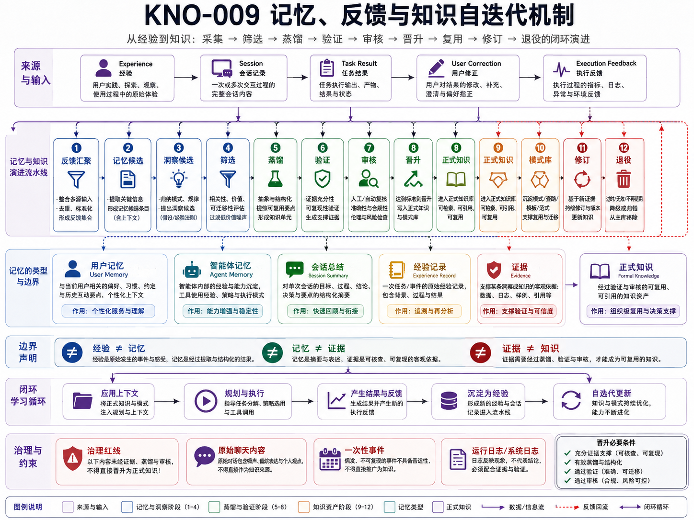

# KNO-009 记忆、反馈与知识自迭代机制

> **核心结论**：平台的“自迭代”不是让模型自动把聊天、日志和一次成功经验写进知识库，而是把运行经历、用户纠正、上下文质量和执行证据分类为候选，通过提炼、反证、人工 Review、成熟度和生命周期门禁，有限地晋升为用户 Memory、Agent 经验、工程洞见或正式知识。

## 正式架构图



### AI 可读语义镜像

Visual Asset ID：`VIS-034`。

- 输入包括 Experience、Session、Task Result、User Correction 与 Execution Feedback。
- 演进流水线覆盖反馈汇聚、记忆候选、洞察候选、筛选、蒸馏、验证、审核、晋升、正式知识、模式库、修订与退役。
- User Memory、Agent Memory、Session Summary、Experience Record、Evidence 与 Formal Knowledge 各有不同所有权、用途和可信等级。
- `Experience ≠ Memory`、`Memory ≠ Evidence`、`Evidence ≠ Knowledge`；原始聊天、一次事件和运行日志不能直接成为正式知识。
- 正式晋升必须具备来源、证据、有效蒸馏、人工 Review 和可控风险；投入运行后的新反馈再次进入候选流水线，形成受控学习闭环。


## 1. 文档定位

本文回答：

> 平台运行产生的经历和反馈，怎样被保留、分析、修订和复用，同时避免错误经验、私人信息、一次事件和模型幻觉污染长期知识？

本文负责 `Memory, Feedback & Learning` 领域，包括：

- Experience 与 Feedback；
- Session / Task 综合；
- User / Agent Memory Candidate；
- Context 选择质量反馈；
- Failure / Success Pattern；
- Engineering Insight；
- Distillation；
- Promotion / Revision / Retirement；
- 与 Knowledge Asset Governance 的晋升接口。

## 2. 核心边界

```text
Experience ≠ Memory
Memory ≠ Evidence
Evidence ≠ Knowledge
Session Summary ≠ Task State
Insight Candidate ≠ Established Principle
Model Output ≠ Accepted Knowledge
```

### 2.1 Experience

一次交互、Task、执行、失败、恢复或 Review 中发生的原始经历。

### 2.2 Feedback

对目标、行为、结果、上下文和知识质量的评价，包括用户纠正、Reviewer 退回、测试失败和检索无效。

### 2.3 Memory

在明确用途和边界下保留的持续信息，例如用户稳定偏好或某个 Agent 的低风险工作习惯。Memory 不拥有项目事实和任务状态。

### 2.4 Evidence

证明某个动作、结果或状态实际发生的材料，例如 Diff、测试、Commit、日志和 Hash。

### 2.5 Knowledge

经过来源核验、语义综合和人工 Review，可长期复用的正式解释、决策、模式或方法。

## 3. 输入来源

| 输入 | 典型内容 | 默认处理 |
|---|---|---|
| User Feedback | 纠正、偏好、否决、审批、满意度 | 区分本次决定和长期偏好 |
| Session | Chat 对话、附件、中间结论 | 先分类 Claim，不直接沉淀 |
| Task Result | 完成、失败、阻塞、Handoff、恢复 | 引用 Task 和 Evidence |
| Executor Evidence | Diff、Test、Commit、Push、日志 | 保留原始证据引用 |
| Reviewer Decision | 接受、退回、风险、缺失项 | 形成反馈和候选模式 |
| Context Usage | 缺失、噪声、过期、Token 浪费、误选来源 | 反馈给 Context Policy |
| Retrieval Feedback | 命中/未命中、相关性、来源冲突 | 反馈给知识索引和 Pack |
| Runtime Health | 超时、重试、副作用、环境漂移 | 形成故障候选，不自动知识化 |
| External Change | Provider、规则、产品和标准变化 | 创建重新核验候选 |

## 4. Experience Record

每个可分析经历应结构化记录：

```text
experience_id
task_id / task_version
session_id
consumer / role / executor
context_version
trigger
expected_outcome
actual_outcome
evidence_refs
user_feedback
review_decision
side_effects
failure_class
recovery_result
sensitivity
created_at
```

原始大日志不应重复写入 Experience Record，而应通过稳定引用指向 Evidence Store 或 Git 证据。

## 5. Feedback 分类

### 5.1 用户反馈

- 目标纠正；
- 输出格式偏好；
- 长期稳定偏好；
- 本次 Approval；
- 对架构和优先级的决定；
- 对 Agent 行为的否决；
- 对结果的接受或退回。

必须区分：

```text
Long-term Preference
≠ Current Task Requirement
≠ Explicit Approval
≠ Project Decision
```

### 5.2 Task / Workflow 反馈

- Handoff 是否完整；
- Checkpoint 是否可恢复；
- Task Version 是否冲突；
- 依赖和阻塞是否被识别；
- Planner 与 Executor 边界是否清晰；
- Recovery 是否重复副作用。

### 5.3 Context 反馈

- 必要事实缺失；
- 无关内容过多；
- 来源过期；
- 当前/目标混写；
- Role / Consumer 视图错误；
- Token 超预算；
- 关键 Constraint 在压缩后丢失；
- 不同 Task / Lane 串线；
- Output Contract 不完整。

### 5.4 Knowledge 反馈

- 文档重复；
- Canonical Owner 不明确；
- 关系缺失；
- 旧资产未 superseded；
- 来源不足；
- 结论被新证据推翻；
- Pack 或 RAG 无法命中；
- 渠道内容与 Git 不一致。

## 6. 记忆分类

### 6.1 User Memory

适合：

- 长期稳定、低风险的偏好；
- 常用表达和交互方式；
- 用户明确要求保存的信息。

不适合：

- 当前 Task 状态；
- Git 分支和 Commit；
- 临时审批；
- Secret；
- 未确认的个人属性推断；
- 项目架构事实。

### 6.2 Agent Memory

可保存：

- 某角色的低风险经验候选；
- 常见错误提醒；
- 检索和工具使用偏好；
- 经验证的局部工作模式。

但必须：

- 绑定 Agent / Role；
- 有来源和适用前提；
- 可修订和撤销；
- 不覆盖 Agent Profile、Task Contract 和 Governance；
- 不跨角色隐式共享。

### 6.3 Task Memory / Checkpoint

严格来说属于 Task Governance 和 Context Runtime，而不是长期 Memory。

它保存：

- 已完成和未完成；
- 最后安全点；
- 当前 Task Version；
- Context / Evidence 引用；
- 下一步和恢复规则。

Task 关闭后，可作为 Experience Source，但不自动进入长期记忆。

### 6.4 Project Context

`context/**` 是项目级共享事实，不属于 User / Agent Memory。语义由总控 Planner 维护，重要变化由用户确认。

## 7. 候选类型

| Candidate | 目标用途 | 晋升位置 |
|---|---|---|
| `MemoryCandidate` | 用户或 Agent 后续交互 | Memory Store / Agent Memory |
| `ContextPolicyCandidate` | 改进选择、预算、过滤、Freshness | Context Policy / Skill |
| `KnowledgeCandidate` | 补充正式解释、决策或方法 | `docs/knowledge` / ADR / Technical |
| `InsightCandidate` | 可跨任务复用的工程原则和模式 | Engineering Insight Registry / INS |
| `SkillCandidate` | 可复用工作流、Validator、模板 | `skills/**` |
| `TestCandidate` | 防止已知错误复发 | Test / Fixture / Eval |
| `ProductCandidate` | 重复出现的真实用户问题 | Product Discovery，不直接承诺产品 |
| `RetirementCandidate` | 过期 Memory、知识、Pack 或规则 | Retirement / Superseded / Archive |

## 8. Screening

不是所有经历都值得沉淀。候选至少应满足若干条件：

- 事件已解决或有可核验证据；
- 根因至少部分确认；
- 改变了工程决策或用户结果；
- 可以形成防复发动作；
- 可能跨任务复用；
- 不是单纯偶发噪声；
- 不暴露未经授权的私人或敏感内容。

应拒绝：

- 未知故障的武断总结；
- 低影响随机事件；
- 无证据的一次成功；
- 纯粹模型风格偏好但用户未确认；
- 已被现有规则完全覆盖且无新增价值；
- 不能说明适用前提和排除条件的“经验”。

## 9. 知识自迭代流水线

```text
1. Capture Experience / Feedback
2. Link Task / Context / Evidence
3. Classify Claim and Sensitivity
4. Screen Reusability and Risk
5. Group Occurrences and Counter-evidence
6. Distill Candidate
7. Select Target Asset / Memory Type
8. Human Review
9. Promote / Revise / Reject
10. Update Registry / Pack / Policy / Test
11. Observe Future Use
12. Increase Maturity or Retire
```

### 9.1 Distillation 输出

工程洞见候选应包括：

```text
principle
problem
root_cause
pattern
anti_pattern
heuristic
preconditions
exclusions
evidence_refs
counter_evidence
recurrence_prevention
maturity
lifecycle
```

同一事件的多份日志、Chat 和报告只算一个 Occurrence。

## 10. 成熟度与生命周期

### 10.1 成熟度

```text
candidate
→ provisional
→ validated
→ repeated
→ established
```

- 一次事件通常不高于 `provisional`；
- `validated` 需要证据和明确边界；
- `repeated` 需要独立事件；
- `established` 需要长期复用、反证检查和稳定价值。

### 10.2 生命周期

```text
active
→ revised
→ superseded
→ retired
```

成熟度高不代表永不过期。Provider、架构和项目阶段变化后，旧洞见仍可能需要修订或退役。

## 11. Promotion Decision

### 11.1 晋升为 User Memory

必须：

- 用户明确要求或明显长期有用；
- 风险低；
- 不属于敏感身份推断；
- 不会替代本次授权；
- 可以被用户撤回。

### 11.2 晋升为 Agent Memory

必须：

- 角色范围明确；
- 有适用前提；
- 不覆盖治理；
- 有来源；
- 有有效期或复审条件；
- 可以通过 Eval 检查是否改善结果。

### 11.3 晋升为 Engineering Insight

必须：

- 根因和模式可解释；
- 具有跨任务复用价值；
- 有 Evidence 和 Occurrence；
- 明确前提、排除和反证；
- 进入 Insight Registry；
- 用户明确触发或批准正式提炼。

### 11.4 晋升为正式 Knowledge / ADR / Skill

必须通过 [ARC-005](../ARC-005-知识资产治理单一真源与生命周期架构/README.md) 的生命周期和 Review 门禁。

Memory / Learning 领域只能提出 Candidate，不能直接写入正式资产。

## 12. 上下文质量的自迭代

Context Usage Record 可以反馈：

```text
selected_item_used
selected_item_unused
missing_item
stale_item
conflicting_item
permission_block
redaction_issue
token_cost
compression_loss
consumer_feedback
result_quality
```

改进方向：

- Consumer Profile；
- Context Template；
- Source Ranking；
- Freshness Policy；
- Token Budget；
- Redaction；
- Handoff Required Fields；
- Context Health Check；
- Knowledge Pack 内容；
- RAG Chunk / Metadata。

所有 Policy 变化仍需 Review，不能由一次模型评分自动修改生产规则。

## 13. 会话知识综合

长 Chat、Codex 报告和执行记录进入正式知识前，采用：

```text
Freeze Session Scope
→ Extract Claims
→ Separate Fact / Decision / Status / Design / Hypothesis / Private
→ Reconcile with Git / Code / Evidence
→ Map Overlap and Conflict
→ Choose Target Asset
→ Draft Full Replacement
→ Human Review
→ Registry / Release / Handoff
```

目标落位：

| 内容 | 目标位置 |
|---|---|
| 项目当前共享事实 | `context/**` |
| 长期解释 | `docs/knowledge/**` |
| 重要决策 | ADR |
| 实现方案 | `docs/technical/**` |
| 观察和验证 | Experiment / Evidence |
| 可复用方法 | Skill |
| 工程模式 | Insight |
| 动态任务 | Task Store / Checkpoint |
| 用户长期偏好 | User Memory |

原始聊天不直接复制进 Public Git。

## 14. 防污染机制

### 14.1 来源污染

- 无来源 Candidate 不晋升；
- RAG 命中只作为来源引用；
- Memory 不能作为项目事实证据；
- Executor 自述必须由 Diff、Test 和 Git 证明。

### 14.2 一次事件过拟合

- 一次事件不成定律；
- 记录 Occurrence；
- 搜索独立事件；
- 保留反证；
- 成熟度与生命周期分开。

### 14.3 隐私污染

- 原始 Chat 先最小化和脱敏；
- 不公开账户、Token、私钥、私人路径和不必要个人信息；
- 用户 Memory 不自动发布；
- Agent Memory 不跨角色公开。

### 14.4 状态污染

- 动态 Task State 不沉淀为长期 Knowledge；
- 当前状态只进入 Context / Task Store；
- 知识文章只描述稳定机制和已验证阶段成果；
- 过期状态通过 Superseded / Archive 保留历史。

### 14.5 自动化污染

- 自动系统只可生成 Candidate；
- 晋升、发布、删除和治理变化需要人工授权；
- 低置信度或冲突候选进入 `needs_evidence`；
- Eval 失败时回退，不偷偷调整规则。

## 15. 评估指标

| 维度 | 候选指标 |
|---|---|
| Memory Value | 减少重复沟通、用户纠正率、撤回率 |
| Context Quality | 缺失率、噪声率、过期率、Token 成本、任务成功率 |
| Knowledge Quality | 来源完整、冲突率、重复率、引用和复用次数 |
| Insight Quality | Occurrence、反证、成熟度、复发减少 |
| Pack / RAG Quality | 命中率、相关性、权限准确、版本新鲜度 |
| Learning Safety | 未授权晋升、隐私泄漏、错误规则传播次数 |

指标用于 Review 和调优，不自动等于因果证明。

## 16. 当前实现与目标设计

### 16.1 当前已实现

- Chat / 仓库知识综合的人工流程；
- `project-knowledge-synthesis` 的 Claim、Conflict、Target Asset 和 Candidate-only 边界；
- `engineering-insight-distillation` 的 Screening、成熟度和 Registry；
- Engineering Insight Registry 和初始洞见；
- 用户对重要知识和 Context 变化的人工 Review；
- Memory、Context、Knowledge、Task State 的概念边界；
- 冻结 Artifact 与真实 Git Evidence 的交付反馈。

### 16.2 当前缺口

- 无统一 Experience / Feedback Store；
- 无 Context Usage Record；
- 无 Agent Memory 管理；
- 无自动 Occurrence 聚合；
- 无跨任务 Candidate Queue；
- 无统一 Promotion / Retirement Workflow；
- 无基于真实 Eval 的 Context Policy 闭环；
- 洞见提炼仍需用户明确触发。

### 16.3 目标设计

- Experience / Feedback / Candidate Registry；
- 与 Task、Context、Evidence 和 Agent Profile 的稳定关系；
- Human Review Queue；
- Memory / Insight / Knowledge 不同晋升路径；
- Counter-evidence 和 Retirement；
- Context / Pack / Skill Eval；
- 受控知识自迭代，而不是自动自我改写。

## 17. 机制不变量

1. 原始经历不等于记忆；
2. 记忆不等于证据；
3. 证据不等于知识；
4. Session Summary 不拥有 Task State；
5. User Memory 不替代 Approval；
6. Agent Memory 不覆盖 Profile、Governance 和 Contract；
7. 一次事件不高于 provisional；
8. Candidate 必须记录适用前提和排除条件；
9. 反证可以降低成熟度或触发 Retirement；
10. 自动流程只生成 Candidate；
11. 正式知识晋升必须经过 Human Review；
12. 私人和敏感信息默认不进入正式知识和分发渠道。

## 18. 验收标准

- 能区分 User Memory、Agent Memory、Task Checkpoint、Project Context 和 Knowledge；
- 每个 Candidate 有来源、Task、Evidence 和适用边界；
- 一次事件不会自动成为长期规则；
- 用户纠正、Reviewer 退回和 Context 缺失可以转化为受控改进候选；
- Memory、Insight、Knowledge 和 Skill 有不同晋升门禁；
- 反证、修订和退役机制明确；
- 自迭代不会绕过用户、治理和 Git 真源。
