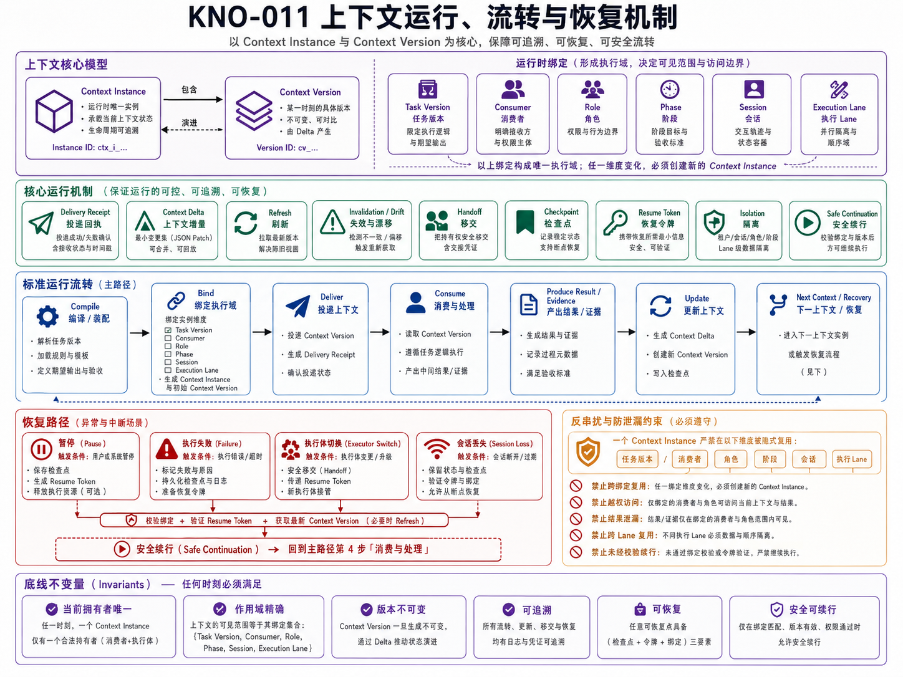

# KNO-011 上下文运行、流转与恢复机制

> **核心结论**：Context Package 被编译出来并不代表任务已经连续。平台还需要把它绑定到唯一的 Task Version、Consumer、Role、Phase、Session 和 Execution Lane，记录交付、使用、增量、刷新、失效、Handoff、Checkpoint 与恢复，才能避免上下文串线并支持跨会话、跨角色和失败后的安全续跑。

## 正式架构图



### AI 可读语义镜像

Visual Asset ID：`VIS-032`。

- Context Instance 包含不可变的 Context Version，并绑定唯一 Task Version、Consumer、Role、Phase、Session 和 Execution Lane。
- 运行机制包括 Delivery Receipt、Context Delta、Refresh、Invalidation / Drift、Handoff、Checkpoint、Resume Token、Isolation 与 Safe Continuation。
- 标准路径为“Compile → Bind → Deliver → Consume → Produce Result / Evidence → Update → Next Context / Recovery”。
- 暂停、执行失败、执行器切换和 Session 丢失都必须经过绑定校验、Resume Token 验证和最新 Context Version 获取后才能安全续行。
- Context 不得跨 Task Version、Consumer、Role、Phase、Session 或 Execution Lane 隐式复用；结果与证据只对授权消费者可见。


## 1. 文档定位

本文回答：

> 上下文进入真实任务后，怎样被版本化、绑定、交付、流转、刷新、失效和恢复？

本文负责 `Context Runtime & Continuity` 领域，扩展原有“总控 Planner 维护 `context/**`、Executor 精确覆盖”的人工机制，但不把项目 Context 文件等同于所有 Runtime Context。

本文不拥有：

- Task 状态机；
- Agent Profile；
- Knowledge Asset；
- Execution Lane 和 Runtime；
- Evidence 与 Approval；
- 用户 Memory。

它只管理 Context Instance 的生命周期和这些外部事实的稳定引用。

## 2. 为什么需要独立 Runtime 领域

只有 Context Builder 时，仍然会出现：

- 同一 Context Package 被错误复用到另一个 Task；
- Task 已经升级 Version，Executor 仍使用旧 Goal 和 Scope；
- Planner、Executor、Reviewer 共享同一视图，导致权限串线；
- Session 被压缩或更换后，任务无法恢复；
- Runtime、Branch、Approval 已变化，但旧上下文继续执行；
- 多条 Execution Lane 互相读取 Workspace 或 Evidence；
- Handoff 只传一段总结，接手角色不知道来源和未完成项；
- 失败重试重复产生副作用；
- Context Drift 被发现，却没有明确失效和重建动作。

因此必须把“上下文包的内容”与“上下文实例的运行生命周期”分开。

## 3. 核心对象

| 对象 | 责任 |
|---|---|
| `ContextInstance` | 某个已签发 Context Package 在真实任务中的运行实例 |
| `ContextVersion` | 同一 Context Instance 的版本序列 |
| `ConsumerBinding` | Context 与 Consumer、Role、Agent Profile 的绑定 |
| `TaskBinding` | Context 与 task_id、task_version、phase 的绑定 |
| `LaneBinding` | Context 与 Session、Runtime、Execution Lane、Workspace 的绑定 |
| `DeliveryReceipt` | 是否被成功交付、何时交付、消费者确认的版本 |
| `ContextDelta` | 新旧 Context Version 之间的结构化增量 |
| `RefreshTrigger` | 哪些事件要求刷新或重新编译 |
| `InvalidationRecord` | 旧版本为什么失效、从何时起禁止使用 |
| `CheckpointBinding` | Context Version 与 Task Checkpoint 的关联 |
| `ResumeToken` | 安全恢复所需的最小引用和门禁 |
| `ContextUsageRecord` | 消费者实际使用、遗漏、冲突和反馈记录 |

## 4. 绑定模型

一个 Context Instance 至少绑定：

```text
context_id
context_version
consumer_id
consumer_type
role_id
agent_profile_version
task_id
task_version
phase
session_id
execution_lane_id
workspace_ref
source_snapshot_id
permission_snapshot_id
generated_at
expires_at
```

### 4.1 核心不变量

> 一个 Context Instance 不能跨 Task Version、Consumer、Role、Phase 或 Execution Lane 隐式复用。

任何一个绑定维度发生变化，都必须：

- 生成新 Context Version；或
- 明确证明旧内容仍有效并记录 Rebind Decision；或
- 使旧实例失效并重新编译。

### 4.2 Task 与 Session 的边界

```text
Task = 可跨 Session 持续的工作事实主线
Session = 某个 Host 或模型的临时交互窗口
```

Session 结束、压缩、换设备或换执行器时，Task 不应丢失。恢复依赖 Task Snapshot、Context Version、Evidence 和 Resume Token，而不是依赖旧会话仍可读取。

## 5. Context Instance 生命周期

```text
requested
→ compiled
→ validated
→ issued
→ delivered
→ acknowledged
→ active
→ refreshed / superseded
→ handed_off / checkpointed
→ completed / invalidated / expired
→ archived
```

### 5.1 requested → compiled

由 Context Request 触发，Context Builder 生成候选包。

### 5.2 compiled → validated

检查：

- Task Version；
- Consumer / Role；
- Scope / Permission；
- Source Version；
- Freshness；
- Sensitivity；
- Budget；
- Output Contract；
- Evidence / Approval 要求。

### 5.3 issued → delivered → acknowledged

交付必须有 Receipt，至少记录：

```text
delivered_context_version
consumer_id
delivery_channel
delivered_at
acknowledged_at
ack_status
```

消费者未确认正确版本时，不应开始高风险执行。

### 5.4 active → refreshed

当来源或 Task 发生允许的变化时，生成新 Context Version，并记录 Delta。

### 5.5 invalidated / expired

旧实例禁止继续使用。失效必须有原因和替代版本或安全停止点。

## 6. 版本与增量

### 6.1 Context Version

Context Version 不等同于 Task Version，但必须引用它。

```text
Task v3
├── Planner Context v1
├── Architect Context v2
├── Executor Context v1
└── Reviewer Context v1
```

同一 Task Version 可以有多个消费者 Context；Task Version 变化通常会使相关 Context 失效或需要刷新。

### 6.2 Context Delta

Delta 应表达：

```text
added_items
removed_items
updated_items
permission_changes
scope_changes
source_version_changes
freshness_changes
new_evidence_refs
invalidated_assumptions
new_stop_conditions
```

对于高风险变化，不能只传增量，必须重新交付完整包并重新确认。

### 6.3 全量包与增量包

| 类型 | 使用场景 |
|---|---|
| Full Package | 新消费者、新角色、新 Session、重大 Scope / Permission 变化、恢复 |
| Delta Package | 同一消费者、同一 Task Version、低风险新 Evidence 或状态更新 |
| Summary Package | 用户和总控的状态阅读视图 |
| Recovery Package | 中断、失败、换执行器或 Session 丢失 |
| Review Package | 原 Contract + Actual Result + Evidence |

## 7. Refresh 与 Invalidation

### 7.1 Refresh Trigger

以下事件应触发刷新候选：

- Task Version 变化；
- Role / Agent Assignment 变化；
- Phase 变化；
- Scope 或 Acceptance 变化；
- Approval 新增、撤销或过期；
- Branch / HEAD / Workspace 变化；
- Capability Health 变化；
- 新 Evidence 或失败事件；
- Canonical Knowledge 或 Context 更新；
- 来源过期；
- Token 压缩造成关键约束缺失；
- Reviewer 退回或要求 Replan；
- Handoff 或 Recovery。

### 7.2 Invalidation Reason

标准原因可包括：

```text
task_version_changed
consumer_changed
role_changed
phase_changed
scope_changed
permission_revoked
approval_expired
source_superseded
runtime_drift
workspace_changed
evidence_conflict
sensitivity_violation
budget_exceeded
manual_revocation
```

### 7.3 失效后的行为

失效不是自动继续重编译的授权。系统应根据 Policy：

- 自动刷新只读低风险视图；
- 请求人工确认；
- 降级为只读；
- 暂停执行；
- 生成 Failure / Stop Report；
- 创建新 Handoff 或 Recovery Task。

## 8. Handoff

### 8.1 Handoff 的目的

Handoff 不是聊天总结，而是从一个 Consumer / Role 向另一个角色移交 Task 的结构化状态和 Context 引用。

### 8.2 Handoff Package

至少包含：

```text
handoff_id
task_id / task_version
from_consumer / from_role
to_consumer / to_role
completed_work
remaining_work
current_state
last_safe_checkpoint
active_context_version
source_refs
decision_refs
evidence_refs
known_risks
blocked_by
non_repeatable_side_effects
required_approvals
next_goal
next_scope
acceptance_criteria
stop_conditions
```

### 8.3 Planner → Executor

当前项目已经通过 `planner-executor-handoff` 建立人工 Handoff：

- Planner 拥有目标、架构、Scope、Context 语义和冻结文件；
- Executor 核对基线、环境、Contract 和授权；
- Executor 只做受限实现或冻结 Artifact 应用；
- 结果以 Diff、Test、Commit、Push 和工作区状态回传。

这属于 `Context Runtime & Continuity` 的当前人工实现，而不是完整自动 Runtime。

### 8.4 Executor → Reviewer

Review Handoff 必须包含原始 Contract 和原始 Evidence，不能只包含 Executor 的成功摘要。

## 9. Checkpoint 与恢复

### 9.1 Checkpoint

Checkpoint 保存某一可恢复时点：

- Task Version；
- Context Version；
- State Snapshot；
- 已完成 / 未完成；
- 关键 Decision；
- Artifact / Diff / Evidence；
- Approval；
- 副作用；
- Workspace / Branch；
- 下一步；
- 风险和阻塞。

### 9.2 Resume Token

Resume Token 不是 Secret，而是恢复索引：

```text
resume_token_id
task_id / task_version
checkpoint_id
required_context_version
last_evidence_id
workspace_ref
allowed_next_phase
expires_at
revalidation_requirements
```

恢复前必须重新验证：

- Task 是否仍有效；
- Approval 是否仍有效；
- Workspace / HEAD 是否漂移；
- 不可重复副作用是否已经发生；
- 依赖是否改变；
- 新证据是否推翻旧假设。

### 9.3 Safe Continuation

安全续跑的原则：

> 先证明哪些动作已经发生、哪些可以重复，再决定从哪里继续。

不能因为存在 Checkpoint 就直接重放所有命令。

## 10. Context Drift

Context Drift 指 Context 中的事实、权限、来源或约束与真实环境不一致。

### 10.1 Drift 类型

- Project Drift：项目阶段或架构 Context 过期；
- Task Drift：Task Version、Scope 或 Acceptance 变化；
- Runtime Drift：Branch、HEAD、Tool、Capability 或 Workspace 变化；
- Knowledge Drift：来源资产被 superseded；
- Permission Drift：Approval、Scope 或 Role 权限变化；
- Evidence Drift：新证据与旧结论冲突；
- Session Drift：压缩后 Goal、Constraint 或 Stop Rule 丢失。

### 10.2 Drift 处理

```text
Detect
→ Stop affected action
→ Collect read-only evidence
→ Classify owner and impact
→ Invalidate affected Context Version
→ Recompile or request decision
→ Deliver and acknowledge new version
→ Resume from safe point
```

Executor 和专业 Agent 只能报告 Drift，不得自行修改项目 Context 语义。

## 11. Context 隔离与防串线

### 11.1 Task 隔离

- 每项 Evidence、Artifact 和 State 引用 task_id / task_version；
- Context 不使用模糊“当前任务”；
- 子任务与父任务显式关联；
- Handoff 不继承未声明的 Side Context。

### 11.2 Role 隔离

- Planner Context 不自动转成 Executor Context；
- Reviewer 获得 Evidence 和原 Contract，但不继承 Executor 写权限；
- 专有 GPT 只加载自己的 Role Pack；
- Recovery Agent 获得恢复所需内容，不获得额外发布权限。

### 11.3 Execution Lane 隔离

- Context 绑定 lane_id 和 workspace_ref；
- 一条可写 Lane 对应隔离 Workspace / Worktree；
- 不同 Lane 的 Branch、Lock、Secret 和 Artifact 不混用；
- Integration 由独立 Task 或明确 Merge Policy 负责。

### 11.4 敏感信息隔离

- 私人 Context 只以必要引用或脱敏视图进入；
- Secret 不进入 Context Package 正文；
- 不向无关角色暴露用户个人信息；
- 发布 Context 不携带 Runtime Credential。

## 12. 所有权与写入权限

### 12.1 项目 `context/**`

当前项目级 Context 的语义由总控 Planner 维护：

- 专业 Agent、Executor 和 Reviewer 可以读取并报告 Drift；
- 重要变化由用户确认；
- Executor 只有在 `apply_frozen_artifacts` 且 `context_access.write_approved` 时，机械覆盖完整文件；
- 不允许目录通配和开放式“自行更新 Context”。

### 12.2 Runtime Context

未来 Runtime Context 由 Context Runtime 服务管理版本和绑定，但它仍不得修改外部领域的真实状态。

- Task 变化由 Task Governance 决定；
- Role 变化由 Agent Governance 决定；
- Approval 由 Evidence & Approval 决定；
- Runtime Snapshot 由 Execution Orchestration 提供；
- 正式知识由 Knowledge Asset Governance 决定。

## 13. 失败与停止

出现以下情况时必须停止相关动作：

- Context Version 与 Task Version 不匹配；
- Consumer、Role、Phase 或 Lane 绑定不匹配；
- Context 已过期或被撤销；
- Branch / HEAD / Workspace 漂移；
- Approval 缺失、撤销或 Scope 不匹配；
- 新 Evidence 推翻关键假设；
- Handoff 缺少未完成项、Side Effect 或停止条件；
- Recovery 无法判断动作是否已发生；
- Session 压缩导致 Goal、Scope 或权限丢失；
- Context Access 未授权却要求修改项目 Context。

返回结构化 Failure / Stop Report：

```text
last_successful_gate
raw_error / mismatch
active_task_version
active_context_version
side_effects
workspace_state
safe_resume_point
required_decision
```

## 14. 当前实现与目标设计

### 14.1 当前人工实现

- `context/**` 由总控 Planner 语义维护；
- Context Drift 通过人工回读和仓库证据发现；
- `planner-executor-handoff` 提供 Reception Ack、Progress Checkpoint、Failure Report、Execution Result；
- `context_access` 控制 Context 完整覆盖；
- 固定 SHA、Scope Lock、Manifest、字节比较和 Git 回读保证冻结交付连续性；
- 当前 Task / Checkpoint / Recovery 主要存在于结构化任务书、Git 和 Chat Review 中。

### 14.2 目标设计

- Context Instance Store；
- Context Version / Delta / Receipt；
- Task / Role / Lane Binding；
- Event-driven Refresh / Invalidation；
- Handoff / Checkpoint / Resume API；
- Context Usage / Drift / Health Event；
- 与 Task Store、Evidence Store、Approval 和 Execution Lane 的 Contract；
- 多任务 Context Isolation。

## 15. 机制不变量

1. Context Instance 必须绑定唯一 Task Version；
2. Consumer、Role、Phase 和 Lane 必须明确；
3. Session 不是 Task 真源；
4. Task Version 变化不能静默沿用旧 Context；
5. 高风险变化使用完整包而非只传 Delta；
6. Context 交付需要 Receipt 和版本确认；
7. 失效后先停止，再重编译或请求决定；
8. Handoff 传结构化状态，不传无边界聊天历史；
9. Recovery 先核验副作用和幂等；
10. 不同 Lane 的 Context、Workspace 和 Evidence 不串线；
11. Executor 不获得 Context 语义修改权；
12. Context Runtime 不夺取 Task、Role、Evidence 或 Knowledge 的所有权。

## 16. 验收标准

- 任意运行中的 Context 都能定位 Task Version、Consumer、Role、Phase 和 Lane；
- 能判断消费者实际收到并确认了哪个版本；
- 来源或权限变化后旧版本会明确失效；
- Handoff 后接手角色不依赖旧 Session；
- 中断后能从 Checkpoint 和 Evidence 安全续跑；
- 不可重复副作用不会被盲目重放；
- 多任务或多 Lane 不会共享未授权上下文；
- Drift、Conflict 和 Expiry 会触发停止、刷新或人工决策。
