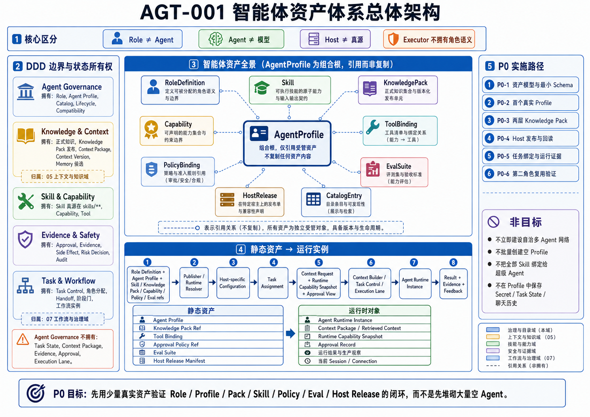

# AGT-001 智能体资产体系总体架构

## 1. 文档定位

本文回答：

> `ai-agent-platform` 中一个可治理的智能体资产究竟是什么，它由哪些正式资产组成，各资产由谁拥有，并如何进入 Task、Context、Execution 与 Evidence 闭环？

智能体资产体系是 P0，不是因为要马上创建大量 Agent，而是因为后续所有专业 Agent、Custom GPT、Runtime Agent 和多角色协作都必须从同一套角色、配置、知识、能力、权限、评估和发布资产生成。

## 2. 正式架构图

Visual Asset ID：`VIS-035`



### AI 可读语义镜像

- `AgentProfile` 是智能体资产组合根，只引用 `RoleDefinition`、`Skill`、`KnowledgePack`、`Capability`、`ToolBinding`、`PolicyBinding`、`EvalSuite`、`HostRelease` 与 `CatalogEntry`，不复制这些资产正文。
- `Role ≠ Agent`，`Agent ≠ 模型`，`Host ≠ 真源`，Executor 不拥有角色语义。
- Agent Governance 拥有 Role、Agent Profile、Catalog、Lifecycle 与 Compatibility；`05_上下文与知识系统` 拥有正式知识、Knowledge Pack、Context Package、Context Version 与 Memory 候选；`07_工作流与项目治理` 拥有 Task Control、角色分配、Handoff、阶段门和工作流实例。
- 静态资产进入运行实例的主路径为：`Role Definition + Agent Profile + 引用资产` → `Publisher / Runtime Resolver` → `Host-specific Configuration` → `Task Assignment` → `Context Request + Runtime Capability Snapshot + Approval View` → `Context Builder / Task Control / Execution Lane` → `Agent Runtime Instance` → `Result + Evidence + Feedback`。
- P0 路径为：最小 Schema → 首个真实 Profile → Common / Role 两层 Knowledge Pack → Host 发布与回读 → Task 绑定与运行证据 → 第二角色复用验证。
- 非目标包括：不立即建设自治多 Agent 网络，不批量创建空 Profile，不把全部 Skill 绑定给超级 Agent，不在 Profile 中保存 Secret、Task State 或聊天历史。
- P0 的验收重点是用少量真实资产验证 `Role / Profile / Pack / Skill / Policy / Eval / Host Release` 闭环，而不是先堆砌大量空 Agent。

## 3. 核心定义

### 3.1 Role 不等于 Agent

`Role Definition` 定义使命、责任、决策权、禁止动作和验收标准。它与模型、Host 和执行器无关。

### 3.2 Agent 不等于模型

Agent 是在特定版本下，由 Role、Profile、Skill、Knowledge、Capability、Tool、Policy 和 Eval 组合形成的受治理行为主体。

### 3.3 Host 不等于真源

Custom GPT、Codex、Plugin、Runtime、API Agent 或本地模型是 Agent 配置的运行载体。Host 配置是 Git 资产的派生发布物，不能反向成为正式配置真源。

### 3.4 Executor 不拥有角色语义

Codex、OpenCode / DeepSeek、脚本和本地模型是执行器。执行器可以承载不同角色，也可以被替换；角色责任和验收标准不能随执行器切换而消失。

## 4. 智能体资产全景

| 资产 | 核心责任 | 权威来源 | 典型引用关系 |
|---|---|---|---|
| `RoleDefinition` | 使命、职责、决策权、禁区、交付物 | 未来 `agents/roles/**` | 被 Profile 引用 |
| `AgentProfile` | 组合根、版本、输入输出、依赖绑定 | 未来 `agents/profiles/**` | 引用 Role、Skill、Pack、Policy、Eval |
| `Skill` | 可复用工作方法、流程与程序性资源 | `skills/**` | 被 Profile 或 Workflow 引用 |
| `KnowledgePack` | 面向角色的稳定知识产品 | 未来 `knowledge-packs/**` | 被 Profile 引用，由 Git Knowledge 派生 |
| `Capability` | 平台能够提供的抽象能力 | Platform Registry | 映射到 Tool / Adapter |
| `ToolBinding` | Agent 可调用的工具及资源范围 | Profile + Runtime | 受 Capability 与 Policy 约束 |
| `PolicyBinding` | 权限、风险、审批、停止规则 | Policy / Governance | 约束 Tool Action |
| `EvalSuite` | 质量、安全、边界和恢复测试 | 未来 Agent Eval 资产 | 绑定 Profile Release |
| `HostRelease` | 某 Profile 在某 Host 的发布记录 | Release / Projection Registry | 绑定 Source Commit、Hash、Eval |
| `CatalogEntry` | 可发现性、状态、负责人和依赖摘要 | Registry 派生目录 | 指向全部正式资产 |

## 5. DDD 边界与状态所有权

### 5.1 Agent Governance

拥有：Role、Agent Profile、Catalog、Agent Lifecycle、Profile Compatibility。

不拥有：Task State、Context Package、Evidence、Approval、Execution Lane。

### 5.2 Knowledge & Context

拥有：正式知识、Knowledge Pack 发布、Context Package、Context Version、Memory 候选。

Agent Profile 只声明 `knowledge_pack_refs`、`context_requirements` 和 `memory_policy_ref`。

### 5.3 Skill & Capability

Skill 的运行时真源在 `skills/**`；Capability 是平台可提供的抽象能力；Tool 是具体实现。Agent Governance 只绑定这些资产，不复制其正文。

### 5.4 Evidence & Safety

拥有 Approval、Evidence、Side Effect、Risk Decision 和 Audit。Agent Profile 引用策略，不保存一次性审批结果。

### 5.5 Task & Workflow

Task Control 和 `07_工作流与项目治理` 拥有任务流转、角色分配、Handoff、阶段门和工作流实例。Agent 资产体系提供可选角色与能力，不直接运行工作流。

## 6. 核心 Aggregate

### 6.1 RoleDefinition Aggregate

不变量：

- `role_id` 稳定且不复用；
- 使命和责任边界可解释；
- 决策权、执行权和验收权显式；
- 高风险职责分离不能由 Host Instructions 绕过；
- 角色变化不自动修改历史 Profile Release。

### 6.2 AgentProfile Aggregate

不变量：

- Profile 引用合法且已知版本的资产；
- 不复制 Skill、Knowledge Pack 或 Policy 的完整正文；
- 破坏性配置变化必须产生新版本；
- 每次发布绑定完整依赖图和 Source Commit；
- 运行时 Task / Session / Secret 不进入 Profile。

### 6.3 AgentRelease Aggregate

不变量：

- 只有通过必要 Eval 的 Profile 才能进入 Pilot / Released；
- Host Release 必须可回滚；
- Host 实际配置与 Manifest Hash 一致；
- 发布状态不能超过证据等级；
- 某个 Host 发布失败不修改 Git Profile 真相。

## 7. 静态资产到运行实例

```text
Role Definition
  + Agent Profile
  + Skill / Knowledge Pack / Capability / Policy / Eval refs
  ↓ Publisher / Runtime Resolver
Host-specific Configuration
  ↓ Task assignment
Context Request + Runtime Capability Snapshot + Approval View
  ↓ Context Builder / Task Control / Execution Lane
Agent Runtime Instance
  ↓
Result + Evidence + Feedback
```

静态 Agent Asset 与运行实例必须分离：

| 静态资产 | 运行时对象 |
|---|---|
| Agent Profile | Agent Runtime Instance |
| Knowledge Pack Ref | Context Package / Retrieved Context |
| Tool Binding | Runtime Capability Snapshot |
| Approval Policy Ref | Approval Record |
| Eval Suite | 运行结果与生产观察 |
| Host Release Manifest | 当前 Session / Connection |

## 8. 当前人工实现映射

| 当前实践 | 对应目标资产 | 当前证据等级 |
|---|---|---|
| Chat 负责规划、架构、语义与复审 | Planner / Reviewer Role | 人工实践，未 Profile 化 |
| Codex 执行冻结任务并回传证据 | Executor Role + Handoff Skill | 已重复验证，未 Agent 化 |
| 6 个活跃 Skill | Skill Assets | accepted / in_review / verified 不同状态 |
| Git Knowledge / Context / Registry | Knowledge / Context / Registry | 已实现 |
| Custom GPT Actions | Host + Action Capability | 窄链路已验证 |
| `agents/` / `knowledge-packs/` | Agent / Pack 真源 | 尚未创建 |

## 9. P0 实施路径

### 9.1 P0-1：资产模型与最小 Schema

建立最小 Role、Agent Profile、Catalog、Eval Result 和 Host Release Schema；不批量创建空资产。

### 9.2 P0-2：首个真实 Profile

从已经反复使用的“总控 Planner / Reviewer”或“知识治理 Agent”中选择一个，形成一份真实 Profile，并引用现有 Skill 与知识包。

### 9.3 P0-3：两层 Knowledge Pack

建立 Common Pack 与首个 Role Pack；绑定 Source Commit、Manifest、Hash、预算和 Eval。

### 9.4 P0-4：Host 发布与回读

优先验证 Custom GPT 或受控 Runtime 的一条发布路径，记录 Preview、实际配置、Hash、Eval 和回滚版本。

### 9.5 P0-5：任务绑定与运行证据

让 Task Contract 引用 `agent_profile_id@version`，并记录 Context、工具、审批、结果和证据，证明 Profile 可重复运行。

### 9.6 P0-6：第二角色复用验证

新增第二个专业 Agent，验证 Role、Skill、Knowledge Pack、Tool 和 Eval 能够复用，而不是复制第一套配置。

## 10. 非目标

- 不立即建设自治多 Agent 网络；
- 不为每个候选名称创建空 Profile；
- 不把全部 Skill 都绑定给一个超级 Agent；
- 不把 Custom GPT Builder 配置当作唯一真源；
- 不在 Profile 中保存 Secret、Task State 或聊天历史；
- 不用单次成功案例声明 Agent 已发布。

## 11. 关联文档

- `ARC-001`：平台总体架构与 Agent Governance 位置；
- `ARC-016`：MVP-3～MVP-7 的 Agent、Task 和多执行器演进；
- `ARC-006`：多消费者上下文编译；
- `KNO-006`：Knowledge Pack 与多渠道投影；
- `AGT-002`：Role 与 Profile 组合；
- `AGT-007`：Eval 与 Release；
- `AGT-008`：专业 Agent 目录与 P0 顺序。
