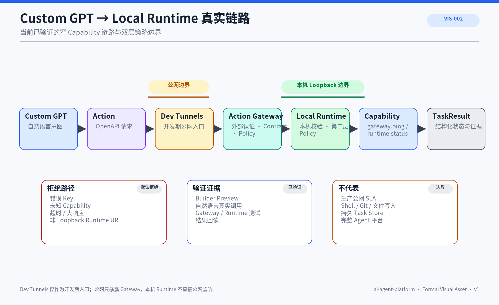

# EXP-005 Custom GPT Actions 链路实验

## 1. 文档定位

本文记录从 Custom GPT 到本机可信执行链的真实实验，区分 Builder 配置、公网入口、Gateway、Runtime 与最终证据。


## 正式视觉资产



### AI 可读语义镜像

```text
Custom GPT
  → Action：POST /v1/runtime/status
  → Microsoft Dev Tunnels：只暴露 Gateway
  → Action Gateway：Bearer、Schema、Policy、Rate/Concurrency/Timeout
  → Local Runtime：独立 Key 与第二层 Policy
  → runtime.status Capability
  → 结构化 TaskResult
```

安全边界：公网不能直接访问 Runtime；未授权 Capability、错误 Key、超时和异常响应必须被拒绝。该链路证明窄 Capability 的真实调用，不证明 Shell、文件、Git、生产公网或完整 Agent 平台已经实现。

- Visual Asset ID：`VIS-002`；
- 可编辑源文件：[`./assets/VIS-002-Custom-GPT到Runtime真实链路.svg`](./assets/VIS-002-Custom-GPT到Runtime真实链路.svg)；
- 人类预览：[`./assets/VIS-002-Custom-GPT到Runtime真实链路.png`](./assets/VIS-002-Custom-GPT到Runtime真实链路.png)；
- 事实边界：该图只覆盖已经验证的窄 Capability 链路，不代表生产公网或完整 Agent 平台。

## 2. 实验目标

验证自然语言请求是否能够沿以下链路到达本机受控 Capability：

```text
Custom GPT
→ Action
→ Microsoft Dev Tunnels
→ Action Gateway
→ Local Runtime
→ TaskResult
```

## 3. 方法与门禁

- 使用 OpenAPI 描述公开 Action；
- 公网只暴露 Gateway，不暴露 Runtime；
- Gateway 与 Runtime 使用不同 API Key；
- 两层 Policy 默认拒绝；
- 仅允许 `gateway.ping` 与 `runtime.status`；
- Builder Preview 与正式自然语言调用分别验证；
- 通过真实回读而不是只看进程日志判定结果。

## 4. 结果

实验确认：

- Custom GPT 可以通过正式 Action 调用到 Gateway；
- Gateway 能完成认证、Contract 和 Policy 检查；
- Runtime 对同一 Task 再次执行 Policy；
- `runtime.status` 返回受控状态；
- 未授权 Capability、错误 Key 和异常响应被安全拒绝；
- 当前链路不提供 Shell、文件、Git 或系统修改能力。

## 5. 局限

当前仍是开发期窄链路：

- 没有持久 Task State；
- 没有 Approval Store；
- 没有 Evidence Registry；
- 没有生产公网域名和 SLA；
- Action 调用可能仍受 ChatGPT 侧确认与产品规则影响。

## 6. 当前事实边界

该链路已经在真实 Builder / Preview 与自然语言调用中验证，仓库测试和本地链路测试持续覆盖 Gateway 与 Runtime。它证明最小可信链路成立，不代表完整 Agent 平台已经完成。

## 7. 后续边界

后续实验应增加结构化 Task Store、Approval、Evidence 和健康事件，并保持 Capability 白名单和双层 Policy。

## 8. 结论与原则

- 真实外部调用必须用回读证据验证。
- 公网入口与本机执行层分离。
- 认证成功不等于 Capability 获准。
- 窄链路成功不能外推为完整平台。

## 9. 关联资产

- [CAP-005 Custom GPT 配置](../../02_基础产品与能力/CAP-002-生态组件配置与能力差异/README.md)
- [ARC-016 架构与实现映射](../../04_平台架构/ARC-016-架构能力与仓库实现映射.md)
- [WFL-009 审批工作流](../../07_工作流与项目治理/WFL-009-审批工作流.md)
