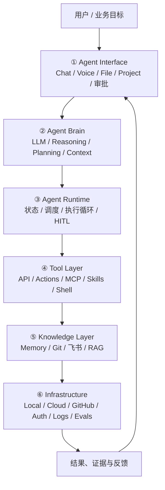
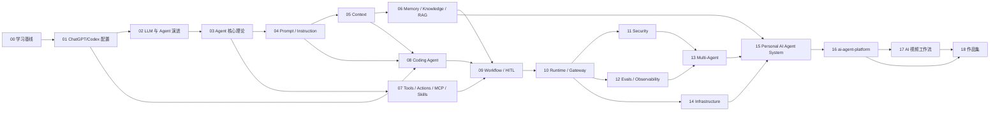

# ChatGPT Agent 工程体系学习总纲 v1.0

> 基线日期：2026-07-27
> 学习对象：具备前端工程经验，希望转向 AI Agent / AI 全栈工程的开发者
> 实践项目：`ai-agent-platform`
> 学习方法：20% 原理 + 60% 实验 + 20% 沉淀

---

## 1. 体系定位

本课程不按照“学 ChatGPT → 学 Codex → 学 MCP → 学 Agent”的产品列表学习，而采用“构建一个可运行、可维护、可审计的 AI Agent 系统”的工程视角。

产品堆叠式学习的问题：

- 容易记住按钮，却不知道系统边界；
- 容易追逐新功能，却缺少稳定工程模型；
- 产品名称变化后，知识结构失效；
- 会使用工具，不等于能设计、搭建和维护 Agent 系统。

最终能力：

1. 解释 LLM、Assistant、Agent、Workflow、Runtime、Tool、Memory、Knowledge 的区别。
2. 判断需求应由普通对话、固定工作流、单 Agent 还是多 Agent 完成。
3. 设计入口、上下文、工具、权限、执行环境和反馈闭环。
4. 配置和使用 ChatGPT/Codex，但不把能力体系绑定在单一产品上。
5. 使用 Git、Markdown、飞书、MCP、API 和本地运行时建立长期知识与执行体系。
6. 将方案落到 `ai-agent-platform`，形成可展示、可迭代的简历项目。

## 2. 六层工程模型



六层闭环：目标输入 → 理解和规划 → 受控执行 → 调用工具 → 读写知识 → 基础设施保障 → 返回证据供人审核。

## 3. 渐进式能力等级

- **Level 0 产品与环境基线**：看懂入口、设置、权限和运行环境。
- **Level 1 模型与 Agent 认知**：理解 LLM 与 Agent 的本质差异。
- **Level 2 指令与上下文控制**：稳定定义任务和上下文。
- **Level 3 工具与知识连接**：连接外部能力和长期知识。
- **Level 4 可靠执行系统**：构建 Coding Agent、Workflow、Runtime、安全与 Evals。
- **Level 5 平台化与项目落地**：形成 Personal AI Agent System 和作品集。

## 4. 完整课程目录

---

# 第 00 章：课程使用说明与学习基线

## 目标
- 明确学习目标、项目目标与知识库规则
- 记录设备、账号、工具、仓库与限制
- 建立术语、实验、决策与进度模板

## 学习内容
- 00.1 为什么采用工程体系而不是产品教程
- 00.2 六层 Agent 工程模型
- 00.3 个人技术与职业基线
- 00.4 学习证据和验收标准
- 00.5 Git、飞书、ChatGPT Project、Memory、Runtime 数据库的职责
- 00.6 如何处理产品快速变化
- 00.7 如何控制学习范围

## 最小实验
- 创建课程目录
- 建立环境与账号矩阵
- 建立 Confirmed / Observed / Inferred / Decision / Todo 分类

## 知识库输出
- `00_学习基线.md`
- `glossary.md`
- `environment-baseline.md`

## 通过标准

能用自己的语言解释六层模型，并指出 ai-agent-platform 已覆盖与缺失的层。

---

# 第 01 章：ChatGPT 与 Codex 配置项及能力基线

## 目标
- 形成统一产品地图
- 区分 ChatGPT 通用入口与 Codex 编码执行面
- 掌握个人、项目、仓库和运行级配置的作用域与优先级
- 建立安全默认配置

## 学习内容
- 01.1 统一产品视角：ChatGPT、Codex 与 Coding Agent
- 01.2 Web、Desktop、Mobile、Chat、Work、Projects
- 01.3 账号、套餐、Workspace 与数据边界
- 01.4 模型、推理强度、速度与任务匹配
- 01.5 Project Instructions、Personalization、Personality
- 01.6 Memory 与 Project Memory
- 01.7 Files、Apps、Connectors、Actions、MCP
- 01.8 Browser、Computer Use、Voice、Image
- 01.9 Notifications、Scheduled 与 Long-running work
- 01.10 数据控制、隐私和权限
- 01.11 Codex Desktop、CLI、IDE、Cloud、Remote
- 01.12 Desktop 通用设置
- 01.13 config.toml 分层和优先级
- 01.14 Model、Provider、Reasoning、Speed、Profile
- 01.15 Approval、Sandbox、Permission、Network
- 01.16 AGENTS.md、AGENTS.override.md 与继承
- 01.17 Rules、Skills、Plugins、MCP、Hooks
- 01.18 Local、Cloud、Worktree、Remote
- 01.19 Git、GitHub、Review 与 Terminal
- 01.20 Logs、Status 与配置审计

## 最小实验
- 绘制实际入口矩阵
- 审计 ChatGPT 设置
- 审计 Codex Desktop/CLI/IDE 设置
- 建立 safe-readonly 与 normal-workspace 两种模式
- 验证 config.toml 与 AGENTS.md 继承
- 执行一次高风险动作的审批与安全停止

## 知识库输出
- `01_ChatGPT-Codex能力地图.md`
- `01_当前配置审计.md`
- `01_个人安全基线.md`
- `01_Codex配置层级.md`
- `01_实验记录.md`

## 通过标准

能解释统一体系与独立配置的关系；能指出配置作用域、优先级、风险和验证方式；不把无限权限设为默认。

---

# 第 02 章：AI、LLM 与 Agent 演进

## 目标
- 理解 Agent 的大脑从哪里来
- 理解语言模型为什么不等于 Agent

## 学习内容
- 02.1 传统软件、规则系统与机器学习
- 02.2 深度学习与 Transformer 必要概念
- 02.3 Token、Embedding、Attention、Context Window
- 02.4 训练、推理、生成与采样
- 02.5 多模态与 Reasoning Model
- 02.6 幻觉与能力边界
- 02.7 Chatbot、Assistant、Copilot、Agent、Agent System
- 02.8 从回答到完成任务
- 02.9 模型能力与工程能力

## 最小实验
- 同一任务比较纯问答、结构化输出、工具调用和 Agent 执行
- 构造缺失上下文并观察错误推断

## 知识库输出
- `02_LLM与Agent认知地图.md`
- `02_术语表.md`
- `02_边界实验.md`

## 通过标准

能解释“模型给出建议”和“系统完成任务”之间缺少哪些组件。

---

# 第 03 章：Agent 核心理论与执行循环

## 目标
- 掌握单 Agent 最小完整结构
- 能判断需求是否真的需要 Agent

## 学习内容
- 03.1 Agent 定义与必要条件
- 03.2 Goal、Task、Constraint、State
- 03.3 Reasoning、Planning 与 Tool Selection
- 03.4 Act、Observe、Reflect
- 03.5 ReAct、Plan-and-Execute、Evaluator-Optimizer
- 03.6 确定性 Workflow 与自主 Agent
- 03.7 停止条件、失败条件、超时
- 03.8 Human-in-the-loop
- 03.9 生命周期与最小状态机
- 03.10 能力边界和责任边界

## 最小实验
- 实现一个只调用两个工具、最多执行三步的 Agent
- 为它设计停止与失败条件

## 知识库输出
- `03_Agent核心模型.md`
- `03_执行循环实验.md`
- `03_状态机图.md`

## 通过标准

能判断什么时候不应使用 Agent，并能定义停止条件。

---

# 第 04 章：Prompt 与 Instruction Engineering

## 目标
- 把自然语言要求转成稳定、可执行、可验证的任务

## 学习内容
- 04.1 Prompt 与 Instruction
- 04.2 目标、背景、输入、输出、约束、验收
- 04.3 System、Developer、User 层级
- 04.4 Few-shot、反例与结构化输出
- 04.5 Task Schema
- 04.6 仓库级约束
- 04.7 指令冲突与优先级
- 04.8 提示词注入
- 04.9 提示词版本管理
- 04.10 Chat 提示词与 Coding Task 的区别

## 最小实验
- 把一个模糊需求改写为带验收、禁止项、回滚条件的 Coding Task

## 知识库输出
- `04_任务定义规范.md`
- `04_Prompt模式库.md`
- `04_Task模板.md`

## 通过标准

Codex 无需猜测交付物、边界和验收方式。

---

# 第 05 章：Context Engineering

## 目标
- 为 Agent 提供刚好足够的上下文
- 降低污染、过期和 Token 浪费

## 学习内容
- 05.1 Context Window 与注意力稀释
- 05.2 静态与动态上下文
- 05.3 用户、项目、任务上下文
- 05.4 文件选择和检索
- 05.5 Context Injection
- 05.6 Compression 与摘要
- 05.7 Context Handoff 与会话恢复
- 05.8 污染与过期
- 05.9 来源优先级
- 05.10 Context Pack

## 最小实验
- 为同一任务制作小、中、大三种 Context Pack，比较准确率、成本和返工

## 知识库输出
- `05_Context工程规范.md`
- `05_Context-Pack模板.md`
- `05_上下文实验.md`

## 通过标准

能解释每份上下文为何加载，并识别冲突与过期内容。

---

# 第 06 章：Memory、Knowledge 与 RAG

## 目标
- 区分对话记忆、项目知识、任务状态和正式知识资产

## 学习内容
- 06.1 Working、Episodic、Semantic Memory
- 06.2 Chat Memory 与 Project Memory
- 06.3 文件知识与长期知识库
- 06.4 Git、Markdown、飞书分工
- 06.5 Source of Truth
- 06.6 分块与元数据
- 06.7 Embedding、Vector Search、Retrieval、Rerank、Citation
- 06.8 RAG 基本链路
- 06.9 知识写入审核
- 06.10 过期与版本
- 06.11 ADR
- 06.12 Feishu Knowledge Skill
- 06.13 Git → 飞书同步

## 最小实验
- 建立 Markdown 小型知识库
- 比较关键词与向量检索
- 更新决策并保留历史
- 验证飞书只读查询和受控写入

## 知识库输出
- `06_Knowledge架构.md`
- `06_知识写入规范.md`
- `06_飞书同步策略.md`
- `06_RAG实验.md`

## 通过标准

能回答什么存 Memory、什么进 Git、什么同步飞书、什么进入任务数据库。

---

# 第 07 章：Tool Calling、Actions、MCP、Skills 与 Plugins

## 目标
- 理解 Agent 如何安全连接外部系统

## 学习内容
- 07.1 Tool 工程定义
- 07.2 Function Calling
- 07.3 OpenAPI 与 Actions
- 07.4 MCP Client、Server、Tool、Resource、Prompt
- 07.5 Apps、Connectors、Plugins
- 07.6 Skill 的指令、资源和脚本
- 07.7 Tool Schema 与 Discovery
- 07.8 认证、OAuth、Token、Secret
- 07.9 幂等、重试、超时、分页
- 07.10 读写分离
- 07.11 审批与风险分级
- 07.12 结果验证
- 07.13 Feishu、GitHub、Browser 示例
- 07.14 Gateway 与内网穿透边界
- 07.15 选型矩阵

## 最小实验
- 实现一个只读工具和一个需审批的写工具
- 保存调用输入、输出、状态与证据

## 知识库输出
- `07_Agent-Tool体系.md`
- `07_选型矩阵.md`
- `07_Tool-Schema规范.md`
- `07_安全实验.md`

## 通过标准

能定义工具输入、输出、权限、失败语义、幂等和审计信息。

---

# 第 08 章：Coding Agent 工程实践

## 目标
- 把 Codex 作为 Coding Agent 首个实践载体
- 掌握仓库级任务执行闭环

## 学习内容
- 08.1 能力边界
- 08.2 Repository Understanding
- 08.3 代码导航与依赖分析
- 08.4 变更计划
- 08.5 Patch 与文件修改
- 08.6 Shell、Build、Lint、Test
- 08.7 Git Diff、Commit、Branch、Worktree
- 08.8 Code Review
- 08.9 前端视觉验证
- 08.10 文档同步
- 08.11 大任务拆分
- 08.12 上下文耗尽
- 08.13 Codex、Claude Code、Cursor、Copilot、Aider 对比
- 08.14 模型与任务匹配
- 08.15 Token、速度、质量权衡

## 最小实验
- 完成一个小型前端功能：计划、修改、测试、diff、文档，不自动提交

## 知识库输出
- `08_Coding-Agent工作流.md`
- `08_任务模板.md`
- `08_实验报告.md`
- `08_工具对比.md`

## 通过标准

任何变更都有需求依据、测试证据、diff 和人工 review。

---

# 第 09 章：Workflow、状态机与 Human-in-the-loop

## 目标
- 把一次性对话转为可重复工作流

## 学习内容
- 09.1 Workflow 与 Agent 边界
- 09.2 DAG、状态机、事件驱动
- 09.3 Task Schema
- 09.4 状态持久化
- 09.5 Checkpoint
- 09.6 Retry、Fallback、Compensation
- 09.7 审批节点
- 09.8 人工修改后继续
- 09.9 长任务、定时任务、条件触发
- 09.10 任务可视化
- 09.11 工作流版本

## 最小实验
- 设计需求→计划→确认→编码→测试→review→文档的状态机

## 知识库输出
- `09_Workflow状态机.md`
- `09_Task-Schema.md`
- `09_审批策略.md`

## 通过标准

流程能暂停、恢复、失败退出，不依赖聊天记录猜状态。

---

# 第 10 章：Agent Runtime、Gateway 与任务协议

## 目标
- 理解真正运行 Agent 的服务端结构
- 实现入口与执行者解耦

## 学习内容
- 10.1 Runtime 与 Gateway 职责
- 10.2 Session、Task、Run、Step、Artifact
- 10.3 Queue、并发、Worker
- 10.4 状态存储
- 10.5 Event、Webhook、Streaming
- 10.6 Cancel、Timeout、Resume
- 10.7 Tool Registry
- 10.8 Model Router
- 10.9 Artifact 管理
- 10.10 API Schema
- 10.11 本地与云 Runtime
- 10.12 DDD 边界

## 最小实验
- 搭建最小 Gateway：接收 Task、保存状态、调用 Worker、返回 Artifact

## 知识库输出
- `10_Runtime架构.md`
- `10_API契约.md`
- `10_领域模型.md`
- `10_MVP实验.md`

## 通过标准

替换 Coding Agent 不需要重写 Task 核心结构。

---

# 第 11 章：安全、权限、沙箱与网络

## 目标
- 确保 Agent 没有无限系统权限

## 学习内容
- 11.1 Threat Model
- 11.2 Least Privilege
- 11.3 Read-only、Workspace-write、Full-access
- 11.4 Approval Policy
- 11.5 文件沙箱
- 11.6 网络控制
- 11.7 Secret
- 11.8 OAuth 与短期 Token
- 11.9 Cloudflare Tunnel 与 Access
- 11.10 命令白名单和拒绝规则
- 11.11 Prompt Injection
- 11.12 数据外泄
- 11.13 供应链风险
- 11.14 审计日志
- 11.15 安全停止与不自动重试
- 11.16 恢复和回滚

## 最小实验
- 模拟危险命令、越权目录、未知网站和写操作，验证阻止或审批

## 知识库输出
- `11_威胁模型.md`
- `11_权限矩阵.md`
- `11_安全基线.md`
- `11_事故处置流程.md`

## 通过标准

高风险动作可识别、审批、记录和回滚。

---

# 第 12 章：测试、Evals、可观测性、成本与可靠性

## 目标
- 让 Agent 从看起来能用变为可测量地可靠

## 学习内容
- 12.1 Unit、Integration、E2E
- 12.2 Agent Eval
- 12.3 Golden Dataset
- 12.4 Deterministic Checks
- 12.5 LLM-as-Judge 边界
- 12.6 Tool 成功率
- 12.7 Task Completion Rate
- 12.8 Grounding
- 12.9 Trace、Log、Metric
- 12.10 Token、Latency、Cost
- 12.11 Cache、Compression
- 12.12 Retry Budget
- 12.13 Model Fallback
- 12.14 回归测试
- 12.15 反馈闭环

## 最小实验
- 为一个 Agent 任务建立 10 条测试样例并记录 Token、时间和失败原因

## 知识库输出
- `12_Eval方案.md`
- `12_指标字典.md`
- `12_成本分析.md`
- `12_回归测试集.md`

## 通过标准

能用数据解释 Agent 是否变好。

---

# 第 13 章：Multi-Agent 与编排

## 目标
- 理解何时需要多个 Agent，避免无意义角色拆分

## 学习内容
- 13.1 单 Agent 上限
- 13.2 Planner、Executor、Reviewer
- 13.3 Supervisor、Handoff、Router
- 13.4 并行与串行
- 13.5 共享状态与私有上下文
- 13.6 消息协议
- 13.7 冲突与仲裁
- 13.8 成本放大
- 13.9 死循环和停止条件
- 13.10 角色模拟与能力隔离
- 13.11 Coding Multi-Agent
- 13.12 多 Agent Eval

## 最小实验
- 比较单 Agent+检查清单与 Planner+Executor+Reviewer 的质量和成本

## 知识库输出
- `13_Multi-Agent选型.md`
- `13_编排实验.md`
- `13_消息协议.md`

## 通过标准

只有隔离、并行或验证价值明确时才采用多 Agent。

---

# 第 14 章：Git、Cloud、Local 与 CI 基础设施

## 目标
- 建立可运行、可交付、可复现的工程底座

## 学习内容
- 14.1 Monorepo 与多包管理
- 14.2 Git 分支与 Worktree
- 14.3 GitHub Actions
- 14.4 CI 门禁
- 14.5 Artifact
- 14.6 Mac/Windows 协作
- 14.7 Cloud Runtime
- 14.8 Container
- 14.9 配置与环境变量
- 14.10 Dev/Test/Prod
- 14.11 备份
- 14.12 部署与回滚
- 14.13 低成本基础设施
- 14.14 供应商可替换性

## 最小实验
- 为最小 Agent 服务建立 lint、test、build、artifact 流程

## 知识库输出
- `14_基础设施方案.md`
- `14_CI规范.md`
- `14_环境矩阵.md`

## 通过标准

成果可从干净环境按文档复现。

---

# 第 15 章：Personal AI Agent System 设计

## 目标
- 把六层能力组合成个人 AI 工作平台

## 学习内容
- 15.1 用户目标与场景
- 15.2 ChatGPT 入口
- 15.3 Task Definition
- 15.4 Gateway
- 15.5 Coding、Knowledge、Tool 能力
- 15.6 Git 版本根源
- 15.7 飞书阅读协作层
- 15.8 本地和云执行
- 15.9 模型和 Agent 可替换
- 15.10 人工审核
- 15.11 安全隐私
- 15.12 运营维护
- 15.13 个人成本
- 15.14 六个月路线

## 最小实验
- 绘制总体架构、数据流、权限流和故障流

## 知识库输出
- `15_Personal-AI-Agent-System.md`
- `15_总体架构图.md`
- `15_能力地图.md`
- `15_六个月路线图.md`

## 通过标准

能说明每层职责、数据流、权限、失败方式和替换策略。

---

# 第 16 章：ai-agent-platform MVP

## 目标
- 以可验证小步实现核心链路，不一次做完整平台

## 学习内容
- 16.1 Batch 1 Git+Knowledge
- 16.2 Batch 2 ChatGPT→Task→Gateway
- 16.3 Batch 3 Gateway→Coding Agent→Git Diff
- 16.4 Batch 4 日志、审批、失败恢复、知识回写

## 最小实验
- 从 ChatGPT 提交受控任务，Coding Agent 在受限工作区执行并返回证据

## 知识库输出
- `可运行 MVP`
- `架构文档`
- `实验记录`
- `Demo`
- `README`
- `ADR`
- `简历描述`

## 通过标准

用户可以提交任务、审核执行证据，并决定是否提交。

---

# 第 17 章：AI 视频工作流扩展

## 目标
- 把平台用于真实业务领域

## 学习内容
- 17.1 文本到脚本
- 17.2 分镜
- 17.3 素材生成
- 17.4 音频
- 17.5 视频合成
- 17.6 质量检查
- 17.7 资产管理
- 17.8 工作流编排
- 17.9 模型替换
- 17.10 成本控制

## 最小实验
- 复用 Runtime、Tool、Knowledge、Security、Eval 构建最小视频链路

## 知识库输出
- `领域模型`
- `Agent 划分`
- `Workflow`
- `Demo`
- `成本质量报告`

## 通过标准

领域工作流不是孤立脚本，而是复用平台能力。

---

# 第 18 章：作品集、简历与工程复盘

## 目标
- 把学习成果转化为职业竞争力

## 学习内容
- 18.1 项目定位
- 18.2 问题、方案、结果
- 18.3 架构图
- 18.4 技术难点
- 18.5 安全可靠性
- 18.6 数据指标
- 18.7 Demo
- 18.8 README
- 18.9 面试问题
- 18.10 失败复盘
- 18.11 下一阶段

## 最小实验
- 让非参与者按 README 在 10 分钟内理解并运行核心 Demo

## 知识库输出
- `项目首页`
- `演示脚本`
- `简历描述`
- `面试问答`
- `学习复盘`

## 通过标准

项目价值、架构、运行方式和个人贡献可被外部评估。


---

## 5. 课程依赖图



## 6. 每章固定学习闭环

```text
预习术语与前置知识
→ 建立最小概念模型
→ 观察当前产品或系统
→ 设计最小实验
→ 保存证据和失败信息
→ 对比方案
→ 区分事实、推断与项目决策
→ 写入 Git
→ 同步适合阅读的内容到飞书
→ 达到验收标准后进入下一章
```

每章必须回答：

1. 它解决什么问题，不解决什么问题？
2. 它位于六层架构中的哪一层？
3. 输入、输出、状态和依赖是什么？
4. 权限与安全风险是什么？
5. 如何验证它真的工作？
6. 在 `ai-agent-platform` 是否需要？
7. 当前决定是什么，为什么？
8. 哪些内容可能随产品更新而变化？
9. 下一章依赖本章的哪些结论？

## 7. 不允许的学习方式

- 只收藏资料，不实验。
- 把产品宣传当作工程事实。
- 没有权限模型就开放本机高权限。
- 用多 Agent 掩盖任务定义不清。
- 没有测试证据就声称完成。
- 把聊天记录当作唯一知识库。
- 让 Git 和飞书同时成为不可判定的唯一真源。
- 基础链路未验证就扩展大量功能。
- 为追逐新功能频繁推翻稳定能力模型。
- 跳过章节验收直接进入复杂平台。

## 8. 知识的稳定性分层

- **稳定工程知识**：状态机、最小权限、Git、可观测性、测试等。
- **产品映射**：菜单、套餐、配置键、当前 UI，必须记录验证日期和官方来源。
- **项目决策**：Git 为版本根源、飞书为协作知识层等，必须使用 ADR。
