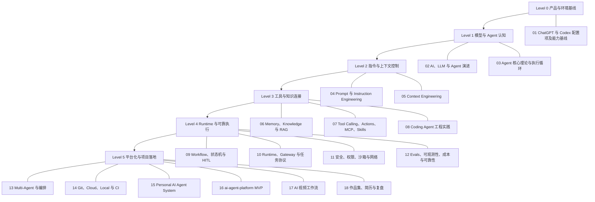
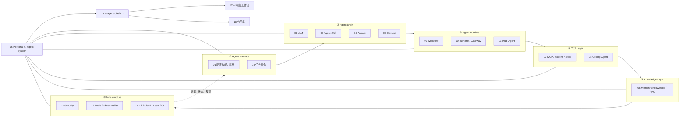
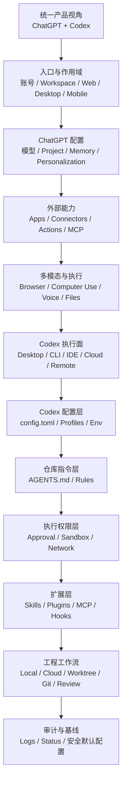
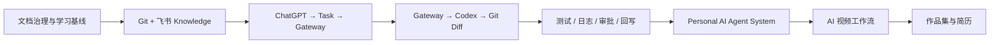
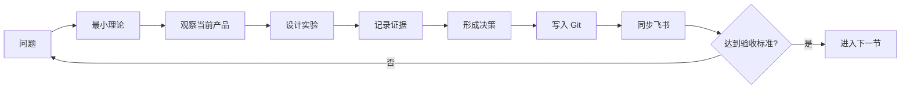

# ChatGPT Agent 工程体系学习大纲图

## 1. 总体学习主线

```mermaid
flowchart TB
    S0[Level 0 产品与环境基线]
    S1[Level 1 模型与 Agent 认知]
    S2[Level 2 指令与上下文控制]
    S3[Level 3 工具与知识连接]
    S4[Level 4 Runtime 与可靠执行]
    S5[Level 5 平台化与项目落地]

    S0 --> S1 --> S2 --> S3 --> S4 --> S5

    S0 --- A1[01 ChatGPT 与 Codex 配置项及能力基线]
    S1 --- A2[02 AI、LLM 与 Agent 演进]
    S1 --- A3[03 Agent 核心理论与执行循环]
    S2 --- A4[04 Prompt 与 Instruction Engineering]
    S2 --- A5[05 Context Engineering]
    S3 --- A6[06 Memory、Knowledge 与 RAG]
    S3 --- A7[07 Tool Calling、Actions、MCP、Skills]
    S3 --- A8[08 Coding Agent 工程实践]
    S4 --- A9[09 Workflow、状态机与 HITL]
    S4 --- A10[10 Runtime、Gateway 与任务协议]
    S4 --- A11[11 安全、权限、沙箱与网络]
    S4 --- A12[12 Evals、可观测性、成本与可靠性]
    S5 --- A13[13 Multi-Agent 与编排]
    S5 --- A14[14 Git、Cloud、Local 与 CI]
    S5 --- A15[15 Personal AI Agent System]
    S5 --- A16[16 ai-agent-platform MVP]
    S5 --- A17[17 AI 视频工作流]
    S5 --- A18[18 作品集、简历与复盘]
```

## 2. 六层架构与章节映射

```mermaid
flowchart LR
  subgraph Interface[① Agent Interface]
    C01[01 配置与能力基线]
    C04a[04 任务指令]
  end

  subgraph Brain[② Agent Brain]
    C02[02 LLM]
    C03[03 Agent 理论]
    C04b[04 Prompt]
    C05[05 Context]
  end

  subgraph Runtime[③ Agent Runtime]
    C09[09 Workflow]
    C10[10 Runtime / Gateway]
    C13[13 Multi-Agent]
  end

  subgraph Tools[④ Tool Layer]
    C07[07 MCP / Actions / Skills]
    C08[08 Coding Agent]
  end

  subgraph Knowledge[⑤ Knowledge Layer]
    C06[06 Memory / Knowledge / RAG]
  end

  subgraph Infra[⑥ Infrastructure]
    C11[11 Security]
    C12[12 Evals / Observability]
    C14[14 Git / Cloud / Local / CI]
  end

  Interface --> Brain --> Runtime --> Tools --> Knowledge --> Infra
  Infra -.证据、状态、反馈.-> Interface
  C15[15 Personal AI Agent System] --- Interface
  C15 --- Brain
  C15 --- Runtime
  C15 --- Tools
  C15 --- Knowledge
  C15 --- Infra
  C15 --> C16[16 ai-agent-platform]
  C16 --> C17[17 AI 视频工作流]
  C16 --> C18[18 作品集]
```

## 3. 第一章内部学习顺序

```mermaid
flowchart TB
  P1[统一产品视角<br/>ChatGPT + Codex]
  P2[入口与作用域<br/>账号 / Workspace / Web / Desktop / Mobile]
  P3[ChatGPT 配置<br/>模型 / Project / Memory / Personalization]
  P4[外部能力<br/>Apps / Connectors / Actions / MCP]
  P5[多模态与执行<br/>Browser / Computer Use / Voice / Files]
  P6[Codex 执行面<br/>Desktop / CLI / IDE / Cloud / Remote]
  P7[Codex 配置层<br/>config.toml / Profiles / Env]
  P8[仓库指令层<br/>AGENTS.md / Rules]
  P9[执行权限层<br/>Approval / Sandbox / Network]
  P10[扩展层<br/>Skills / Plugins / MCP / Hooks]
  P11[工程工作流<br/>Local / Cloud / Worktree / Git / Review]
  P12[审计与基线<br/>Logs / Status / 安全默认配置]

  P1 --> P2 --> P3 --> P4 --> P5 --> P6 --> P7 --> P8 --> P9 --> P10 --> P11 --> P12
```

## 4. 实践项目演进图

```mermaid
flowchart LR
  B0[文档治理与学习基线]
  B1[Git + 飞书 Knowledge]
  B2[ChatGPT → Task → Gateway]
  B3[Gateway → Codex → Git Diff]
  B4[测试 / 日志 / 审批 / 回写]
  B5[Personal AI Agent System]
  B6[AI 视频工作流]
  B7[作品集与简历]

  B0 --> B1 --> B2 --> B3 --> B4 --> B5 --> B6 --> B7
```

## 5. 学习闭环图

```mermaid
flowchart LR
  Q[问题] --> T[最小理论]
  T --> O[观察当前产品]
  O --> E[设计实验]
  E --> R[记录证据]
  R --> D[形成决策]
  D --> G[写入 Git]
  G --> F[同步飞书]
  F --> A{达到验收标准?}
  A -- 否 --> Q
  A -- 是 --> N[进入下一节]
```
