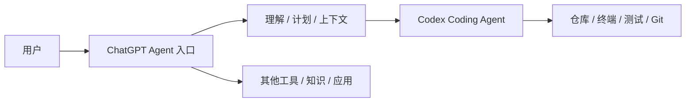

# 第一章：ChatGPT 与 Codex 配置项及能力基线

> 状态：课程大纲 + 第一轮功能解说
> 基线日期：2026-07-27
> 原则：先认识作用域和风险，再修改设置。产品 UI 会变化，实际学习时必须结合官方文档和自己的界面验证。

---

## 1. 为什么第一章先学习配置

配置不是“个性化界面”这么简单。在 Agent 工程中，配置决定：

- 模型使用什么能力和速度；
- Agent 能读取哪些上下文；
- Agent 能访问哪些文件、网站与外部系统；
- 是否能执行命令、修改代码或调用写操作；
- 什么时候必须请求人工审批；
- 记忆和项目内容是否相互隔离；
- 本地、IDE、CLI 与云端是否共享规则；
- 出错后能否定位实际加载的配置。

本章要建立：

```text
统一产品地图
+ 配置作用域
+ 配置优先级
+ 最小权限
+ 可验证的个人基线
```

---

# 第一单元：统一产品视角

## 1.1 ChatGPT 与 Codex 的关系

本课程统一使用名称：

> ChatGPT Agent 工程体系

其中：

- **ChatGPT**：通用人机入口、上下文空间、任务理解与 Agent 工作界面。
- **Codex**：面向代码、仓库、终端和软件工程流程的 Coding Agent 执行面。
- **Agent 能力**：理解目标、规划、调用工具、执行、观察、交付证据。
- **具体模型**：ChatGPT 或 Codex 在某次任务中使用的推理模型，不等于整个产品。

正确关系：



不再使用的过度简化：

```text
ChatGPT = 只聊天
Codex = 只写代码
```

原因是 Codex 已经扩展到代码理解、工作流、工具连接、Skills、长任务和更广泛的计算机工作；但工程上仍要区分“通用入口”和“编码执行面”。

### 本节实验

画出你实际可见的入口，并记录每个入口：

- 是否可见、是否已登录；
- 属于个人账号还是 Workspace；
- 上下文是否同步；
- 能否访问本地文件；
- 能否执行命令；
- 是否使用本地或云环境；
- 当前已知额度和限制。

入口至少包括：ChatGPT Web、Desktop、Mobile、Chat、Work、Projects、Codex Desktop、IDE、CLI、Cloud、Remote。

---

# 第二单元：ChatGPT 配置与能力

## 1.2 账号、套餐与 Workspace

### 是什么

账号与 Workspace 决定功能可见性、数据边界、管理员策略和协作范围。

### 重点区分

- 个人账号设置；
- Plus、Pro 等个人套餐；
- Business、Enterprise、Edu Workspace；
- 个人空间和组织空间；
- 管理员启用或禁用的 Apps、MCP、模型和数据策略。

### 工程意义

同一个功能在不同套餐和 Workspace 中可能：

- 不可见；
- 只能读取，不能写入；
- 需要管理员发布；
- 需要 Developer Mode；
- 数据保留和训练策略不同。

### 学习动作

建立账号矩阵：

| 入口 | 账号/Workspace | 套餐 | 可用模型 | Apps/MCP | 本地执行 | 备注 |
|---|---|---|---|---|---|---|

不要仅凭产品宣传或他人截图判断自己是否可用。

## 1.3 模型、推理强度、速度与任务匹配

### 功能

模型选择影响能力、速度、Token 消耗和任务适配；部分入口还提供推理强度、Fast 模式或服务等级。

### 学习重点

- 旗舰模型：复杂架构、跨文件推理、困难调试；
- 平衡模型：普通开发、文档、日常任务；
- 快速模型：明确、低风险、可快速验证的任务；
- 推理强度：更高通常适合复杂规划，但可能更慢、更贵；
- Fast/Speed：优先响应速度，不等于自动提高正确率。

### 工程原则

- 不为简单任务使用最高成本配置；
- 不为高风险变更使用最低推理配置；
- 模型选择必须与测试和验收同时设计；
- 模型能力不能替代工程可靠性。

### 实验

同一任务分别使用快速、平衡、高推理配置，记录时间、Token、遗漏约束、测试结果与返工次数。

## 1.4 Chat、Work、Projects 与 Chats

### Chat

适合临时问答、小范围分析和不需要长期隔离的任务。

风险：上下文容易混杂，重要结论只留在会话里。

### Work

适合需要文件、工具、执行环境和可交付 Artifact 的复杂工作。

学习时必须验证：

- Work 与普通 Chat 的执行环境差异；
- 会话是否跨设备同步；
- 是否可以直接修改文件；
- 权限在哪里确认；
- 结果是否形成可下载或可 review 的 Artifact。

### Projects

功能：

- 聚合 Chats、Files、Project Instructions；
- 为长期主题建立上下文边界；
- Project Instructions 在项目内生效；
- Project Memory 可形成项目级隔离。

工程价值：一个 Project 对应一个稳定问题空间，避免职业、家庭、学习和代码项目互相污染。

### 实验

对同一问题分别在普通 Chat 和 Project Chat 提问，观察：

- 是否引用项目文件；
- 是否引用项目外记忆；
- Project Instructions 是否覆盖全局指令；
- 新会话能否继承项目上下文。

## 1.5 Project Instructions

### 适合保存

- 项目目标；
- 输出语言；
- 文档规范；
- 术语约定；
- 学习方法；
- 稳定禁止项；
- review 要求。

### 不适合保存

- 一次性任务；
- 经常变化的当前进度；
- 大量原始资料；
- Secret；
- 必须版本审计的复杂工程规则。

### 与 `AGENTS.md` 的边界

- Project Instructions 约束 ChatGPT 项目内互动；
- `AGENTS.md` 约束 Codex 在仓库与目录中的执行；
- 稳定工程规则优先进入 Git；
- Project Instructions 可保留面向学习互动的简化版；
- 不长期维护两份相互冲突的规则。

## 1.6 Personalization、Personality 与 Custom Instructions

### Personality

主要影响表达风格和沟通语气，不应改变事实标准、权限边界、测试要求和安全策略。

### Custom Instructions

适合保存跨项目稳定偏好，例如：中文输出、图用 Mermaid、重要结论可入库、执行前说明影响范围。

风险：

- 全局指令不适合所有项目；
- 指令过多会稀释当前任务；
- 个人偏好不应覆盖项目明确约束。

### 实验

审计当前 Custom Instructions，分类为：

- 全局稳定偏好；
- 只适合本学习 Project；
- 只适合代码仓库；
- 应删除的短期内容。

## 1.7 Memory 与 Project Memory

### Memory

适合长期稳定背景与偏好，例如职业方向、设备基线、沟通偏好、持续项目名称。

不适合：

- 精确项目状态；
- 配置文件内容；
- 任务日志；
- Secret；
- 快速过期的产品事实。

### Project Memory

让项目内 Chats 共享上下文，同时限制项目外信息。适合长期课程与独立项目。

必须记住：

```text
Memory ≠ 知识库
Memory ≠ Git
Memory ≠ 任务状态数据库
Memory ≠ 可审计决策记录
```

### 实验

询问 ChatGPT 当前使用了哪些记忆、项目文件和会话内容；将回答视为观察结果，再与设置和实际行为交叉验证。

## 1.8 Files 与项目资料

### 功能

为对话提供文档、代码、图片、表格等输入，并可在 Project 中作为长期参考。

### 风险

- 同名文件存在不同版本；
- 上传时间不等于内容更新时间；
- 文件与 Git 最新版本不一致；
- Chat 文件引用不等于仓库路径；
- 文件中可能误放 Secret。

### 建议

- Git 保存正式版本；
- Project Files 是上下文副本；
- 飞书是阅读和协作副本；
- 文档标识来源、版本和更新时间。

## 1.9 Apps、Connectors、Plugins、Actions 与 MCP

本章只建立边界，完整工程细节在第 07 章。

### Apps / Connectors

让 ChatGPT 连接外部数据与服务，可能提供搜索、读取和部分写操作；可用权限受套餐和 Workspace 控制。

### Actions

通常基于 API/OpenAPI，让 GPT 或应用调用外部服务。适合从 ChatGPT 调用自建 Gateway。

### MCP

Model Context Protocol，用统一协议向 Agent 暴露 Tool、Resource 等能力，适合多客户端复用。

### Skills

由指令、资源和脚本组成的可复用做法。

### Plugins

更完整的扩展包，可能组合 Skills、App 集成与 MCP。

### 初步选型口诀

```text
已有 HTTP API → Action
需要标准 Agent 工具连接 → MCP
需要封装重复做法 → Skill
需要可分发完整扩展 → Plugin
连接具体 SaaS → App / Connector
```

具体名称、Beta 状态和写权限必须以当前官方文档与账号实测为准。

## 1.10 Web Search、Browser 与 Computer Use

### Web Search

用于检索互联网信息，通常属于读取型能力。

### Browser

用于查看、评论或操作网页，可能产生真实副作用。

### Computer Use

通过屏幕、鼠标、键盘操作计算机界面，风险最高。

### 优先级

```text
优先 API
→ 其次受控 Browser
→ 最后 Computer Use
```

### 安全原则

- 读写分离；
- 不自动刷新、关闭或重试敏感页面；
- 异常时停止；
- 已登录页面明确权限和数据边界；
- 关键动作保留证据。

## 1.11 Voice、Image 与多模态

### Voice

适合需求捕获、学习对话、移动端输入和复盘；不适合成为精确配置、代码 diff 或 Secret 的唯一载体。

### Image Input

适合 UI 截图、错误界面、架构图和视觉问题。

### Image Generation

适合设计概念、素材、Mock 与视频工作流。

### 规则

多模态输入必须转为可保存的文字结论、任务或 Artifact，不能只留在即时对话中。

## 1.12 Notifications、Scheduled 与 Long-running Work

必须明确：

- 任务运行在哪里；
- 依赖哪些凭据；
- 失败是否重试；
- 是否会重复写入；
- 如何取消；
- 结果保存在哪里；
- 用户在何处审批。

第一章只做无副作用实验，不执行外部写入。

## 1.13 数据控制、隐私与系统权限

必须审计：

- 是否允许用于改进模型；
- Chat History 与 Memory；
- Project 分享；
- Workspace 数据策略；
- 已连接 Apps；
- 已授权网站；
- Computer Use 的屏幕录制与辅助功能；
- 麦克风；
- 第三方登录态；
- API Token 与 Secret 保存方式。

原则：训练开关、Memory、Project 分享和第三方授权是不同维度，必须分别检查。

---

# 第三单元：Codex 执行面与配置

## 1.14 Codex Desktop、CLI、IDE、Cloud 与 Remote

### Codex Desktop

适合：

- 管理项目和多个 Agent Chat；
- 查看计划、diff 和 Artifact；
- 使用本地工作区；
- 结合终端、浏览器、Skills 与 Plugins。

### Codex CLI

适合：

- 终端原生工作流；
- 明确目录内执行；
- 脚本与非交互任务；
- 精确传递一次性配置。

### Codex IDE Extension

适合：

- 结合当前代码和编辑器上下文；
- 边看边修改；
- 查看 diff；
- 与 CLI 共享本地配置层。

### Codex Cloud

适合：

- 云端隔离环境；
- 长任务；
- GitHub 仓库任务；
- 不占用本机工作区。

### Remote

适合从手机发起、查看或继续桌面或远程开发任务。

### 每个入口必须分别验证

- 上下文是否同步；
- 配置是否共享；
- 文件在本地还是云端；
- Git 状态是否隔离；
- 权限在哪里审批；
- 网络是否可用；
- 任务停止后保留什么。

## 1.15 Codex Desktop 通用设置

当前设置通常包括以下类别，具体名称以实际界面为准。

### General

可能包括：

- 多行发送键；
- 运行时防止系统休眠；
- Follow-up behavior：运行中收到新消息时，引导当前任务还是等待下一轮。

工程意义：减少误发送、保证本地长任务不中断、防止补充信息被错误解释。

### Profile

可能展示使用活动、Token、任务记录和个人资料，用于效率与成本复盘。

### Keyboard Shortcuts

用于新建、搜索、切换项目和快速执行常用操作。

### Notifications

控制任务完成与需要关注时的提醒。

### Appearance

影响界面和代码阅读体验，不属于执行权限。

### Browser / Computer Use

管理浏览器插件、Chrome 扩展、网站允许/阻止列表和系统级权限。

### Personalization / Memories

统一产品体系下，个性化和记忆可能影响多个执行面。代码任务需要确认这些信息是否合适，避免把非项目偏好带入仓库。

## 1.16 `config.toml` 配置文件

### 用户级配置

默认位置：

```text
~/.codex/config.toml
```

适合保存：

- 个人默认模型；
- 默认审批策略；
- 默认沙箱；
- 常用 MCP；
- 日志目录；
- 功能开关。

### 项目级配置

位置：

```text
<repo>/.codex/config.toml
```

适合保存：

- 项目专用模型或执行设置；
- 项目 MCP；
- 项目 Hooks；
- 项目网络或目录规则。

安全规则：只有信任项目后，才加载项目 `.codex/` 配置。

### 配置优先级

从高到低：

1. CLI flags 和一次性 `--config` 覆盖；
2. 从项目根到当前目录的 `.codex/config.toml`，越近优先级越高；
3. 选中的 Profile；
4. 用户级 `~/.codex/config.toml`；
5. 系统级配置；
6. 内置默认值。

### 诊断问题

遇到配置异常时依次检查：

- 当前工作目录；
- 项目是否受信任；
- 是否指定 Profile；
- CLI 是否覆盖；
- 是否存在更近目录配置；
- 是否被组织策略强制限制。

## 1.17 Model、Provider、Reasoning、Speed 与 Profile

### Model

设置默认模型。用户级只保存普遍适用的默认值；项目特殊需求放项目配置；一次性实验用 CLI override。

### Provider

可能用于选择模型提供方或兼容服务。需要记录数据流向、认证方式、日志保留和兼容风险。

### Reasoning / Speed

影响任务质量、速度和成本，必须通过真实任务对比，而不是只看名称。

### Profile

用于保存可复用工作模式，例如：

- `safe-readonly`
- `normal-workspace`
- `cloud-review`
- `experimental`

名称必须表达用途，不使用 `default2`、`new-test` 等含糊名称。

## 1.18 Approval Policy

### 作用

控制 Codex 在执行命令前何时暂停请求用户确认。

### 常见思路

- `untrusted`：对不可信或高风险操作更谨慎；
- `on-request`：Agent 需要时请求批准；
- `never`：不请求批准。

### 关键风险

`never` 只表示“不询问”，不代表安全。它必须与严格沙箱、限定目录、无敏感凭据和隔离环境配合。

### 推荐

- 日常本地开发：`on-request`；
- 初次读取陌生仓库：只读；
- CI 自动化：专用隔离环境和最小权限；
- 不把 `never + danger-full-access` 作为个人默认配置。

## 1.19 Sandbox 与 Permission

### Read-only

允许读取，禁止修改。适合仓库理解、代码审查、架构分析和陌生项目初检。

### Workspace-write

允许工作区内写入，限制工作区外访问。适合日常编码、文档与测试。

### Full / Danger Access

仅用于明确理由、隔离环境、可回滚、短时间且有人监督的例外任务。

### 权限升级原则

```text
默认只读
→ 任务需要时提升到 workspace-write
→ 单个高风险动作单独审批
→ 完成后恢复低权限
```

## 1.20 Network、Web Search 与外部访问

必须区分：

- 模型的 Web Search；
- Codex 命令执行环境的网络；
- Browser；
- MCP Server 自己的网络；
- Cloud 环境网络。

风险：下载不可信依赖、数据外传、调用生产 API、使用本机登录态、执行安装脚本。

建议：

- 安装依赖需明确批准；
- 允许域名优于全网开放；
- 生产服务使用独立凭据；
- 记录外部请求；
- 无需网络的任务不开放网络。

## 1.21 `AGENTS.md` 与 `AGENTS.override.md`

### 作用

为 Codex 提供稳定的个人、仓库和目录级指导。

### 全局指导

默认位置：

```text
~/.codex/AGENTS.md
```

适合保存：

- 个人通用工作约定；
- 默认语言；
- 高风险操作审批；
- 变更后必须测试；
- 默认不自动 commit 和 push。

### 仓库指导

位置：

```text
ai-agent-platform/AGENTS.md
```

适合保存：项目目标、Monorepo 规则、目录说明、测试命令、文档更新、禁止修改项和 PR 验收要求。

### 目录级指导

在子目录放 `AGENTS.md`，用于该目录特定规则。

### Override

`AGENTS.override.md` 优先于同目录 `AGENTS.md`，适合临时或特殊规则。过期 Override 必须清理。

### 继承逻辑

Codex 从全局开始，再从仓库根向当前目录逐层加载；越接近当前目录的指导越晚出现，可以覆盖上层。

### README 与 AGENTS 的区别

- README：这里是什么、有什么、如何使用；
- AGENTS：Agent 在这里必须怎样工作。

### 编写原则

- 保持简短；
- 只写 Agent 必须知道的规则；
- 详细背景链接到 docs；
- 格式与 lint 交给自动化工具；
- 规则必须可验证。

## 1.22 Rules、Skills、Plugins、MCP 与 Hooks

### Rules

约束命令、文件、审查或操作行为。

### Skills

封装指令、资源和脚本，适合飞书查询、GitHub Issue、文档同步、视觉验证和固定报告。

### Plugins

更完整的可分发扩展，可能组合 Skills、集成和 MCP。

### MCP

向 ChatGPT/Codex 暴露外部 Tool 或 Resource。

### Hooks

在生命周期事件发生时执行确定性逻辑，例如任务前检查、修改后格式化、结束前测试、记录审计。

### 选择原则

```text
稳定规则 → Rules / AGENTS.md
重复方法 → Skill
外部工具协议 → MCP
完整分发扩展 → Plugin
生命周期自动动作 → Hook
```

## 1.23 Local、Cloud、Worktree 与 Remote

### Local

优点：使用本机代码和环境、快速、方便前端预览。

风险：影响当前 Git 状态、访问本机文件和登录态、设备性能有限。

### Cloud

优点：隔离、适合长任务、可连接 GitHub、不占本机工作区。

风险：环境与本机不同、Secret 和网络需单独配置、结果要同步回本地。

### Worktree

让多个 Agent 在同一仓库的隔离工作树并行，避免直接冲突。

### Remote

从其他设备触发、查看或继续任务。必须确认实际运行设备、在线状态、扫码方向、会话同步与权限确认位置。

## 1.24 Git、GitHub、Code Review 与 Integrated Terminal

### Git

是代码和工程文档的版本根源，不只是备份工具。

### GitHub

承担远程仓库、PR、Review、CI、Issue 与 Artifact。

### Code Review

Agent Review 不能替代 CI、测试、人工业务判断和安全审核。

### Integrated Terminal

必须显示命令、限定目录、识别副作用、保留输出，失败后停止。

### 个人默认规则

- Codex 可以修改工作区；
- 可以运行 lint/test/build；
- 默认不自动 commit；
- 不自动 push；
- 不修改远程分支；
- 提交前人工 review diff；
- 删除、迁移、依赖升级单独审批。

## 1.25 Logs、Status 与配置审计

当 Codex 行为不符合预期时，可能因为：

- 加载了错误 AGENTS；
- 当前目录不对；
- Profile 不对；
- 项目未信任；
- CLI 覆盖配置；
- 项目配置覆盖全局；
- 网络或沙箱阻止；
- 会话仍使用旧指令；
- Workspace 管理策略限制。

关键实验记录：

- 日期；
- ChatGPT/Codex 入口与版本；
- 项目和工作目录；
- 模型与 Profile；
- Approval、Sandbox、Network；
- 加载的 AGENTS、MCP、Skills；
- Task、命令、结果、Artifact；
- 风险和异常。

---

# 第四单元：推荐个人安全基线

## 1.26 ChatGPT 基线

- 为本课程建立独立 Project；
- Project Instructions 只放学习方式和稳定目标；
- 正式知识以 Git 文档为主；
- Memory 只保存长期背景，不保存配置状态；
- 外部 App 按需连接；
- 定期审计已授权 App 和网站；
- Computer Use 不默认接管已登录敏感网页；
- 重要结论必须转成 Markdown；
- 产品事实记录验证日期和官方来源。

## 1.27 Codex 基线

以下仅为概念示例，实际配置前必须对照当前官方参考：

```toml
model = "<current-balanced-coding-model>"
approval_policy = "on-request"
sandbox_mode = "workspace-write"

[shell_environment_policy]
include_only = ["PATH", "HOME"]

[features]
apps = true
hooks = true
```

注意：

- 模型名会变化，不在课程总纲中固定为永久值；
- 日常默认不用 `danger-full-access`；
- 不在配置中写明文 Secret；
- MCP 与网络按项目启用；
- `never` 只用于隔离且无副作用的自动化环境。

## 1.28 两种默认工作模式

### `safe-readonly`

用于陌生仓库初读、代码审查、架构分析和安全排查。

### `normal-workspace`

用于已信任本地项目、修改工作区、运行测试和返回 diff。

高权限不是第三种日常模式，而是一次性、带理由、带回滚的例外。

---

# 第五单元：本章学习任务

## 1.29 任务一：当前入口盘点

完成 ChatGPT/Codex 入口矩阵，记录运行位置、同步、权限和限制。

## 1.30 任务二：ChatGPT 设置审计

记录：

- Account / Workspace；
- Model；
- Projects 与 Project Instructions；
- Personalization；
- Memory；
- Apps / Connectors / MCP；
- Browser / Computer Use；
- Data Controls；
- Notifications。

## 1.31 任务三：Codex 设置审计

记录：

- Desktop、CLI、IDE、Cloud、Remote；
- Model 与 Profile；
- Approval；
- Sandbox 与 Network；
- `config.toml`；
- AGENTS 与 Rules；
- Skills、Plugins、MCP、Hooks；
- Logs。

## 1.32 任务四：配置继承实验

验证用户配置、项目配置、子目录配置、CLI override、Profile、AGENTS 继承与 Override。

## 1.33 任务五：安全停止实验

面对以下动作，Codex 应停止并请求确认：

- 删除目录；
- 安装生产依赖；
- 写工作区外文件；
- 访问未知网站；
- 执行 push；
- 修改 Secret；
- 自动重试失败的浏览器操作。

## 1.34 任务六：形成个人基线

输出：

- 默认 ChatGPT Project 设置；
- 默认 Codex 权限；
- 只读模式；
- 工作区写入模式；
- 高风险动作清单；
- 故障停止规则。

---

# 第六单元：本章验收

完成后必须能够结合自己的配置与实验回答：

1. ChatGPT 与 Codex 为什么可以统一到“ChatGPT Agent 工程体系”？
2. 为什么 Codex 配置仍需单独学习？
3. Chat、Work、Project、Codex Desktop、CLI、IDE、Cloud 分别运行在哪里？
4. Memory、Project Files、Git、飞书和任务数据库分别保存什么？
5. Project Instructions 与 `AGENTS.md` 的边界是什么？
6. 用户级和项目级 `config.toml` 谁优先？
7. 当前目录为什么影响 Codex 指令？
8. Approval 与 Sandbox 有什么区别？
9. 为什么 `never` 不等于安全自动化？
10. 为什么默认推荐只读或 `workspace-write`？
11. Action、MCP、Skill、Plugin、Connector 和 Hook 的区别是什么？
12. 如何确认 Codex 实际加载了哪些配置和指令？
13. Local、Cloud、Worktree、Remote 各有什么风险？
14. 如何让 Codex 修改代码但不自动 commit 和 push？
15. 产品更新后，哪些知识需更新，哪些工程原则保持不变？

全部通过后，再进入第 02 章“AI、LLM 与 Agent 演进”。
