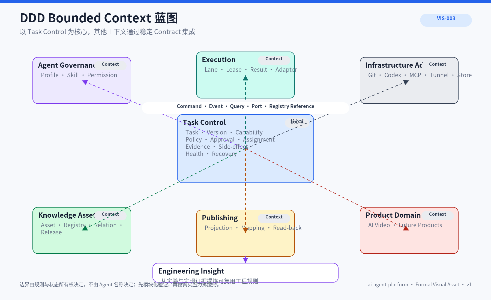
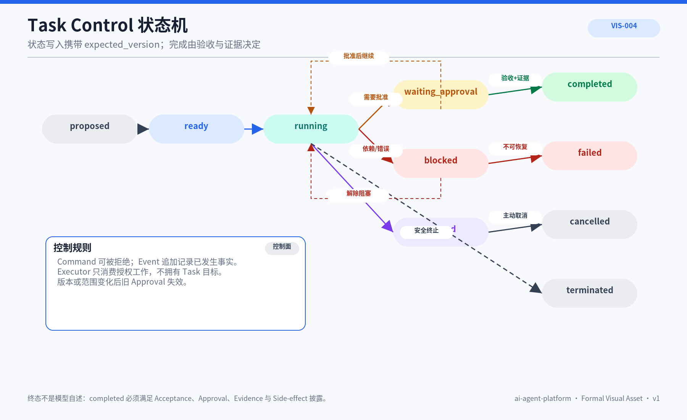
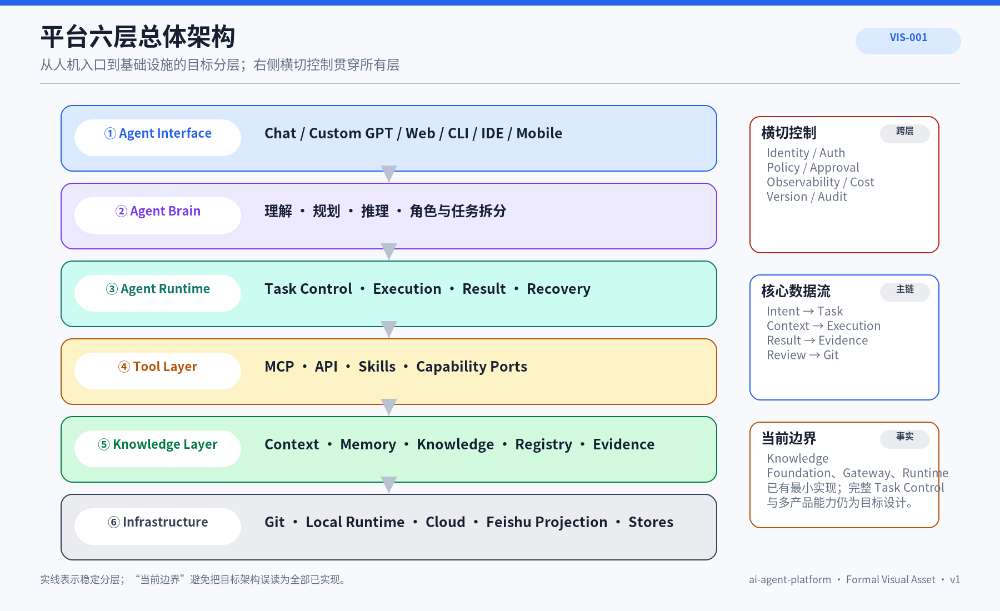
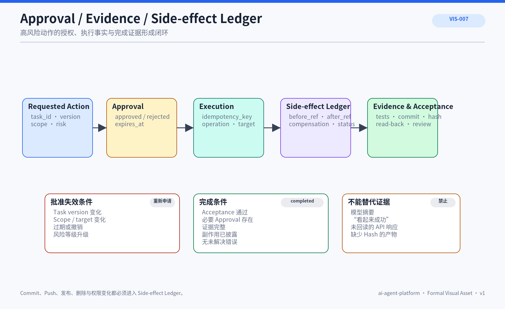
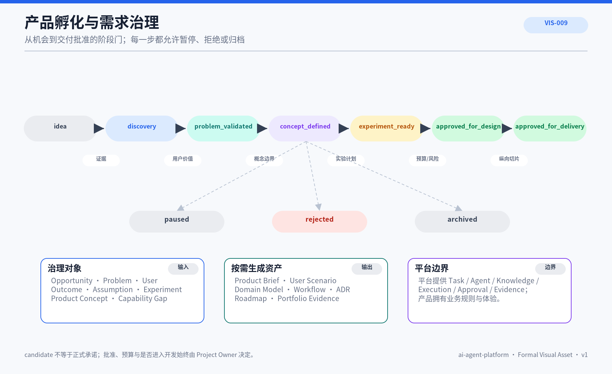

# 04 平台架构整合前观点与后续处理候选

> 本 Document Bundle 保存平台架构收敛前的文章、详细草案和旧视觉资产。它们不是无价值内容，也不是当前实现承诺。核心架构语义已经进入 `ARC-001` 与 `ARC-016`；详细规则由后续专题承接；尚无真实调用方的内容继续作为延迟决策候选。

## 1. 状态解释

| 分类 | 含义 | 使用规则 |
|---|---|---|
| `merged_into_canonical` | 核心结论已经进入 ARC-001 / ARC-016 | 以 Canonical 文档为准，旧文只作来源追踪 |
| `delegated_to_downstream` | 详细规则由 05～09 的正式专题继续 Review | 后续专题不得违背 ARC 状态所有权和不变量 |
| `deferred_candidate` | 当前无真实调用方、代码或验收 | 保留价值，不提前物化为平台承诺 |
| `historical_visual` | 旧图仍有解释价值，但不再是架构入口 | 不得回链为 Canonical Visual |

## 2. 旧资产去向

| 原资产 | 当前分类 | 已进入 Canonical 的内容 | 后续承接 / 恢复条件 |
|---|---|---|---|
| ARC-007 | `merged_into_canonical` | Task / Role / Executor 分离、依赖、默认串行和并行前置条件进入 ARC-016 | 多窗口交互细节出现真实 UI 后再评估 |
| ARC-008 | `merged_into_canonical` | Bounded Context、状态所有权、Context Map 原则、模块化单体进入 ARC-001 | 领域 Schema 由实现任务深化 |
| ARC-009 | `merged_into_canonical` + `delegated_to_downstream` | Task Version、状态、依赖、完成门禁进入 ARC-001 / 016 | 完整状态机由 `07` 与 Task Store 实现共同确认 |
| ARC-010 | `merged_into_canonical` | Execution Lane、Lease、Adapter、Workspace 隔离进入 ARC-001 / 016 | Lane 字段和生命周期由真实 Runtime Contract 确认 |
| ARC-011 | `merged_into_canonical` + `delegated_to_downstream` | 一个可写 Lane 一个隔离工作区、Integration Task 原则进入 ARC-016 | Git 操作细节由 `07` 工作流承接 |
| ARC-012 | `merged_into_canonical` + `delegated_to_downstream` | Agent Governance、Profile、Skill、Knowledge Pack 位置进入 ARC-001 | 具体资产规范由 `05/06` 承接 |
| ARC-013 | `merged_into_canonical` + `delegated_to_downstream` | Approval、Evidence、Side-effect 和完成门禁进入 ARC-001 / 016 | 账本 Schema 与审批流程由 `07/08` 承接 |
| ARC-014 | `merged_into_canonical` + `delegated_to_downstream` | Health、Snapshot、Safe Continuation、停止恢复出口进入 ARC-001 / 016 | 恢复等级由实验和真实错误模型确认 |
| ARC-015 | `merged_into_canonical` + `deferred_candidate` | 多执行器 Adapter 与 MVP-7 位置进入 ARC-001 / 016 | Usher、Host Drift 和多设备路由在第二执行器出现后恢复 |
| ARC-017 | `delegated_to_downstream` | Product Domain 在 ARC-001 保留正式占位 | 产品孵化细节归 `01/07` |
| ARC-018 | `delegated_to_downstream` | Registry / Evidence 作为治理与汇报数据源进入 ARC-001 | 自动汇报归 `07/09` |
| DOM-001 | `merged_into_canonical` | Task、Assignment、Context、Execution、Evidence、Knowledge Asset Aggregate 进入 ARC-001 | 字段级模型随 Contract 实现深化 |

## 3. DDD 与领域模型历史草案

平台按“谁拥有状态和规则”划分 Context，而不是按 ChatGPT、Codex、Browser、Tunnel 等工具名称划分。旧草案包含 Interaction Loop、Task Control、Agent Collaboration、Context & Knowledge、Execution Runtime、Trust & Recovery、Platform Registry & Release 等命名；当前 Canonical 已收敛为 Task Control、Agent Governance、Context & Knowledge、Execution Orchestration、Evidence & Safety、Publishing & Registry、Product Domain、Engineering Insight。

旧图 `VIS-003` 继续保存在本 Bundle；它不表示已经拆成独立服务。



### AI 可读语义镜像

Visual Asset ID：`VIS-003`。

旧图表达多个 Bounded Context 通过 Command、Query、Event、Port 和稳定 ID Reference 协作。当前名称和所有权以 ARC-001 为准。

## 4. Task Control 与状态机历史草案

旧状态草案：

```text
proposed → ready → running
running → waiting_input / waiting_approval / blocked / paused
running → validating → awaiting_review → accepted → closed
running / validating → failed_safe
failed_safe → resumable / replan_required / terminated
```

其价值在于 `expected_version`、`idempotency_key`、Acceptance、Evidence 和 Safe Stop 不变量；具体状态枚举必须由未来 Task Contract 与测试重新确认。



### AI 可读语义镜像

Visual Asset ID：`VIS-004`。

旧图表达正常路径、等待、失败安全和恢复入口。它是实现候选，不是当前运行状态机。

## 5. Execution Lane、Worktree 与多执行器历史草案

旧 Lane 字段候选：

```text
lane_id / task_id / task_version / execution_id / attempt
role_id / agent_id / executor_id / capability
repository / commit / branch / worktree / scope
approval_refs / environment / resource_budget / lease
```

旧生命周期：`requested → leased → preparing → running → validating → reported → released`。其核心价值已进入 ARC-001 / 016：Provider 差异停留在 Adapter、过期 Lease 结果不得写回、默认串行、一个可写 Lane 一个隔离工作区、汇合由独立 Integration Task 处理。


### AI 可读语义镜像

Visual Asset ID：`VIS-005`。

旧图表达统一 Execution Port 接入 Codex、Work、Script、Browser 和未来执行器；具体 Adapter 和路由只有在真实实现后升级。

## 6. Agent、Evidence、Recovery 与产品治理候选

- Agent Profile = Role + Capability + Skill Ref + Knowledge Pack Ref + Tool Contract + Policy + Publication Target；详细规范归 `05/06`；
- Approval、Evidence 与 Side-effect 必须绑定 Task Version、Action 和 Scope；详细流程归 `07/08`；
- Health 区分 Context、Execution、Network、Resource、State；恢复受次数、时间和资源预算限制；
- 产品孵化、需求阶段门和项目汇报属于平台能力消费者，不属于 Runtime 核心。

旧 `VIS-006～VIS-009` 保留在本 Bundle，作为后续专题的来源材料。

## 7. 延迟决策候选

- Usher / Host Configuration Adapter；
- 通用 Workflow Engine；
- Executor Registry 与集群调度；
- 多设备、手机或远程 Executor；
- 动态模型路由；
- 通用 Task Event Store 技术选型；
- 自动产品孵化与自动项目汇报。

恢复任何候选前必须明确真实调用方、当前代码、依赖、风险、验收和停止条件，并重新运行 Project Knowledge Synthesis。

## 8. 恢复规则

1. 先核对 ARC-001 / ARC-016 和当前 Context；
2. 指明真实任务、调用方和业务价值；
3. 以代码、测试、实验和 Registry 证据区分当前事实与目标设计；
4. 决定恢复旧 ID、新建资产或继续归档；
5. 更新跨文档关系和正式占位；
6. 生成新的正式图和 AI 可读语义镜像；
7. 经人工 Review 后才能进入 `docs/knowledge/`。


## 9. 旧视觉资产完整索引

以下视觉资产均为历史辅助视图，不再作为 Canonical 架构入口；保留它们是为了让来源、旧推理和后续专题可以追溯。



### AI 可读语义镜像

Visual Asset ID：`VIS-001`。

该图从 Agent Interface、Brain、Runtime、Tool、Knowledge 与 Infrastructure 六层解释平台责任。它适合教学与 Portfolio，但不能替代 ARC-001 的 System Context、DDD 和真实运行闭环。


### AI 可读语义镜像

Visual Asset ID：`VIS-006`。

该图表达 Profile 将 Role、Skill、Knowledge Pack、Tool Contract 与 Policy 组合，再派生到不同 Host。当前 Canonical 只保留其在 Agent Governance 中的位置，详细资产规则由 `05/06` 承接。



### AI 可读语义镜像

Visual Asset ID：`VIS-007`。

该图把 Approval、Execution、Side Effect、Evidence 与 Review Decision 连接成可信闭环。当前 Canonical 以 Evidence & Safety Context 和 MVP-4 表达其位置与阶段依赖。


### AI 可读语义镜像

Visual Asset ID：`VIS-008`。

该图表达 Health Event 到暂停、重试、续跑、移交和终止快照的路径。具体恢复等级必须由真实错误模型、幂等和副作用实验确认。



### AI 可读语义镜像

Visual Asset ID：`VIS-009`。

该图表达机会发现、需求证据、阶段门、产品资产生成和停止条件。它属于 Product Domain 的上层治理视图，由 `01/07` 承接，不进入 Runtime 核心。
