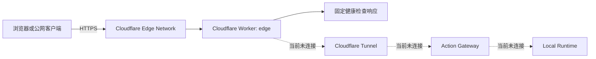

# Cloudflare Edge Worker 安全、运行与审计说明

> **文档状态**：待用户 Review  
> **建议仓库路径**：`docs/technical/技术方案/安全/SEC-002-cloudflare-edge安全与运行说明.md`  
> **发布策略**：暂不进入 `docs/knowledge/`，暂不同步飞书知识库  
> **代码基线**：`5b1c24888e00b03d04565d520684e8b0f892a2fa`  
> **当前公网地址**：`https://edge.ai-agent-platform.workers.dev`  
> **当前有效接口**：`GET /health`

---

## 1. 文档目的

`apps/cloudflare-edge` 是 `ai-agent-platform` 当前第一个正式部署到 Cloudflare 的边缘组件。

它已经拥有固定 HTTPS 地址，但当前并不是完整公网 Gateway，也没有连接本机。本文用于回答以下问题：

- 这个目录到底做了什么；
- Cloudflare 帮我们承担了什么；
- 当前公网能访问什么、不能访问什么；
- 为什么访问根路径会得到 404；
- 代码、部署、账号凭据和 Secret 如何隔离；
- 当前安全性如何验证；
- 如何部署、断开、删除和恢复；
- Mac 必须开启 VPN 对当前方案有什么影响；
- 后续接入 Tunnel、Action Gateway 和 Custom GPT 前，必须增加哪些安全措施；
- 当前哪些结论已经有代码和测试证据，哪些仍属于下一阶段假设。

本文只描述当前真实实现和已经验证的事实。未来设计会单独标注，不与当前能力混淆。

---

## 2. 当前结论

当前 `Cloudflare Edge Worker` 是一个：

> **由 Cloudflare 托管、拥有固定 HTTPS 地址、仅提供健康检查的公网占位入口。**

它当前已经完成：

- Worker 源码进入 Git；
- Wrangler 部署配置进入 Git；
- 固定 `workers.dev` HTTPS 地址建立；
- 本地单元测试；
- TypeScript 类型检查；
- 根级完整验证；
- 真实公网验证；
- Secret 扫描；
- Git 提交和推送。

它当前没有：

- Cloudflare Tunnel；
- Quick Tunnel 转发；
- 本机 Action Gateway 连接；
- Local Runtime 连接；
- Custom GPT Action；
- OpenAPI；
- Bearer API Key；
- Origin 地址；
- Worker Secret；
- 数据持久化；
- 任意代理能力；
- 文件、Shell、Git 或本机系统操作能力。

因此当前最重要的安全事实是：

```text
Worker 已经在线，但没有连接本机。
```

---

## 3. 当前真实架构



当前真实请求链路：

```text
公网客户端
→ Cloudflare DNS 与 HTTPS
→ edge.ai-agent-platform.workers.dev
→ Cloudflare Worker
→ 固定 JSON 响应
```

当前不成立的链路：

```text
Worker
→ Tunnel
→ Mac
→ Action Gateway
→ Local Runtime
```

---

## 4. 本次实际完成了什么

### 4.1 新增 Workspace

新增：

```text
apps/cloudflare-edge
```

Workspace 名称：

```text
@ai-agent-platform/cloudflare-edge
```

### 4.2 创建固定 Cloudflare Worker

Worker 部署名称：

```text
edge
```

Cloudflare 账号级 `workers.dev` 子域：

```text
ai-agent-platform.workers.dev
```

最终固定地址：

```text
https://edge.ai-agent-platform.workers.dev
```

地址结构是 Cloudflare Workers 的固定格式：

```text
https://<worker-name>.<account-subdomain>.workers.dev
```

因此不能简化为：

```text
https://edge.workers.dev
```

### 4.3 删除旧 Worker

最初临时部署过名称重复的 Worker：

```text
ai-agent-platform-edge
```

它对应的旧地址已经删除，并验证返回 404。

当前保留的唯一目标 Worker 是：

```text
edge
```

### 4.4 纳入根级验证

根目录 `package.json` 新增：

```text
check:edge
```

并将 Edge 验证加入：

```bash
npm run verify
```

这意味着以后验证整个仓库时，Edge Worker 不会被遗漏。

### 4.5 提交与推送

最终提交：

```text
Commit:
5b1c24888e00b03d04565d520684e8b0f892a2fa

Message:
feat(edge): add workers.dev gateway foundation
```

提交后：

```text
main == origin/main
工作区干净
```

---

## 5. 目录结构

```text
apps/cloudflare-edge
├── README.md
├── package.json
├── src
│   ├── README.md
│   └── index.ts
├── tests
│   ├── README.md
│   └── worker.test.mjs
├── tsconfig.json
└── wrangler.jsonc
```

---

## 6. 每个文件做什么

### 6.1 `package.json`

当前内容的核心含义：

```json
{
  "name": "@ai-agent-platform/cloudflare-edge",
  "private": true,
  "type": "module",
  "scripts": {
    "test": "tsc -p tsconfig.json --noEmit && node --test tests/*.test.mjs",
    "deploy": "wrangler deploy",
    "verify": "npm test"
  },
  "devDependencies": {
    "wrangler": "4.86.0"
  }
}
```

作用：

- 声明独立 Workspace；
- 禁止误发布到 npm；
- 测试前先执行 TypeScript 检查；
- 使用 Wrangler 部署；
- 不引入 Worker 运行时依赖；
- 精确固定 Wrangler 版本。

### 6.2 `wrangler.jsonc`

当前真实配置：

```jsonc
{
  "name": "edge",
  "main": "src/index.ts",
  "compatibility_date": "2026-07-28",
  "workers_dev": true
}
```

字段含义：

| 字段 | 作用 |
|---|---|
| `name` | Cloudflare Worker 名称，当前为 `edge` |
| `main` | Worker 入口源码 |
| `compatibility_date` | Workers Runtime 兼容行为基线 |
| `workers_dev` | 启用固定 `workers.dev` 地址 |

当前没有配置：

- `account_id`；
- `zone_id`；
- 自定义域名；
- Route；
- KV；
- D1；
- R2；
- Durable Objects；
- Queues；
- Service Binding；
- Secret；
- Vars；
- Tunnel；
- Origin；
- 本机地址。

因此仓库中不存在 Cloudflare 账号标识和部署 Secret。

### 6.3 `src/index.ts`

源码只做三件事：

1. 非 GET 方法统一返回 405；
2. `GET /health` 返回固定健康结果；
3. 其他 GET 路径返回 404。

实际逻辑顺序非常重要：

```text
先判断方法
→ 再判断路径
```

所以：

```text
POST /health  → 405
POST /unknown → 405
GET  /unknown → 404
```

### 6.4 `tests/worker.test.mjs`

测试通过 TypeScript 编译器在内存中转换源码，然后直接导入测试。

它不会：

- 启动本地服务器；
- 访问公网；
- 读取 Cloudflare 登录；
- 读取环境变量；
- 读取 Secret。

当前共有 8 项测试。

### 6.5 `tsconfig.json`

当前使用：

```json
{
  "lib": ["ES2022", "WebWorker"],
  "noEmit": true,
  "types": []
}
```

含义：

- 代码运行模型是 Web Worker，不是 Node Server；
- 只做类型检查；
- 不生成本地构建文件；
- 不默认引入 Node 全局类型。

---

## 7. 当前路由行为

### 7.1 路由表

| 方法 | 路径 | 结果 |
|---|---|---:|
| `GET` | `/health` | 200 |
| `GET` | `/` | 404 |
| `GET` | 任意其他路径 | 404 |
| 非 `GET` | 任意路径 | 405 |

### 7.2 为什么根地址是 404

直接访问：

```text
https://edge.ai-agent-platform.workers.dev/
```

会返回：

```json
{"ok":false,"error":"NOT_FOUND"}
```

这不是部署失败。

这说明：

```text
DNS 正常
→ HTTPS 正常
→ 请求到达 Worker
→ Worker 按默认拒绝规则返回 404
```

当前唯一有效地址是：

```text
https://edge.ai-agent-platform.workers.dev/health
```

根路径没有设计网页，也没有设计欢迎页。现阶段保留 404 可以减少无关暴露面。

### 7.3 `/health` 响应

预期响应：

```http
HTTP 200
Content-Type: application/json; charset=utf-8
Cache-Control: no-store
```

```json
{
  "ok": true,
  "service": "ai-agent-platform-edge",
  "status": "placeholder"
}
```

### 7.4 404 响应

```json
{
  "ok": false,
  "error": "NOT_FOUND"
}
```

### 7.5 405 响应

```json
{
  "ok": false,
  "error": "METHOD_NOT_ALLOWED"
}
```

同时包含：

```http
Allow: GET
```

---

## 8. 当前安全措施

### 8.1 最小功能

当前没有为未来能力提前加入代理、认证、任务或存储。

Worker 当前不解析：

- 请求体；
- JSON 输入；
- Query 参数；
- 任意 URL；
- 动态 Header；
- 客户端指定 Origin。

### 8.2 默认拒绝

当前安全模型：

```text
明确允许 GET /health
其余路径拒绝
其余方法拒绝
```

这与 Gateway 和 Runtime 的 deny-by-default 思路一致。

### 8.3 不连接本机

当前源码没有任何向外 `fetch()` 的调用。

因此 Worker 无法：

- 访问 Tunnel；
- 访问 Gateway；
- 访问 Runtime；
- 探测本机端口；
- 读取本机文件；
- 执行本机命令；
- 操作 Git。

### 8.4 不保存 Secret

源码、配置和测试中没有：

- Cloudflare API Token；
- Cloudflare Account ID；
- Zone ID；
- Tunnel Token；
- Gateway API Key；
- Runtime API Key；
- Authorization Header；
- Origin 地址；
- 本机用户目录。

### 8.5 不泄露内部状态

公开响应不包含：

- Git Commit；
- Node 版本；
- Wrangler 版本；
- 操作系统；
- Cloudflare 账号信息；
- 本机 IP；
- 本机路径；
- Runtime URL；
- 环境变量；
- Stack Trace。

### 8.6 禁止缓存

所有响应统一带有：

```http
Cache-Control: no-store
```

当前响应虽然是固定内容，但这个基线可以避免未来动态或认证响应被错误缓存。

### 8.7 无运行时第三方依赖

Worker 本身没有运行时 npm 依赖。

Wrangler 只用于：

- 本地验证；
- 登录；
- 部署。

部署后的 Worker 不会在 Cloudflare Runtime 中加载本地 Wrangler 依赖树。

### 8.8 工程隔离

Cloudflare Edge 是独立 Workspace，没有修改：

- `apps/action-gateway`；
- `apps/local-runtime`；
- `packages/contracts`；
- `packages/auth`；
- `packages/policy`；
- `skills/ai-knowledge`。

---

## 9. 当前未实现的安全能力

当前安全是通过“功能极小且不连接本机”实现的。

以下能力尚未实现，不能误以为已经具备：

- Bearer 认证；
- 边缘 Rate Limit；
- 请求体大小限制；
- Origin 超时；
- Origin 响应大小限制；
- Header 白名单；
- Request ID；
- 日志脱敏；
- CORS 策略；
- OpenAPI 校验；
- Task 幂等；
- Origin Kill Switch；
- Cloudflare Access；
- WAF 自定义规则。

这些能力在当前占位阶段不是必须，但接入 Gateway 之前必须重新设计。

---

## 10. 如何连接

### 10.1 当前“连接”只到 Cloudflare

客户端访问：

```text
https://edge.ai-agent-platform.workers.dev
```

连接的是 Cloudflare，不是 Mac。

Cloudflare 当前负责：

- DNS；
- TLS；
- HTTPS；
- Worker 运行；
- 返回响应。

### 10.2 当前没有 Worker 到 Mac 的连接

当前不存在：

```text
Worker → Tunnel
```

也不存在：

```text
Worker → Action Gateway
```

### 10.3 后续计划链路

后续 MVP 目标可能是：

```text
Custom GPT
→ Cloudflare Worker
→ Quick Tunnel
→ Action Gateway
→ Local Runtime
```

这需要新增：

- Worker Origin 配置；
- Tunnel 启停；
- Edge 到 Gateway 的受控认证；
- 路径与方法白名单；
- 超时与大小限制；
- 公网端到端测试。

---

## 11. Mac 必须开启 VPN 的影响

### 11.1 当前阶段

当前 Worker 运行在 Cloudflare，不依赖 Mac 在线。

即使 Mac 关机，当前 `/health` 仍由 Cloudflare 返回。

因此：

```text
当前占位 Worker
≠ 依赖 Mac
```

### 11.2 大陆直连限制

已确认：

```text
workers.dev 在中国大陆网络中可能无法直接访问
```

用户的 Mac 日常必须开启 VPN，并且在 VPN 开启时可以访问该地址。

因此对当前个人 MVP 的结论是：

```text
不构成阻塞，但 VPN 是本地运维依赖。
```

### 11.3 对 Custom GPT 的影响

Custom GPT Action 调用 API 时，请求通常由 OpenAI 服务端发起，而不是由本机浏览器直接发起。

因此要分别验证：

1. Mac 在 VPN 下能否访问 Worker；
2. OpenAI 的 Action 请求能否访问 Worker；
3. Worker 能否访问后续 Tunnel；
4. Tunnel 能否稳定连接到开启 VPN 的 Mac。

第一项已经满足，不代表后面三项自动满足。

### 11.4 对未来 Tunnel 的影响

未来 `cloudflared` 在 Mac 上运行时，需要持续建立到 Cloudflare 的出站连接。

VPN 将成为运行条件之一：

```text
VPN 正常
→ cloudflared 才有可能稳定连接 Cloudflare

VPN 断开或切换线路
→ Tunnel 可能中断、重连或超时
```

### 11.5 VPN 不是安全控制本身

不能把“只有开 VPN 才能访问”当作 API 认证。

VPN 只能解决网络可达性，不能替代：

- API Key；
- 路径白名单；
- 限流；
- Gateway Policy；
- Runtime Policy；
- Secret 管理。

### 11.6 建议的运行前检查

未来启动 MVP 时，建议按以下顺序：

```text
1. 确认 VPN 已连接
2. 验证 Cloudflare Worker /health
3. 验证 cloudflared 能连接 Cloudflare
4. 启动 Local Runtime
5. 启动 Action Gateway
6. 启动 Quick Tunnel
7. 更新 Edge Origin
8. 执行端到端验证
```

### 11.7 VPN 中断时的安全结果

未来即使 VPN 断开：

- Tunnel 应失联；
- Mac 不应直接开放公网端口；
- Gateway 和 Runtime 仍应只监听 `127.0.0.1`；
- Worker 应快速失败，不能切换到不安全备用 Origin；
- 不应自动关闭认证；
- 不应把本机端口改为 `0.0.0.0`。

---

## 12. 如何部署

### 12.1 基线检查

```bash
cd /Users/agent/Desktop/ai-agent-platform

git status --short --branch
git log -1 --oneline
```

### 12.2 测试 Edge

```bash
npm run test --workspace @ai-agent-platform/cloudflare-edge
```

### 12.3 验证整个仓库

```bash
npm run verify
```

### 12.4 检查 Cloudflare 登录

```bash
npm exec \
  --workspace @ai-agent-platform/cloudflare-edge \
  -- wrangler whoami
```

### 12.5 部署

```bash
npm run deploy --workspace @ai-agent-platform/cloudflare-edge
```

部署不会自动提交 Git，也不会自动同步文档。

---

## 13. 如何验证

### 13.1 浏览器验证

有效接口：

```text
https://edge.ai-agent-platform.workers.dev/health
```

根路径：

```text
https://edge.ai-agent-platform.workers.dev/
```

预期是 404。

### 13.2 Curl 验证健康接口

```bash
curl -i \
  https://edge.ai-agent-platform.workers.dev/health
```

### 13.3 验证 404

```bash
curl -i \
  https://edge.ai-agent-platform.workers.dev/unknown
```

### 13.4 验证 405

```bash
curl -i \
  -X POST \
  https://edge.ai-agent-platform.workers.dev/health
```

### 13.5 已完成的真实验证

最终审计包结果：

```text
edge_test_exit=0
typecheck_exit=0
root_verify_exit=0

GET /health  = 200
GET /unknown = 404
POST /health = 405
```

---

## 14. 如何断开

“断开”需要区分当前阶段和未来阶段。

### 14.1 当前已经与本机断开

当前没有 Tunnel 和 Origin。

所以 Worker 虽然在线，但与 Mac 是隔离的。

### 14.2 停止部署

不执行：

```bash
npm run deploy --workspace @ai-agent-platform/cloudflare-edge
```

本地修改就不会影响线上版本。

### 14.3 删除 Worker

破坏性命令：

```bash
npm exec \
  --workspace @ai-agent-platform/cloudflare-edge \
  -- wrangler delete edge
```

删除前必须：

- 确认 Worker 名称；
- 确认当前账号；
- 明确获得授权；
- 不使用批量删除；
- 删除后验证 URL。

### 14.4 恢复 Worker

只要 Git 中代码仍在，可以重新部署：

```bash
npm run deploy --workspace @ai-agent-platform/cloudflare-edge
```

### 14.5 未来的推荐 Kill Switch

接入 Gateway 后，紧急断开顺序建议为：

```text
1. 将 Worker 回滚为当前占位版本
2. 删除或禁用 Origin 配置
3. 停止 Quick Tunnel
4. 停止 Action Gateway
5. 停止 Local Runtime
6. 最后才考虑删除 Worker
```

当前 Commit 可以作为安全回滚点：

```text
5b1c24888e00b03d04565d520684e8b0f892a2fa
```

---

## 15. 测试与审计证据

### 15.1 测试数量

```text
8/8 通过
```

覆盖：

1. `default.fetch` 实际入口；
2. `/health` 状态码；
3. 精确 JSON；
4. Content-Type；
5. Cache-Control；
6. 404；
7. 405；
8. `Allow: GET`；
9. 敏感信息模式扫描。

其中多项断言位于同一测试中，因此测试用例总数为 8。

### 15.2 TypeScript

```text
typecheck_exit=0
```

### 15.3 根级验证

```text
root_verify_exit=0
```

根级验证包含：

- Repo；
- Knowledge Skill；
- Contracts；
- Auth；
- Policy；
- Gateway；
- Runtime；
- Edge；
- Local Chain；
- Local Stack。

### 15.4 Secret 扫描

最终扫描结果为空。

未发现：

- `account_id`；
- `zone_id`；
- API Token；
- Gateway API Key；
- Runtime API Key；
- Private Key；
- Bearer Secret。

---

## 16. Wrangler 与依赖风险

### 16.1 当前版本

```text
Node.js: v20.20.1
npm: 10.8.2
Wrangler requested: 4.86.0
Wrangler installed: 4.86.0
```

### 16.2 为什么精确锁定

仓库当前使用 Node 20。

Wrangler 被精确固定，而不是使用：

```text
^4
```

这样可以避免未来安装时自动升级到不兼容 Node 20 的版本。

### 16.3 npm Audit

最终审计结果：

```text
low: 1
high: 5
critical: 0
total: 6
```

`npm audit` 返回非零，因此不能宣称依赖全绿。

当前接受理由：

- 告警来自 Wrangler 本地开发/部署依赖链；
- Worker 云端运行代码没有运行时依赖；
- 当前只部署可信仓库源码；
- 不运行 `wrangler dev` 处理不可信输入；
- 不自动执行 `npm audit fix`。

### 16.4 后续处理

进入正式生产阶段前：

1. 单独评估 Node 22；
2. 验证整个 Monorepo；
3. 升级 Wrangler；
4. 重新生成锁文件；
5. 重新执行完整安全审计；
6. 不在 MVP 任务中顺手升级整个工具链。

---

## 17. 当前威胁模型

### 17.1 高频请求

任何人都可以请求 `/health`。

当前影响较小，因为：

- 响应固定；
- 无数据库；
- 无本机连接；
- 无动态计算；
- 无请求体解析。

接入 Gateway 后必须增加边缘限流。

### 17.2 未知路径与方法

当前默认拒绝：

```text
未知 GET 路径 → 404
非 GET 请求 → 405
```

### 17.3 Secret 泄露

当前代码中无 Secret。

未来风险主要来自：

- 把 Origin URL 写进源码；
- 把 API Key 写进 `wrangler.jsonc`；
- 日志打印 Authorization；
- 测试快照保存真实 Key；
- 把 Token 粘贴进 AI 对话。

### 17.4 开放代理与 SSRF

未来最危险的错误设计之一是：

```text
客户端提交 URL
→ Worker 对该 URL 执行 fetch
```

必须禁止客户端控制 Origin。

### 17.5 Cloudflare 账号接管

账号被接管后，攻击者可以修改 Worker。

代码安全不能代替账号安全。

应保持：

- 强密码；
- 多因素认证；
- 最小权限；
- 定期检查授权应用；
- 不共享 Token；
- 不在日志或文档中记录凭据。

### 17.6 Git 与云端漂移

Cloudflare Dashboard 可能允许直接编辑 Worker。

治理原则：

```text
Git 是代码真源
Cloudflare 是运行环境
```

不应长期在 Dashboard 直接修改代码。

---

## 18. 接入 Gateway 前的强制安全门禁

### 18.1 固定 Origin

Origin 必须来自受控配置。

客户端不能通过：

- Query；
- Header；
- JSON Body；

决定 Worker 请求哪个地址。

### 18.2 Origin 不进入 Git

Quick Tunnel URL 和未来 Origin 配置不应硬编码在源码。

### 18.3 路径白名单

初期只考虑：

```text
GET  /v1/capabilities
POST /v1/tasks
```

不允许通配转发全部路径。

### 18.4 方法白名单

每个路径绑定固定方法。

### 18.5 Header 白名单

不能全量透传客户端 Header。

### 18.6 请求体限制

必须限制最大 JSON 大小。

### 18.7 响应大小限制

不能无限转发 Origin 响应。

### 18.8 超时

Worker 到 Origin 必须有确定的超时行为。

### 18.9 禁止自动重试任务

`POST /v1/tasks` 不能在失败后自动重复执行，除非先实现持久化幂等。

### 18.10 认证分层

必须明确：

```text
Custom GPT → Edge
Edge → Gateway
Gateway → Runtime
```

每层使用什么凭据。

Runtime 内部 Key 不能交给 Edge。

### 18.11 日志脱敏

不得记录：

- Authorization；
- API Key；
- Tunnel Token；
- 完整任务输入；
- 本机路径；
- 环境变量。

### 18.12 边缘限流

Gateway 内部限流不能替代 Edge 公网限流。

### 18.13 Kill Switch

必须能够快速回滚到当前占位版本。

### 18.14 VPN 健康检查

未来本机启动脚本需要确认：

- VPN 可用；
- Cloudflare 可达；
- Tunnel 注册成功；
- Gateway 和 Runtime 仍只监听回环地址。

---

## 19. 日常命令

### 查看状态

```bash
cd /Users/agent/Desktop/ai-agent-platform
git status --short --branch
```

### 测试 Edge

```bash
npm run test --workspace @ai-agent-platform/cloudflare-edge
```

### 完整验证

```bash
npm run verify
```

### 查看 Cloudflare 登录

```bash
npm exec \
  --workspace @ai-agent-platform/cloudflare-edge \
  -- wrangler whoami
```

### 部署

```bash
npm run deploy --workspace @ai-agent-platform/cloudflare-edge
```

### 公网健康检查

```bash
curl \
  https://edge.ai-agent-platform.workers.dev/health
```

### 依赖审计

```bash
npm audit
```

当前不要擅自执行：

```bash
npm audit fix
```

---

## 20. 故障判断

### 根路径 404

预期行为，不是故障。

### `/health` 404

可能是：

- URL 错误；
- Worker 删除；
- 部署名称变化；
- 访问了旧 Worker；
- 云端与 Git 漂移。

### VPN 关闭后访问失败

属于当前网络环境的预期风险。

先恢复 VPN，再判断 Cloudflare 或 Worker 是否异常。

### 本地测试通过、公网不一致

检查顺序：

1. `wrangler whoami`；
2. 当前 Git Commit；
3. 本地 Edge 测试；
4. 重新部署；
5. 公网验证。

### Wrangler 无法运行

检查 Node 与 Wrangler 版本组合。

当前基线：

```text
Node 20
Wrangler 4.86.0
```

---

## 21. 当前验收清单

### 已完成

- [x] Edge Workspace 创建
- [x] Worker 代码进入 Git
- [x] Wrangler 配置进入 Git
- [x] 固定 HTTPS 地址
- [x] `/health` 200
- [x] 根路径 404
- [x] 未知路径 404
- [x] 非 GET 405
- [x] `Allow: GET`
- [x] `Cache-Control: no-store`
- [x] 8 项测试通过
- [x] TypeScript 通过
- [x] 根级验证通过
- [x] Secret 扫描通过
- [x] Git 提交与推送
- [x] 工作区干净
- [x] 未连接 Tunnel
- [x] 未连接本机
- [x] 未配置 Custom GPT

### MVP 前未完成

- [ ] Edge 代理
- [ ] Origin 配置
- [ ] Quick Tunnel 自动化
- [ ] Edge 认证
- [ ] 路径白名单
- [ ] 方法白名单
- [ ] Header 白名单
- [ ] 超时
- [ ] 请求体限制
- [ ] 响应大小限制
- [ ] 边缘限流
- [ ] 日志脱敏
- [ ] Kill Switch
- [ ] VPN 健康检查
- [ ] 公网端到端测试
- [ ] OpenAPI
- [ ] Custom GPT Action

---

## 22. 文档治理

建议保存位置：

```text
docs/technical/技术方案/安全/SEC-002-cloudflare-edge安全与运行说明.md
```

原因：

- 属于技术实现和安全说明；
- 不是面向飞书展示的知识资产；
- 当前仍需用户 Review；
- 不应立即进入 `docs/knowledge/`；
- 不应自动同步飞书。

用户 Review 后再决定：

- 是否调整编号；
- 是否拆分运行手册；
- 是否更新元数据；
- 是否更新 Context；
- 是否发布飞书。

---

## 23. 审计证据

最终审计包：

```text
cloudflare-edge-final-review-20260729-003319.tar.gz
```

最终基线：

```text
branch=main
head=5b1c24888e00b03d04565d520684e8b0f892a2fa
origin_main=5b1c24888e00b03d04565d520684e8b0f892a2fa
```

验证摘要：

```text
edge_test_exit=0
typecheck_exit=0
root_verify_exit=0
npm_audit_exit=1

health_http=200
unknown_http=404
post_health_http=405

wrangler_requested=4.86.0
wrangler_installed=4.86.0
```

---

## 24. 最终说明

当前 `apps/cloudflare-edge` 的核心价值不是已经完成了远程操作 Mac，而是先建立了一个安全、固定、可审查的公网边缘入口。

当前安全状态可以概括为：

```text
公网入口已经存在
代码和配置已经进入 Git
行为已经通过本地与公网验证
但没有任何路径可以进入本机
```

Mac 长期开启 VPN 使当前个人 MVP 的网络可达性具备实际条件，但 VPN 只是运行依赖，不是认证措施，也不能替代后续 Edge、Gateway 和 Runtime 的分层安全设计。
